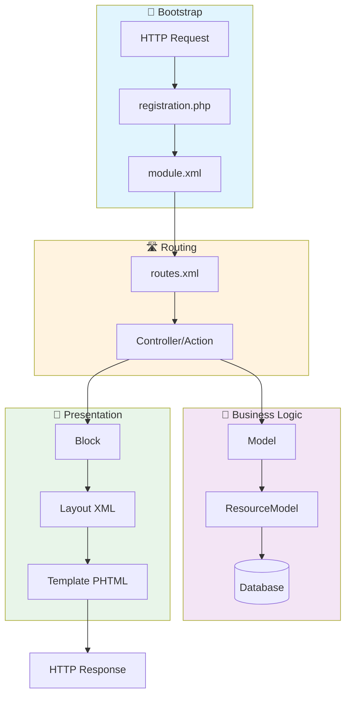

# 📚 Magento 2 Module Structure Guide

> دليل شامل لهيكل الموديول في Magento 2 مع روابط لشرح تفصيلي لكل جزء

---

## 📁 الهيكل الكامل للموديول

```
app/code/Vendor/ModuleName/
│
├── 📄 registration.php              # [1] تسجيل المودول
│
├── 📂 etc/                          # [2] ملفات الإعدادات
│   ├── module.xml                   # تعريف المودول
│   ├── di.xml                       # Dependency Injection
│   ├── events.xml                   # تسجيل الـ Events
│   ├── crontab.xml                  # جدولة Cron Jobs
│   ├── webapi.xml                   # API endpoints
│   ├── acl.xml                      # Access Control List
│   ├── config.xml                   # Default config values
│   │
│   ├── 📂 adminhtml/                # إعدادات الـ Admin
│   │   ├── routes.xml
│   │   ├── system.xml               # إعدادات في Admin Panel
│   │   ├── menu.xml                 # قوائم الـ Admin
│   │   └── di.xml
│   │
│   └── 📂 frontend/                 # إعدادات الـ Frontend
│       ├── routes.xml
│       ├── sections.xml             # Customer sections
│       └── di.xml
│
├── 📂 Api/                          # [3] Service Contracts
│   ├── 📂 Data/                     # Data Interfaces
│   │   └── EntityInterface.php
│   └── EntityRepositoryInterface.php
│
├── 📂 Block/                        # [4] View Blocks
│   ├── 📂 Adminhtml/                # Admin Blocks
│   └── SomeBlock.php
│
├── 📂 Controller/                   # [5] Controllers
│   ├── 📂 Adminhtml/                # Admin Controllers
│   │   └── Entity/
│   │       ├── Index.php
│   │       ├── Edit.php
│   │       ├── Save.php
│   │       └── Delete.php
│   └── 📂 Index/                    # Frontend Controllers
│       └── Index.php
│
├── 📂 Model/                        # [6] Models
│   ├── Entity.php                   # Data Model
│   ├── EntityRepository.php         # Repository
│   ├── 📂 ResourceModel/            # Database Layer
│   │   ├── Entity.php               # Resource Model
│   │   └── Entity/
│   │       └── Collection.php       # Collection
│   └── 📂 Config/
│       └── Source/                  # Dropdowns
│
├── 📂 Observer/                     # [7] Event Observers
│   └── SomeObserver.php
│
├── 📂 Plugin/                       # [8] Plugins (Interceptors)
│   └── SomePlugin.php
│
├── 📂 Helper/                       # [9] Helper Classes
│   └── Data.php
│
├── 📂 Setup/                        # [10] Installation
│   └── 📂 Patch/
│       ├── 📂 Data/                 # Data Patches
│       │   └── AddSampleData.php
│       └── 📂 Schema/               # Schema Patches
│           └── CreateTable.php
│
├── 📂 Cron/                         # [11] Cron Jobs
│   └── SomeJob.php
│
├── 📂 Console/                      # [12] CLI Commands
│   └── Command/
│       └── SomeCommand.php
│
├── 📂 view/                         # [13] View Layer
│   ├── 📂 adminhtml/
│   │   ├── 📂 layout/               # Admin Layouts
│   │   ├── 📂 templates/            # Admin Templates
│   │   ├── 📂 ui_component/         # UI Components
│   │   └── 📂 web/
│   │       ├── css/
│   │       └── js/
│   │
│   ├── 📂 frontend/
│   │   ├── 📂 layout/               # Frontend Layouts
│   │   ├── 📂 templates/            # PHTML files
│   │   ├── 📂 requirejs-config.js   # RequireJS config
│   │   └── 📂 web/
│   │       ├── css/
│   │       ├── js/
│   │       └── images/
│   │
│   └── 📂 base/                     # Shared (Admin + Frontend)
│       └── 📂 web/
│
├── 📂 i18n/                         # [14] Translations
│   ├── en_US.csv
│   └── ar_SA.csv
│
├── 📂 Test/                         # Tests
│   ├── 📂 Unit/
│   └── 📂 Integration/
│
└── 📄 composer.json                 # Composer package info (optional)
```

---

## 🔄 الـ Flow الأساسي



---

## 📖 الشرح التفصيلي

> كل جزء من أجزاء الموديول له ملف شرح مفصل خاص به

| # | الجزء | الملف | الحالة |
|---|-------|-------|--------|
| 1 | Registration | [docs/ar/01_REGISTRATION.md](./docs/ar/01_REGISTRATION.md) | ✅ |
| 2 | Module XML | [docs/ar/02_MODULE_XML.md](./docs/ar/02_MODULE_XML.md) | ✅ |
| 3 | Routes | [docs/ar/03_ROUTES.md](./docs/ar/03_ROUTES.md) | ✅ |
| 4 | Controllers | [docs/ar/04_CONTROLLERS.md](./docs/ar/04_CONTROLLERS.md) | ✅ |
| 5 | Models | [docs/ar/05_MODELS.md](./docs/ar/05_MODELS.md) | ✅ |
| 6 | Blocks | [docs/ar/06_BLOCKS.md](./docs/ar/06_BLOCKS.md) | ✅ |
| 7 | Views & Layouts | [docs/ar/07_VIEWS.md](./docs/ar/07_VIEWS.md) | ✅ |
| 8 | Dependency Injection | [docs/ar/08_DI.md](./docs/ar/08_DI.md) | ✅ |
| 9 | Observers | [docs/ar/09_OBSERVERS.md](./docs/ar/09_OBSERVERS.md) | ✅ |
| 10 | Plugins | [docs/ar/10_PLUGINS.md](./docs/ar/10_PLUGINS.md) | ✅ |
| 11 | API & WebAPI | [docs/ar/11_API.md](./docs/ar/11_API.md) | ✅ |
| 12 | Setup & Patches | [docs/ar/12_SETUP.md](./docs/ar/12_SETUP.md) | ✅ |
| 13 | CLI Commands | [docs/ar/13_CLI.md](./docs/ar/13_CLI.md) | ✅ |
| 14 | Cron Jobs | [docs/ar/14_CRON.md](./docs/ar/14_CRON.md) | ✅ |

### 🔥 المواضيع المتقدمة

| # | الجزء | الملف | الحالة |
|---|-------|-------|--------|
| 15 | EAV System | [docs/ar/15_EAV.md](./docs/ar/15_EAV.md) | ✅ |
| 16 | XML Configuration | [docs/ar/16_XML_CONFIGURATION.md](./docs/ar/16_XML_CONFIGURATION.md) | ✅ |
| 17 | UI Components | [docs/ar/17_UI_COMPONENTS.md](./docs/ar/17_UI_COMPONENTS.md) | ✅ |
| 18 | Indexers | [docs/ar/18_INDEXERS.md](./docs/ar/18_INDEXERS.md) | ✅ |
| 19 | Caching | [docs/ar/19_CACHING.md](./docs/ar/19_CACHING.md) | ✅ |
| 20 | ACL & Security | [docs/ar/20_ACL_SECURITY.md](./docs/ar/20_ACL_SECURITY.md) | ✅ |
| 21 | Testing | [docs/ar/21_TESTING.md](./docs/ar/21_TESTING.md) | ✅ |
| 22 | GraphQL | [docs/ar/22_GRAPHQL.md](./docs/ar/22_GRAPHQL.md) | ✅ |
| 23 | Message Queues | [docs/ar/23_MESSAGE_QUEUES.md](./docs/ar/23_MESSAGE_QUEUES.md) | ✅ |
| 24 | Payment Methods | [docs/ar/24_PAYMENT.md](./docs/ar/24_PAYMENT.md) | ✅ |
| 25 | Checkout | [docs/ar/25_CHECKOUT.md](./docs/ar/25_CHECKOUT.md) | ✅ |
| 26 | Themes | [docs/ar/26_THEMES.md](./docs/ar/26_THEMES.md) | ✅ |

---

## 🎓 خطة الشهادة

> **هل تريد الحصول على شهادة Adobe Commerce Developer؟**

📚 [**خطة 6 شهور للحصول على الشهادة**](./certification-roadmap/README.md)

> **📚 English Version:** [MODULE_STRUCTURE_EN.md](./MODULE_STRUCTURE_EN.md)

> **الرموز:** ✅ مكتمل | 📝 قيد الإنشاء | ⏳ لم يبدأ

---

## 🔴 الحد الأدنى للموديول (Minimum Required)

لإنشاء موديول يعمل، تحتاج فقط:

```
Vendor/ModuleName/
├── registration.php    # إلزامي ❗
└── etc/
    └── module.xml      # إلزامي ❗
```

### 1️⃣ registration.php
```php
<?php
use Magento\Framework\Component\ComponentRegistrar;

ComponentRegistrar::register(
    ComponentRegistrar::MODULE,
    'Vendor_ModuleName',
    __DIR__
);
```

### 2️⃣ etc/module.xml
```xml
<?xml version="1.0"?>
<config xmlns:xsi="http://www.w3.org/2001/XMLSchema-instance"
        xsi:noNamespaceSchemaLocation="urn:magento:framework:Module/etc/module.xsd">
    <module name="Vendor_ModuleName" setup_version="1.0.0">
        <sequence>
            <!-- Dependencies here -->
        </sequence>
    </module>
</config>
```

---

## 🚀 أوامر مهمة

```bash
# تفعيل المودول
bin/magento module:enable Vendor_ModuleName

# تحديث
bin/magento setup:upgrade

# Compile DI
bin/magento setup:di:compile

# مسح الكاش
bin/magento cache:flush

# عرض حالة المودول
bin/magento module:status Vendor_ModuleName
```

---

## 📌 Quick Reference

| العنصر | المسار | الوظيفة |
|--------|--------|---------|
| تسجيل | `registration.php` | تسجيل المودول في Magento |
| تعريف | `etc/module.xml` | اسم المودول + dependencies |
| Routes | `etc/*/routes.xml` | ربط URLs بـ Controllers |
| DI | `etc/di.xml` | Dependency Injection |
| Events | `etc/events.xml` | تسجيل Observers |
| Cron | `etc/crontab.xml` | جدولة المهام |
| ACL | `etc/acl.xml` | صلاحيات الوصول |
| API | `etc/webapi.xml` | REST/GraphQL endpoints |

---

## 🔗 روابط مفيدة

- [Magento DevDocs - Module Development](https://developer.adobe.com/commerce/php/development/)
- [Magento Coding Standards](https://developer.adobe.com/commerce/php/coding-standards/)
- [Magento Architecture](https://developer.adobe.com/commerce/php/architecture/)

---

> [!TIP]
> **ابدأ بالأساسيات!** افهم `registration.php` و `module.xml` أولاً، ثم انتقل للـ Controllers والـ Models.
