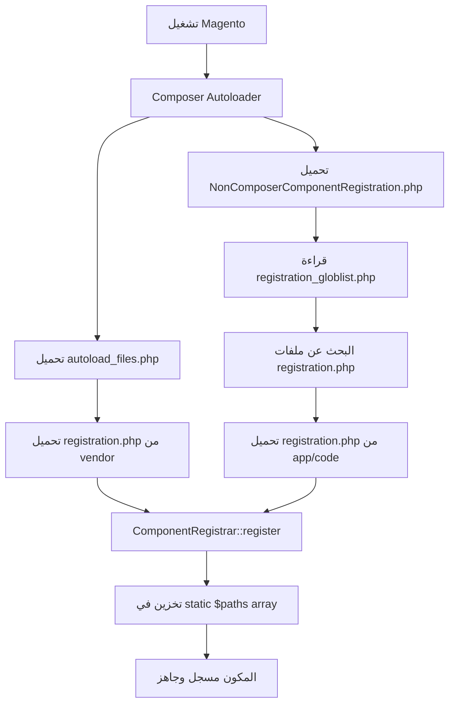
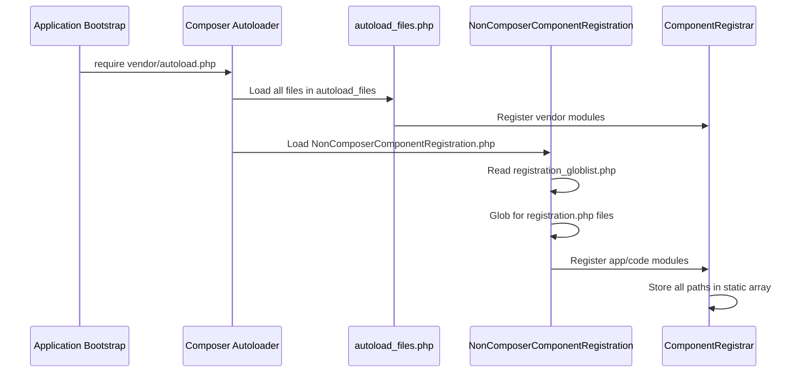

# 📚 شرح شامل لملف `registration.php` في Magento 2

## 📄 محتوى الملف الحالي

```php
<?php
use Magento\Framework\Component\ComponentRegistrar;

ComponentRegistrar::register(ComponentRegistrar::MODULE, 'Elshrif_HelloWorld', __DIR__);
```

---

## 🎯 الفهرس

1. [ما هو `registration.php`؟](#1-ما-هو-registrationphp)
2. [من أين يأتي هذا الملف؟](#2-من-أين-يأتي-هذا-الملف)
3. [لماذا نحتاجه؟](#3-لماذا-نحتاجه)
4. [كيف يتم تحميله؟](#4-كيف-يتم-تحميله)
5. [شرح الـ ComponentRegistrar Class](#5-شرح-الـ-componentregistrar-class)
6. [أنواع المكونات (Component Types)](#6-أنواع-المكونات-component-types)
7. [آلية التسجيل خطوة بخطوة](#7-آلية-التسجيل-خطوة-بخطوة)
8. [الأوامر المتعلقة](#8-الأوامر-المتعلقة)
9. [الملفات والمجلدات في Vendor](#9-الملفات-والمجلدات-في-vendor)
10. [لماذا لا يمكن تسجيل أكثر من مكون بنفس الاسم؟](#10-لماذا-لا-يمكن-تسجيل-أكثر-من-مكون-بنفس-الاسم)
11. [Best Practices ✅](#11-best-practices-)
12. [Bad Practices ❌](#12-bad-practices-)
13. [مستوى متقدم: كيف يعمل النظام داخلياً](#13-مستوى-متقدم-كيف-يعمل-النظام-داخلياً)

---

## 1. ما هو `registration.php`؟

`registration.php` هو **نقطة الدخول الأولى** لأي مكون (Component) في Magento 2. هو الملف المسؤول عن:

- **تسجيل المكون** في Magento's Component Registry
- **تعريف نوع المكون** (Module, Theme, Language, Library, Setup)
- **تحديد مسار المكون** على نظام الملفات

> [!IMPORTANT]
> بدون هذا الملف، **Magento لن يعرف بوجود المكون الخاص بك** حتى لو كانت جميع الملفات الأخرى موجودة.

---

## 2. من أين يأتي هذا الملف؟

### المصدر في Vendor

الـ `ComponentRegistrar` class موجود في:

```
vendor/magento/framework/Component/ComponentRegistrar.php
```

### هيكل الـ Class

```php
namespace Magento\Framework\Component;

class ComponentRegistrar implements ComponentRegistrarInterface
{
    const MODULE = 'module';
    const LIBRARY = 'library';
    const THEME = 'theme';
    const LANGUAGE = 'language';
    const SETUP = 'setup';

    private static $paths = [
        self::MODULE => [],
        self::LIBRARY => [],
        self::LANGUAGE => [],
        self::THEME => [],
        self::SETUP => []
    ];

    public static function register($type, $componentName, $path)
    {
        // التسجيل يحدث هنا
    }
}
```

---

## 3. لماذا نحتاجه؟

### 🔹 3.1 اكتشاف المكونات (Component Discovery)
Magento يستخدم هذا الملف لاكتشاف جميع المكونات المثبتة تلقائياً.

### 🔹 3.2 Autoloading
يضمن أن Magento يمكنه تحميل classes الخاصة بالمكون.

### 🔹 3.3 التكامل مع CLI
الأوامر مثل `bin/magento module:status` تعتمد على هذا التسجيل.

### 🔹 3.4 ترتيب التحميل
يساعد في تحديد ترتيب تحميل المكونات.

---

## 4. كيف يتم تحميله؟

### 🛣️ مسارات التحميل

هناك **طريقتان** لتحميل `registration.php`:

### الطريقة الأولى: عبر Composer (للمكونات في vendor)

```
vendor/composer/autoload_files.php
```

يحتوي على قائمة بجميع ملفات `registration.php`:

```php
return array(
    '07ec02c7e667fdcb3e30c02cc772b743' => $vendorDir . '/magento/framework/registration.php',
    '07f4b29581a907da6d366307f545041b' => $vendorDir . '/magento/module-user/registration.php',
    // ... المئات من الملفات
);
```

### الطريقة الثانية: عبر Glob Patterns (للمكونات في app/code)

#### الملف المسؤول:
```
app/etc/NonComposerComponentRegistration.php
```

#### كيف يعمل:

```php
(static function (): void {
    $globPatterns = require __DIR__ . '/registration_globlist.php';
    $baseDir = \dirname(__DIR__, 2) . '/';

    foreach ($globPatterns as $globPattern) {
        $files = \glob($baseDir . $globPattern, GLOB_NOSORT);
        \array_map(
            static function (string $file): void {
                require_once $file;
            },
            $files
        );
    }
})();
```

#### قائمة الـ Glob Patterns:

```php
// app/etc/registration_globlist.php
return [
    'app/code/*/*/cli_commands.php',
    'app/code/*/*/registration.php',        // <- هنا يتم تحميل المودول بتاعك
    'app/design/*/*/*/registration.php',
    'app/i18n/*/*/registration.php',
    'lib/internal/*/*/registration.php',
    'lib/internal/*/*/*/registration.php',
    'setup/src/*/*/registration.php'
];
```

---

## 5. شرح الـ ComponentRegistrar Class

### الموقع في Vendor

```
vendor/magento/framework/Component/ComponentRegistrar.php
```

### الـ Methods الأساسية

| Method | الوظيفة |
|--------|---------|
| `register($type, $name, $path)` | تسجيل مكون جديد |
| `getPaths($type)` | الحصول على جميع مسارات نوع معين |
| `getPath($type, $name)` | الحصول على مسار مكون محدد |
| `validateType($type)` | التحقق من صحة نوع المكون |

### شرح الـ `register` Method

```php
public static function register($type, $componentName, $path)
{
    // 1. التحقق من صحة النوع
    self::validateType($type);

    // 2. التحقق من عدم وجود المكون مسبقاً
    if (isset(self::$paths[$type][$componentName])) {
        throw new \LogicException(
            ucfirst($type) . ' \'' . $componentName . '\' from \'' . $path . '\' '
            . 'has been already defined in \'' . self::$paths[$type][$componentName] . '\'.'
        );
    }

    // 3. تسجيل المكون
    self::$paths[$type][$componentName] = str_replace('\\', '/', $path);
}
```

---

## 6. أنواع المكونات (Component Types)

### جدول الأنواع

| النوع | الثابت | الوصف | مثال المسار |
|-------|--------|-------|-------------|
| Module | `ComponentRegistrar::MODULE` | الموديولات (Extensions) | `app/code/Vendor/Module` |
| Theme | `ComponentRegistrar::THEME` | القوالب | `app/design/frontend/Vendor/theme` |
| Language | `ComponentRegistrar::LANGUAGE` | حزم الترجمة | `app/i18n/vendor/language` |
| Library | `ComponentRegistrar::LIBRARY` | المكتبات | `lib/internal/Vendor/Library` |
| Setup | `ComponentRegistrar::SETUP` | أدوات الإعداد | `setup/src/Vendor/Setup` |

### أمثلة لكل نوع

#### Module
```php
ComponentRegistrar::register(ComponentRegistrar::MODULE, 'Vendor_ModuleName', __DIR__);
```

#### Theme
```php
ComponentRegistrar::register(ComponentRegistrar::THEME, 'frontend/Vendor/theme-name', __DIR__);
```

#### Language
```php
ComponentRegistrar::register(ComponentRegistrar::LANGUAGE, 'vendor_language-code', __DIR__);
```

---

## 7. آلية التسجيل خطوة بخطوة

### 🔄 دورة الحياة الكاملة



### خطوات التسجيل التفصيلية

#### الخطوة 1: Bootstrap
عند تشغيل أي طلب في Magento، يتم تحميل:
```php
require __DIR__ . '/app/bootstrap.php';
```

#### الخطوة 2: Composer Autoload
```php
require_once __DIR__ . '/vendor/autoload.php';
```

#### الخطوة 3: تحميل ملفات التسجيل
Composer يحمل جميع الملفات في `autoload_files.php` تلقائياً.

#### الخطوة 4: تسجيل المكونات
كل ملف `registration.php` ينفذ `ComponentRegistrar::register()`.

#### الخطوة 5: التخزين في الذاكرة
المسارات تُخزن في `static $paths` array.

---

## 8. الأوامر المتعلقة

### 📋 أوامر تتأثر بـ registration.php

| الأمر | الوظيفة | كيف يتأثر بـ registration.php |
|-------|---------|-------------------------------|
| `bin/magento module:status` | عرض حالة الموديولات | يقرأ المكونات المسجلة |
| `bin/magento module:enable` | تفعيل موديول | يحتاج تسجيل سليم |
| `bin/magento module:disable` | تعطيل موديول | يحتاج تسجيل سليم |
| `bin/magento setup:upgrade` | تحديث الـ schema | يحمّل جميع الموديولات المسجلة |
| `bin/magento setup:di:compile` | توليد DI | يحتاج مسارات الموديولات |
| `bin/magento cache:flush` | مسح الكاش | يعيد تحميل التسجيلات |

### أوامر مهمة للتشخيص

```bash
# عرض جميع الموديولات
bin/magento module:status

# عرض الموديولات المفعّلة فقط
bin/magento module:status --enabled

# عرض الموديولات المعطّلة فقط
bin/magento module:status --disabled

# تفعيل موديول
bin/magento module:enable Elshrif_HelloWorld

# تحديث بعد التفعيل
bin/magento setup:upgrade
```

---

## 9. الملفات والمجلدات في Vendor

### 🗂️ الملفات الرئيسية

```
vendor/
├── magento/
│   └── framework/
│       └── Component/
│           ├── ComponentRegistrar.php      # الـ Class الرئيسي
│           └── ComponentRegistrarInterface.php  # الـ Interface
├── composer/
│   ├── autoload_files.php     # قائمة الملفات للتحميل
│   ├── autoload_static.php    # نفس القائمة بشكل static
│   ├── autoload_psr4.php      # PSR-4 mappings
│   └── ClassLoader.php        # محمّل الـ Classes
```

### الـ Interface

```php
// vendor/magento/framework/Component/ComponentRegistrarInterface.php
interface ComponentRegistrarInterface
{
    public function getPaths($type);
    public function getPath($type, $componentName);
}
```

---

## 10. لماذا لا يمكن تسجيل أكثر من مكون بنفس الاسم؟

### ⚠️ السبب التقني

في الـ `register` method:

```php
public static function register($type, $componentName, $path)
{
    self::validateType($type);

    // هنا الفحص! 👇
    if (isset(self::$paths[$type][$componentName])) {
        throw new \LogicException(
            ucfirst($type) . ' \'' . $componentName . '\' from \'' . $path . '\' '
            . 'has been already defined in \'' . self::$paths[$type][$componentName] . '\'.'
        );
    }

    self::$paths[$type][$componentName] = str_replace('\\', '/', $path);
}
```

### 🎯 الأسباب المنطقية

#### 1. تجنب التعارضات (Conflict Prevention)
```
❌ خطأ: مكونين بنفس الاسم
   app/code/Vendor/Module/registration.php
   vendor/other/Module/registration.php

   كلاهما يسجل: 'Vendor_Module'
```

#### 2. تحديد المسار الفريد
Magento يستخدم الاسم للوصول للمسار:
```php
$path = ComponentRegistrar::getPath(ComponentRegistrar::MODULE, 'Vendor_Module');
// يجب أن يعيد مسار واحد فقط!
```

#### 3. تجنب الـ Override غير المقصود
لو سمحنا بأكثر من تسجيل:
- أي فايلات سيتم تحميلها؟
- أي كونفيج سيُستخدم؟
- أي Classes ستكون available؟

### رسالة الخطأ

```
Module 'Vendor_Module' from '/path/to/new/module'
has been already defined in '/path/to/existing/module'.
```

---

## 11. Best Practices ✅

### ✅ 1. اسم الموديول يطابق المسار

```php
// المسار: app/code/Elshrif/HelloWorld/registration.php
// الاسم: Elshrif_HelloWorld ✅

ComponentRegistrar::register(ComponentRegistrar::MODULE, 'Elshrif_HelloWorld', __DIR__);
```

### ✅ 2. استخدام `__DIR__` دائماً

```php
// ✅ صحيح - مسار ديناميكي
ComponentRegistrar::register(ComponentRegistrar::MODULE, 'Vendor_Module', __DIR__);

// ❌ خطأ - مسار ثابت (hardcoded)
ComponentRegistrar::register(ComponentRegistrar::MODULE, 'Vendor_Module', '/var/www/html/app/code/Vendor/Module');
```

### ✅ 3. إضافة strict types

```php
<?php
declare(strict_types=1);

use Magento\Framework\Component\ComponentRegistrar;

ComponentRegistrar::register(ComponentRegistrar::MODULE, 'Vendor_Module', __DIR__);
```

### ✅ 4. الحفاظ على البساطة

```php
// ✅ بسيط ومباشر
<?php
use Magento\Framework\Component\ComponentRegistrar;

ComponentRegistrar::register(ComponentRegistrar::MODULE, 'Vendor_Module', __DIR__);
```

### ✅ 5. إضافة Copyright Header

```php
<?php
/**
 * Copyright © Your Company. All rights reserved.
 * See LICENSE.txt for license details.
 */
declare(strict_types=1);

use Magento\Framework\Component\ComponentRegistrar;

ComponentRegistrar::register(ComponentRegistrar::MODULE, 'Vendor_Module', __DIR__);
```

### ✅ 6. اتباع PSR-4 Naming

| المسار | اسم الموديول |
|--------|--------------|
| `Elshrif/HelloWorld` | `Elshrif_HelloWorld` |
| `Company/FeatureName` | `Company_FeatureName` |

---

## 12. Bad Practices ❌

### ❌ 1. إضافة Logic في registration.php

```php
// ❌ خطأ جداً!
<?php
use Magento\Framework\Component\ComponentRegistrar;

// لا تضف logic هنا!
if (file_exists('/some/condition')) {
    ComponentRegistrar::register(ComponentRegistrar::MODULE, 'Vendor_Module', __DIR__);
}

// لا تستدعي functions هنا!
someFunction();
```

### ❌ 2. استخدام مسار ثابت (Hardcoded Path)

```php
// ❌ خطأ
ComponentRegistrar::register(
    ComponentRegistrar::MODULE,
    'Vendor_Module',
    '/var/www/html/app/code/Vendor/Module'
);
```

### ❌ 3. اسم خاطئ لا يطابق المسار

```php
// المسار: app/code/Vendor/ModuleOne/registration.php
// ❌ خطأ - الاسم مختلف!
ComponentRegistrar::register(ComponentRegistrar::MODULE, 'Vendor_DifferentName', __DIR__);
```

### ❌ 4. تسجيل أكثر من مكون في ملف واحد

```php
// ❌ خطأ جداً!
<?php
ComponentRegistrar::register(ComponentRegistrar::MODULE, 'Vendor_ModuleA', __DIR__);
ComponentRegistrar::register(ComponentRegistrar::MODULE, 'Vendor_ModuleB', __DIR__ . '/../ModuleB');
```

### ❌ 5. نسيان use statement

```php
// ❌ خطأ - سيفشل!
<?php
ComponentRegistrar::register(ComponentRegistrar::MODULE, 'Vendor_Module', __DIR__);

// ✅ صحيح
<?php
use Magento\Framework\Component\ComponentRegistrar;

ComponentRegistrar::register(ComponentRegistrar::MODULE, 'Vendor_Module', __DIR__);
```

### ❌ 6. استخدام علامات PHP القصيرة

```php
// ❌ خطأ
<?
use Magento\Framework\Component\ComponentRegistrar;

// ✅ صحيح
<?php
use Magento\Framework\Component\ComponentRegistrar;
```

### ❌ 7. إغلاق علامة PHP

```php
// ❌ خطأ - لا تغلق الـ PHP tag
<?php
use Magento\Framework\Component\ComponentRegistrar;

ComponentRegistrar::register(ComponentRegistrar::MODULE, 'Vendor_Module', __DIR__);
?>

// ✅ صحيح - اترك الملف مفتوحاً
<?php
use Magento\Framework\Component\ComponentRegistrar;

ComponentRegistrar::register(ComponentRegistrar::MODULE, 'Vendor_Module', __DIR__);
```

---

## 13. مستوى متقدم: كيف يعمل النظام داخلياً

### 🔬 Static Array Storage

```php
private static $paths = [
    'module' => [],
    'library' => [],
    'language' => [],
    'theme' => [],
    'setup' => []
];
```

بعد تسجيل موديولك:

```php
private static $paths = [
    'module' => [
        'Elshrif_HelloWorld' => '/var/www/html/app/code/Elshrif/HelloWorld',
        'Magento_Catalog' => '/var/www/html/vendor/magento/module-catalog',
        // ... المئات من الموديولات
    ],
    // ...
];
```

### 🔬 كيف Magento يستخدم هذه البيانات

#### عند تشغيل `bin/magento module:status`:

```php
// Simplified example
$registrar = new ComponentRegistrar();
$modules = $registrar->getPaths(ComponentRegistrar::MODULE);

foreach ($modules as $name => $path) {
    echo $name . ' => ' . $path . PHP_EOL;
}
```

#### عند تحميل Class:

```php
// When loading Elshrif\HelloWorld\Model\SomeClass
// Magento looks up the path:
$modulePath = ComponentRegistrar::getPath(
    ComponentRegistrar::MODULE,
    'Elshrif_HelloWorld'
);
// Returns: /var/www/html/app/code/Elshrif/HelloWorld

// Then loads:
// /var/www/html/app/code/Elshrif/HelloWorld/Model/SomeClass.php
```

### 🔬 الفرق بين app/code و vendor

| الجانب | `app/code` | `vendor` |
|--------|-----------|----------|
| طريقة التحميل | Glob patterns | Composer autoload |
| يتم تحميله عبر | `NonComposerComponentRegistration.php` | `autoload_files.php` |
| أولوية التحميل | بعد vendor | قبل app/code |
| التحديثات | يدوياً | عبر `composer update` |
| Git tracking | نعم (مستحسن) | لا (في .gitignore) |

### 🔬 ترتيب تحميل الـ registration files



### 🔬 Validation Logic

```php
private static function validateType($type)
{
    if (!isset(self::$paths[$type])) {
        throw new \LogicException('\'' . $type . '\' is not a valid component type');
    }
}
```

إذا حاولت تسجيل نوع غير موجود:

```php
// ❌ سيفشل!
ComponentRegistrar::register('invalid_type', 'Vendor_Module', __DIR__);
// Throws: LogicException: 'invalid_type' is not a valid component type
```

---

## 📌 ملخص سريع

| العنصر | القيمة/الوصف |
|--------|-------------|
| **الموقع** | `app/code/Vendor/Module/registration.php` |
| **الـ Class المستخدم** | `Magento\Framework\Component\ComponentRegistrar` |
| **الـ Method** | `ComponentRegistrar::register()` |
| **المعاملات** | `($type, $componentName, $path)` |
| **الأنواع المتاحة** | `MODULE`, `THEME`, `LANGUAGE`, `LIBRARY`, `SETUP` |
| **الملف في Vendor** | `vendor/magento/framework/Component/ComponentRegistrar.php` |
| **طريقة التحميل** | عبر Composer أو Glob patterns |

---

## 🔗 روابط مفيدة

- [Magento DevDocs - Module Registration](https://developer.adobe.com/commerce/php/development/build/component-registration/)
- [PSR-4 Autoloading Standard](https://www.php-fig.org/psr/psr-4/)
- [Composer Autoloading](https://getcomposer.org/doc/04-schema.md#autoload)

---

> [!TIP]
> **نصيحة أخيرة**: الـ `registration.php` يجب أن يكون **بسيط وقصير**. كل ما تحتاجه هو 3-4 أسطر فقط. لا تضف أي logic إضافي!
