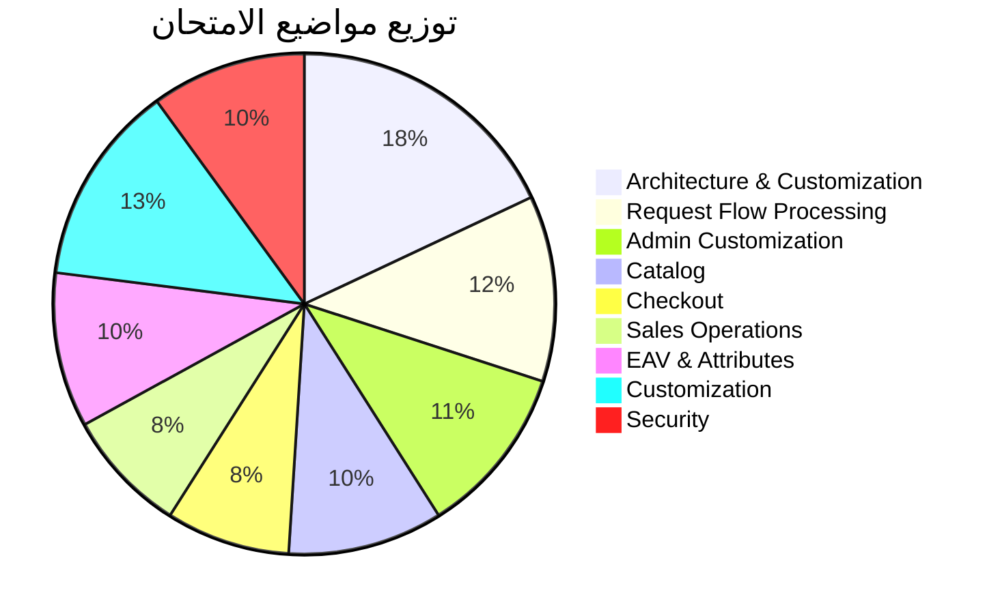

# 🎓 خطة الحصول على شهادة Adobe Commerce Developer

> خطة تفصيلية لمدة 6 شهور لتصبح مطور Magento معتمد

---

## 📋 الشهادات المتاحة

| الشهادة | الكود | المستوى | المدة |
|---------|-------|---------|-------|
| **Adobe Commerce Developer Professional** | AD0-E717 | مبتدئ/متوسط | 120 دقيقة |
| **Adobe Commerce Developer Expert** | AD0-E716 | متقدم | 180 دقيقة |
| **Adobe Commerce Front-End Developer** | AD0-E719 | متوسط | 120 دقيقة |

---

## 🗓️ الخطة المفصلة (6 شهور)

### [📅 الشهر الأول](./month-01-basics.md)
> **أساسيات Magento 2 والـ Architecture**

### [📅 الشهر الثاني](./month-02-database.md)
> **قواعد البيانات، EAV، والـ Models**

### [📅 الشهر الثالث](./month-03-frontend.md)
> **الـ Frontend، Layouts، والـ JavaScript**

### [📅 الشهر الرابع](./month-04-backend.md)
> **الـ Backend، API، والـ Customization**

### [📅 الشهر الخامس](./month-05-advanced.md)
> **المواضيع المتقدمة والـ Performance**

### [📅 الشهر السادس](./month-06-exam-prep.md)
> **التحضير للامتحان والـ Practice Tests**

---

## 📚 الكورسات المطلوبة

### 🎯 كورسات مجانية

| المصدر | الكورس | الرابط |
|--------|--------|--------|
| **Adobe** | Commerce Tutorials | [developer.adobe.com](https://developer.adobe.com/commerce/tutorials/) |
| **Magento DevDocs** | PHP Developer Guide | [devdocs.magento.com](https://developer.adobe.com/commerce/php/development/) |
| **SwiftOtter** | Study Guide | [swiftotter.com](https://swiftotter.com/technical/certifications) |
| **YouTube** | Max Pronko Channel | [youtube.com/@maxpronko](https://www.youtube.com/@maxpronko) |
| **YouTube** | Mark Shust | [youtube.com/@markshust](https://www.youtube.com/@markshust) |

### 💰 كورسات مدفوعة (موصى بها)

| المصدر | الكورس | السعر التقريبي |
|--------|--------|----------------|
| **Udemy** | Magento 2 Certified Professional Developer | $20-50 |
| **M.academy** | Complete Magento 2 Course | $997 |
| **Magento U** | Adobe Official Training | متفاوت |
| **SwiftOtter** | Certification Study Guide | $149 |

---

## 🎯 متطلبات الامتحان (AD0-E717 Professional)

### المواضيع والنسب



---

## 📂 ملفات الخطة

```
certification-roadmap/
├── README.md                    # (أنت هنا)
├── month-01-basics.md           # الشهر الأول
├── month-02-database.md         # الشهر الثاني
├── month-03-frontend.md         # الشهر الثالث
├── month-04-backend.md          # الشهر الرابع
├── month-05-advanced.md         # الشهر الخامس
├── month-06-exam-prep.md        # الشهر السادس
├── resources.md                 # الموارد والروابط
└── exam-topics-checklist.md     # قائمة مراجعة المواضيع
```

---

## ✅ تتبع التقدم

- [ ] الشهر الأول - الأساسيات
- [ ] الشهر الثاني - قواعد البيانات
- [ ] الشهر الثالث - Frontend
- [ ] الشهر الرابع - Backend
- [ ] الشهر الخامس - المتقدم
- [ ] الشهر السادس - التحضير للامتحان
- [ ] 🎓 **الحصول على الشهادة!**

---

> [!TIP]
> ابدأ بـ [الشهر الأول](./month-01-basics.md) الآن!
