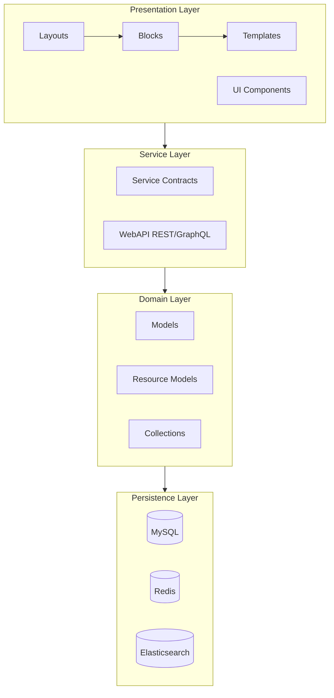
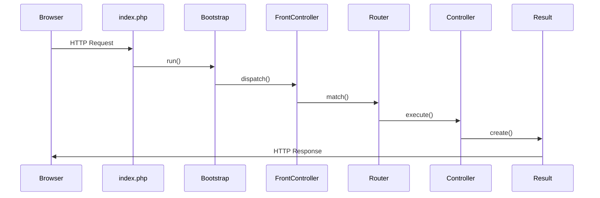

# 📅 الشهر الأول: أساسيات Magento 2

> **الهدف:** فهم Architecture وهيكل الموديول والـ Request Flow

---

## 🎯 أهداف الشهر

- [ ] فهم بنية Magento 2 (Architecture)
- [ ] إنشاء موديول من الصفر
- [ ] فهم الـ Request Flow
- [ ] التعامل مع الـ CLI Commands
- [ ] فهم الـ Dependency Injection

---

## 📆 الأسبوع الأول: Environment & Architecture

### اليوم 1-2: تثبيت بيئة التطوير

```bash
# الأدوات المطلوبة
- PHP 8.1+
- MySQL 8.0 / MariaDB 10.4+
- Elasticsearch 7.x / OpenSearch
- Redis (للـ Cache)
- Composer 2.x
- Docker (موصى به)
```

**المهام:**
- [ ] تثبيت Magento 2 محلياً
- [ ] إعداد Xdebug للـ Debugging
- [ ] تثبيت PhpStorm + Magento Plugin

**الموارد:**
- [Magento DevDocs - Installation](https://experienceleague.adobe.com/docs/commerce-operations/installation-guide/overview.html)
- [Mark Shust Docker Environment](https://github.com/markshust/docker-magento)

### اليوم 3-4: فهم Architecture



**للقراءة:**
- [Magento Architecture Guide](https://developer.adobe.com/commerce/php/architecture/)
- [Magicento - DevDocs](../docs/ar/01_REGISTRATION.md)

### اليوم 5-7: مجلدات وملفات Magento

```
app/
├── code/           # Custom modules
├── design/         # Custom themes
├── etc/            # Configuration
├── i18n/           # Translations
└── language/       # Language packages

vendor/
├── magento/        # Core modules
└── ...

pub/
├── static/         # Generated assets
└── media/          # Uploaded files
```

---

## 📆 الأسبوع الثاني: إنشاء الموديول

### اليوم 8-9: الملفات الأساسية

```php
// registration.php
<?php
use Magento\Framework\Component\ComponentRegistrar;

ComponentRegistrar::register(
    ComponentRegistrar::MODULE,
    'Vendor_ModuleName',
    __DIR__
);
```

```xml
<!-- etc/module.xml -->
<?xml version="1.0"?>
<config xmlns:xsi="http://www.w3.org/2001/XMLSchema-instance"
        xsi:noNamespaceSchemaLocation="urn:magento:framework:Module/etc/module.xsd">
    <module name="Vendor_ModuleName">
        <sequence>
            <module name="Magento_Catalog"/>
        </sequence>
    </module>
</config>
```

**تمرين عملي:**
- [ ] إنشاء موديول `Training_FirstModule`
- [ ] تفعيله باستخدام `bin/magento module:enable`

### اليوم 10-11: Routes و Controllers

```xml
<!-- etc/frontend/routes.xml -->
<?xml version="1.0"?>
<config xmlns:xsi="http://www.w3.org/2001/XMLSchema-instance"
        xsi:noNamespaceSchemaLocation="urn:magento:framework:App/etc/routes.xsd">
    <router id="standard">
        <route id="training" frontName="training">
            <module name="Training_FirstModule"/>
        </route>
    </router>
</config>
```

```php
// Controller/Index/Index.php
<?php
namespace Training\FirstModule\Controller\Index;

use Magento\Framework\App\Action\HttpGetActionInterface;
use Magento\Framework\View\Result\PageFactory;

class Index implements HttpGetActionInterface
{
    public function __construct(
        private PageFactory $pageFactory
    ) {}

    public function execute()
    {
        return $this->pageFactory->create();
    }
}
```

### اليوم 12-14: Block و Template

**تمرين عملي:**
- [ ] إنشاء Controller يعرض صفحة
- [ ] إنشاء Block مع Template
- [ ] عرض "Hello World" في الصفحة

---

## 📆 الأسبوع الثالث: Request Flow

### اليوم 15-17: فهم الـ Request Flow



**الملفات المهمة للدراسة:**
```
vendor/magento/framework/App/Bootstrap.php
vendor/magento/framework/App/Http.php
vendor/magento/framework/App/FrontController.php
vendor/magento/framework/App/Router/Base.php
```

### اليوم 18-21: Observers و Plugins

**Observers:**
```xml
<!-- etc/events.xml -->
<event name="catalog_product_save_after">
    <observer name="training_product_logger"
              instance="Training\FirstModule\Observer\ProductLogger"/>
</event>
```

**Plugins:**
```xml
<!-- etc/di.xml -->
<type name="Magento\Catalog\Model\Product">
    <plugin name="training_product_plugin"
            type="Training\FirstModule\Plugin\ProductPlugin"/>
</type>
```

**تمرين عملي:**
- [ ] إنشاء Observer يسجل في log عند حفظ منتج
- [ ] إنشاء Plugin يعدل على سعر المنتج

---

## 📆 الأسبوع الرابع: DI و CLI

### اليوم 22-25: Dependency Injection

```xml
<!-- etc/di.xml -->
<config>
    <!-- Preference -->
    <preference for="Vendor\Module\Api\EntityInterface"
                type="Vendor\Module\Model\Entity"/>

    <!-- Type Configuration -->
    <type name="Vendor\Module\Model\Entity">
        <arguments>
            <argument name="logger" xsi:type="object">Psr\Log\LoggerInterface</argument>
        </arguments>
    </type>

    <!-- Virtual Type -->
    <virtualType name="CustomLogger" type="Magento\Framework\Logger\Monolog">
        <arguments>
            <argument name="handlers" xsi:type="array">
                <item name="debug" xsi:type="object">CustomLogHandler</item>
            </argument>
        </arguments>
    </virtualType>
</config>
```

### اليوم 26-28: CLI Commands

```php
// Console/Command/CustomCommand.php
<?php
namespace Training\FirstModule\Console\Command;

use Symfony\Component\Console\Command\Command;
use Symfony\Component\Console\Input\InputInterface;
use Symfony\Component\Console\Output\OutputInterface;

class CustomCommand extends Command
{
    protected function configure()
    {
        $this->setName('training:hello')
            ->setDescription('Says Hello');
    }

    protected function execute(InputInterface $input, OutputInterface $output)
    {
        $output->writeln('<info>Hello from Training Module!</info>');
        return Command::SUCCESS;
    }
}
```

---

## ✅ اختبار نهاية الشهر

### أسئلة للمراجعة:

1. ما الفرق بين `app/code` و `vendor`؟
2. اشرح الـ Request Flow من البداية للنهاية
3. ما الفرق بين Observer و Plugin؟
4. كيف يعمل الـ Dependency Injection في Magento؟
5. ما هي الـ Virtual Types ومتى نستخدمها؟

### مشروع عملي:

إنشاء موديول "Contact Logger" يقوم بـ:
- [ ] تسجيل كل رسائل Contact Form في log file
- [ ] إنشاء CLI command لعرض آخر 10 رسائل
- [ ] عرض عدد الرسائل في صفحة frontend

---

## 📚 الموارد الإضافية

- [📖 docs/ar/01_REGISTRATION.md](../docs/ar/01_REGISTRATION.md)
- [📖 docs/ar/02_MODULE_XML.md](../docs/ar/02_MODULE_XML.md)
- [📖 docs/ar/03_ROUTES.md](../docs/ar/03_ROUTES.md)
- [📖 docs/ar/04_CONTROLLERS.md](../docs/ar/04_CONTROLLERS.md)
- [📖 docs/ar/08_DI.md](../docs/ar/08_DI.md)

---

## ➡️ [الشهر التالي: قواعد البيانات و EAV](./month-02-database.md)
