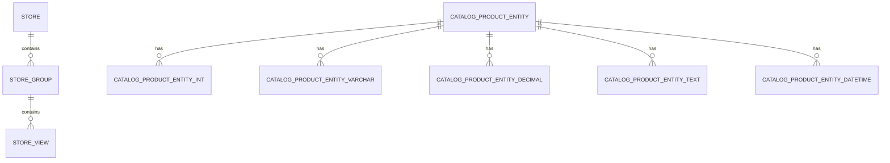
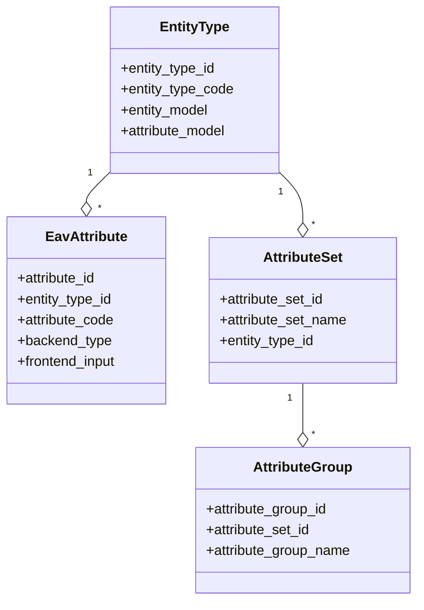

# 📅 الشهر الثاني: قواعد البيانات و EAV

> **الهدف:** فهم عميق لـ EAV، Models، والتعامل مع قاعدة البيانات

---

## 🎯 أهداف الشهر

- [ ] فهم بنية قاعدة بيانات Magento
- [ ] إتقان نظام EAV (Entity-Attribute-Value)
- [ ] إنشاء Models و ResourceModels
- [ ] التعامل مع Collections
- [ ] إنشاء Data و Schema Patches

---

## 📆 الأسبوع الأول: بنية قاعدة البيانات

### اليوم 1-3: الجداول الأساسية



**أهم الجداول:**

| الجدول | الوظيفة |
|--------|---------|
| `store` | المتاجر |
| `store_group` | مجموعات المتاجر |
| `store_website` | المواقع |
| `catalog_product_entity` | المنتجات الأساسية |
| `catalog_category_entity` | الفئات |
| `customer_entity` | العملاء |
| `sales_order` | الطلبات |
| `eav_attribute` | الـ Attributes |

### اليوم 4-7: فهم Flat vs EAV

```
┌─────────────────────────────────────────────────────────────┐
│                      Flat Table                              │
├──────┬───────────┬─────────┬────────┬─────────┬────────────┤
│ id   │ name      │ sku     │ price  │ status  │ description│
├──────┼───────────┼─────────┼────────┼─────────┼────────────┤
│ 1    │ Product 1 │ SKU001  │ 99.99  │ 1       │ Text...    │
│ 2    │ Product 2 │ SKU002  │ 149.99 │ 1       │ Text...    │
└──────┴───────────┴─────────┴────────┴─────────┴────────────┘

┌─────────────────────────────────────────────────────────────┐
│                      EAV System                              │
│                                                              │
│  ┌─────────────────────┐    ┌────────────────────────────┐ │
│  │ Entity Table        │    │ Attribute Table            │ │
│  ├──────┬──────────────┤    ├────────────┬───────────────┤ │
│  │ id   │ entity_type  │    │ attr_id    │ attr_code     │ │
│  │ 1    │ product      │    │ 71         │ name          │ │
│  │ 2    │ product      │    │ 72         │ price         │ │
│  └──────┴──────────────┘    └────────────┴───────────────┘ │
│                                                              │
│  ┌────────────────────────────────────────────────────────┐│
│  │ Value Tables (varchar, int, decimal, text, datetime)   ││
│  ├──────────┬────────────┬──────────┬─────────────────────┤│
│  │ entity_id│ attr_id    │ store_id │ value               ││
│  │ 1        │ 71         │ 0        │ Product Name        ││
│  │ 1        │ 72         │ 0        │ 99.99               ││
│  └──────────┴────────────┴──────────┴─────────────────────┘│
└─────────────────────────────────────────────────────────────┘
```

**مقارنة:**

| الميزة | Flat Table | EAV |
|--------|------------|-----|
| **السرعة** | ✅ أسرع | ❌ أبطأ |
| **المرونة** | ❌ ثابت | ✅ مرن جداً |
| **الذاكرة** | ❌ أكبر | ✅ أقل |
| **التعقيد** | ✅ بسيط | ❌ معقد |
| **Multi-store** | ❌ صعب | ✅ سهل |

---

## 📆 الأسبوع الثاني: نظام EAV

### اليوم 8-10: EAV Architecture



**الجداول الأساسية لـ EAV:**

```sql
-- Entity Types
SELECT * FROM eav_entity_type;
-- product, category, customer, customer_address, order, invoice, etc.

-- Attributes
SELECT * FROM eav_attribute WHERE entity_type_id = 4; -- Products

-- Attribute Sets
SELECT * FROM eav_attribute_set WHERE entity_type_id = 4;

-- Product Values
SELECT * FROM catalog_product_entity_varchar
WHERE attribute_id = 73 AND entity_id = 1;
```

### اليوم 11-14: إنشاء Custom EAV Attribute

```php
<?php
// Setup/Patch/Data/AddCustomProductAttribute.php
namespace Vendor\Module\Setup\Patch\Data;

use Magento\Eav\Setup\EavSetupFactory;
use Magento\Framework\Setup\Patch\DataPatchInterface;
use Magento\Catalog\Model\Product;
use Magento\Eav\Model\Entity\Attribute\ScopedAttributeInterface;

class AddCustomProductAttribute implements DataPatchInterface
{
    public function __construct(
        private EavSetupFactory $eavSetupFactory,
        private \Magento\Framework\Setup\ModuleDataSetupInterface $moduleDataSetup
    ) {}

    public function apply()
    {
        $eavSetup = $this->eavSetupFactory->create(['setup' => $this->moduleDataSetup]);

        $eavSetup->addAttribute(
            Product::ENTITY,
            'custom_attribute',
            [
                'type' => 'varchar',                    // backend_type
                'label' => 'Custom Attribute',
                'input' => 'text',                      // frontend_input
                'required' => false,
                'visible' => true,
                'user_defined' => true,
                'searchable' => true,
                'filterable' => true,
                'comparable' => true,
                'visible_on_front' => true,
                'used_in_product_listing' => true,
                'unique' => false,
                'group' => 'General',
                'global' => ScopedAttributeInterface::SCOPE_STORE,
            ]
        );
    }

    public static function getDependencies(): array
    {
        return [];
    }

    public function getAliases(): array
    {
        return [];
    }
}
```

**Backend Types:**

| Type | الوظيفة | الجدول |
|------|---------|--------|
| `varchar` | نص قصير | `_varchar` |
| `text` | نص طويل | `_text` |
| `int` | أرقام صحيحة | `_int` |
| `decimal` | أرقام عشرية | `_decimal` |
| `datetime` | تاريخ/وقت | `_datetime` |
| `static` | في الجدول الرئيسي | Entity table |

**Frontend Inputs:**

| Input | الوظيفة |
|-------|---------|
| `text` | حقل نصي |
| `textarea` | حقل نصي كبير |
| `select` | Dropdown |
| `multiselect` | Multiple selection |
| `boolean` | Yes/No |
| `date` | Date picker |
| `media_image` | صورة |
| `price` | سعر |
| `weight` | وزن |

---

## 📆 الأسبوع الثالث: Models و ResourceModels

### اليوم 15-17: إنشاء Model كامل

```php
<?php
// Model/CustomEntity.php
namespace Vendor\Module\Model;

use Magento\Framework\Model\AbstractModel;
use Magento\Framework\DataObject\IdentityInterface;

class CustomEntity extends AbstractModel implements IdentityInterface
{
    const CACHE_TAG = 'vendor_module_custom_entity';

    protected function _construct()
    {
        $this->_init(\Vendor\Module\Model\ResourceModel\CustomEntity::class);
    }

    public function getIdentities(): array
    {
        return [self::CACHE_TAG . '_' . $this->getId()];
    }
}
```

```php
<?php
// Model/ResourceModel/CustomEntity.php
namespace Vendor\Module\Model\ResourceModel;

use Magento\Framework\Model\ResourceModel\Db\AbstractDb;

class CustomEntity extends AbstractDb
{
    protected function _construct()
    {
        $this->_init('vendor_module_custom_entity', 'entity_id');
    }
}
```

```php
<?php
// Model/ResourceModel/CustomEntity/Collection.php
namespace Vendor\Module\Model\ResourceModel\CustomEntity;

use Magento\Framework\Model\ResourceModel\Db\Collection\AbstractCollection;

class Collection extends AbstractCollection
{
    protected function _construct()
    {
        $this->_init(
            \Vendor\Module\Model\CustomEntity::class,
            \Vendor\Module\Model\ResourceModel\CustomEntity::class
        );
    }
}
```

### اليوم 18-21: Repository Pattern

```php
<?php
// Api/CustomEntityRepositoryInterface.php
namespace Vendor\Module\Api;

use Vendor\Module\Api\Data\CustomEntityInterface;
use Magento\Framework\Api\SearchCriteriaInterface;

interface CustomEntityRepositoryInterface
{
    public function save(CustomEntityInterface $entity): CustomEntityInterface;
    public function getById(int $id): CustomEntityInterface;
    public function delete(CustomEntityInterface $entity): bool;
    public function getList(SearchCriteriaInterface $criteria);
}
```

```php
<?php
// Model/CustomEntityRepository.php
namespace Vendor\Module\Model;

use Vendor\Module\Api\CustomEntityRepositoryInterface;
use Vendor\Module\Api\Data\CustomEntityInterface;
use Vendor\Module\Model\ResourceModel\CustomEntity as ResourceModel;
use Magento\Framework\Exception\NoSuchEntityException;

class CustomEntityRepository implements CustomEntityRepositoryInterface
{
    public function __construct(
        private ResourceModel $resourceModel,
        private CustomEntityFactory $entityFactory
    ) {}

    public function save(CustomEntityInterface $entity): CustomEntityInterface
    {
        $this->resourceModel->save($entity);
        return $entity;
    }

    public function getById(int $id): CustomEntityInterface
    {
        $entity = $this->entityFactory->create();
        $this->resourceModel->load($entity, $id);

        if (!$entity->getId()) {
            throw new NoSuchEntityException(__('Entity with id "%1" not found.', $id));
        }

        return $entity;
    }
}
```

---

## 📆 الأسبوع الرابع: Patches و Schema

### اليوم 22-24: db_schema.xml

```xml
<!-- etc/db_schema.xml -->
<?xml version="1.0"?>
<schema xmlns:xsi="http://www.w3.org/2001/XMLSchema-instance"
        xsi:noNamespaceSchemaLocation="urn:magento:framework:Setup/Declaration/Schema/etc/schema.xsd">

    <table name="vendor_module_custom_entity" resource="default" engine="innodb"
           comment="Custom Entity Table">

        <column xsi:type="int" name="entity_id" unsigned="true" nullable="false"
                identity="true" comment="Entity ID"/>
        <column xsi:type="varchar" name="name" nullable="false" length="255"
                comment="Name"/>
        <column xsi:type="text" name="description" nullable="true"
                comment="Description"/>
        <column xsi:type="decimal" name="price" precision="12" scale="4"
                nullable="true" comment="Price"/>
        <column xsi:type="smallint" name="status" unsigned="true" nullable="false"
                default="1" comment="Status"/>
        <column xsi:type="timestamp" name="created_at" nullable="false"
                default="CURRENT_TIMESTAMP" comment="Created At"/>
        <column xsi:type="timestamp" name="updated_at" nullable="false"
                default="CURRENT_TIMESTAMP" on_update="true" comment="Updated At"/>

        <!-- Primary Key -->
        <constraint xsi:type="primary" referenceId="PRIMARY">
            <column name="entity_id"/>
        </constraint>

        <!-- Index -->
        <index referenceId="VENDOR_MODULE_CUSTOM_ENTITY_STATUS" indexType="btree">
            <column name="status"/>
        </index>

        <!-- Unique -->
        <constraint xsi:type="unique" referenceId="VENDOR_MODULE_CUSTOM_ENTITY_NAME">
            <column name="name"/>
        </constraint>
    </table>
</schema>
```

### اليوم 25-28: Data Patches

```php
<?php
// Setup/Patch/Data/InsertSampleData.php
namespace Vendor\Module\Setup\Patch\Data;

use Magento\Framework\Setup\Patch\DataPatchInterface;
use Magento\Framework\Setup\ModuleDataSetupInterface;

class InsertSampleData implements DataPatchInterface
{
    public function __construct(
        private ModuleDataSetupInterface $moduleDataSetup
    ) {}

    public function apply()
    {
        $this->moduleDataSetup->startSetup();

        $this->moduleDataSetup->getConnection()->insertMultiple(
            $this->moduleDataSetup->getTable('vendor_module_custom_entity'),
            [
                ['name' => 'Entity 1', 'description' => 'Description 1', 'status' => 1],
                ['name' => 'Entity 2', 'description' => 'Description 2', 'status' => 1],
                ['name' => 'Entity 3', 'description' => 'Description 3', 'status' => 0],
            ]
        );

        $this->moduleDataSetup->endSetup();
    }

    public static function getDependencies(): array
    {
        return [];
    }

    public function getAliases(): array
    {
        return [];
    }
}
```

---

## ✅ اختبار نهاية الشهر

### أسئلة للمراجعة:

1. ما الفرق بين Flat Table و EAV؟
2. اشرح الـ Entity Types الموجودة في Magento
3. كيف تنشئ Custom Product Attribute؟
4. ما الفرق بين Model، ResourceModel، و Collection؟
5. ما هو الـ Repository Pattern ولماذا نستخدمه؟
6. ما الفرق بين Schema Patch و Data Patch؟

### مشروع عملي:

إنشاء "Custom FAQ Module":
- [ ] جدول لتخزين الأسئلة والأجوبة
- [ ] Model/ResourceModel/Collection
- [ ] Repository مع CRUD كامل
- [ ] إضافة Category attribute للمنتجات (متعدد الاختيارات)
- [ ] Data Patch لإضافة بيانات تجريبية

---

## ➡️ [الشهر التالي: Frontend و JavaScript](./month-03-frontend.md)
