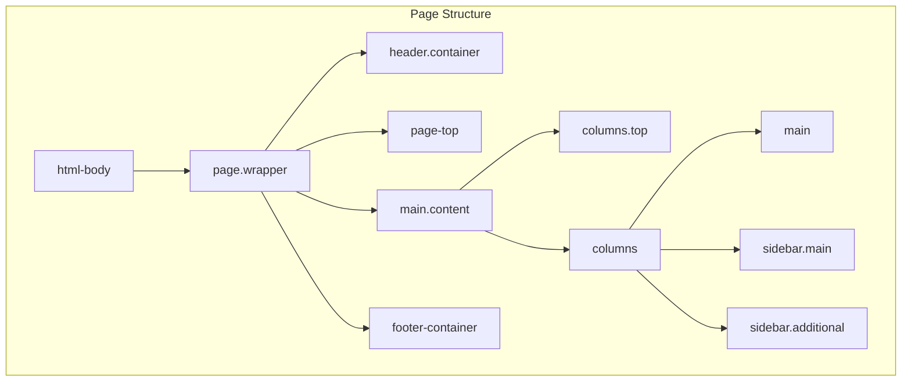

# 📅 الشهر الثالث: Frontend و JavaScript

> **الهدف:** إتقان الـ Layout System، Templates، CSS/LESS، و RequireJS

---

## 🎯 أهداف الشهر

- [ ] فهم الـ Layout XML بالتفصيل
- [ ] إنشاء Themes مخصصة
- [ ] إتقان LESS و CSS في Magento
- [ ] فهم RequireJS و JavaScript
- [ ] التعامل مع UI Components

---

## 📆 الأسبوع الأول: Layout System

### اليوم 1-3: فهم Layout XML

```xml
<?xml version="1.0"?>
<page xmlns:xsi="http://www.w3.org/2001/XMLSchema-instance"
      layout="2columns-left"
      xsi:noNamespaceSchemaLocation="urn:magento:framework:View/Layout/etc/page_configuration.xsd">

    <!-- Head Section -->
    <head>
        <title>Page Title</title>
        <css src="Vendor_Module::css/styles.css"/>
        <script src="Vendor_Module::js/custom.js"/>
        <link src="Vendor_Module::js/module.js"/>
    </head>

    <body>
        <!-- Add Block to Container -->
        <referenceContainer name="content">
            <block class="Vendor\Module\Block\Custom"
                   name="custom.block"
                   template="Vendor_Module::custom.phtml"
                   cacheable="false">
                <arguments>
                    <argument name="view_model" xsi:type="object">
                        Vendor\Module\ViewModel\CustomViewModel
                    </argument>
                </arguments>
            </block>
        </referenceContainer>

        <!-- Move Block -->
        <move element="product.info.price" destination="product.info.main" before="-"/>

        <!-- Remove Block -->
        <referenceBlock name="catalog.compare.sidebar" remove="true"/>

        <!-- Update Block -->
        <referenceBlock name="existing.block">
            <action method="setTemplate">
                <argument name="template" xsi:type="string">Vendor_Module::new.phtml</argument>
            </action>
        </referenceBlock>
    </body>
</page>
```

**أنواع الـ Handles:**

| Handle | الوصف |
|--------|-------|
| `default.xml` | جميع الصفحات |
| `catalog_product_view.xml` | صفحة المنتج |
| `catalog_category_view.xml` | صفحة الفئة |
| `checkout_cart_index.xml` | سلة التسوق |
| `checkout_index_index.xml` | صفحة الـ Checkout |
| `customer_account_login.xml` | تسجيل الدخول |
| `cms_index_index.xml` | الصفحة الرئيسية |
| `custom_controller_action.xml` | صفحة مخصصة |

### اليوم 4-7: Containers و Blocks



**الـ Containers الأساسية:**

```xml
<!-- Main Containers -->
<referenceContainer name="header.container"/>
<referenceContainer name="content"/>
<referenceContainer name="footer-container"/>
<referenceContainer name="sidebar.main"/>
<referenceContainer name="before.body.end"/>
```

---

## 📆 الأسبوع الثاني: Themes

### اليوم 8-10: إنشاء Theme مخصص

```
app/design/frontend/Vendor/theme-name/
├── registration.php
├── theme.xml
├── composer.json
├── etc/
│   └── view.xml
├── web/
│   ├── css/
│   │   └── source/
│   │       └── _theme.less
│   ├── images/
│   │   └── logo.svg
│   └── js/
├── Magento_Theme/
│   ├── layout/
│   │   └── default.xml
│   └── templates/
│       └── html/
│           └── header.phtml
└── media/
    └── preview.jpg
```

```php
// registration.php
<?php
use Magento\Framework\Component\ComponentRegistrar;

ComponentRegistrar::register(
    ComponentRegistrar::THEME,
    'frontend/Vendor/theme-name',
    __DIR__
);
```

```xml
<!-- theme.xml -->
<theme xmlns:xsi="http://www.w3.org/2001/XMLSchema-instance"
       xsi:noNamespaceSchemaLocation="urn:magento:framework:Config/etc/theme.xsd">
    <title>Custom Theme</title>
    <parent>Magento/luma</parent>
    <media>
        <preview_image>media/preview.jpg</preview_image>
    </media>
</theme>
```

### اليوم 11-14: LESS و CSS

```less
// web/css/source/_theme.less

// Variables
@primary-color: #1979c3;
@secondary-color: #ff5501;
@font-family: 'Open Sans', sans-serif;

// Mixins
.box-shadow(@shadow) {
    -webkit-box-shadow: @shadow;
    box-shadow: @shadow;
}

// Custom Styles
.custom-block {
    background: @primary-color;
    padding: 20px;
    .box-shadow(0 2px 8px rgba(0,0,0,0.1));

    &__title {
        color: white;
        font-family: @font-family;
    }
}
```

**Magento UI Library:**

```less
// استخدام مكتبة Magento
@import 'source/_buttons.less';
@import 'source/_forms.less';
@import 'source/_tables.less';

// Override Variables
@button__background: @primary-color;
@button__border: 1px solid darken(@primary-color, 10%);
```

---

## 📆 الأسبوع الثالث: JavaScript و RequireJS

### اليوم 15-18: RequireJS Configuration

```javascript
// view/frontend/requirejs-config.js
var config = {
    paths: {
        'customModule': 'Vendor_Module/js/custom-module',
        'slick': 'Vendor_Module/js/lib/slick.min'
    },
    shim: {
        'slick': {
            deps: ['jquery']
        }
    },
    map: {
        '*': {
            'customWidget': 'Vendor_Module/js/custom-widget'
        }
    },
    config: {
        mixins: {
            'Magento_Catalog/js/catalog-add-to-cart': {
                'Vendor_Module/js/mixins/catalog-add-to-cart-mixin': true
            }
        }
    }
};
```

### اليوم 19-21: JavaScript Widgets

```javascript
// view/frontend/web/js/custom-widget.js
define([
    'jquery',
    'jquery-ui-modules/widget',
    'mage/translate'
], function ($, widget, $t) {
    'use strict';

    $.widget('vendor.customWidget', {
        options: {
            message: 'Default message',
            delay: 3000
        },

        _create: function () {
            this._bind();
            console.log('Widget initialized');
        },

        _bind: function () {
            this.element.on('click', this._onClick.bind(this));
        },

        _onClick: function (event) {
            event.preventDefault();
            this._showMessage();
        },

        _showMessage: function () {
            alert($t(this.options.message));
        }
    });

    return $.vendor.customWidget;
});
```

**استخدام الـ Widget:**

```html
<div data-mage-init='{"Vendor_Module/js/custom-widget": {"message": "Hello!"}}'>
    Click me
</div>

<!-- أو باستخدام x-magento-init -->
<script type="text/x-magento-init">
{
    "#element-id": {
        "Vendor_Module/js/custom-widget": {
            "message": "Custom message",
            "delay": 5000
        }
    }
}
</script>
```

### اليوم 22-24: Mixins و KnockoutJS

```javascript
// view/frontend/web/js/mixins/catalog-add-to-cart-mixin.js
define([], function () {
    'use strict';

    return function (originalWidget) {
        $.widget('mage.catalogAddToCart', originalWidget, {
            submitForm: function (form) {
                console.log('Before add to cart');
                // Custom logic
                return this._super(form);
            }
        });

        return $.mage.catalogAddToCart;
    };
});
```

**KnockoutJS في Magento:**

```html
<!-- Template with KO bindings -->
<div data-bind="scope: 'customComponent'">
    <span data-bind="text: message"></span>
    <button data-bind="click: submit">Submit</button>
</div>

<script type="text/x-magento-init">
{
    "*": {
        "Magento_Ui/js/core/app": {
            "components": {
                "customComponent": {
                    "component": "Vendor_Module/js/view/custom-component"
                }
            }
        }
    }
}
</script>
```

---

## 📆 الأسبوع الرابع: UI Components

### اليوم 25-28: UI Component Basics

```xml
<!-- view/adminhtml/ui_component/custom_listing.xml -->
<?xml version="1.0"?>
<listing xmlns:xsi="http://www.w3.org/2001/XMLSchema-instance"
         xsi:noNamespaceSchemaLocation="urn:magento:module:Magento_Ui:etc/ui_configuration.xsd">

    <argument name="data" xsi:type="array">
        <item name="js_config" xsi:type="array">
            <item name="provider" xsi:type="string">custom_listing.custom_listing_data_source</item>
        </item>
    </argument>

    <settings>
        <spinner>custom_columns</spinner>
        <deps>
            <dep>custom_listing.custom_listing_data_source</dep>
        </deps>
    </settings>

    <dataSource name="custom_listing_data_source">
        <argument name="dataProvider" xsi:type="configurableObject">
            <argument name="class" xsi:type="string">Magento\Framework\View\Element\UiComponent\DataProvider\DataProvider</argument>
            <argument name="name" xsi:type="string">custom_listing_data_source</argument>
            <argument name="primaryFieldName" xsi:type="string">entity_id</argument>
            <argument name="requestFieldName" xsi:type="string">id</argument>
        </argument>
    </dataSource>

    <listingToolbar name="listing_top">
        <bookmark name="bookmarks"/>
        <columnsControls name="columns_controls"/>
        <filters name="listing_filters"/>
        <paging name="listing_paging"/>
    </listingToolbar>

    <columns name="custom_columns">
        <selectionsColumn name="ids">
            <settings>
                <indexField>entity_id</indexField>
            </settings>
        </selectionsColumn>

        <column name="entity_id">
            <settings>
                <filter>textRange</filter>
                <label translate="true">ID</label>
                <sorting>asc</sorting>
            </settings>
        </column>

        <column name="name">
            <settings>
                <filter>text</filter>
                <label translate="true">Name</label>
            </settings>
        </column>
    </columns>
</listing>
```

---

## ✅ اختبار نهاية الشهر

### أسئلة:

1. ما الفرق بين Container و Block؟
2. كيف تضيف CSS/JS لصفحة معينة فقط؟
3. اشرح كيف يعمل RequireJS في Magento
4. ما هي الـ Mixins ومتى نستخدمها؟
5. ما الفرق بين `data-mage-init` و `x-magento-init`؟

### مشروع عملي:

إنشاء "Custom Product Slider":
- [ ] إنشاء Block يجلب featured products
- [ ] إنشاء Template مع slider design
- [ ] إضافة Slick.js carousel
- [ ] إضافة Add to Cart من الـ slider
- [ ] تخصيص الـ styles

---

## ➡️ [الشهر التالي: Backend و API](./month-04-backend.md)
