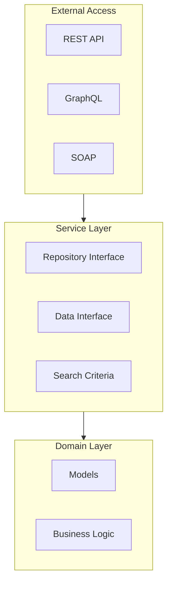

# 📅 الشهر الرابع: Backend و API

> **الهدف:** إتقان REST API، GraphQL، Service Contracts، والـ Customization

---

## 🎯 أهداف الشهر

- [ ] فهم Service Contracts
- [ ] إنشاء REST API endpoints
- [ ] فهم واستخدام GraphQL
- [ ] إتقان الـ Plugin System
- [ ] فهم الـ Event/Observer Pattern

---

## 📆 الأسبوع الأول: Service Contracts

### اليوم 1-3: فهم Service Layer



### اليوم 4-7: إنشاء Service Contract كامل

```php
<?php
// Api/Data/EntityInterface.php
namespace Vendor\Module\Api\Data;

interface EntityInterface
{
    const ENTITY_ID = 'entity_id';
    const NAME = 'name';
    const STATUS = 'status';
    const CREATED_AT = 'created_at';

    /**
     * @return int|null
     */
    public function getEntityId(): ?int;

    /**
     * @param int $entityId
     * @return $this
     */
    public function setEntityId(int $entityId): self;

    /**
     * @return string|null
     */
    public function getName(): ?string;

    /**
     * @param string $name
     * @return $this
     */
    public function setName(string $name): self;

    /**
     * @return int
     */
    public function getStatus(): int;

    /**
     * @param int $status
     * @return $this
     */
    public function setStatus(int $status): self;
}
```

```php
<?php
// Api/EntityRepositoryInterface.php
namespace Vendor\Module\Api;

use Vendor\Module\Api\Data\EntityInterface;
use Vendor\Module\Api\Data\EntitySearchResultsInterface;
use Magento\Framework\Api\SearchCriteriaInterface;
use Magento\Framework\Exception\LocalizedException;
use Magento\Framework\Exception\NoSuchEntityException;

/**
 * @api
 */
interface EntityRepositoryInterface
{
    /**
     * Save entity.
     *
     * @param \Vendor\Module\Api\Data\EntityInterface $entity
     * @return \Vendor\Module\Api\Data\EntityInterface
     * @throws \Magento\Framework\Exception\LocalizedException
     */
    public function save(EntityInterface $entity): EntityInterface;

    /**
     * Get entity by ID.
     *
     * @param int $entityId
     * @return \Vendor\Module\Api\Data\EntityInterface
     * @throws \Magento\Framework\Exception\NoSuchEntityException
     */
    public function getById(int $entityId): EntityInterface;

    /**
     * Delete entity.
     *
     * @param \Vendor\Module\Api\Data\EntityInterface $entity
     * @return bool
     * @throws \Magento\Framework\Exception\LocalizedException
     */
    public function delete(EntityInterface $entity): bool;

    /**
     * Delete entity by ID.
     *
     * @param int $entityId
     * @return bool
     * @throws \Magento\Framework\Exception\NoSuchEntityException
     * @throws \Magento\Framework\Exception\LocalizedException
     */
    public function deleteById(int $entityId): bool;

    /**
     * Get entity list.
     *
     * @param \Magento\Framework\Api\SearchCriteriaInterface $searchCriteria
     * @return \Vendor\Module\Api\Data\EntitySearchResultsInterface
     */
    public function getList(SearchCriteriaInterface $searchCriteria): EntitySearchResultsInterface;
}
```

---

## 📆 الأسبوع الثاني: REST API

### اليوم 8-11: webapi.xml

```xml
<?xml version="1.0"?>
<routes xmlns:xsi="http://www.w3.org/2001/XMLSchema-instance"
        xsi:noNamespaceSchemaLocation="urn:magento:module:Magento_Webapi:etc/webapi.xsd">

    <!-- GET single entity -->
    <route url="/V1/vendor-module/entities/:entityId" method="GET">
        <service class="Vendor\Module\Api\EntityRepositoryInterface" method="getById"/>
        <resources>
            <resource ref="Vendor_Module::entity_view"/>
        </resources>
    </route>

    <!-- GET list with search criteria -->
    <route url="/V1/vendor-module/entities" method="GET">
        <service class="Vendor\Module\Api\EntityRepositoryInterface" method="getList"/>
        <resources>
            <resource ref="Vendor_Module::entity_view"/>
        </resources>
    </route>

    <!-- POST create -->
    <route url="/V1/vendor-module/entities" method="POST">
        <service class="Vendor\Module\Api\EntityRepositoryInterface" method="save"/>
        <resources>
            <resource ref="Vendor_Module::entity_save"/>
        </resources>
    </route>

    <!-- PUT update -->
    <route url="/V1/vendor-module/entities/:entityId" method="PUT">
        <service class="Vendor\Module\Api\EntityRepositoryInterface" method="save"/>
        <resources>
            <resource ref="Vendor_Module::entity_save"/>
        </resources>
    </route>

    <!-- DELETE -->
    <route url="/V1/vendor-module/entities/:entityId" method="DELETE">
        <service class="Vendor\Module\Api\EntityRepositoryInterface" method="deleteById"/>
        <resources>
            <resource ref="Vendor_Module::entity_delete"/>
        </resources>
    </route>

    <!-- Anonymous endpoint -->
    <route url="/V1/vendor-module/public" method="GET">
        <service class="Vendor\Module\Api\PublicDataInterface" method="getData"/>
        <resources>
            <resource ref="anonymous"/>
        </resources>
    </route>

    <!-- Self (customer) endpoint -->
    <route url="/V1/vendor-module/my-data" method="GET">
        <service class="Vendor\Module\Api\CustomerDataInterface" method="getMyData"/>
        <resources>
            <resource ref="self"/>
        </resources>
    </route>
</routes>
```

### اليوم 12-14: استخدام الـ API

```bash
# Get Admin Token
curl -X POST "https://magento.local/rest/V1/integration/admin/token" \
     -H "Content-Type: application/json" \
     -d '{"username":"admin","password":"admin123"}'

# GET single entity
curl -X GET "https://magento.local/rest/V1/vendor-module/entities/1" \
     -H "Authorization: Bearer {token}"

# GET list with filters
curl -X GET "https://magento.local/rest/V1/vendor-module/entities?\
searchCriteria[filterGroups][0][filters][0][field]=status&\
searchCriteria[filterGroups][0][filters][0][value]=1&\
searchCriteria[pageSize]=10&\
searchCriteria[currentPage]=1" \
     -H "Authorization: Bearer {token}"

# POST create
curl -X POST "https://magento.local/rest/V1/vendor-module/entities" \
     -H "Authorization: Bearer {token}" \
     -H "Content-Type: application/json" \
     -d '{"entity": {"name": "New Entity", "status": 1}}'

# PUT update
curl -X PUT "https://magento.local/rest/V1/vendor-module/entities/1" \
     -H "Authorization: Bearer {token}" \
     -H "Content-Type: application/json" \
     -d '{"entity": {"entity_id": 1, "name": "Updated Name"}}'

# DELETE
curl -X DELETE "https://magento.local/rest/V1/vendor-module/entities/1" \
     -H "Authorization: Bearer {token}"
```

---

## 📆 الأسبوع الثالث: GraphQL

### اليوم 15-18: إنشاء GraphQL Schema

```graphql
# etc/schema.graphqls

type Query {
    customEntity(id: Int! @doc(description: "Entity ID")): CustomEntity
        @resolver(class: "Vendor\\Module\\Model\\Resolver\\Entity")
        @doc(description: "Get custom entity by ID")

    customEntities(
        filter: CustomEntityFilterInput @doc(description: "Filter options")
        pageSize: Int = 20 @doc(description: "Number of results")
        currentPage: Int = 1 @doc(description: "Page number")
    ): CustomEntities
        @resolver(class: "Vendor\\Module\\Model\\Resolver\\Entities")
        @doc(description: "Get list of custom entities")
}

type Mutation {
    createCustomEntity(input: CustomEntityInput!): CustomEntity
        @resolver(class: "Vendor\\Module\\Model\\Resolver\\CreateEntity")
        @doc(description: "Create new custom entity")

    updateCustomEntity(id: Int!, input: CustomEntityInput!): CustomEntity
        @resolver(class: "Vendor\\Module\\Model\\Resolver\\UpdateEntity")
        @doc(description: "Update custom entity")

    deleteCustomEntity(id: Int!): Boolean
        @resolver(class: "Vendor\\Module\\Model\\Resolver\\DeleteEntity")
        @doc(description: "Delete custom entity")
}

type CustomEntity @doc(description: "Custom Entity") {
    entity_id: Int @doc(description: "Entity ID")
    name: String @doc(description: "Entity name")
    status: Int @doc(description: "Status")
    created_at: String @doc(description: "Created date")
}

type CustomEntities @doc(description: "Custom Entities Result") {
    items: [CustomEntity] @doc(description: "List of entities")
    total_count: Int @doc(description: "Total count")
    page_info: SearchResultPageInfo @doc(description: "Pagination info")
}

input CustomEntityInput @doc(description: "Entity Input") {
    name: String! @doc(description: "Entity name")
    status: Int @doc(description: "Status (0 or 1)")
}

input CustomEntityFilterInput @doc(description: "Filter Input") {
    entity_id: FilterTypeInput
    name: FilterTypeInput
    status: FilterTypeInput
}
```

### اليوم 19-21: GraphQL Resolver

```php
<?php
namespace Vendor\Module\Model\Resolver;

use Magento\Framework\GraphQl\Config\Element\Field;
use Magento\Framework\GraphQl\Query\ResolverInterface;
use Magento\Framework\GraphQl\Schema\Type\ResolveInfo;
use Vendor\Module\Api\EntityRepositoryInterface;

class Entity implements ResolverInterface
{
    public function __construct(
        private EntityRepositoryInterface $entityRepository
    ) {}

    public function resolve(
        Field $field,
        $context,
        ResolveInfo $info,
        array $value = null,
        array $args = null
    ) {
        $entityId = $args['id'];
        $entity = $this->entityRepository->getById($entityId);

        return [
            'entity_id' => $entity->getEntityId(),
            'name' => $entity->getName(),
            'status' => $entity->getStatus(),
            'created_at' => $entity->getCreatedAt()
        ];
    }
}
```

**GraphQL Query:**

```graphql
query {
    customEntity(id: 1) {
        entity_id
        name
        status
    }

    customEntities(pageSize: 10, currentPage: 1) {
        items {
            entity_id
            name
        }
        total_count
    }
}

mutation {
    createCustomEntity(input: {name: "New Entity", status: 1}) {
        entity_id
        name
    }
}
```

---

## 📆 الأسبوع الرابع: Plugins و Events

### اليوم 22-25: Plugin System المتقدم

```php
<?php
namespace Vendor\Module\Plugin;

use Magento\Catalog\Model\Product;

class ProductPlugin
{
    /**
     * Before plugin - modify arguments
     */
    public function beforeSetPrice(Product $subject, $price): array
    {
        // Apply discount
        $discountedPrice = $price * 0.9;
        return [$discountedPrice];
    }

    /**
     * After plugin - modify result
     */
    public function afterGetPrice(Product $subject, $result): float
    {
        // Add tax
        return $result * 1.1;
    }

    /**
     * Around plugin - full control
     */
    public function aroundSave(
        Product $subject,
        callable $proceed
    ): Product {
        // Before save
        $this->logger->info('Before product save');

        // Call original method
        $result = $proceed();

        // After save
        $this->logger->info('After product save', ['id' => $result->getId()]);

        return $result;
    }
}
```

### اليوم 26-28: Events المتقدمة

```php
<?php
// Dispatch custom event
namespace Vendor\Module\Model;

use Magento\Framework\Event\ManagerInterface;

class EntityService
{
    public function __construct(
        private ManagerInterface $eventManager
    ) {}

    public function process(Entity $entity): void
    {
        // Before event
        $this->eventManager->dispatch(
            'vendor_module_entity_process_before',
            ['entity' => $entity]
        );

        // Process logic...

        // After event
        $this->eventManager->dispatch(
            'vendor_module_entity_process_after',
            ['entity' => $entity, 'result' => $result]
        );
    }
}
```

---

## ✅ اختبار نهاية الشهر

### أسئلة:

1. ما هي الـ Service Contracts ولماذا نستخدمها؟
2. اشرح الفرق بين REST و GraphQL
3. ما هي authentication methods المتاحة؟
4. متى نستخدم Observer ومتى نستخدم Plugin؟
5. ما هي أنواع الـ Plugins الثلاثة؟

### مشروع عملي:

إنشاء "Wishlist API Extension":
- [ ] REST endpoint لإضافة منتج للـ Wishlist
- [ ] GraphQL query للحصول على الـ Wishlist
- [ ] Plugin لتسجيل إحصائيات
- [ ] Event عند إضافة منتج

---

## ➡️ [الشهر التالي: المواضيع المتقدمة](./month-05-advanced.md)
