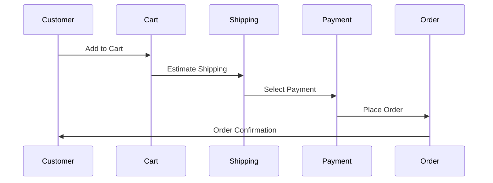
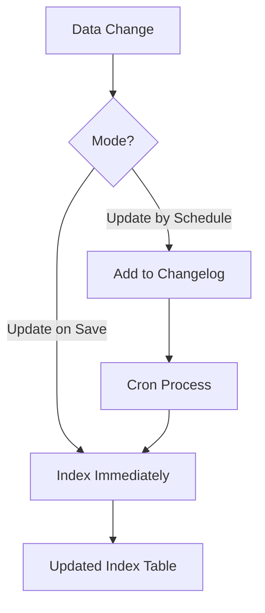

# 📅 الشهر الخامس: المواضيع المتقدمة

> **الهدف:** إتقان Checkout، Indexers، Message Queues، و Performance

---

## 🎯 أهداف الشهر

- [ ] فهم Checkout Flow
- [ ] إنشاء Custom Shipping/Payment Methods
- [ ] فهم Indexers و Cron
- [ ] Message Queues (RabbitMQ)
- [ ] Performance Optimization

---

## 📆 الأسبوع الأول: Checkout

### اليوم 1-3: Checkout Flow



**أهم الـ Classes:**

```php
Magento\Checkout\Model\Cart
Magento\Quote\Model\Quote
Magento\Quote\Model\QuoteManagement
Magento\Sales\Model\Order
Magento\Sales\Model\OrderRepository
```

### اليوم 4-7: Custom Shipping Method

```php
<?php
// Model/Carrier/CustomShipping.php
namespace Vendor\Module\Model\Carrier;

use Magento\Shipping\Model\Carrier\AbstractCarrier;
use Magento\Shipping\Model\Carrier\CarrierInterface;
use Magento\Quote\Model\Quote\Address\RateRequest;

class CustomShipping extends AbstractCarrier implements CarrierInterface
{
    protected $_code = 'customshipping';
    protected $_isFixed = true;

    public function collectRates(RateRequest $request)
    {
        if (!$this->isActive()) {
            return false;
        }

        $result = $this->_rateResultFactory->create();
        $method = $this->_rateMethodFactory->create();

        $method->setCarrier($this->_code);
        $method->setCarrierTitle($this->getConfigData('title'));
        $method->setMethod($this->_code);
        $method->setMethodTitle($this->getConfigData('name'));
        $method->setPrice($this->getConfigData('price'));
        $method->setCost($this->getConfigData('price'));

        $result->append($method);
        return $result;
    }

    public function getAllowedMethods(): array
    {
        return [$this->_code => $this->getConfigData('name')];
    }
}
```

```xml
<!-- etc/config.xml -->
<config>
    <default>
        <carriers>
            <customshipping>
                <active>1</active>
                <model>Vendor\Module\Model\Carrier\CustomShipping</model>
                <name>Custom Shipping</name>
                <title>Custom Carrier</title>
                <price>10.00</price>
                <sallowspecific>0</sallowspecific>
            </customshipping>
        </carriers>
    </default>
</config>
```

---

## 📆 الأسبوع الثاني: Indexers

### اليوم 8-11: فهم Indexers



**الـ Indexers الأساسية:**

| Indexer | الوظيفة |
|---------|---------|
| `catalog_product_flat` | Flat product tables |
| `catalog_category_flat` | Flat category tables |
| `catalog_product_price` | Product prices |
| `cataloginventory_stock` | Stock status |
| `catalogsearch_fulltext` | Search index |
| `catalog_category_product` | Category-Product relations |

### اليوم 12-14: إنشاء Custom Indexer

```php
<?php
// Model/Indexer/CustomIndexer.php
namespace Vendor\Module\Model\Indexer;

use Magento\Framework\Indexer\ActionInterface;
use Magento\Framework\Mview\ActionInterface as MviewActionInterface;

class CustomIndexer implements ActionInterface, MviewActionInterface
{
    public function executeFull()
    {
        // Reindex all data
        $this->reindexAll();
    }

    public function executeList(array $ids)
    {
        // Reindex specific IDs
        $this->reindexByIds($ids);
    }

    public function executeRow($id)
    {
        // Reindex single row
        $this->reindexByIds([$id]);
    }

    public function execute($ids)
    {
        // MView interface - called by changelog
        $this->reindexByIds($ids);
    }

    private function reindexByIds(array $ids): void
    {
        // Indexing logic
    }
}
```

```xml
<!-- etc/indexer.xml -->
<config>
    <indexer id="vendor_module_custom_indexer"
             view_id="vendor_module_custom_indexer"
             class="Vendor\Module\Model\Indexer\CustomIndexer">
        <title translate="true">Custom Indexer</title>
        <description translate="true">Custom data indexer</description>
    </indexer>
</config>
```

---

## 📆 الأسبوع الثالث: Message Queues

### اليوم 15-18: RabbitMQ Integration

```xml
<!-- etc/communication.xml -->
<config>
    <topic name="vendor.module.custom" request="Vendor\Module\Api\Data\MessageInterface">
        <handler name="customHandler" type="Vendor\Module\Model\Consumer\CustomHandler" method="process"/>
    </topic>
</config>
```

```xml
<!-- etc/queue_consumer.xml -->
<config>
    <consumer name="vendor.module.custom.consumer"
              queue="vendor.module.custom.queue"
              handler="Vendor\Module\Model\Consumer\CustomHandler::process"
              consumerInstance="Magento\Framework\MessageQueue\Consumer"/>
</config>
```

```xml
<!-- etc/queue_topology.xml -->
<config>
    <exchange name="vendor.module.exchange" type="topic" connection="amqp">
        <binding id="vendorModuleBinding"
                 topic="vendor.module.custom"
                 destination="vendor.module.custom.queue"
                 destinationType="queue"/>
    </exchange>
</config>
```

### اليوم 19-21: Publisher و Consumer

```php
<?php
// Publisher
namespace Vendor\Module\Model;

use Magento\Framework\MessageQueue\PublisherInterface;

class MessagePublisher
{
    public function __construct(
        private PublisherInterface $publisher
    ) {}

    public function publish(MessageInterface $message): void
    {
        $this->publisher->publish('vendor.module.custom', $message);
    }
}
```

```php
<?php
// Consumer
namespace Vendor\Module\Model\Consumer;

class CustomHandler
{
    public function process(MessageInterface $message): void
    {
        // Process the message
        $data = $message->getData();
        // Business logic...
    }
}
```

---

## 📆 الأسبوع الرابع: Performance

### اليوم 22-25: Caching Strategies

```php
<?php
// Cache Implementation
namespace Vendor\Module\Model;

use Magento\Framework\App\CacheInterface;
use Magento\Framework\Serialize\SerializerInterface;

class DataProvider
{
    private const CACHE_KEY = 'vendor_module_data_';
    private const CACHE_LIFETIME = 3600;

    public function __construct(
        private CacheInterface $cache,
        private SerializerInterface $serializer
    ) {}

    public function getData(int $id): array
    {
        $cacheKey = self::CACHE_KEY . $id;
        $cached = $this->cache->load($cacheKey);

        if ($cached) {
            return $this->serializer->unserialize($cached);
        }

        $data = $this->loadFromDatabase($id);

        $this->cache->save(
            $this->serializer->serialize($data),
            $cacheKey,
            ['vendor_module_data'],
            self::CACHE_LIFETIME
        );

        return $data;
    }

    public function invalidate(int $id): void
    {
        $this->cache->remove(self::CACHE_KEY . $id);
    }
}
```

### اليوم 26-28: Database Optimization

```php
// Collection Optimization
$collection->addFieldToSelect(['id', 'name', 'status']); // Select specific fields
$collection->setPageSize(100); // Limit results
$collection->getSelect()->group('category_id'); // Group data

// Use Repository with SearchCriteria
$searchCriteria = $this->searchCriteriaBuilder
    ->addFilter('status', 1)
    ->setPageSize(50)
    ->create();

$result = $this->repository->getList($searchCriteria);
```

---

## ✅ اختبار نهاية الشهر

### أسئلة:

1. اشرح Checkout Flow في Magento
2. كيف تنشئ Custom Shipping Method؟
3. ما الفرق بين "Update on Save" و "Update by Schedule"؟
4. ما هي Message Queues ومتى نستخدمها؟
5. ما هي Cache Types في Magento؟

### مشروع عملي:

إنشاء "Custom Inventory Alert System":
- [ ] Indexer لتتبع المنتجات قليلة الكمية
- [ ] Message Queue لإرسال الإشعارات
- [ ] Cron job للفحص اليومي
- [ ] Cache للنتائج

---

## ➡️ [الشهر التالي: التحضير للامتحان](./month-06-exam-prep.md)
