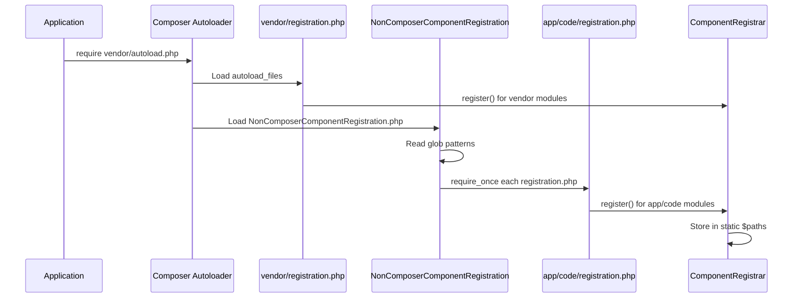
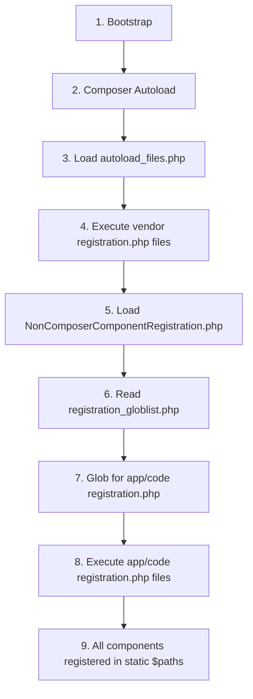

# 📄 ملف التسجيل `registration.php`

> الدليل الشامل من المستوى المبتدئ إلى الاحترافي

---

## 📑 الفهرس

1. [مقدمة](#1-مقدمة)
2. [الكود الأساسي](#2-الكود-الأساسي)
3. [فهم ComponentRegistrar Class](#3-فهم-componentregistrar-class)
4. [كيف يتم تحميل الملف](#4-كيف-يتم-تحميل-الملف)
5. [أنواع المكونات](#5-أنواع-المكونات)
6. [الـ Functions الأساسية](#6-الـ-functions-الأساسية)
7. [Static Storage Pattern](#7-static-storage-pattern)
8. [آلية اكتشاف المكونات](#8-آلية-اكتشاف-المكونات)
9. [التكامل مع Composer](#9-التكامل-مع-composer)
10. [Best Practices](#10-best-practices)
11. [Bad Practices](#11-bad-practices)
12. [أخطاء شائعة وحلولها](#12-أخطاء-شائعة-وحلولها)
13. [مستوى متقدم](#13-مستوى-متقدم)

---

## 1. مقدمة

### ما هو `registration.php`؟

`registration.php` هو **نقطة الدخول الأولى** لأي مكون (Component) في Magento 2. بدون هذا الملف، Magento لن يعرف بوجود المكون.

### لماذا هو إلزامي؟

```
❌ بدون registration.php:
   - Magento لا يعرف المودول
   - الـ Autoloading لا يعمل
   - الأوامر مثل module:enable تفشل

✅ مع registration.php:
   - المودول مسجل في النظام
   - Classes قابلة للتحميل
   - المودول يظهر في module:status
```

---

## 2. الكود الأساسي

### الشكل الأدنى (Minimal)

```php
<?php
use Magento\Framework\Component\ComponentRegistrar;

ComponentRegistrar::register(ComponentRegistrar::MODULE, 'Vendor_ModuleName', __DIR__);
```

### الشكل الكامل (Full Professional)

```php
<?php
/**
 * Copyright © Your Company. All rights reserved.
 * See LICENSE.txt for license details.
 */
declare(strict_types=1);

use Magento\Framework\Component\ComponentRegistrar;

ComponentRegistrar::register(
    ComponentRegistrar::MODULE,
    'Vendor_ModuleName',
    __DIR__
);
```

### تحليل كل جزء

| الجزء | الشرح |
|-------|-------|
| `<?php` | فتح PHP tag (لا تستخدم short tag `<?`) |
| `declare(strict_types=1)` | تفعيل Strict Types (PHP 7+) |
| `use` statement | استيراد الـ Class |
| `ComponentRegistrar::register()` | Static method للتسجيل |
| `ComponentRegistrar::MODULE` | Constant يحدد نوع المكون |
| `'Vendor_ModuleName'` | اسم المكون (Vendor_Module format) |
| `__DIR__` | Magic constant - المسار الحالي للملف |

---

## 3. فهم ComponentRegistrar Class

### الموقع في Vendor

```
vendor/magento/framework/Component/ComponentRegistrar.php
```

### الكود الكامل للـ Class

```php
<?php
namespace Magento\Framework\Component;

class ComponentRegistrar implements ComponentRegistrarInterface
{
    // أنواع المكونات المتاحة
    const MODULE = 'module';
    const LIBRARY = 'library';
    const THEME = 'theme';
    const LANGUAGE = 'language';
    const SETUP = 'setup';

    // Static array لتخزين المسارات
    private static $paths = [
        self::MODULE => [],
        self::LIBRARY => [],
        self::LANGUAGE => [],
        self::THEME => [],
        self::SETUP => []
    ];

    /**
     * تسجيل مكون جديد
     *
     * @param string $type نوع المكون
     * @param string $componentName اسم المكون
     * @param string $path مسار المكون
     * @throws \LogicException
     */
    public static function register($type, $componentName, $path)
    {
        self::validateType($type);

        if (isset(self::$paths[$type][$componentName])) {
            throw new \LogicException(
                ucfirst($type) . ' \'' . $componentName . '\' from \'' . $path . '\' '
                . 'has been already defined in \'' . self::$paths[$type][$componentName] . '\'.'
            );
        }

        self::$paths[$type][$componentName] = str_replace('\\', '/', $path);
    }

    /**
     * الحصول على جميع مسارات نوع معين
     */
    public function getPaths($type)
    {
        self::validateType($type);
        return self::$paths[$type];
    }

    /**
     * الحصول على مسار مكون محدد
     */
    public function getPath($type, $componentName)
    {
        self::validateType($type);
        return self::$paths[$type][$componentName] ?? null;
    }

    /**
     * التحقق من صحة النوع
     */
    private static function validateType($type)
    {
        if (!isset(self::$paths[$type])) {
            throw new \LogicException('\'' . $type . '\' is not a valid component type');
        }
    }
}
```

---

## 4. كيف يتم تحميل الملف

### مسارات التحميل

هناك طريقتان رئيسيتان:

### الطريقة 1: Composer Autoload (للمكونات في vendor)

```
vendor/composer/autoload_files.php
```

```php
return array(
    'hash1' => $vendorDir . '/magento/framework/registration.php',
    'hash2' => $vendorDir . '/magento/module-catalog/registration.php',
    // ... مئات الملفات
);
```

### الطريقة 2: Glob Patterns (للمكونات في app/code)

```
app/etc/NonComposerComponentRegistration.php
```

```php
(static function (): void {
    $globPatterns = require __DIR__ . '/registration_globlist.php';
    $baseDir = \dirname(__DIR__, 2) . '/';

    foreach ($globPatterns as $globPattern) {
        $files = \glob($baseDir . $globPattern, GLOB_NOSORT);
        \array_map(
            static function (string $file): void {
                require_once $file;
            },
            $files
        );
    }
})();
```

### قائمة الـ Glob Patterns

```php
// app/etc/registration_globlist.php
return [
    'app/code/*/*/cli_commands.php',
    'app/code/*/*/registration.php',        // ← المودولات
    'app/design/*/*/*/registration.php',    // ← الثيمات
    'app/i18n/*/*/registration.php',        // ← اللغات
    'lib/internal/*/*/registration.php',
    'lib/internal/*/*/*/registration.php',
    'setup/src/*/*/registration.php'
];
```

### ترتيب التحميل



---

## 5. أنواع المكونات

### جدول الأنواع الخمسة

| النوع | Constant | الوصف | مثال المسار | مثال الاسم |
|-------|----------|-------|-------------|------------|
| **Module** | `MODULE` | Extensions | `app/code/Vendor/Module` | `Vendor_Module` |
| **Theme** | `THEME` | Templates | `app/design/frontend/Vendor/theme` | `frontend/Vendor/theme` |
| **Language** | `LANGUAGE` | Translations | `app/i18n/vendor/ar_SA` | `vendor_ar_sa` |
| **Library** | `LIBRARY` | PHP Libraries | `lib/internal/Vendor/Lib` | `vendor/library` |
| **Setup** | `SETUP` | Setup Tools | `setup/src/Vendor/Setup` | `vendor/setup` |

### أمثلة التسجيل لكل نوع

#### Module
```php
ComponentRegistrar::register(
    ComponentRegistrar::MODULE,
    'Vendor_ModuleName',
    __DIR__
);
```

#### Theme
```php
ComponentRegistrar::register(
    ComponentRegistrar::THEME,
    'frontend/Vendor/mytheme',
    __DIR__
);
```

#### Language Pack
```php
ComponentRegistrar::register(
    ComponentRegistrar::LANGUAGE,
    'vendor_ar_sa',
    __DIR__
);
```

---

## 6. الـ Functions الأساسية

### 1. `register()` - Static Method

```php
public static function register($type, $componentName, $path)
```

| Parameter | Type | Description |
|-----------|------|-------------|
| `$type` | string | نوع المكون (MODULE, THEME, etc.) |
| `$componentName` | string | الاسم الفريد للمكون |
| `$path` | string | المسار المطلق للمكون |

**Returns:** `void`

**Throws:** `\LogicException` إذا:
- النوع غير صالح
- المكون مسجل مسبقاً

### 2. `getPaths()` - Instance Method

```php
public function getPaths($type): array
```

**مثال الاستخدام:**
```php
$registrar = new ComponentRegistrar();
$modules = $registrar->getPaths(ComponentRegistrar::MODULE);

// النتيجة:
[
    'Magento_Catalog' => '/var/www/html/vendor/magento/module-catalog',
    'Vendor_Module' => '/var/www/html/app/code/Vendor/Module',
    // ...
]
```

### 3. `getPath()` - Instance Method

```php
public function getPath($type, $componentName): ?string
```

**مثال الاستخدام:**
```php
$registrar = new ComponentRegistrar();
$path = $registrar->getPath(ComponentRegistrar::MODULE, 'Magento_Catalog');

// النتيجة:
'/var/www/html/vendor/magento/module-catalog'
```

### 4. `validateType()` - Private Static Method

```php
private static function validateType($type): void
```

يتحقق من أن النوع موجود في `$paths` array.

---

## 7. Static Storage Pattern

### لماذا Static؟

```php
private static $paths = [
    self::MODULE => [],
    self::LIBRARY => [],
    self::LANGUAGE => [],
    self::THEME => [],
    self::SETUP => []
];
```

**الأسباب:**

1. **Early Loading**: الملف يُحمل قبل Object Manager
2. **No Dependencies**: لا يحتاج لـ DI
3. **Global Access**: متاح من أي مكان
4. **Single State**: حالة واحدة مشتركة

### كيف تبدو البيانات بعد التحميل

```php
private static $paths = [
    'module' => [
        'Magento_Store' => '/var/www/html/vendor/magento/module-store',
        'Magento_Catalog' => '/var/www/html/vendor/magento/module-catalog',
        'Vendor_Module' => '/var/www/html/app/code/Vendor/Module',
        // ... 300+ modules
    ],
    'theme' => [
        'frontend/Magento/blank' => '/var/www/html/vendor/magento/theme-frontend-blank',
        'frontend/Magento/luma' => '/var/www/html/vendor/magento/theme-frontend-luma',
    ],
    'language' => [
        'magento_en_us' => '/var/www/html/vendor/magento/language-en_us',
    ],
    // ...
];
```

---

## 8. آلية اكتشاف المكونات

### المراحل



### كيف Magento يستخدم المعلومات

```php
// في أي مكان في Magento
$objectManager = \Magento\Framework\App\ObjectManager::getInstance();
$registrar = $objectManager->get(\Magento\Framework\Component\ComponentRegistrarInterface::class);

// الحصول على مسار مودول
$catalogPath = $registrar->getPath(
    \Magento\Framework\Component\ComponentRegistrar::MODULE,
    'Magento_Catalog'
);

// الحصول على كل المودولات
$allModules = $registrar->getPaths(
    \Magento\Framework\Component\ComponentRegistrar::MODULE
);
```

---

## 9. التكامل مع Composer

### composer.json للمودول

```json
{
    "name": "vendor/module-name",
    "description": "Module description",
    "type": "magento2-module",
    "version": "1.0.0",
    "license": ["OSL-3.0", "AFL-3.0"],
    "require": {
        "php": "~8.1.0||~8.2.0||~8.3.0",
        "magento/framework": "103.0.*"
    },
    "autoload": {
        "files": [
            "registration.php"
        ],
        "psr-4": {
            "Vendor\\ModuleName\\": ""
        }
    }
}
```

### الـ `type` المدعومة

| Type | Description |
|------|-------------|
| `magento2-module` | Extension module |
| `magento2-theme` | Theme package |
| `magento2-language` | Language pack |
| `magento2-library` | PHP library |

### كيف Composer يعالج `autoload.files`

عند تشغيل `composer dump-autoload`:

1. يقرأ كل `composer.json`
2. يجمع كل الملفات من `autoload.files`
3. يولد `vendor/composer/autoload_files.php`
4. يُحمل تلقائياً عند `require vendor/autoload.php`

---

## 10. Best Practices

### ✅ 1. استخدم `__DIR__` دائماً

```php
// ✅ صحيح
ComponentRegistrar::register(ComponentRegistrar::MODULE, 'Vendor_Module', __DIR__);

// ❌ خطأ - hardcoded path
ComponentRegistrar::register(ComponentRegistrar::MODULE, 'Vendor_Module', '/var/www/app/code/Vendor/Module');
```

### ✅ 2. استخدم `declare(strict_types=1)`

```php
<?php
declare(strict_types=1);

use Magento\Framework\Component\ComponentRegistrar;
// ...
```

### ✅ 3. اسم المودول يطابق المسار

```
المسار: app/code/Elshrif/HelloWorld
الاسم: Elshrif_HelloWorld ✅
```

### ✅ 4. أضف Copyright Header

```php
<?php
/**
 * @copyright Copyright © 2024 Your Company. All rights reserved.
 * @license   OSL-3.0
 */
declare(strict_types=1);
```

### ✅ 5. لا تغلق PHP tag

```php
// ✅ صحيح - ملف مفتوح
<?php
ComponentRegistrar::register(...);
// EOF

// ❌ خطأ - closing tag
<?php
ComponentRegistrar::register(...);
?>
```

---

## 11. Bad Practices

### ❌ 1. إضافة Logic

```php
// ❌ خطأ!
<?php
if (file_exists('/some/path')) {
    ComponentRegistrar::register(...);
}

// ❌ خطأ!
function registerModule() {
    ComponentRegistrar::register(...);
}
registerModule();
```

### ❌ 2. تسجيل أكثر من مكون

```php
// ❌ خطأ!
ComponentRegistrar::register(ComponentRegistrar::MODULE, 'Vendor_ModuleA', __DIR__);
ComponentRegistrar::register(ComponentRegistrar::MODULE, 'Vendor_ModuleB', __DIR__ . '/../ModuleB');
```

### ❌ 3. نسيان use statement

```php
// ❌ سيفشل!
<?php
ComponentRegistrar::register(ComponentRegistrar::MODULE, 'Vendor_Module', __DIR__);

// يجب إضافة:
use Magento\Framework\Component\ComponentRegistrar;
```

### ❌ 4. اسم خاطئ

```php
// المسار: app/code/Vendor/ModuleOne
// ❌ خطأ!
ComponentRegistrar::register(ComponentRegistrar::MODULE, 'Vendor_DifferentName', __DIR__);
```

---

## 12. أخطاء شائعة وحلولها

### Error 1: Module already defined

```
LogicException: Module 'Vendor_Module' from '/path/a'
has been already defined in '/path/b'.
```

**السبب:** مودولين مسجلين بنفس الاسم

**الحل:**
1. ابحث عن جميع `registration.php` بنفس الاسم
2. احذف أو أعد تسمية أحدهما

```bash
grep -r "Vendor_Module" app/code/*/registration.php
```

### Error 2: Invalid component type

```
LogicException: 'invalid_type' is not a valid component type
```

**السبب:** استخدام نوع غير موجود

**الحل:** استخدم الأنواع الصحيحة فقط:
- `ComponentRegistrar::MODULE`
- `ComponentRegistrar::THEME`
- `ComponentRegistrar::LANGUAGE`
- `ComponentRegistrar::LIBRARY`
- `ComponentRegistrar::SETUP`

### Error 3: Class not found

```
Class 'Magento\Framework\Component\ComponentRegistrar' not found
```

**السبب:** نسيان `use` statement

**الحل:**
```php
use Magento\Framework\Component\ComponentRegistrar;
```

---

## 13. مستوى متقدم

### كيف تصنع Custom Component Type

> ⚠️ **تحذير:** هذا للمعرفة فقط - لا يُنصح بتعديل Core

```php
// لإضافة نوع جديد، يجب تعديل:
// vendor/magento/framework/Component/ComponentRegistrar.php

const CUSTOM = 'custom';

private static $paths = [
    // ...
    self::CUSTOM => []
];
```

### استخدام ComponentRegistrar في كود مخصص

```php
<?php
namespace Vendor\Module\Model;

use Magento\Framework\Component\ComponentRegistrarInterface;
use Magento\Framework\Component\ComponentRegistrar;

class ModuleInfo
{
    public function __construct(
        private ComponentRegistrarInterface $componentRegistrar
    ) {}

    public function getModulePath(string $moduleName): ?string
    {
        return $this->componentRegistrar->getPath(
            ComponentRegistrar::MODULE,
            $moduleName
        );
    }

    public function getAllModules(): array
    {
        return $this->componentRegistrar->getPaths(ComponentRegistrar::MODULE);
    }

    public function isModuleRegistered(string $moduleName): bool
    {
        return $this->getModulePath($moduleName) !== null;
    }
}
```

### Debug: عرض كل المكونات المسجلة

```php
// في أي Controller أو Block للتجربة
$registrar = \Magento\Framework\App\ObjectManager::getInstance()
    ->get(\Magento\Framework\Component\ComponentRegistrarInterface::class);

$modules = $registrar->getPaths(\Magento\Framework\Component\ComponentRegistrar::MODULE);

echo "Total Modules: " . count($modules) . "\n";
foreach ($modules as $name => $path) {
    echo "$name => $path\n";
}
```

---

## 📌 ملخص

| العنصر | القيمة |
|--------|--------|
| **الملف** | `registration.php` |
| **إلزامي؟** | نعم ✅ |
| **الـ Class** | `Magento\Framework\Component\ComponentRegistrar` |
| **الـ Method** | `ComponentRegistrar::register()` |
| **Parameters** | `$type`, `$componentName`, `$path` |
| **الموقع في Vendor** | `vendor/magento/framework/Component/ComponentRegistrar.php` |

---

## ⬅️ السابق | [🏠 الرئيسية](../MODULE_STRUCTURE.md) | [التالي ➡️](./02_MODULE_XML.md)
