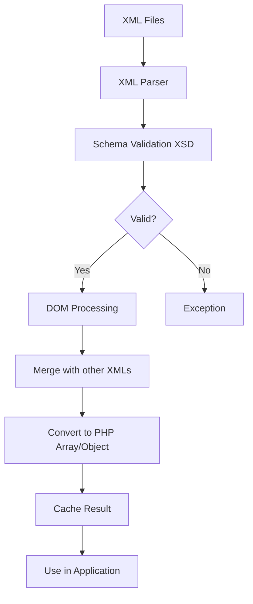
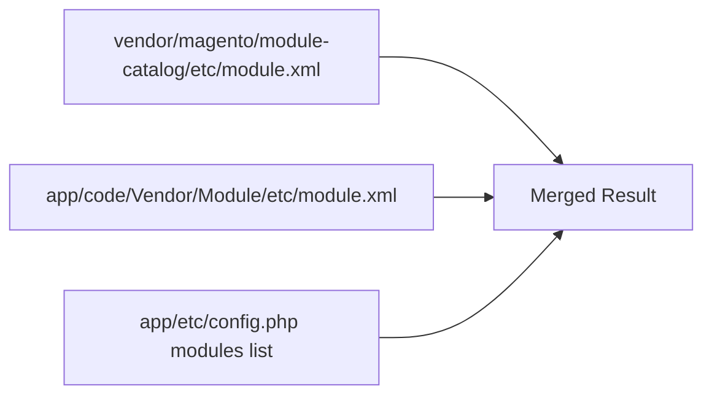
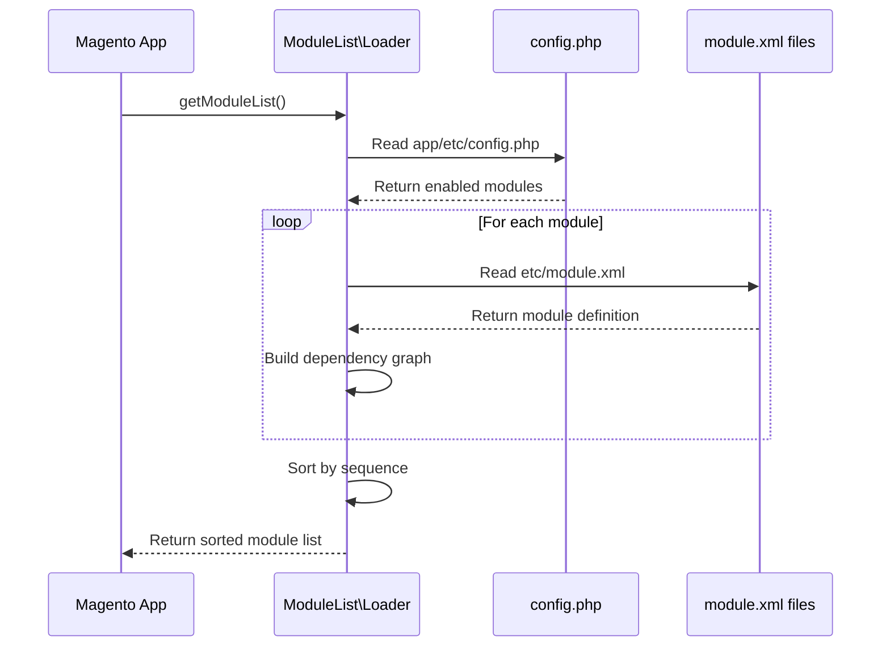

# 📄 ملف تعريف المودول `module.xml`

> الدليل الشامل لفهم XML في Magento 2 من الصفر إلى الاحتراف

---

## 📑 الفهرس

1. [مقدمة](#1-مقدمة)
2. [كيف Magento يتعامل مع XML](#2-كيف-magento-يتعامل-مع-xml)
3. [الكود الأساسي](#3-الكود-الأساسي)
4. [XSD Schema والتحقق](#4-xsd-schema-والتحقق)
5. [العناصر (Elements)](#5-العناصر-elements)
6. [الخصائص (Attributes)](#6-الخصائص-attributes)
7. [الكلمات المفتاحية](#7-الكلمات-المفتاحية)
8. [الـ Sequence والـ Dependencies](#8-الـ-sequence-والـ-dependencies)
9. [دمج XML (Merging)](#9-دمج-xml-merging)
10. [XML Areas](#10-xml-areas)
11. [متى يُقرأ الملف](#11-متى-يُقرأ-الملف)
12. [Best Practices](#12-best-practices)
13. [Bad Practices](#13-bad-practices)
14. [أخطاء شائعة](#14-أخطاء-شائعة)
15. [مستوى متقدم](#15-مستوى-متقدم)

---

## 1. مقدمة

### ما هو `module.xml`؟

`module.xml` هو الملف الثاني الإلزامي لأي مودول في Magento 2. يقع في:

```
app/code/Vendor/ModuleName/etc/module.xml
```

### الوظائف الرئيسية

| الوظيفة | الشرح |
|---------|-------|
| **تعريف الاسم** | يحدد الاسم الرسمي للمودول |
| **تحديد Dependencies** | أي مودولات يجب تحميلها أولاً |
| **ترتيب التحميل** | يتحكم في ترتيب تنفيذ المودولات |

---

## 2. كيف Magento يتعامل مع XML

### نظرة عامة على معالجة XML



### الـ Classes المسؤولة

```php
// قراءة XML
Magento\Framework\Config\Reader\Filesystem

// التحقق من Schema
Magento\Framework\Config\Dom

// تحويل لـ PHP
Magento\Framework\Config\Converter
```

### عملية القراءة بالتفصيل

```php
// 1. تحديد مسارات الملفات
$files = $this->fileResolver->get('module.xml', 'global');

// 2. قراءة وتحقق من كل ملف
foreach ($files as $file) {
    $dom = new \DOMDocument();
    $dom->loadXML($content);

    // 3. التحقق من XSD
    $dom->schemaValidate($schemaPath);

    // 4. دمج مع الملفات السابقة
    $this->merge($dom);
}

// 5. تحويل لـ PHP array
$result = $this->converter->convert($this->dom);

// 6. Cache النتيجة
$this->cache->save($result);
```

---

## 3. الكود الأساسي

### الشكل الأدنى (Minimal)

```xml
<?xml version="1.0"?>
<config xmlns:xsi="http://www.w3.org/2001/XMLSchema-instance"
        xsi:noNamespaceSchemaLocation="urn:magento:framework:Module/etc/module.xsd">
    <module name="Vendor_ModuleName"/>
</config>
```

### الشكل الكامل (Full)

```xml
<?xml version="1.0"?>
<!--
/**
 * @copyright Copyright © 2024 Your Company. All rights reserved.
 */
-->
<config xmlns:xsi="http://www.w3.org/2001/XMLSchema-instance"
        xsi:noNamespaceSchemaLocation="urn:magento:framework:Module/etc/module.xsd">
    <module name="Vendor_ModuleName">
        <sequence>
            <module name="Magento_Store"/>
            <module name="Magento_Catalog"/>
            <module name="Magento_Customer"/>
        </sequence>
    </module>
</config>
```

### تحليل كل سطر

```xml
<?xml version="1.0"?>
```
↳ XML Declaration - الإصدار 1.0 (إلزامي)

```xml
<config xmlns:xsi="http://www.w3.org/2001/XMLSchema-instance"
        xsi:noNamespaceSchemaLocation="urn:magento:framework:Module/etc/module.xsd">
```
↳ Root Element مع:
- `xmlns:xsi`: W3C XML Schema Instance namespace
- `xsi:noNamespaceSchemaLocation`: مسار الـ XSD للتحقق

```xml
<module name="Vendor_ModuleName">
```
↳ تعريف المودول مع الاسم (must match registration.php)

```xml
<sequence>
    <module name="Magento_Store"/>
</sequence>
```
↳ قائمة المودولات التي يعتمد عليها هذا المودول

---

## 4. XSD Schema والتحقق

### ما هو XSD؟

**XSD (XML Schema Definition)** هو ملف يحدد:
- العناصر المسموح بها
- الخصائص لكل عنصر
- الترتيب المطلوب
- القيم المقبولة

### موقع Schema لـ module.xml

```
vendor/magento/framework/Module/etc/module.xsd
```

### محتوى الـ XSD

```xml
<?xml version="1.0" encoding="UTF-8"?>
<xs:schema xmlns:xs="http://www.w3.org/2001/XMLSchema">
    <!-- Root element -->
    <xs:element name="config">
        <xs:complexType>
            <xs:sequence>
                <xs:element name="module" type="moduleDeclaration"
                            minOccurs="1" maxOccurs="1"/>
            </xs:sequence>
        </xs:complexType>
    </xs:element>

    <!-- Module declaration type -->
    <xs:complexType name="moduleDeclaration">
        <xs:sequence>
            <xs:element name="sequence" type="sequenceType"
                        minOccurs="0" maxOccurs="1"/>
        </xs:sequence>
        <xs:attribute name="name" type="moduleName" use="required"/>
    </xs:complexType>

    <!-- Sequence type -->
    <xs:complexType name="sequenceType">
        <xs:sequence>
            <xs:element name="module" maxOccurs="unbounded">
                <xs:complexType>
                    <xs:attribute name="name" type="moduleName" use="required"/>
                </xs:complexType>
            </xs:element>
        </xs:sequence>
    </xs:complexType>

    <!-- Module name pattern -->
    <xs:simpleType name="moduleName">
        <xs:restriction base="xs:string">
            <xs:pattern value="[A-Z][a-zA-Z0-9]*_[A-Z][a-zA-Z0-9]*"/>
        </xs:restriction>
    </xs:simpleType>
</xs:schema>
```

### قراءة الـ URN

```xml
xsi:noNamespaceSchemaLocation="urn:magento:framework:Module/etc/module.xsd"
```

| الجزء | المعنى |
|-------|--------|
| `urn:magento:` | Magento URN prefix |
| `framework:` | من `magento/framework` package |
| `Module/etc/module.xsd` | المسار داخل الـ package |

### كيف Magento يحل الـ URN

```php
// vendor/magento/framework/Config/Dom/UrnResolver.php
class UrnResolver
{
    public function getRealPath($urn)
    {
        // urn:magento:framework:Module/etc/module.xsd
        // يتحول إلى:
        // vendor/magento/framework/Module/etc/module.xsd
    }
}
```

---

## 5. العناصر (Elements)

### جدول العناصر المتاحة

| العنصر | الوصف | إلزامي | Parent |
|--------|-------|--------|--------|
| `<config>` | Root element | ✅ نعم | - |
| `<module>` | تعريف المودول | ✅ نعم | `config` |
| `<sequence>` | قائمة Dependencies | ❌ لا | `module` |
| `<module>` (inside sequence) | مودول dependency | ❌ لا | `sequence` |

### `<config>` - Root Element

```xml
<config xmlns:xsi="http://www.w3.org/2001/XMLSchema-instance"
        xsi:noNamespaceSchemaLocation="urn:magento:framework:Module/etc/module.xsd">
    <!-- محتوى هنا -->
</config>
```

**ملاحظات:**
- العنصر الجذري لكل ملف XML في Magento
- يجب تضمين XSD reference

### `<module>` - Module Declaration

```xml
<module name="Vendor_ModuleName">
    <!-- sequence here (optional) -->
</module>
```

### `<sequence>` - Load Order

```xml
<sequence>
    <module name="Magento_Store"/>
    <module name="Magento_Catalog"/>
</sequence>
```

---

## 6. الخصائص (Attributes)

### جدول الخصائص

| Attribute | Element | الوصف | إلزامي | مثال |
|-----------|---------|-------|--------|------|
| `name` | `<module>` | اسم المودول | ✅ نعم | `Vendor_Module` |
| `setup_version` | `<module>` | إصدار (deprecated) | ❌ لا | `1.0.0` |

### `name` Attribute

**القواعد:**
```
Pattern: [A-Z][a-zA-Z0-9]*_[A-Z][a-zA-Z0-9]*

✅ صحيح:
- Magento_Catalog
- Vendor_ModuleName
- MyCompany_AwesomeModule

❌ خطأ:
- magento_catalog (lowercase)
- Vendor-Module (hyphen)
- VendorModule (no underscore)
- Vendor_module (lowercase after _)
```

### `setup_version` Attribute (Deprecated)

```xml
<!-- ❌ قديم - لا تستخدمه في Magento 2.3+ -->
<module name="Vendor_Module" setup_version="1.0.0"/>

<!-- ✅ الطريقة الجديدة: Data/Schema Patches -->
```

---

## 7. الكلمات المفتاحية

### XML Keywords

| Keyword | المعنى | مثال |
|---------|--------|------|
| `xmlns` | XML Namespace | `xmlns:xsi="..."` |
| `xsi` | XML Schema Instance | `xsi:noNamespaceSchemaLocation` |
| `urn` | Uniform Resource Name | `urn:magento:framework:...` |

### Magento Module XML Keywords

| Keyword | الاستخدام |
|---------|-----------|
| `config` | Root element لكل XML |
| `module` | تعريف المودول |
| `sequence` | ترتيب التحميل |
| `name` | اسم المودول |

---

## 8. الـ Sequence والـ Dependencies

### ماذا يفعل Sequence؟

```xml
<sequence>
    <module name="Magento_Store"/>
    <module name="Magento_Catalog"/>
</sequence>
```

**يضمن أن:**
1. `Magento_Store` يُحمل أولاً
2. `Magento_Catalog` يُحمل ثانياً
3. ثم يُحمل مودولك

### Soft vs Hard Dependencies

```xml
<!-- Hard Dependency - في sequence -->
<sequence>
    <module name="Magento_Catalog"/>
</sequence>

<!-- Soft Dependency - في composer.json فقط -->
{
    "require": {
        "magento/module-catalog": "*"
    },
    "suggest": {
        "magento/module-review": "Optional for reviews"
    }
}
```

### متى تستخدم Sequence؟

| الحالة | تحتاج Sequence؟ |
|--------|----------------|
| تعتمد على Events من مودول آخر | ✅ نعم |
| تستخدم Plugins على مودول آخر | ✅ نعم |
| تستخدم Preferences (di.xml) | ✅ غالباً |
| تستخدم Layout XML من مودول آخر | ✅ نعم |
| فقط تستخدم Classes عادية | ❌ لا |

### مثال عملي

```xml
<!-- نريد عمل Plugin على Catalog Product -->
<config>
    <module name="Vendor_ProductEnhancer">
        <sequence>
            <!-- Magento_Catalog يجب أن يُحمل أولاً -->
            <module name="Magento_Catalog"/>
        </sequence>
    </module>
</config>
```

---

## 9. دمج XML (Merging)

### كيف يعمل الدمج



### قواعد الدمج لـ module.xml

```
- module.xml لا يُدمج مع ملفات أخرى
- كل module.xml مستقل
- الدمج يحدث على مستوى config.php
```

### config.php والمودولات

```php
// app/etc/config.php
return [
    'modules' => [
        'Magento_Store' => 1,      // enabled
        'Magento_Catalog' => 1,    // enabled
        'Vendor_Module' => 1,      // enabled
        'Other_Module' => 0,       // disabled
    ]
];
```

---

## 10. XML Areas

### ما هي الـ Areas؟

```
etc/
├── module.xml              # Global (كل الـ areas)
├── di.xml                  # Global DI
├── frontend/               # Frontend area
│   ├── di.xml
│   └── routes.xml
├── adminhtml/              # Admin area
│   ├── di.xml
│   └── routes.xml
├── webapi_rest/            # REST API area
├── webapi_soap/            # SOAP API area
├── graphql/                # GraphQL area
└── crontab/                # Cron area
```

### module.xml Area

```
module.xml يوضع في etc/ فقط (global)
لا يوجد module.xml في frontend/ أو adminhtml/
```

---

## 11. متى يُقرأ الملف

### Lifecycle



### الـ Classes المسؤولة

```php
// قراءة قائمة المودولات
Magento\Framework\Module\ModuleList

// تحميل module.xml
Magento\Framework\Module\ModuleList\Loader

// ترتيب المودولات
Magento\Framework\Module\ModuleList\Sorter
```

---

## 12. Best Practices

### ✅ 1. حدد Dependencies بدقة

```xml
<!-- ✅ صحيح - فقط ما تحتاجه -->
<sequence>
    <module name="Magento_Catalog"/>
</sequence>

<!-- ❌ خطأ - كثير جداً -->
<sequence>
    <module name="Magento_Store"/>
    <module name="Magento_Customer"/>
    <module name="Magento_Catalog"/>
    <module name="Magento_Sales"/>
    <module name="Magento_Checkout"/>
    <!-- ... الخ -->
</sequence>
```

### ✅ 2. استخدم XSD الصحيح

```xml
<!-- ✅ صحيح -->
xsi:noNamespaceSchemaLocation="urn:magento:framework:Module/etc/module.xsd"

<!-- ❌ خطأ - مسار مطلق -->
xsi:noNamespaceSchemaLocation="/vendor/magento/framework/Module/etc/module.xsd"
```

### ✅ 3. تحقق من صحة XML

```bash
# IDE مثل PHPStorm يتحقق تلقائياً
# أو استخدم:
bin/magento setup:upgrade
```

### ✅ 4. الاسم يطابق registration.php

```php
// registration.php
ComponentRegistrar::register(ComponentRegistrar::MODULE, 'Vendor_ModuleName', __DIR__);
```

```xml
<!-- module.xml -->
<module name="Vendor_ModuleName"/>  <!-- ✅ يطابق -->
```

---

## 13. Bad Practices

### ❌ 1. اسم لا يطابق registration.php

```php
// registration.php
'Vendor_ModuleA'

// module.xml
<module name="Vendor_ModuleB"/>  <!-- ❌ خطأ! -->
```

### ❌ 2. Circular Dependencies

```xml
<!-- Module A -->
<sequence>
    <module name="Module_B"/>
</sequence>

<!-- Module B -->
<sequence>
    <module name="Module_A"/>  <!-- ❌ Circular! -->
</sequence>
```

### ❌ 3. استخدام setup_version في 2.3+

```xml
<!-- ❌ قديم -->
<module name="Vendor_Module" setup_version="1.0.0"/>

<!-- ✅ استخدم Data/Schema Patches بدلاً -->
```

### ❌ 4. XML غير صالح

```xml
<!-- ❌ لا توجد XML declaration -->
<config>
    <module name="Vendor_Module"/>
</config>

<!-- ❌ Attribute بدون quotes -->
<module name=Vendor_Module/>

<!-- ❌ Tag غير مغلق -->
<module name="Vendor_Module">
```

---

## 14. أخطاء شائعة

### Error 1: Schema validation failed

```
The 'xyz' element is not expected.
```

**السبب:** Element غير معروف في XSD
**الحل:** تحقق من الـ XSD المسموح به

### Error 2: Module not found in sequence

```
Module 'Unknown_Module' is not installed
```

**السبب:** مودول في sequence غير موجود
**الحل:** تأكد من تثبيت المودول أو أزله من sequence

### Error 3: Circular dependency

```
Circular dependency detected: A -> B -> A
```

**السبب:** مودول A يعتمد على B والعكس
**الحل:** أعد ترتيب الـ dependencies

### Error 4: Module name mismatch

```
Module 'X' does not match module.xml declaration 'Y'
```

**السبب:** اسم registration.php ≠ module.xml
**الحل:** طابق الاسمين

---

## 15. مستوى متقدم

### قراءة module.xml برمجياً

```php
<?php
namespace Vendor\Module\Model;

use Magento\Framework\Module\ModuleListInterface;
use Magento\Framework\Module\Dir\Reader as ModuleReader;

class ModuleInfo
{
    public function __construct(
        private ModuleListInterface $moduleList,
        private ModuleReader $moduleReader
    ) {}

    public function getModules(): array
    {
        return $this->moduleList->getNames();
    }

    public function getModulePath(string $moduleName): string
    {
        return $this->moduleReader->getModuleDir('', $moduleName);
    }

    public function isModuleEnabled(string $moduleName): bool
    {
        return $this->moduleList->has($moduleName);
    }
}
```

### فهم ترتيب التحميل

```php
// vendor/magento/framework/Module/ModuleList/Sorter.php
class Sorter
{
    public function sort(array $modules): array
    {
        // 1. Build dependency graph
        // 2. Topological sort
        // 3. Return sorted array
    }
}
```

### Custom Module Configuration

إذا أردت إضافة configuration خاص لمودولك:

```xml
<!-- etc/config.xml -->
<?xml version="1.0"?>
<config xmlns:xsi="http://www.w3.org/2001/XMLSchema-instance"
        xsi:noNamespaceSchemaLocation="urn:magento:module:Magento_Store:etc/config.xsd">
    <default>
        <vendor_module>
            <general>
                <enabled>1</enabled>
                <api_key/>
            </general>
        </vendor_module>
    </default>
</config>
```

---

## 📌 ملخص

| العنصر | القيمة |
|--------|--------|
| **الملف** | `etc/module.xml` |
| **إلزامي؟** | ✅ نعم |
| **XSD** | `urn:magento:framework:Module/etc/module.xsd` |
| **Root Element** | `<config>` |
| **Main Element** | `<module name="...">` |
| **Optional** | `<sequence>` |

---

## ⬅️ [السابق](./01_REGISTRATION.md) | [🏠 الرئيسية](../MODULE_STRUCTURE.md) | [التالي ➡️](./03_ROUTES.md)
