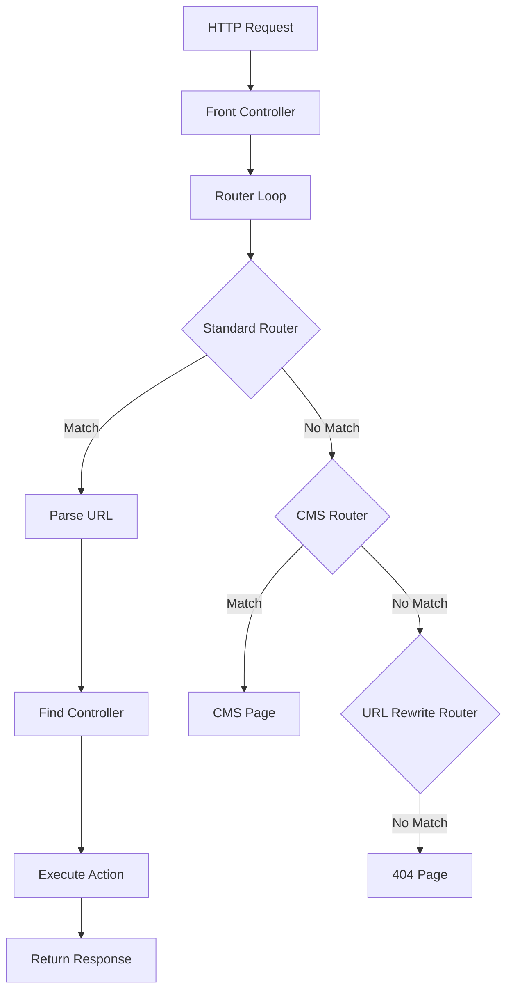
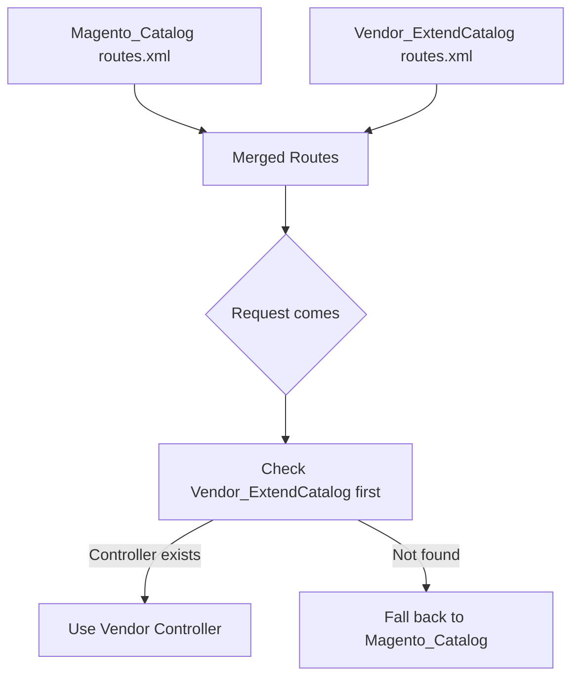

# 🛣️ ملف الـ Routes (`routes.xml`)

> الدليل الشامل لنظام الـ Routing في Magento 2

---

## 📑 الفهرس

1. [مقدمة](#1-مقدمة)
2. [كيف يعمل الـ Routing](#2-كيف-يعمل-الـ-routing)
3. [موقع الملف](#3-موقع-الملف)
4. [الكود الأساسي](#4-الكود-الأساسي)
5. [XSD Schema](#5-xsd-schema)
6. [العناصر (Elements)](#6-العناصر-elements)
7. [الخصائص (Attributes)](#7-الخصائص-attributes)
8. [أنواع الـ Routers](#8-أنواع-الـ-routers)
9. [URL Structure](#9-url-structure)
10. [الـ Action Classes](#10-الـ-action-classes)
11. [دمج Routes](#11-دمج-routes)
12. [Best Practices](#12-best-practices)
13. [Bad Practices](#13-bad-practices)
14. [أخطاء شائعة](#14-أخطاء-شائعة)
15. [مستوى متقدم](#15-مستوى-متقدم)

---

## 1. مقدمة

### ما هو `routes.xml`؟

`routes.xml` هو الملف المسؤول عن ربط الـ URLs بالـ Controllers في Magento 2.

### كيف يعمل؟

```
URL: https://store.com/helloworld/index/display
                        ↓
                   routes.xml يربط "helloworld" بـ
                        ↓
                Controller/Index/Display.php
```

---

## 2. كيف يعمل الـ Routing

### المراحل



### الـ Router Chain

```php
// ترتيب الـ Routers
1. Magento\Framework\App\Router\Base         // Standard router
2. Magento\Cms\Controller\Router             // CMS pages
3. Magento\UrlRewrite\Controller\Router      // URL rewrites
4. Magento\Framework\App\Router\DefaultRouter // 404
```

### الـ Classes المسؤولة

```php
// Front Controller
Magento\Framework\App\FrontController

// Router Interface
Magento\Framework\App\RouterInterface

// Standard Router
Magento\Framework\App\Router\Base
```

---

## 3. موقع الملف

### Frontend Routes

```
app/code/Vendor/ModuleName/etc/frontend/routes.xml
```

### Admin Routes

```
app/code/Vendor/ModuleName/etc/adminhtml/routes.xml
```

### الهيكل

```
etc/
├── frontend/
│   └── routes.xml      # Frontend routes
├── adminhtml/
│   └── routes.xml      # Admin routes
└── module.xml
```

---

## 4. الكود الأساسي

### Frontend Route

```xml
<?xml version="1.0"?>
<config xmlns:xsi="http://www.w3.org/2001/XMLSchema-instance"
        xsi:noNamespaceSchemaLocation="urn:magento:framework:App/etc/routes.xsd">
    <router id="standard">
        <route id="helloworld" frontName="helloworld">
            <module name="Vendor_ModuleName"/>
        </route>
    </router>
</config>
```

### Admin Route

```xml
<?xml version="1.0"?>
<config xmlns:xsi="http://www.w3.org/2001/XMLSchema-instance"
        xsi:noNamespaceSchemaLocation="urn:magento:framework:App/etc/routes.xsd">
    <router id="admin">
        <route id="myadmin" frontName="myadmin">
            <module name="Vendor_ModuleName"/>
        </route>
    </router>
</config>
```

### تحليل كل جزء

```xml
<router id="standard">
```
↳ نوع الـ Router (standard للـ frontend, admin للـ backend)

```xml
<route id="helloworld" frontName="helloworld">
```
↳ `id`: معرف فريد للـ route
↳ `frontName`: الجزء الأول من الـ URL

```xml
<module name="Vendor_ModuleName"/>
```
↳ المودول الذي يحتوي على الـ Controllers

---

## 5. XSD Schema

### موقع الـ XSD

```
vendor/magento/framework/App/etc/routes.xsd
```

### محتوى Schema الأساسي

```xml
<?xml version="1.0" encoding="UTF-8"?>
<xs:schema xmlns:xs="http://www.w3.org/2001/XMLSchema">

    <xs:element name="config">
        <xs:complexType>
            <xs:sequence>
                <xs:element name="router" maxOccurs="unbounded">
                    <xs:complexType>
                        <xs:sequence>
                            <xs:element name="route" maxOccurs="unbounded">
                                <xs:complexType>
                                    <xs:sequence>
                                        <xs:element name="module" maxOccurs="unbounded"/>
                                    </xs:sequence>
                                    <xs:attribute name="id" type="xs:string" use="required"/>
                                    <xs:attribute name="frontName" type="xs:string" use="required"/>
                                </xs:complexType>
                            </xs:element>
                        </xs:sequence>
                        <xs:attribute name="id" type="routerId" use="required"/>
                    </xs:complexType>
                </xs:element>
            </xs:sequence>
        </xs:complexType>
    </xs:element>

    <xs:simpleType name="routerId">
        <xs:restriction base="xs:string">
            <xs:enumeration value="standard"/>
            <xs:enumeration value="admin"/>
        </xs:restriction>
    </xs:simpleType>

</xs:schema>
```

---

## 6. العناصر (Elements)

### جدول العناصر

| العنصر | الوصف | Parent | إلزامي |
|--------|-------|--------|--------|
| `<config>` | Root element | - | ✅ |
| `<router>` | تعريف الـ router | config | ✅ |
| `<route>` | تعريف route | router | ✅ |
| `<module>` | المودول المعالج | route | ✅ |

### `<router>` Element

```xml
<router id="standard">
    <!-- routes here -->
</router>
```

### `<route>` Element

```xml
<route id="catalog" frontName="catalog">
    <module name="Magento_Catalog"/>
</route>
```

### `<module>` Element (داخل route)

```xml
<module name="Vendor_ModuleName"/>
<!-- أو مع before/after -->
<module name="Vendor_ModuleName" before="Magento_Catalog"/>
```

---

## 7. الخصائص (Attributes)

### جدول الخصائص الكاملة

| Attribute | Element | الوصف | إلزامي | القيم |
|-----------|---------|-------|--------|-------|
| `id` | router | نوع الـ router | ✅ | `standard`, `admin` |
| `id` | route | معرف الـ route | ✅ | string فريد |
| `frontName` | route | URL prefix | ✅ | lowercase string |
| `name` | module | اسم المودول | ✅ | `Vendor_Module` |
| `before` | module | ترتيب قبل مودول | ❌ | module name |
| `after` | module | ترتيب بعد مودول | ❌ | module name |

### `id` Attribute (Router)

| القيمة | الاستخدام | Area |
|--------|-----------|------|
| `standard` | Frontend requests | frontend |
| `admin` | Admin panel requests | adminhtml |

### `frontName` Attribute

```
URL: https://store.com/{frontName}/controller/action
                           ↑
                      هذا الجزء
```

**قواعد التسمية:**
```
✅ صحيح:
- helloworld
- mymodule
- custom_route

❌ خطأ:
- HelloWorld (uppercase)
- hello-world (hyphen - تجنبه)
- hello world (spaces)
```

### `before` و `after` Attributes

```xml
<!-- مودولك يعالج الـ route قبل Magento_Catalog -->
<route id="catalog" frontName="catalog">
    <module name="Vendor_CustomCatalog" before="Magento_Catalog"/>
</route>

<!-- مودولك يعالج الـ route بعد Magento_Catalog -->
<route id="catalog" frontName="catalog">
    <module name="Vendor_CustomCatalog" after="Magento_Catalog"/>
</route>
```

---

## 8. أنواع الـ Routers

### 1. Standard Router (`id="standard"`)

```xml
<router id="standard">
    <route id="helloworld" frontName="helloworld">
        <module name="Vendor_ModuleName"/>
    </route>
</router>
```

**للـ Frontend URLs:**
- `https://store.com/helloworld`
- `https://store.com/helloworld/index`
- `https://store.com/helloworld/index/index`

### 2. Admin Router (`id="admin"`)

```xml
<router id="admin">
    <route id="myadmin" frontName="myadmin">
        <module name="Vendor_ModuleName"/>
    </route>
</router>
```

**للـ Admin URLs:**
- `https://store.com/admin/myadmin`
- `https://store.com/admin/myadmin/index`
- `https://store.com/admin/myadmin/entity/edit`

### جدول المقارنة

| الخاصية | Standard | Admin |
|---------|----------|-------|
| Area | frontend | adminhtml |
| URL Prefix | frontName مباشرة | admin/{frontName} |
| Authentication | لا | نعم (required) |
| ACL | لا | نعم (required) |
| Controller Path | Controller/ | Controller/Adminhtml/ |

---

## 9. URL Structure

### الهيكل الكامل

```
https://store.com/{frontName}/{controller}/{action}/{param}/{value}
                      ↓            ↓          ↓        ↓       ↓
                  Route ID    Folder     PHP File   Key   Value
```

### أمثلة

| URL | Controller Path |
|-----|-----------------|
| `/helloworld` | `Controller/Index/Index.php` |
| `/helloworld/index` | `Controller/Index/Index.php` |
| `/helloworld/index/index` | `Controller/Index/Index.php` |
| `/helloworld/test` | `Controller/Test/Index.php` |
| `/helloworld/test/display` | `Controller/Test/Display.php` |
| `/helloworld/customer/view` | `Controller/Customer/View.php` |

### القواعد

```
1. إذا لم يُحدد controller → يستخدم "index"
2. إذا لم يُحدد action → يستخدم "index"
3. Controller folder = ucfirst(controller من URL)
4. Action file = ucfirst(action من URL).php
```

### Parameters في URL

```
URL: /helloworld/index/view/id/5/name/test
                              ↓    ↓
Parameters: ['id' => '5', 'name' => 'test']
```

```php
// في Controller
$id = $this->getRequest()->getParam('id');    // '5'
$name = $this->getRequest()->getParam('name'); // 'test'
```

---

## 10. الـ Action Classes

### Frontend Action (Modern Way)

```php
<?php
declare(strict_types=1);

namespace Vendor\ModuleName\Controller\Index;

use Magento\Framework\App\Action\HttpGetActionInterface;
use Magento\Framework\View\Result\Page;
use Magento\Framework\View\Result\PageFactory;

class Index implements HttpGetActionInterface
{
    public function __construct(
        private PageFactory $pageFactory
    ) {}

    public function execute(): Page
    {
        return $this->pageFactory->create();
    }
}
```

### Action Interfaces

| Interface | HTTP Method | الاستخدام |
|-----------|-------------|-----------|
| `HttpGetActionInterface` | GET | عرض صفحات |
| `HttpPostActionInterface` | POST | إرسال forms |
| `HttpPutActionInterface` | PUT | تحديث resources |
| `HttpDeleteActionInterface` | DELETE | حذف resources |

### Admin Action

```php
<?php
declare(strict_types=1);

namespace Vendor\ModuleName\Controller\Adminhtml\Entity;

use Magento\Backend\App\Action;
use Magento\Backend\App\Action\Context;
use Magento\Framework\View\Result\PageFactory;
use Magento\Framework\View\Result\Page;

class Index extends Action
{
    /**
     * ACL Resource - مطلوب للـ Admin Controllers
     */
    const ADMIN_RESOURCE = 'Vendor_ModuleName::entity_view';

    public function __construct(
        Context $context,
        private PageFactory $pageFactory
    ) {
        parent::__construct($context);
    }

    public function execute(): Page
    {
        $page = $this->pageFactory->create();
        $page->getConfig()->getTitle()->prepend(__('Entities'));
        return $page;
    }
}
```

---

## 11. دمج Routes

### Override Route من مودول آخر

```xml
<!-- إضافة مودولك لمعالجة route موجود -->
<config>
    <router id="standard">
        <route id="catalog" frontName="catalog">
            <module name="Vendor_ExtendCatalog" before="Magento_Catalog"/>
        </route>
    </router>
</config>
```

### كيف يعمل الدمج



### ترتيب المودولات

```xml
<!-- مودولك يُفحص أولاً -->
<module name="Vendor_Module" before="Magento_Catalog"/>

<!-- مودولك يُفحص بعد Magento_Catalog -->
<module name="Vendor_Module" after="Magento_Catalog"/>

<!-- بدون تحديد - ترتيب module.xml sequence -->
<module name="Vendor_Module"/>
```

---

## 12. Best Practices

### ✅ 1. استخدم frontName فريد

```xml
<!-- ✅ صحيح - اسم واضح وفريد -->
<route id="vendor_products" frontName="vendor-products">

<!-- ❌ خطأ - قد يتعارض مع مودولات أخرى -->
<route id="products" frontName="products">
```

### ✅ 2. استخدم Action Interfaces الصحيحة

```php
// ✅ GET request
class View implements HttpGetActionInterface

// ✅ POST request
class Save implements HttpPostActionInterface

// ❌ خطأ - method غير محدد
class Save implements ActionInterface
```

### ✅ 3. Admin Controllers تمتد من Backend\App\Action

```php
// ✅ صحيح
class Index extends \Magento\Backend\App\Action

// ❌ خطأ - لن يعمل ACL
class Index implements HttpGetActionInterface
```

### ✅ 4. حدد ADMIN_RESOURCE

```php
class Index extends Action
{
    const ADMIN_RESOURCE = 'Vendor_Module::resource_id';
    // ...
}
```

---

## 13. Bad Practices

### ❌ 1. استخدام نفس frontName لمودولين

```xml
<!-- Module A -->
<route id="myroute" frontName="custom">

<!-- Module B - ❌ تعارض! -->
<route id="myroute2" frontName="custom">
```

### ❌ 2. Admin Controller بدون ACL

```php
// ❌ خطأ - أي شخص يمكنه الوصول
class Delete extends Action
{
    // لا يوجد ADMIN_RESOURCE!
    public function execute() { }
}
```

### ❌ 3. Logic معقد في Action

```php
// ❌ خطأ - Controller يجب أن يكون thin
public function execute()
{
    // مئات الأسطر من الـ business logic
    // يجب نقلها إلى Model أو Service
}
```

---

## 14. أخطاء شائعة

### Error 1: 404 Not Found

**الأسباب المحتملة:**
1. frontName خطأ
2. Controller غير موجود
3. routes.xml في المكان الخطأ

**الحل:**
```bash
# تحقق من الـ cache
bin/magento cache:flush

# تحقق من الملف
ls app/code/Vendor/Module/etc/frontend/routes.xml
```

### Error 2: Access Denied (Admin)

**السبب:** ADMIN_RESOURCE غير محدد أو خطأ

**الحل:**
```php
const ADMIN_RESOURCE = 'Vendor_Module::correct_resource';
```

وتأكد من `acl.xml`:
```xml
<resource id="Vendor_Module::correct_resource" title="Resource"/>
```

### Error 3: Class not found

**السبب:** Controller في مسار خطأ

**الحل:** تأكد من الهيكل:
```
Controller/
├── Index/
│   └── Index.php      # namespace: Vendor\Module\Controller\Index
└── Adminhtml/
    └── Entity/
        └── Index.php  # namespace: Vendor\Module\Controller\Adminhtml\Entity
```

---

## 15. مستوى متقدم

### Custom Router

```php
<?php
declare(strict_types=1);

namespace Vendor\Module\Controller;

use Magento\Framework\App\ActionFactory;
use Magento\Framework\App\RequestInterface;
use Magento\Framework\App\RouterInterface;

class CustomRouter implements RouterInterface
{
    public function __construct(
        private ActionFactory $actionFactory
    ) {}

    public function match(RequestInterface $request)
    {
        $identifier = trim($request->getPathInfo(), '/');

        if (strpos($identifier, 'custom-url') !== false) {
            $request->setModuleName('vendor_module');
            $request->setControllerName('index');
            $request->setActionName('custom');

            return $this->actionFactory->create(
                \Magento\Framework\App\Action\Forward::class
            );
        }

        return null;
    }
}
```

### تسجيل Custom Router

```xml
<!-- etc/frontend/di.xml -->
<type name="Magento\Framework\App\RouterList">
    <arguments>
        <argument name="routerList" xsi:type="array">
            <item name="custom" xsi:type="array">
                <item name="class" xsi:type="string">Vendor\Module\Controller\CustomRouter</item>
                <item name="disable" xsi:type="boolean">false</item>
                <item name="sortOrder" xsi:type="string">25</item>
            </item>
        </argument>
    </arguments>
</type>
```

### URL Rewrite برمجياً

```php
<?php
use Magento\UrlRewrite\Model\UrlRewriteFactory;
use Magento\UrlRewrite\Model\ResourceModel\UrlRewrite as UrlRewriteResource;

class CreateRewrite
{
    public function __construct(
        private UrlRewriteFactory $urlRewriteFactory,
        private UrlRewriteResource $urlRewriteResource
    ) {}

    public function execute(): void
    {
        $urlRewrite = $this->urlRewriteFactory->create();
        $urlRewrite->setEntityType('custom')
            ->setRequestPath('my-custom-url')
            ->setTargetPath('vendor_module/index/index')
            ->setRedirectType(0) // 0 = no redirect, 301, 302
            ->setStoreId(1);

        $this->urlRewriteResource->save($urlRewrite);
    }
}
```

---

## 📌 ملخص

| العنصر | القيمة |
|--------|--------|
| **الملف** | `etc/frontend/routes.xml` أو `etc/adminhtml/routes.xml` |
| **XSD** | `urn:magento:framework:App/etc/routes.xsd` |
| **Router IDs** | `standard` (frontend), `admin` (backend) |
| **URL Format** | `/{frontName}/{controller}/{action}` |

---

## ⬅️ [السابق](./02_MODULE_XML.md) | [🏠 الرئيسية](../MODULE_STRUCTURE.md) | [التالي ➡️](./04_CONTROLLERS.md)
