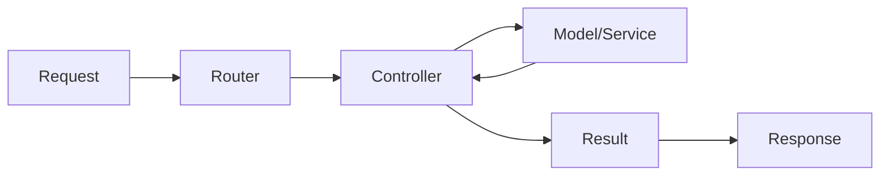

# 🎮 الـ Controllers

> الدليل الشامل للـ Controllers في Magento 2

---

## 📑 الفهرس

1. [مقدمة](#1-مقدمة)
2. [موقع الملفات](#2-موقع-الملفات)
3. [Action Interfaces](#3-action-interfaces)
4. [Frontend Controllers](#4-frontend-controllers)
5. [Admin Controllers](#5-admin-controllers)
6. [Request & Response](#6-request--response)
7. [Result Types](#7-result-types)
8. [Forward & Redirect](#8-forward--redirect)
9. [Dependency Injection](#9-dependency-injection)
10. [ACL للـ Admin](#10-acl-للـ-admin)
11. [Best Practices](#11-best-practices)
12. [Bad Practices](#12-bad-practices)
13. [مستوى متقدم](#13-مستوى-متقدم)

---

## 1. مقدمة

### ما هو Controller؟

Controller هو المسؤول عن:
- **استقبال** الـ HTTP Request
- **معالجة** الطلب (عبر Models/Services)
- **إرجاع** Response مناسب

### الـ Pattern



---

## 2. موقع الملفات

### الهيكل

```
app/code/Vendor/ModuleName/Controller/
├── Index/                      # Frontend controllers
│   ├── Index.php              # /modulename/index/index
│   ├── View.php               # /modulename/index/view
│   └── Save.php               # /modulename/index/save
│
└── Adminhtml/                  # Admin controllers
    └── Entity/
        ├── Index.php          # /admin/modulename/entity/index
        ├── Edit.php           # /admin/modulename/entity/edit
        ├── Save.php           # /admin/modulename/entity/save
        └── Delete.php         # /admin/modulename/entity/delete
```

### قواعد التسمية

```
URL: /{frontName}/{controller}/{action}

Controller Path: Controller/{Controller}/{Action}.php

مثال:
URL: /helloworld/customer/view
Path: Controller/Customer/View.php
Class: Vendor\Module\Controller\Customer\View
```

---

## 3. Action Interfaces

### الـ Interfaces المتاحة

| Interface | HTTP Method | الاستخدام |
|-----------|-------------|-----------|
| `HttpGetActionInterface` | GET | عرض صفحات، قراءة بيانات |
| `HttpPostActionInterface` | POST | إرسال forms، إنشاء بيانات |
| `HttpPutActionInterface` | PUT | تحديث بيانات |
| `HttpDeleteActionInterface` | DELETE | حذف بيانات |

### موقع الـ Interfaces

```php
Magento\Framework\App\Action\HttpGetActionInterface
Magento\Framework\App\Action\HttpPostActionInterface
Magento\Framework\App\Action\HttpPutActionInterface
Magento\Framework\App\Action\HttpDeleteActionInterface
```

### لماذا نستخدمها؟

```php
// ✅ يحدد HTTP method - أكثر أماناً
class View implements HttpGetActionInterface

// ❌ يقبل أي method - أقل أماناً
class View extends Action
```

---

## 4. Frontend Controllers

### الكود الكامل

```php
<?php
declare(strict_types=1);

namespace Vendor\ModuleName\Controller\Index;

use Magento\Framework\App\Action\HttpGetActionInterface;
use Magento\Framework\App\RequestInterface;
use Magento\Framework\View\Result\Page;
use Magento\Framework\View\Result\PageFactory;

class Index implements HttpGetActionInterface
{
    /**
     * @param PageFactory $pageFactory
     * @param RequestInterface $request
     */
    public function __construct(
        private PageFactory $pageFactory,
        private RequestInterface $request
    ) {}

    /**
     * Execute action
     *
     * @return Page
     */
    public function execute(): Page
    {
        // الحصول على parameters
        $id = $this->request->getParam('id');

        // إنشاء صفحة
        $page = $this->pageFactory->create();

        // تعديل الـ title
        $page->getConfig()->getTitle()->set(__('My Page Title'));

        return $page;
    }
}
```

### POST Action

```php
<?php
declare(strict_types=1);

namespace Vendor\ModuleName\Controller\Index;

use Magento\Framework\App\Action\HttpPostActionInterface;
use Magento\Framework\App\RequestInterface;
use Magento\Framework\Controller\Result\RedirectFactory;
use Magento\Framework\Controller\Result\Redirect;
use Magento\Framework\Message\ManagerInterface;
use Magento\Framework\Data\Form\FormKey\Validator;

class Save implements HttpPostActionInterface
{
    public function __construct(
        private RequestInterface $request,
        private RedirectFactory $redirectFactory,
        private ManagerInterface $messageManager,
        private Validator $formKeyValidator
    ) {}

    public function execute(): Redirect
    {
        $redirect = $this->redirectFactory->create();

        // التحقق من Form Key (CSRF protection)
        if (!$this->formKeyValidator->validate($this->request)) {
            $this->messageManager->addErrorMessage(__('Invalid form key'));
            return $redirect->setPath('*/*/');
        }

        try {
            $data = $this->request->getPostValue();
            // معالجة البيانات...

            $this->messageManager->addSuccessMessage(__('Data saved successfully'));
            return $redirect->setPath('*/*/index');

        } catch (\Exception $e) {
            $this->messageManager->addErrorMessage($e->getMessage());
            return $redirect->setPath('*/*/');
        }
    }
}
```

---

## 5. Admin Controllers

### الكود الكامل

```php
<?php
declare(strict_types=1);

namespace Vendor\ModuleName\Controller\Adminhtml\Entity;

use Magento\Backend\App\Action;
use Magento\Backend\App\Action\Context;
use Magento\Framework\View\Result\Page;
use Magento\Framework\View\Result\PageFactory;

class Index extends Action
{
    /**
     * Authorization level - مطلوب!
     */
    public const ADMIN_RESOURCE = 'Vendor_ModuleName::entity_view';

    /**
     * @param Context $context
     * @param PageFactory $pageFactory
     */
    public function __construct(
        Context $context,
        private PageFactory $pageFactory
    ) {
        parent::__construct($context);
    }

    /**
     * Execute action
     *
     * @return Page
     */
    public function execute(): Page
    {
        $page = $this->pageFactory->create();

        // إعداد العنوان
        $page->setActiveMenu('Vendor_ModuleName::entity');
        $page->getConfig()->getTitle()->prepend(__('Manage Entities'));
        $page->addBreadcrumb(__('Entities'), __('Entities'));

        return $page;
    }
}
```

### Admin Save Action

```php
<?php
declare(strict_types=1);

namespace Vendor\ModuleName\Controller\Adminhtml\Entity;

use Magento\Backend\App\Action;
use Magento\Backend\App\Action\Context;
use Magento\Framework\Controller\Result\Redirect;
use Vendor\ModuleName\Api\EntityRepositoryInterface;
use Vendor\ModuleName\Api\Data\EntityInterfaceFactory;

class Save extends Action
{
    public const ADMIN_RESOURCE = 'Vendor_ModuleName::entity_save';

    public function __construct(
        Context $context,
        private EntityRepositoryInterface $entityRepository,
        private EntityInterfaceFactory $entityFactory
    ) {
        parent::__construct($context);
    }

    public function execute(): Redirect
    {
        $resultRedirect = $this->resultRedirectFactory->create();
        $data = $this->getRequest()->getPostValue();

        if (!$data) {
            return $resultRedirect->setPath('*/*/');
        }

        try {
            $entity = $this->entityFactory->create();
            $entity->setData($data);

            $this->entityRepository->save($entity);

            $this->messageManager->addSuccessMessage(__('Entity saved successfully.'));

            // Check if "Save and Continue"
            if ($this->getRequest()->getParam('back')) {
                return $resultRedirect->setPath('*/*/edit', ['id' => $entity->getId()]);
            }

            return $resultRedirect->setPath('*/*/');

        } catch (\Exception $e) {
            $this->messageManager->addErrorMessage($e->getMessage());
            return $resultRedirect->setPath('*/*/edit', ['id' => $this->getRequest()->getParam('id')]);
        }
    }
}
```

---

## 6. Request & Response

### Request Object

```php
use Magento\Framework\App\RequestInterface;

class MyController
{
    public function __construct(
        private RequestInterface $request
    ) {}

    public function execute()
    {
        // GET parameter
        $id = $this->request->getParam('id');
        $id = $this->request->getParam('id', 'default_value');

        // POST data
        $postData = $this->request->getPostValue();
        $field = $this->request->getPost('field_name');

        // All parameters
        $params = $this->request->getParams();

        // Check method
        $isPost = $this->request->isPost();
        $isAjax = $this->request->isAjax();

        // Headers
        $contentType = $this->request->getHeader('Content-Type');

        // Module/Controller/Action names
        $module = $this->request->getModuleName();
        $controller = $this->request->getControllerName();
        $action = $this->request->getActionName();
    }
}
```

### Request Methods

| Method | الوصف |
|--------|-------|
| `getParam($key, $default)` | GET/POST parameter |
| `getParams()` | كل الـ parameters |
| `getPostValue()` | POST data |
| `getPost($key)` | POST field محدد |
| `isPost()` | هل request POST؟ |
| `isAjax()` | هل AJAX request؟ |
| `getHeader($name)` | HTTP header |
| `getModuleName()` | اسم المودول |

---

## 7. Result Types

### أنواع الـ Results

| Type | الاستخدام | Factory |
|------|-----------|---------|
| `Page` | صفحة HTML | `PageFactory` |
| `Json` | JSON response | `JsonFactory` |
| `Redirect` | Redirect URL | `RedirectFactory` |
| `Forward` | Forward داخلي | `ForwardFactory` |
| `Raw` | Raw content | `RawFactory` |

### Page Result

```php
use Magento\Framework\View\Result\PageFactory;

class Index implements HttpGetActionInterface
{
    public function __construct(private PageFactory $pageFactory) {}

    public function execute()
    {
        $page = $this->pageFactory->create();
        $page->getConfig()->getTitle()->set('Page Title');
        return $page;
    }
}
```

### JSON Result

```php
use Magento\Framework\Controller\Result\JsonFactory;

class GetData implements HttpGetActionInterface
{
    public function __construct(private JsonFactory $jsonFactory) {}

    public function execute()
    {
        $result = $this->jsonFactory->create();
        return $result->setData([
            'success' => true,
            'message' => 'Data retrieved',
            'data' => ['id' => 1, 'name' => 'Test']
        ]);
    }
}
```

### Redirect Result

```php
use Magento\Framework\Controller\Result\RedirectFactory;

class Save implements HttpPostActionInterface
{
    public function __construct(private RedirectFactory $redirectFactory) {}

    public function execute()
    {
        $redirect = $this->redirectFactory->create();

        // Redirect to path
        return $redirect->setPath('module/controller/action');

        // Redirect to URL
        return $redirect->setUrl('https://example.com');

        // With parameters
        return $redirect->setPath('catalog/product/view', ['id' => 5]);
    }
}
```

---

## 8. Forward & Redirect

### Forward (داخلي - نفس request)

```php
use Magento\Framework\Controller\Result\ForwardFactory;

class OldAction implements HttpGetActionInterface
{
    public function __construct(private ForwardFactory $forwardFactory) {}

    public function execute()
    {
        $forward = $this->forwardFactory->create();
        return $forward
            ->setModule('module')
            ->setController('controller')
            ->setParams(['id' => 5])
            ->forward('newaction');
    }
}
```

### الفرق بين Forward و Redirect

| الخاصية | Forward | Redirect |
|---------|---------|----------|
| HTTP Request جديد | ❌ لا | ✅ نعم |
| URL يتغير | ❌ لا | ✅ نعم |
| Data محفوظ | ✅ نعم | ❌ لا |
| Performance | أسرع | أبطأ |

---

## 9. Dependency Injection

### Constructor Injection

```php
<?php
declare(strict_types=1);

namespace Vendor\Module\Controller\Index;

use Magento\Framework\App\Action\HttpGetActionInterface;
use Magento\Framework\View\Result\PageFactory;
use Vendor\Module\Api\EntityRepositoryInterface;
use Psr\Log\LoggerInterface;

class Index implements HttpGetActionInterface
{
    public function __construct(
        private PageFactory $pageFactory,
        private EntityRepositoryInterface $entityRepository,
        private LoggerInterface $logger
    ) {}

    public function execute()
    {
        $this->logger->info('Controller executed');
        return $this->pageFactory->create();
    }
}
```

### Available Dependencies

| Dependency | الوصف |
|------------|-------|
| `RequestInterface` | HTTP Request |
| `PageFactory` | إنشاء صفحات |
| `JsonFactory` | إنشاء JSON |
| `RedirectFactory` | إنشاء redirects |
| `ManagerInterface` | Flash messages |
| `LoggerInterface` | Logging |
| `UrlInterface` | URL builder |

---

## 10. ACL للـ Admin

### تعريف ACL في acl.xml

```xml
<!-- etc/acl.xml -->
<?xml version="1.0"?>
<config xmlns:xsi="http://www.w3.org/2001/XMLSchema-instance"
        xsi:noNamespaceSchemaLocation="urn:magento:framework:Acl/etc/acl.xsd">
    <acl>
        <resources>
            <resource id="Magento_Backend::admin">
                <resource id="Vendor_Module::top_level" title="My Module">
                    <resource id="Vendor_Module::entity" title="Entities">
                        <resource id="Vendor_Module::entity_view" title="View"/>
                        <resource id="Vendor_Module::entity_save" title="Save"/>
                        <resource id="Vendor_Module::entity_delete" title="Delete"/>
                    </resource>
                </resource>
            </resource>
        </resources>
    </acl>
</config>
```

### استخدام في Controller

```php
class Index extends Action
{
    public const ADMIN_RESOURCE = 'Vendor_Module::entity_view';
}

class Save extends Action
{
    public const ADMIN_RESOURCE = 'Vendor_Module::entity_save';
}

class Delete extends Action
{
    public const ADMIN_RESOURCE = 'Vendor_Module::entity_delete';
}
```

---

## 11. Best Practices

### ✅ 1. Controllers يجب أن تكون Thin

```php
// ✅ صحيح - thin controller
public function execute()
{
    $data = $this->request->getPostValue();
    $this->entityService->save($data);  // Business logic في Service
    return $this->redirect->setPath('*/*/');
}

// ❌ خطأ - fat controller
public function execute()
{
    // 100 سطر من business logic
}
```

### ✅ 2. استخدم Action Interfaces

```php
// ✅ صحيح
class View implements HttpGetActionInterface

// ❌ قديم
class View extends \Magento\Framework\App\Action\Action
```

### ✅ 3. CSRF Protection

```php
// تحقق من Form Key
if (!$this->formKeyValidator->validate($this->request)) {
    throw new \Exception('Invalid form key');
}
```

### ✅ 4. Type Hints

```php
public function execute(): Page  // Return type
{
    return $this->pageFactory->create();
}
```

---

## 12. Bad Practices

### ❌ 1. استخدام ObjectManager

```php
// ❌ خطأ!
$objectManager = \Magento\Framework\App\ObjectManager::getInstance();
$product = $objectManager->get(ProductRepository::class);

// ✅ صحيح - استخدم DI
public function __construct(private ProductRepository $productRepository) {}
```

### ❌ 2. Logic معقد

```php
// ❌ Controller لا يجب أن يحتوي business logic
public function execute()
{
    // حسابات معقدة
    // database queries مباشرة
    // validation logic
}
```

### ❌ 3. Admin بدون ADMIN_RESOURCE

```php
// ❌ Security risk!
class Delete extends Action
{
    public function execute()
    {
        // لا يوجد ADMIN_RESOURCE - أي admin يمكنه الحذف!
    }
}
```

---

## 13. مستوى متقدم

### REST Controller

```php
<?php
namespace Vendor\Module\Controller\Api;

use Magento\Framework\App\Action\HttpGetActionInterface;
use Magento\Framework\Controller\Result\JsonFactory;

class GetEntity implements HttpGetActionInterface
{
    public function __construct(
        private JsonFactory $jsonFactory,
        private EntityRepository $repository
    ) {}

    public function execute()
    {
        $result = $this->jsonFactory->create();

        try {
            $id = $this->request->getParam('id');
            $entity = $this->repository->getById($id);

            return $result->setData([
                'success' => true,
                'data' => $entity->getData()
            ]);
        } catch (\Exception $e) {
            return $result->setData([
                'success' => false,
                'message' => $e->getMessage()
            ]);
        }
    }
}
```

### Async Controller

```php
<?php
namespace Vendor\Module\Controller\Index;

use Magento\Framework\App\Action\HttpPostActionInterface;
use Magento\Framework\MessageQueue\PublisherInterface;

class AsyncSave implements HttpPostActionInterface
{
    public function __construct(
        private PublisherInterface $publisher,
        private JsonFactory $jsonFactory
    ) {}

    public function execute()
    {
        $data = $this->request->getPostValue();

        // إرسال للـ queue بدلاً من المعالجة المباشرة
        $this->publisher->publish('vendor.module.entity.save', $data);

        return $this->jsonFactory->create()->setData([
            'success' => true,
            'message' => 'Processing in background'
        ]);
    }
}
```

---

## 📌 ملخص

| العنصر | القيمة |
|--------|--------|
| **المسار** | `Controller/` (Frontend) أو `Controller/Adminhtml/` (Admin) |
| **Interfaces** | `HttpGetActionInterface`, `HttpPostActionInterface` |
| **Admin Base** | `Magento\Backend\App\Action` |
| **Method** | `execute()` |
| **ACL** | `ADMIN_RESOURCE` constant |

---

## ⬅️ [السابق](./03_ROUTES.md) | [🏠 الرئيسية](../MODULE_STRUCTURE.md) | [التالي ➡️](./05_MODELS.md)
