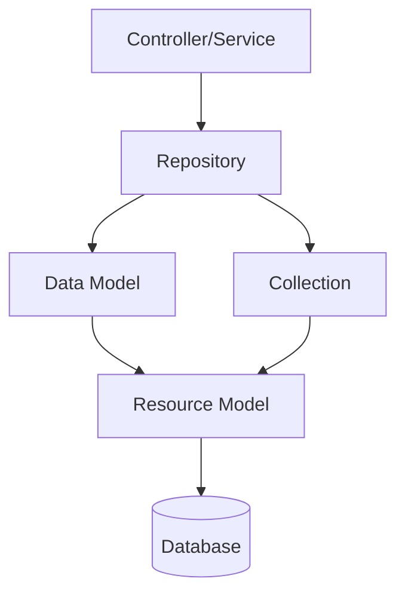

# 💾 الـ Models وطبقة البيانات

> الدليل الشامل للـ Models, ResourceModels, Repositories في Magento 2

---

## 📑 الفهرس

1. [مقدمة](#1-مقدمة)
2. [هيكل الملفات](#2-هيكل-الملفات)
3. [Data Model](#3-data-model)
4. [Resource Model](#4-resource-model)
5. [Collection](#5-collection)
6. [Repository Pattern](#6-repository-pattern)
7. [Data Interface](#7-data-interface)
8. [SearchCriteria](#8-searchcriteria)
9. [CRUD Operations](#9-crud-operations)
10. [Events في Models](#10-events-في-models)
11. [Validation](#11-validation)
12. [Best Practices](#12-best-practices)
13. [Bad Practices](#13-bad-practices)
14. [مستوى متقدم](#14-مستوى-متقدم)

---

## 1. مقدمة

### طبقات البيانات في Magento 2



### الفرق بين الطبقات

| الطبقة | المسؤولية |
|--------|-----------|
| **Data Model** | تمثيل البيانات (Entity) |
| **Resource Model** | عمليات قاعدة البيانات |
| **Collection** | مجموعة من Models |
| **Repository** | API layer للـ CRUD |

---

## 2. هيكل الملفات

```
app/code/Vendor/Module/
├── Api/
│   ├── Data/
│   │   └── EntityInterface.php      # Data Interface
│   └── EntityRepositoryInterface.php # Repository Interface
│
├── Model/
│   ├── Entity.php                   # Data Model
│   ├── EntityRepository.php         # Repository Implementation
│   └── ResourceModel/
│       ├── Entity.php               # Resource Model
│       └── Entity/
│           └── Collection.php       # Collection
│
└── etc/
    └── di.xml                       # Interface bindings
```

---

## 3. Data Model

### الكود الكامل

```php
<?php
declare(strict_types=1);

namespace Vendor\Module\Model;

use Magento\Framework\Model\AbstractModel;
use Magento\Framework\DataObject\IdentityInterface;
use Vendor\Module\Api\Data\EntityInterface;
use Vendor\Module\Model\ResourceModel\Entity as ResourceModel;

class Entity extends AbstractModel implements EntityInterface, IdentityInterface
{
    /**
     * Cache tag
     */
    public const CACHE_TAG = 'vendor_module_entity';

    /**
     * @var string
     */
    protected $_cacheTag = self::CACHE_TAG;

    /**
     * @var string
     */
    protected $_eventPrefix = 'vendor_module_entity';

    /**
     * @var string
     */
    protected $_eventObject = 'entity';

    /**
     * Initialize resource model
     *
     * @return void
     */
    protected function _construct(): void
    {
        $this->_init(ResourceModel::class);
    }

    /**
     * Get identities for cache invalidation
     *
     * @return array
     */
    public function getIdentities(): array
    {
        return [self::CACHE_TAG . '_' . $this->getId()];
    }

    // ===== Getters =====

    /**
     * Get entity ID
     *
     * @return int|null
     */
    public function getEntityId(): ?int
    {
        return $this->getData(self::ENTITY_ID) ? (int) $this->getData(self::ENTITY_ID) : null;
    }

    /**
     * Get name
     *
     * @return string|null
     */
    public function getName(): ?string
    {
        return $this->getData(self::NAME);
    }

    /**
     * Get description
     *
     * @return string|null
     */
    public function getDescription(): ?string
    {
        return $this->getData(self::DESCRIPTION);
    }

    /**
     * Get status
     *
     * @return bool
     */
    public function getIsActive(): bool
    {
        return (bool) $this->getData(self::IS_ACTIVE);
    }

    /**
     * Get created at
     *
     * @return string|null
     */
    public function getCreatedAt(): ?string
    {
        return $this->getData(self::CREATED_AT);
    }

    /**
     * Get updated at
     *
     * @return string|null
     */
    public function getUpdatedAt(): ?string
    {
        return $this->getData(self::UPDATED_AT);
    }

    // ===== Setters =====

    /**
     * Set entity ID
     *
     * @param int $entityId
     * @return EntityInterface
     */
    public function setEntityId(int $entityId): EntityInterface
    {
        return $this->setData(self::ENTITY_ID, $entityId);
    }

    /**
     * Set name
     *
     * @param string $name
     * @return EntityInterface
     */
    public function setName(string $name): EntityInterface
    {
        return $this->setData(self::NAME, $name);
    }

    /**
     * Set description
     *
     * @param string|null $description
     * @return EntityInterface
     */
    public function setDescription(?string $description): EntityInterface
    {
        return $this->setData(self::DESCRIPTION, $description);
    }

    /**
     * Set status
     *
     * @param bool $isActive
     * @return EntityInterface
     */
    public function setIsActive(bool $isActive): EntityInterface
    {
        return $this->setData(self::IS_ACTIVE, $isActive);
    }

    /**
     * Set created at
     *
     * @param string $createdAt
     * @return EntityInterface
     */
    public function setCreatedAt(string $createdAt): EntityInterface
    {
        return $this->setData(self::CREATED_AT, $createdAt);
    }

    /**
     * Set updated at
     *
     * @param string $updatedAt
     * @return EntityInterface
     */
    public function setUpdatedAt(string $updatedAt): EntityInterface
    {
        return $this->setData(self::UPDATED_AT, $updatedAt);
    }
}
```

### Properties المهمة

| Property | الوظيفة |
|----------|---------|
| `$_cacheTag` | Tag لـ cache invalidation |
| `$_eventPrefix` | Prefix للـ events |
| `$_eventObject` | اسم الـ object في events |
| `$_idFieldName` | اسم الـ primary key |

### AbstractModel Methods

| Method | الوظيفة |
|--------|---------|
| `_construct()` | Initialize - تُستدعى تلقائياً |
| `_init($resourceModel)` | ربط الـ Resource Model |
| `getId()` / `setId()` | Primary key |
| `getData($key)` / `setData($key, $value)` | Get/Set fields |
| `hasData($key)` | Check if field exists |
| `unsetData($key)` | Remove field |
| `save()` | حفظ (deprecated - use Repository) |
| `delete()` | حذف (deprecated - use Repository) |
| `load($id)` | تحميل (deprecated - use Repository) |

---

## 4. Resource Model

### الكود الكامل

```php
<?php
declare(strict_types=1);

namespace Vendor\Module\Model\ResourceModel;

use Magento\Framework\Model\ResourceModel\Db\AbstractDb;
use Magento\Framework\Model\ResourceModel\Db\Context;
use Magento\Framework\Stdlib\DateTime\DateTime;
use Magento\Framework\Model\AbstractModel;

class Entity extends AbstractDb
{
    /**
     * @var DateTime
     */
    private DateTime $dateTime;

    /**
     * @param Context $context
     * @param DateTime $dateTime
     * @param string|null $connectionName
     */
    public function __construct(
        Context $context,
        DateTime $dateTime,
        ?string $connectionName = null
    ) {
        parent::__construct($context, $connectionName);
        $this->dateTime = $dateTime;
    }

    /**
     * Initialize resource model
     *
     * @return void
     */
    protected function _construct(): void
    {
        $this->_init('vendor_module_entity', 'entity_id');
    }

    /**
     * Before save callback
     *
     * @param AbstractModel $object
     * @return $this
     */
    protected function _beforeSave(AbstractModel $object): self
    {
        // Set created_at for new entities
        if ($object->isObjectNew() && !$object->hasData('created_at')) {
            $object->setData('created_at', $this->dateTime->gmtDate());
        }

        // Always update updated_at
        $object->setData('updated_at', $this->dateTime->gmtDate());

        return parent::_beforeSave($object);
    }

    /**
     * After save callback
     *
     * @param AbstractModel $object
     * @return $this
     */
    protected function _afterSave(AbstractModel $object): self
    {
        // Additional logic after save
        return parent::_afterSave($object);
    }

    /**
     * Before delete callback
     *
     * @param AbstractModel $object
     * @return $this
     */
    protected function _beforeDelete(AbstractModel $object): self
    {
        // Validation before delete
        return parent::_beforeDelete($object);
    }

    /**
     * Load entity by field
     *
     * @param AbstractModel $object
     * @param mixed $value
     * @param string $field
     * @return $this
     */
    public function load(AbstractModel $object, $value, $field = null): self
    {
        if ($field === null) {
            $field = $this->getIdFieldName();
        }

        $connection = $this->getConnection();
        $select = $connection->select()
            ->from($this->getMainTable())
            ->where($field . ' = ?', $value);

        $data = $connection->fetchRow($select);
        if ($data) {
            $object->setData($data);
        }

        $this->_afterLoad($object);

        return $this;
    }
}
```

### `_init()` Method

```php
protected function _construct(): void
{
    $this->_init('table_name', 'primary_key_column');
}
```

| Parameter | الوصف |
|-----------|-------|
| `$mainTable` | اسم الجدول في DB |
| `$idFieldName` | اسم الـ Primary Key column |

### Callbacks

| Callback | متى يُستدعى |
|----------|-------------|
| `_beforeSave()` | قبل الحفظ |
| `_afterSave()` | بعد الحفظ |
| `_beforeDelete()` | قبل الحذف |
| `_afterDelete()` | بعد الحذف |
| `_beforeLoad()` | قبل التحميل |
| `_afterLoad()` | بعد التحميل |

---

## 5. Collection

### الكود الكامل

```php
<?php
declare(strict_types=1);

namespace Vendor\Module\Model\ResourceModel\Entity;

use Magento\Framework\Model\ResourceModel\Db\Collection\AbstractCollection;
use Vendor\Module\Model\Entity as Model;
use Vendor\Module\Model\ResourceModel\Entity as ResourceModel;

class Collection extends AbstractCollection
{
    /**
     * @var string
     */
    protected $_idFieldName = 'entity_id';

    /**
     * @var string
     */
    protected $_eventPrefix = 'vendor_module_entity_collection';

    /**
     * @var string
     */
    protected $_eventObject = 'entity_collection';

    /**
     * Initialize collection
     *
     * @return void
     */
    protected function _construct(): void
    {
        $this->_init(Model::class, ResourceModel::class);
    }

    /**
     * Add filter by active status
     *
     * @return $this
     */
    public function addActiveFilter(): self
    {
        $this->addFieldToFilter('is_active', ['eq' => 1]);
        return $this;
    }

    /**
     * Add filter by store
     *
     * @param int|array $storeId
     * @return $this
     */
    public function addStoreFilter($storeId): self
    {
        $this->addFieldToFilter('store_id', ['in' => (array) $storeId]);
        return $this;
    }

    /**
     * Set first result offset
     *
     * @param int $offset
     * @return $this
     */
    public function setPageStart(int $offset): self
    {
        $this->getSelect()->limit(null, $offset);
        return $this;
    }
}
```

### Collection Methods

| Method | الوظيفة | مثال |
|--------|---------|------|
| `addFieldToFilter()` | إضافة WHERE | `->addFieldToFilter('status', 1)` |
| `addFieldToSelect()` | تحديد columns | `->addFieldToSelect(['id', 'name'])` |
| `setOrder()` | ترتيب | `->setOrder('created_at', 'DESC')` |
| `setPageSize()` | LIMIT | `->setPageSize(10)` |
| `setCurPage()` | الصفحة الحالية | `->setCurPage(2)` |
| `getSize()` | COUNT | `$collection->getSize()` |
| `getItems()` | Array of items | `$collection->getItems()` |
| `getFirstItem()` | أول عنصر | `$collection->getFirstItem()` |

### Filter Conditions

```php
// Equal
$collection->addFieldToFilter('status', ['eq' => 1]);

// Not Equal
$collection->addFieldToFilter('status', ['neq' => 0]);

// Greater Than
$collection->addFieldToFilter('qty', ['gt' => 10]);

// Greater or Equal
$collection->addFieldToFilter('qty', ['gteq' => 10]);

// Less Than
$collection->addFieldToFilter('qty', ['lt' => 100]);

// Less or Equal
$collection->addFieldToFilter('qty', ['lteq' => 100]);

// LIKE
$collection->addFieldToFilter('name', ['like' => '%test%']);

// IN
$collection->addFieldToFilter('id', ['in' => [1, 2, 3]]);

// NOT IN
$collection->addFieldToFilter('id', ['nin' => [1, 2, 3]]);

// NULL
$collection->addFieldToFilter('field', ['null' => true]);

// NOT NULL
$collection->addFieldToFilter('field', ['notnull' => true]);

// BETWEEN
$collection->addFieldToFilter('created_at', [
    'from' => '2024-01-01',
    'to' => '2024-12-31'
]);
```

---

## 6. Repository Pattern

### Repository Interface

```php
<?php
declare(strict_types=1);

namespace Vendor\Module\Api;

use Magento\Framework\Api\SearchCriteriaInterface;
use Vendor\Module\Api\Data\EntityInterface;
use Vendor\Module\Api\Data\EntitySearchResultsInterface;

interface EntityRepositoryInterface
{
    /**
     * Save entity
     *
     * @param EntityInterface $entity
     * @return EntityInterface
     * @throws \Magento\Framework\Exception\CouldNotSaveException
     */
    public function save(EntityInterface $entity): EntityInterface;

    /**
     * Get entity by ID
     *
     * @param int $entityId
     * @return EntityInterface
     * @throws \Magento\Framework\Exception\NoSuchEntityException
     */
    public function getById(int $entityId): EntityInterface;

    /**
     * Delete entity
     *
     * @param EntityInterface $entity
     * @return bool
     * @throws \Magento\Framework\Exception\CouldNotDeleteException
     */
    public function delete(EntityInterface $entity): bool;

    /**
     * Delete entity by ID
     *
     * @param int $entityId
     * @return bool
     * @throws \Magento\Framework\Exception\CouldNotDeleteException
     */
    public function deleteById(int $entityId): bool;

    /**
     * Get entities matching criteria
     *
     * @param SearchCriteriaInterface $searchCriteria
     * @return EntitySearchResultsInterface
     */
    public function getList(SearchCriteriaInterface $searchCriteria): EntitySearchResultsInterface;
}
```

### Repository Implementation

```php
<?php
declare(strict_types=1);

namespace Vendor\Module\Model;

use Magento\Framework\Api\SearchCriteria\CollectionProcessorInterface;
use Magento\Framework\Api\SearchCriteriaInterface;
use Magento\Framework\Exception\CouldNotDeleteException;
use Magento\Framework\Exception\CouldNotSaveException;
use Magento\Framework\Exception\NoSuchEntityException;
use Vendor\Module\Api\Data\EntityInterface;
use Vendor\Module\Api\Data\EntityInterfaceFactory;
use Vendor\Module\Api\Data\EntitySearchResultsInterface;
use Vendor\Module\Api\Data\EntitySearchResultsInterfaceFactory;
use Vendor\Module\Api\EntityRepositoryInterface;
use Vendor\Module\Model\ResourceModel\Entity as ResourceModel;
use Vendor\Module\Model\ResourceModel\Entity\CollectionFactory;

class EntityRepository implements EntityRepositoryInterface
{
    /**
     * @param ResourceModel $resourceModel
     * @param EntityInterfaceFactory $entityFactory
     * @param CollectionFactory $collectionFactory
     * @param EntitySearchResultsInterfaceFactory $searchResultsFactory
     * @param CollectionProcessorInterface $collectionProcessor
     */
    public function __construct(
        private ResourceModel $resourceModel,
        private EntityInterfaceFactory $entityFactory,
        private CollectionFactory $collectionFactory,
        private EntitySearchResultsInterfaceFactory $searchResultsFactory,
        private CollectionProcessorInterface $collectionProcessor
    ) {}

    /**
     * @inheritDoc
     */
    public function save(EntityInterface $entity): EntityInterface
    {
        try {
            $this->resourceModel->save($entity);
        } catch (\Exception $e) {
            throw new CouldNotSaveException(__('Could not save entity: %1', $e->getMessage()));
        }

        return $entity;
    }

    /**
     * @inheritDoc
     */
    public function getById(int $entityId): EntityInterface
    {
        $entity = $this->entityFactory->create();
        $this->resourceModel->load($entity, $entityId);

        if (!$entity->getId()) {
            throw new NoSuchEntityException(__('Entity with ID "%1" does not exist.', $entityId));
        }

        return $entity;
    }

    /**
     * @inheritDoc
     */
    public function delete(EntityInterface $entity): bool
    {
        try {
            $this->resourceModel->delete($entity);
        } catch (\Exception $e) {
            throw new CouldNotDeleteException(__('Could not delete entity: %1', $e->getMessage()));
        }

        return true;
    }

    /**
     * @inheritDoc
     */
    public function deleteById(int $entityId): bool
    {
        return $this->delete($this->getById($entityId));
    }

    /**
     * @inheritDoc
     */
    public function getList(SearchCriteriaInterface $searchCriteria): EntitySearchResultsInterface
    {
        $collection = $this->collectionFactory->create();

        $this->collectionProcessor->process($searchCriteria, $collection);

        $searchResults = $this->searchResultsFactory->create();
        $searchResults->setSearchCriteria($searchCriteria);
        $searchResults->setItems($collection->getItems());
        $searchResults->setTotalCount($collection->getSize());

        return $searchResults;
    }
}
```

### di.xml للـ Repository

```xml
<?xml version="1.0"?>
<config xmlns:xsi="http://www.w3.org/2001/XMLSchema-instance"
        xsi:noNamespaceSchemaLocation="urn:magento:framework:ObjectManager/etc/config.xsd">

    <!-- Bind interface to implementation -->
    <preference for="Vendor\Module\Api\EntityRepositoryInterface"
                type="Vendor\Module\Model\EntityRepository"/>

    <preference for="Vendor\Module\Api\Data\EntityInterface"
                type="Vendor\Module\Model\Entity"/>

    <preference for="Vendor\Module\Api\Data\EntitySearchResultsInterface"
                type="Magento\Framework\Api\SearchResults"/>
</config>
```

---

## 7. Data Interface

```php
<?php
declare(strict_types=1);

namespace Vendor\Module\Api\Data;

interface EntityInterface
{
    public const ENTITY_ID = 'entity_id';
    public const NAME = 'name';
    public const DESCRIPTION = 'description';
    public const IS_ACTIVE = 'is_active';
    public const CREATED_AT = 'created_at';
    public const UPDATED_AT = 'updated_at';

    /**
     * @return int|null
     */
    public function getEntityId(): ?int;

    /**
     * @param int $entityId
     * @return self
     */
    public function setEntityId(int $entityId): self;

    /**
     * @return string|null
     */
    public function getName(): ?string;

    /**
     * @param string $name
     * @return self
     */
    public function setName(string $name): self;

    // ... باقي الـ getters/setters
}
```

---

## 8. SearchCriteria

### استخدام SearchCriteriaBuilder

```php
<?php
use Magento\Framework\Api\SearchCriteriaBuilder;
use Magento\Framework\Api\FilterBuilder;
use Magento\Framework\Api\Search\FilterGroupBuilder;
use Magento\Framework\Api\SortOrderBuilder;

class EntityService
{
    public function __construct(
        private EntityRepositoryInterface $repository,
        private SearchCriteriaBuilder $searchCriteriaBuilder,
        private FilterBuilder $filterBuilder,
        private SortOrderBuilder $sortOrderBuilder
    ) {}

    public function getActiveEntities(): array
    {
        // Simple filter
        $this->searchCriteriaBuilder->addFilter('is_active', 1);

        // Sorting
        $sortOrder = $this->sortOrderBuilder
            ->setField('created_at')
            ->setDirection('DESC')
            ->create();
        $this->searchCriteriaBuilder->addSortOrder($sortOrder);

        // Pagination
        $this->searchCriteriaBuilder->setPageSize(10);
        $this->searchCriteriaBuilder->setCurrentPage(1);

        $searchCriteria = $this->searchCriteriaBuilder->create();
        $result = $this->repository->getList($searchCriteria);

        return $result->getItems();
    }

    public function searchByName(string $name): array
    {
        $this->searchCriteriaBuilder->addFilter('name', '%' . $name . '%', 'like');

        $searchCriteria = $this->searchCriteriaBuilder->create();
        $result = $this->repository->getList($searchCriteria);

        return $result->getItems();
    }
}
```

---

## 9. CRUD Operations

### Create

```php
$entity = $this->entityFactory->create();
$entity->setName('New Entity');
$entity->setDescription('Description');
$entity->setIsActive(true);

$savedEntity = $this->entityRepository->save($entity);
```

### Read

```php
// By ID
$entity = $this->entityRepository->getById(1);

// List with criteria
$searchCriteria = $this->searchCriteriaBuilder
    ->addFilter('is_active', 1)
    ->create();
$result = $this->entityRepository->getList($searchCriteria);
```

### Update

```php
$entity = $this->entityRepository->getById(1);
$entity->setName('Updated Name');
$this->entityRepository->save($entity);
```

### Delete

```php
// By object
$entity = $this->entityRepository->getById(1);
$this->entityRepository->delete($entity);

// By ID
$this->entityRepository->deleteById(1);
```

---

## 10. Events في Models

### Events التلقائية

```php
// عند الحفظ
vendor_module_entity_save_before
vendor_module_entity_save_after

// عند الحذف
vendor_module_entity_delete_before
vendor_module_entity_delete_after

// عند التحميل
vendor_module_entity_load_after
```

### تفعيل Events

```php
// في Model
protected $_eventPrefix = 'vendor_module_entity';  // مطلوب
protected $_eventObject = 'entity';                 // مطلوب
```

---

## 11. Validation

```php
<?php
namespace Vendor\Module\Model;

class EntityValidator
{
    public function validate(EntityInterface $entity): array
    {
        $errors = [];

        if (empty($entity->getName())) {
            $errors[] = __('Name is required.');
        }

        if (strlen($entity->getName()) > 255) {
            $errors[] = __('Name cannot exceed 255 characters.');
        }

        return $errors;
    }
}
```

### استخدام في Repository

```php
public function save(EntityInterface $entity): EntityInterface
{
    $errors = $this->validator->validate($entity);
    if (!empty($errors)) {
        throw new ValidationException(__('Validation failed'), null, 0, $errors);
    }

    $this->resourceModel->save($entity);
    return $entity;
}
```

---

## 12. Best Practices

### ✅ استخدم Repository دائماً

```php
// ✅ صحيح
$entity = $this->entityRepository->getById($id);

// ❌ قديم
$entity = $this->entityFactory->create()->load($id);
```

### ✅ استخدم Interfaces

```php
// ✅ صحيح
use Vendor\Module\Api\Data\EntityInterface;

// ❌ خطأ - Concrete class
use Vendor\Module\Model\Entity;
```

### ✅ استخدم Factories

```php
// ✅ صحيح
$entity = $this->entityFactory->create();

// ❌ خطأ
$entity = new Entity();
```

---

## 13. Bad Practices

### ❌ استخدام ObjectManager

```php
// ❌ خطأ!
$objectManager = ObjectManager::getInstance();
$entity = $objectManager->create(Entity::class);
```

### ❌ عمليات DB مباشرة

```php
// ❌ خطأ! - لا تستخدم SQL مباشرة
$connection->query("DELETE FROM table WHERE id = $id");

// ✅ صحيح
$this->entityRepository->deleteById($id);
```

---

## 14. مستوى متقدم

### Custom Collection Queries

```php
public function getEntitiesWithJoin(): Collection
{
    $collection = $this->collectionFactory->create();

    $collection->getSelect()->joinLeft(
        ['related' => $this->getTable('related_table')],
        'main_table.entity_id = related.entity_id',
        ['related_name' => 'name']
    );

    return $collection;
}
```

### Bulk Operations

```php
public function bulkSave(array $entities): void
{
    $connection = $this->resourceModel->getConnection();
    $tableName = $this->resourceModel->getMainTable();

    $connection->beginTransaction();
    try {
        foreach ($entities as $entity) {
            $connection->insertOnDuplicate(
                $tableName,
                $entity->getData(),
                ['name', 'updated_at']
            );
        }
        $connection->commit();
    } catch (\Exception $e) {
        $connection->rollBack();
        throw $e;
    }
}
```

---

## 📌 ملخص

| المكون | المسار | الوظيفة |
|--------|--------|---------|
| **Model** | `Model/Entity.php` | Data representation |
| **ResourceModel** | `Model/ResourceModel/Entity.php` | DB operations |
| **Collection** | `Model/ResourceModel/Entity/Collection.php` | Multi-record queries |
| **Repository** | `Model/EntityRepository.php` | CRUD API |
| **Interface** | `Api/Data/EntityInterface.php` | Contract |

---

## ⬅️ [السابق](./04_CONTROLLERS.md) | [🏠 الرئيسية](../MODULE_STRUCTURE.md) | [التالي ➡️](./06_BLOCKS.md)
