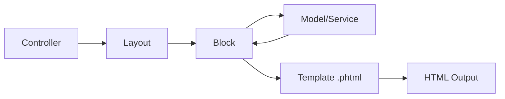

# 🧱 الـ Blocks

> الدليل الشامل للـ Blocks في Magento 2

---

## 📑 الفهرس

1. [مقدمة](#1-مقدمة)
2. [موقع الملفات](#2-موقع-الملفات)
3. [أنواع الـ Blocks](#3-أنواع-الـ-blocks)
4. [Template Block](#4-template-block)
5. [ربط Block بـ Layout](#5-ربط-block-بـ-layout)
6. [Dependency Injection](#6-dependency-injection)
7. [Block Methods](#7-block-methods)
8. [Data Passing](#8-data-passing)
9. [Caching](#9-caching)
10. [Best Practices](#10-best-practices)
11. [مستوى متقدم](#11-مستوى-متقدم)

---

## 1. مقدمة

### ما هو Block؟

Block هو الجسر بين الـ **Business Logic** والـ **Template (View)**.



### المسؤوليات

| المسؤولية | الشرح |
|-----------|-------|
| **تحضير البيانات** | جلب وتنسيق البيانات للـ Template |
| **Logic بسيط** | حسابات ومنطق العرض |
| **Escaping** | حماية من XSS |
| **Caching** | التحكم في كاش الـ Block |

---

## 2. موقع الملفات

```
app/code/Vendor/Module/
├── Block/
│   ├── SomeBlock.php              # Frontend Block
│   ├── Product/
│   │   └── View.php               # Specific Block
│   └── Adminhtml/
│       └── Entity/
│           ├── Edit.php           # Admin Edit Block
│           └── Grid.php           # Admin Grid Block
└── view/
    └── frontend/
        └── templates/
            └── some_block.phtml   # Template
```

---

## 3. أنواع الـ Blocks

### 1. Template Block (الأكثر شيوعاً)

```php
use Magento\Framework\View\Element\Template;

class MyBlock extends Template
{
    // مع template .phtml
}
```

### 2. AbstractBlock (بدون template)

```php
use Magento\Framework\View\Element\AbstractBlock;

class MyBlock extends AbstractBlock
{
    protected function _toHtml(): string
    {
        return '<div>Direct HTML</div>';
    }
}
```

### 3. Text Block

```php
use Magento\Framework\View\Element\Text;
// للـ text فقط
```

### 4. Admin Blocks

```php
use Magento\Backend\Block\Template;
use Magento\Backend\Block\Widget\Grid;
use Magento\Backend\Block\Widget\Form;
```

---

## 4. Template Block

### الكود الكامل

```php
<?php
declare(strict_types=1);

namespace Vendor\Module\Block;

use Magento\Framework\View\Element\Template;
use Magento\Framework\View\Element\Template\Context;
use Vendor\Module\Api\EntityRepositoryInterface;
use Vendor\Module\Api\Data\EntityInterface;
use Magento\Framework\Api\SearchCriteriaBuilder;

class EntityList extends Template
{
    /**
     * @param Context $context
     * @param EntityRepositoryInterface $entityRepository
     * @param SearchCriteriaBuilder $searchCriteriaBuilder
     * @param array $data
     */
    public function __construct(
        Context $context,
        private EntityRepositoryInterface $entityRepository,
        private SearchCriteriaBuilder $searchCriteriaBuilder,
        array $data = []
    ) {
        parent::__construct($context, $data);
    }

    /**
     * Get active entities
     *
     * @return EntityInterface[]
     */
    public function getEntities(): array
    {
        $searchCriteria = $this->searchCriteriaBuilder
            ->addFilter('is_active', 1)
            ->create();

        $result = $this->entityRepository->getList($searchCriteria);

        return $result->getItems();
    }

    /**
     * Get entity URL
     *
     * @param EntityInterface $entity
     * @return string
     */
    public function getEntityUrl(EntityInterface $entity): string
    {
        return $this->getUrl('vendor_module/entity/view', [
            'id' => $entity->getEntityId()
        ]);
    }

    /**
     * Get formatted date
     *
     * @param string $date
     * @return string
     */
    public function getFormattedDate(string $date): string
    {
        return $this->formatDate($date, \IntlDateFormatter::MEDIUM);
    }

    /**
     * Check if entity has description
     *
     * @param EntityInterface $entity
     * @return bool
     */
    public function hasDescription(EntityInterface $entity): bool
    {
        return !empty($entity->getDescription());
    }
}
```

### Template المقابل

```php
<?php
/**
 * @var \Vendor\Module\Block\EntityList $block
 */
?>
<div class="entity-list">
    <?php foreach ($block->getEntities() as $entity): ?>
        <div class="entity-item">
            <h3>
                <a href="<?= $block->escapeUrl($block->getEntityUrl($entity)) ?>">
                    <?= $block->escapeHtml($entity->getName()) ?>
                </a>
            </h3>

            <?php if ($block->hasDescription($entity)): ?>
                <p><?= $block->escapeHtml($entity->getDescription()) ?></p>
            <?php endif; ?>

            <span class="date">
                <?= $block->escapeHtml($block->getFormattedDate($entity->getCreatedAt())) ?>
            </span>
        </div>
    <?php endforeach; ?>
</div>
```

---

## 5. ربط Block بـ Layout

### Layout XML

```xml
<?xml version="1.0"?>
<page xmlns:xsi="http://www.w3.org/2001/XMLSchema-instance"
      xsi:noNamespaceSchemaLocation="urn:magento:framework:View/Layout/etc/page_configuration.xsd">
    <body>
        <referenceContainer name="content">
            <block class="Vendor\Module\Block\EntityList"
                   name="entity.list"
                   template="Vendor_Module::entity/list.phtml">
                <!-- Arguments -->
                <arguments>
                    <argument name="view_model" xsi:type="object">Vendor\Module\ViewModel\EntityViewModel</argument>
                    <argument name="cache_lifetime" xsi:type="number">3600</argument>
                </arguments>
            </block>
        </referenceContainer>
    </body>
</page>
```

### Block Attributes

| Attribute | الوصف |
|-----------|-------|
| `class` | الـ Block class |
| `name` | اسم فريد للـ block |
| `template` | مسار الـ template |
| `as` | alias للاستخدام في getChildHtml() |
| `before` / `after` | ترتيب |
| `cacheable` | true/false |

---

## 6. Dependency Injection

### Constructor Injection

```php
public function __construct(
    Template\Context $context,
    private ProductRepositoryInterface $productRepository,
    private PriceCurrencyInterface $priceCurrency,
    private StoreManagerInterface $storeManager,
    array $data = []
) {
    parent::__construct($context, $data);
}
```

### Context يحتوي على

```php
// Template\Context يوفر:
$this->_urlBuilder         // URL builder
$this->_storeManager       // Store manager
$this->_scopeConfig        // Config
$this->_request            // Request
$this->_layout             // Layout
$this->_eventManager       // Events
$this->_cacheState         // Cache
$this->_session            // Session
```

---

## 7. Block Methods

### Escaping Methods (حماية XSS)

```php
// HTML escape
$block->escapeHtml($string);
$block->escapeHtml($string, ['b', 'i', 'u']); // سماح بـ tags معينة

// URL escape
$block->escapeUrl($url);

// JavaScript escape
$block->escapeJs($string);

// HTML attribute escape
$block->escapeHtmlAttr($string);

// CSS escape
$block->escapeCss($string);

// Quote escape
$block->escapeQuote($string);
```

### URL Methods

```php
// Build URL
$block->getUrl('module/controller/action', ['param' => 'value']);

// Current URL
$block->getBaseUrl();

// Static URL (CSS/JS)
$block->getViewFileUrl('Vendor_Module::js/script.js');
```

### Child Blocks

```php
// Get child HTML
$block->getChildHtml('child.name');

// Get all children HTML
$block->getChildHtml();

// Get specific child block
$block->getChildBlock('child.name');
```

### Data Methods

```php
// Get/Set data
$block->getData('key');
$block->setData('key', 'value');
$block->hasData('key');

// Magic methods
$block->getSomeValue();  // getData('some_value')
$block->setSomeValue($v); // setData('some_value', $v)
```

---

## 8. Data Passing

### من Layout XML

```xml
<block class="Vendor\Module\Block\MyBlock" name="my.block">
    <arguments>
        <argument name="title" xsi:type="string">My Title</argument>
        <argument name="count" xsi:type="number">10</argument>
        <argument name="enabled" xsi:type="boolean">true</argument>
        <argument name="items" xsi:type="array">
            <item name="first" xsi:type="string">First Item</item>
            <item name="second" xsi:type="string">Second Item</item>
        </argument>
        <argument name="helper" xsi:type="object">Vendor\Module\Helper\Data</argument>
    </arguments>
</block>
```

### الوصول في Block

```php
$title = $this->getData('title');
// أو
$title = $this->getTitle();
```

---

## 9. Caching

### Cache Keys

```php
protected function getCacheKeyInfo(): array
{
    return [
        'VENDOR_MODULE_ENTITY_LIST',
        $this->_storeManager->getStore()->getId(),
        $this->_design->getDesignTheme()->getId(),
        $this->httpContext->getValue(CustomerContext::CONTEXT_GROUP),
        'template' => $this->getTemplate()
    ];
}
```

### Cache Lifetime

```php
protected function getCacheLifetime(): int
{
    return 3600; // 1 hour
}
```

### Cache Tags

```php
protected function getCacheTags(): array
{
    return [
        \Vendor\Module\Model\Entity::CACHE_TAG,
        'FPC'
    ];
}
```

### Identity Interface

```php
use Magento\Framework\DataObject\IdentityInterface;

class EntityList extends Template implements IdentityInterface
{
    public function getIdentities(): array
    {
        $identities = [];
        foreach ($this->getEntities() as $entity) {
            $identities[] = Entity::CACHE_TAG . '_' . $entity->getId();
        }
        return $identities;
    }
}
```

---

## 10. Best Practices

### ✅ استخدم ViewModel بدلاً من Block

```php
// ViewModel (الأفضل)
class EntityViewModel implements ArgumentInterface
{
    public function __construct(
        private EntityRepositoryInterface $repository
    ) {}

    public function getEntities(): array
    {
        // ...
    }
}
```

```xml
<block class="Magento\Framework\View\Element\Template" name="my.block">
    <arguments>
        <argument name="view_model" xsi:type="object">Vendor\Module\ViewModel\EntityViewModel</argument>
    </arguments>
</block>
```

### ✅ استخدم Escaping دائماً

```php
// ✅ صحيح
<?= $block->escapeHtml($entity->getName()) ?>

// ❌ خطأ - XSS vulnerability!
<?= $entity->getName() ?>
```

### ✅ Blocks يجب أن تكون Thin

```php
// ✅ Block يستدعي Service/Repository
public function getEntities(): array
{
    return $this->entityService->getActive();
}

// ❌ Business logic في Block
public function getEntities(): array
{
    // 50 سطر من الـ logic
}
```

---

## 11. مستوى متقدم

### Dynamic Block Loading

```php
$block = $this->getLayout()
    ->createBlock(\Vendor\Module\Block\MyBlock::class)
    ->setTemplate('Vendor_Module::my_template.phtml')
    ->setData('custom_data', $value);

$html = $block->toHtml();
```

### Block with UI Component

```php
namespace Vendor\Module\Block\Adminhtml\Entity;

use Magento\Backend\Block\Widget\Container;

class Listing extends Container
{
    protected function _prepareLayout()
    {
        $this->addButton('add', [
            'label' => __('Add New Entity'),
            'onclick' => sprintf("location.href = '%s';", $this->getCreateUrl()),
            'class' => 'primary'
        ]);

        return parent::_prepareLayout();
    }

    public function getCreateUrl(): string
    {
        return $this->getUrl('*/*/new');
    }
}
```

---

## 📌 ملخص

| المكون | المسار |
|--------|--------|
| **Block** | `Block/MyBlock.php` |
| **Template** | `view/frontend/templates/my_block.phtml` |
| **Layout** | `view/frontend/layout/route_controller_action.xml` |
| **ViewModel** | `ViewModel/MyViewModel.php` (recommended) |

---

## ⬅️ [السابق](./05_MODELS.md) | [🏠 الرئيسية](../MODULE_STRUCTURE.md) | [التالي ➡️](./07_VIEWS.md)
