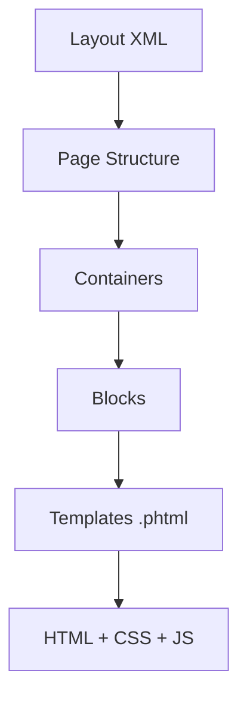

# 🎨 الـ Views والـ Layouts

> الدليل الشامل لطبقة العرض في Magento 2

---

## 📑 الفهرس

1. [مقدمة](#1-مقدمة)
2. [هيكل الملفات](#2-هيكل-الملفات)
3. [Layout XML](#3-layout-xml)
4. [Page Layouts](#4-page-layouts)
5. [Containers](#5-containers)
6. [Blocks في Layout](#6-blocks-في-layout)
7. [Templates PHTML](#7-templates-phtml)
8. [Assets CSS/JS](#8-assets-cssjs)
9. [RequireJS](#9-requirejs)
10. [UI Components](#10-ui-components)
11. [Themes Override](#11-themes-override)
12. [Best Practices](#12-best-practices)
13. [مستوى متقدم](#13-مستوى-متقدم)

---

## 1. مقدمة

### طبقة العرض



### المكونات الرئيسية

| المكون | الملف | الوظيفة |
|--------|-------|---------|
| **Layout** | `.xml` | هيكل الصفحة |
| **Template** | `.phtml` | HTML + PHP |
| **CSS** | `.less` / `.css` | Styles |
| **JS** | `.js` | JavaScript |

---

## 2. هيكل الملفات

```
app/code/Vendor/Module/view/
├── frontend/                      # Frontend area
│   ├── layout/                    # Layout XML files
│   │   ├── default.xml           # Applied to all pages
│   │   └── module_controller_action.xml
│   ├── templates/                 # PHTML templates
│   │   └── my_template.phtml
│   ├── web/                       # Static assets
│   │   ├── css/
│   │   │   └── source/
│   │   │       └── _module.less
│   │   ├── js/
│   │   │   └── my-script.js
│   │   └── images/
│   └── requirejs-config.js        # RequireJS configuration
│
├── adminhtml/                     # Admin area
│   ├── layout/
│   ├── templates/
│   ├── ui_component/              # UI Components
│   └── web/
│
└── base/                          # Shared (both areas)
    └── web/
```

---

## 3. Layout XML

### تسمية ملفات Layout

```
{route_id}_{controller}_{action}.xml

مثال:
catalog_product_view.xml   → /catalog/product/view
customer_account_login.xml → /customer/account/login
helloworld_index_index.xml → /helloworld/index/index
```

### Layout Handles الخاصة

| Handle | متى يُطبق |
|--------|----------|
| `default.xml` | كل الصفحات |
| `default_head_blocks.xml` | HEAD section |
| `catalog_category_view.xml` | صفحة الفئة |
| `catalog_product_view.xml` | صفحة المنتج |
| `checkout_cart_index.xml` | السلة |
| `checkout_index_index.xml` | Checkout |

### مثال Layout كامل

```xml
<?xml version="1.0"?>
<page xmlns:xsi="http://www.w3.org/2001/XMLSchema-instance"
      layout="2columns-left"
      xsi:noNamespaceSchemaLocation="urn:magento:framework:View/Layout/etc/page_configuration.xsd">

    <!-- Head section -->
    <head>
        <title>Page Title</title>
        <meta name="description" content="Page description"/>
        <meta name="keywords" content="keyword1, keyword2"/>

        <!-- CSS -->
        <css src="Vendor_Module::css/styles.css"/>

        <!-- JavaScript -->
        <script src="Vendor_Module::js/script.js"/>

        <!-- Remove existing -->
        <remove src="Magento_Theme::css/old-styles.css"/>
    </head>

    <body>
        <!-- Add CSS class to body -->
        <attribute name="class" value="my-custom-page"/>

        <!-- Reference existing container -->
        <referenceContainer name="content">
            <!-- Add block -->
            <block class="Vendor\Module\Block\MyBlock"
                   name="my.custom.block"
                   template="Vendor_Module::my_template.phtml"
                   before="-">
                <arguments>
                    <argument name="title" xsi:type="string">My Title</argument>
                </arguments>
            </block>
        </referenceContainer>

        <!-- Reference existing block -->
        <referenceBlock name="product.info.main">
            <action method="setTemplate">
                <argument name="template" xsi:type="string">Vendor_Module::custom.phtml</argument>
            </action>
        </referenceBlock>

        <!-- Remove block -->
        <referenceBlock name="unwanted.block" remove="true"/>

        <!-- Move block -->
        <move element="block.name" destination="new.container" before="-"/>
    </body>
</page>
```

---

## 4. Page Layouts

### الـ Layouts المتاحة

| Layout | الوصف |
|--------|-------|
| `empty` | صفحة فارغة |
| `1column` | عمود واحد |
| `2columns-left` | عمودين (sidebar يسار) |
| `2columns-right` | عمودين (sidebar يمين) |
| `3columns` | ثلاثة أعمدة |

### تطبيق Layout

```xml
<!-- في page tag -->
<page layout="2columns-left">

<!-- أو عبر update -->
<update handle="2columns-left"/>
```

---

## 5. Containers

### ما هو Container؟

Container هو **حاوية** للـ Blocks. لا يحتوي على logic.

### الـ Containers الرئيسية

| Container | الموقع |
|-----------|--------|
| `head.additional` | داخل `<head>` |
| `after.body.start` | بعد `<body>` |
| `page.wrapper` | Page wrapper |
| `header.container` | Header |
| `header-wrapper` | Header content |
| `main` | Main content area |
| `columns` | Columns container |
| `main.content` | Main content |
| `content` | Primary content |
| `sidebar.main` | Left sidebar |
| `sidebar.additional` | Right sidebar |
| `footer-container` | Footer |
| `before.body.end` | قبل `</body>` |

### إنشاء Container

```xml
<container name="my.container"
           htmlTag="div"
           htmlClass="my-container-class"
           htmlId="my-container-id"
           after="content">
    <!-- blocks here -->
</container>
```

### Attributes

| Attribute | الوصف |
|-----------|-------|
| `name` | اسم فريد |
| `htmlTag` | div, section, article... |
| `htmlClass` | CSS class |
| `htmlId` | HTML id |
| `before` / `after` | Position |
| `label` | Label للـ Admin |

---

## 6. Blocks في Layout

### إضافة Block

```xml
<block class="Vendor\Module\Block\MyBlock"
       name="unique.block.name"
       template="Vendor_Module::path/to/template.phtml"
       as="alias"
       before="-"
       cacheable="true">
    <arguments>
        <argument name="arg1" xsi:type="string">value</argument>
        <argument name="arg2" xsi:type="number">100</argument>
        <argument name="arg3" xsi:type="boolean">true</argument>
        <argument name="arg4" xsi:type="object">Vendor\Module\ViewModel\MyViewModel</argument>
        <argument name="arg5" xsi:type="array">
            <item name="key1" xsi:type="string">value1</item>
        </argument>
    </arguments>
</block>
```

### Argument Types

| Type | مثال |
|------|------|
| `string` | `"text value"` |
| `number` | `100` |
| `boolean` | `true` / `false` |
| `object` | Class name |
| `array` | Nested items |
| `null` | null value |
| `helper` | Helper class::method |
| `options` | Source model |

### تعديل Block موجود

```xml
<!-- تغيير Template -->
<referenceBlock name="block.name">
    <action method="setTemplate">
        <argument name="template" xsi:type="string">Vendor_Module::new.phtml</argument>
    </action>
</referenceBlock>

<!-- إضافة argument -->
<referenceBlock name="block.name">
    <arguments>
        <argument name="new_arg" xsi:type="string">value</argument>
    </arguments>
</referenceBlock>

<!-- حذف Block -->
<referenceBlock name="block.name" remove="true"/>

<!-- إخفاء Block (يمكن إظهاره لاحقاً) -->
<referenceBlock name="block.name" display="false"/>
```

---

## 7. Templates PHTML

### الكود الأساسي

```php
<?php
/**
 * Template description
 *
 * @var \Vendor\Module\Block\MyBlock $block
 */
?>
<div class="my-component">
    <h2><?= $block->escapeHtml($block->getTitle()) ?></h2>

    <?php if ($block->hasItems()): ?>
        <ul>
            <?php foreach ($block->getItems() as $item): ?>
                <li>
                    <a href="<?= $block->escapeUrl($item->getUrl()) ?>">
                        <?= $block->escapeHtml($item->getName()) ?>
                    </a>
                </li>
            <?php endforeach; ?>
        </ul>
    <?php else: ?>
        <p><?= $block->escapeHtml(__('No items found.')) ?></p>
    <?php endif; ?>

    <!-- Child block -->
    <?= $block->getChildHtml('child.block.name') ?>

    <!-- JavaScript -->
    <script type="text/x-magento-init">
        {
            "*": {
                "Vendor_Module/js/my-script": {
                    "config": <?= /* @noEscape */ $block->getJsonConfig() ?>
                }
            }
        }
    </script>
</div>
```

### Template Functions

```php
// الترجمة
<?= $block->escapeHtml(__('Translate this')) ?>

// URL
<?= $block->escapeUrl($block->getUrl('module/controller/action')) ?>

// Static file URL
<?= $block->escapeUrl($block->getViewFileUrl('Vendor_Module::images/logo.png')) ?>

// Child Blocks
<?= $block->getChildHtml('child.name') ?>
<?= $block->getChildHtml() // All children ?>

// Layout
<?= $block->getLayout()->getBlock('block.name')->toHtml() ?>

// Check if block exists
<?php if ($block->getLayout()->hasElement('block.name')): ?>
```

---

## 8. Assets CSS/JS

### إضافة CSS

```xml
<!-- في Layout XML -->
<head>
    <!-- External CSS -->
    <css src="Vendor_Module::css/styles.css"/>

    <!-- With media query -->
    <css src="Vendor_Module::css/print.css" media="print"/>

    <!-- Remove CSS -->
    <remove src="Magento_Theme::css/old.css"/>
</head>
```

### إضافة JavaScript

```xml
<head>
    <!-- Script -->
    <script src="Vendor_Module::js/script.js"/>

    <!-- Defer -->
    <script src="Vendor_Module::js/script.js" defer="defer"/>
</head>
```

### LESS Structure

```
view/frontend/web/css/source/
├── _module.less           # Main module styles
├── _extend.less           # Override parent theme
└── _custom.less           # Custom styles
```

### LESS مثال

```less
// _module.less
@import 'module/_variables.less';
@import 'module/_components.less';

.my-component {
    padding: @indent__base;
    background: @color-white;

    &__title {
        font-size: @font-size__l;
        color: @heading__color;
    }

    &__content {
        margin-top: @indent__s;
    }
}
```

---

## 9. RequireJS

### requirejs-config.js

```javascript
// view/frontend/requirejs-config.js
var config = {
    // Paths mapping
    paths: {
        'myModule': 'Vendor_Module/js/my-module',
        'customLib': 'Vendor_Module/js/lib/custom'
    },

    // Shim for non-AMD modules
    shim: {
        'customLib': {
            deps: ['jquery'],
            exports: 'CustomLib'
        }
    },

    // Map for replacements
    map: {
        '*': {
            'originalModule': 'Vendor_Module/js/replacement-module'
        }
    },

    // Mixins
    config: {
        mixins: {
            'Magento_Catalog/js/catalog-add-to-cart': {
                'Vendor_Module/js/catalog-add-to-cart-mixin': true
            }
        }
    }
};
```

### JavaScript Module

```javascript
// view/frontend/web/js/my-module.js
define([
    'jquery',
    'underscore',
    'mage/translate'
], function ($, _, $t) {
    'use strict';

    return function (config, element) {
        var defaults = {
            selector: '.item'
        };

        var options = $.extend({}, defaults, config);

        // Module logic
        $(element).find(options.selector).on('click', function () {
            console.log($t('Item clicked'));
        });
    };
});
```

### استخدام في Template

```html
<div id="my-component" data-mage-init='{"Vendor_Module/js/my-module": {"selector": ".custom-item"}}'>
    <!-- content -->
</div>

<!-- أو -->
<script type="text/x-magento-init">
{
    "#my-component": {
        "Vendor_Module/js/my-module": {
            "selector": ".custom-item"
        }
    }
}
</script>
```

---

## 10. UI Components

### موقع UI Components

```
view/adminhtml/ui_component/
└── entity_listing.xml
└── entity_form.xml
```

### Listing Component (Grid)

```xml
<?xml version="1.0"?>
<listing xmlns:xsi="http://www.w3.org/2001/XMLSchema-instance"
         xsi:noNamespaceSchemaLocation="urn:magento:module:Magento_Ui:etc/ui_configuration.xsd">

    <argument name="data" xsi:type="array">
        <item name="js_config" xsi:type="array">
            <item name="provider" xsi:type="string">entity_listing.entity_listing_data_source</item>
        </item>
    </argument>

    <settings>
        <spinner>entity_columns</spinner>
        <deps>
            <dep>entity_listing.entity_listing_data_source</dep>
        </deps>
    </settings>

    <dataSource name="entity_listing_data_source">
        <argument name="data" xsi:type="array">
            <item name="config" xsi:type="array">
                <item name="component" xsi:type="string">Magento_Ui/js/grid/provider</item>
                <item name="update_url" xsi:type="url" path="mui/index/render"/>
                <item name="storageConfig" xsi:type="array">
                    <item name="indexField" xsi:type="string">entity_id</item>
                </item>
            </item>
        </argument>
        <settings>
            <updateUrl path="mui/index/render"/>
        </settings>
        <aclResource>Vendor_Module::entity</aclResource>
        <dataProvider class="Magento\Framework\View\Element\UiComponent\DataProvider\DataProvider"
                      name="entity_listing_data_source">
            <settings>
                <primaryFieldName>entity_id</primaryFieldName>
                <requestFieldName>id</requestFieldName>
            </settings>
        </dataProvider>
    </dataSource>

    <columns name="entity_columns">
        <selectionsColumn name="ids">
            <settings>
                <indexField>entity_id</indexField>
            </settings>
        </selectionsColumn>

        <column name="entity_id">
            <settings>
                <filter>textRange</filter>
                <label translate="true">ID</label>
                <sorting>asc</sorting>
            </settings>
        </column>

        <column name="name">
            <settings>
                <filter>text</filter>
                <label translate="true">Name</label>
            </settings>
        </column>

        <actionsColumn name="actions"
                       class="Vendor\Module\Ui\Component\Listing\Column\EntityActions">
            <settings>
                <indexField>entity_id</indexField>
            </settings>
        </actionsColumn>
    </columns>
</listing>
```

---

## 11. Themes Override

### Override Template

```
app/design/frontend/Vendor/theme/
└── Vendor_Module/
    └── templates/
        └── my_template.phtml  # Overrides module template
```

### Override Layout

```
app/design/frontend/Vendor/theme/
└── Vendor_Module/
    └── layout/
        └── module_controller_action.xml
```

### Extend Layout (recommended)

```xml
<!-- Extend instead of override -->
<?xml version="1.0"?>
<page xmlns:xsi="http://www.w3.org/2001/XMLSchema-instance"
      xsi:noNamespaceSchemaLocation="urn:magento:framework:View/Layout/etc/page_configuration.xsd">
    <body>
        <!-- Just add your changes -->
        <referenceBlock name="existing.block">
            <arguments>
                <argument name="new_arg" xsi:type="string">value</argument>
            </arguments>
        </referenceBlock>
    </body>
</page>
```

---

## 12. Best Practices

### ✅ استخدم Escaping

```php
// ✅ Always escape
<?= $block->escapeHtml($data) ?>

// ❌ Never trust user data
<?= $data ?>
```

### ✅ استخدم ViewModel

```php
// ViewModel أفضل من Block للـ logic
class MyViewModel implements ArgumentInterface
{
    public function getData(): array
    {
        return $this->repository->getAll();
    }
}
```

### ✅ استخدم data-mage-init

```html
<!-- ✅ Preferred -->
<div data-mage-init='{"module": {"config": "value"}}'>

<!-- ❌ Avoid inline scripts -->
<script>
    require(['module'], function(m) { m.init(); });
</script>
```

---

## 13. مستوى متقدم

### Knockout.js Templates

```html
<!-- ko foreach: items -->
<div class="item" data-bind="text: name"></div>
<!-- /ko -->

<script type="text/x-magento-init">
{
    "*": {
        "Magento_Ui/js/core/app": {
            "components": {
                "myComponent": {
                    "component": "Vendor_Module/js/view/my-component",
                    "items": <?= /* @noEscape */ $block->getItemsJson() ?>
                }
            }
        }
    }
}
</script>
```

### Layout Handle Programmatically

```php
// في Controller
$page = $this->pageFactory->create();
$page->addHandle('custom_handle');
$page->addPageLayoutHandles(['type' => 'simple']);
return $page;
```

---

## 📌 ملخص

| المكون | المسار | الامتداد |
|--------|--------|---------|
| Layout | `view/frontend/layout/` | `.xml` |
| Template | `view/frontend/templates/` | `.phtml` |
| CSS | `view/frontend/web/css/` | `.less` / `.css` |
| JS | `view/frontend/web/js/` | `.js` |
| RequireJS | `view/frontend/` | `requirejs-config.js` |

---

## ⬅️ [السابق](./06_BLOCKS.md) | [🏠 الرئيسية](../MODULE_STRUCTURE.md) | [التالي ➡️](./08_DI.md)
