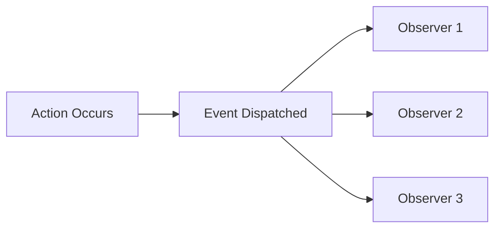

# 👁️ الـ Observers

> الدليل الشامل للـ Event Observers في Magento 2

---

## 📑 الفهرس

1. [مقدمة](#1-مقدمة)
2. [Event System](#2-event-system)
3. [موقع الملفات](#3-موقع-الملفات)
4. [events.xml](#4-eventsxml)
5. [Observer Class](#5-observer-class)
6. [Events شائعة](#6-events-شائعة)
7. [Custom Events](#7-custom-events)
8. [Observer vs Plugin](#8-observer-vs-plugin)
9. [Best Practices](#9-best-practices)
10. [مستوى متقدم](#10-مستوى-متقدم)

---

## 1. مقدمة

### ما هو Observer؟

Observer هو class يستمع لـ **Event** معين ويُنفذ كود عند حدوثه.



### متى تستخدم Observer؟

| الحالة | Observer مناسب؟ |
|--------|-----------------|
| رد فعل على action | ✅ نعم |
| Logging | ✅ نعم |
| إرسال Email | ✅ نعم |
| تعديل data قبل الحفظ | ✅ نعم |
| تعديل method return | ❌ لا (استخدم Plugin) |

---

## 2. Event System

### كيف يعمل

```php
// 1. Dispatch event
$this->eventManager->dispatch('event_name', ['key' => $data]);

// 2. Magento يبحث عن Observers مسجلين
// 3. ينفذ كل Observer

// 4. Observer يستقبل الـ data
public function execute(Observer $observer)
{
    $data = $observer->getEvent()->getData('key');
}
```

### EventManager

```php
use Magento\Framework\Event\ManagerInterface;

class MyClass
{
    public function __construct(
        private ManagerInterface $eventManager
    ) {}

    public function doSomething()
    {
        // Dispatch event
        $this->eventManager->dispatch(
            'vendor_module_action_after',
            ['entity' => $entity, 'request' => $request]
        );
    }
}
```

---

## 3. موقع الملفات

```
app/code/Vendor/Module/
├── etc/
│   ├── events.xml              # Global events
│   ├── frontend/
│   │   └── events.xml          # Frontend events only
│   └── adminhtml/
│       └── events.xml          # Admin events only
└── Observer/
    └── MyObserver.php
```

---

## 4. events.xml

### XSD Schema

```xml
<?xml version="1.0"?>
<config xmlns:xsi="http://www.w3.org/2001/XMLSchema-instance"
        xsi:noNamespaceSchemaLocation="urn:magento:framework:Event/etc/events.xsd">

    <!-- Single Observer -->
    <event name="catalog_product_save_after">
        <observer name="vendor_module_product_observer"
                  instance="Vendor\Module\Observer\ProductSaveObserver"/>
    </event>

    <!-- Multiple Observers -->
    <event name="sales_order_place_after">
        <observer name="vendor_order_email"
                  instance="Vendor\Module\Observer\SendOrderEmail"/>
        <observer name="vendor_order_log"
                  instance="Vendor\Module\Observer\LogOrder"/>
    </event>

    <!-- Disabled Observer -->
    <event name="some_event">
        <observer name="some_observer"
                  instance="Vendor\Module\Observer\SomeObserver"
                  disabled="true"/>
    </event>

</config>
```

### Observer Attributes

| Attribute | الوصف | إلزامي |
|-----------|-------|--------|
| `name` | اسم فريد للـ observer | ✅ |
| `instance` | الـ Observer class | ✅ |
| `disabled` | تعطيل الـ observer | ❌ |
| `shared` | Singleton (true) أو new instance | ❌ |

---

## 5. Observer Class

### الكود الكامل

```php
<?php
declare(strict_types=1);

namespace Vendor\Module\Observer;

use Magento\Framework\Event\Observer;
use Magento\Framework\Event\ObserverInterface;
use Psr\Log\LoggerInterface;

class ProductSaveObserver implements ObserverInterface
{
    /**
     * @param LoggerInterface $logger
     */
    public function __construct(
        private LoggerInterface $logger
    ) {}

    /**
     * Execute observer
     *
     * @param Observer $observer
     * @return void
     */
    public function execute(Observer $observer): void
    {
        /** @var \Magento\Catalog\Model\Product $product */
        $product = $observer->getEvent()->getData('product');

        // Or using magic method
        // $product = $observer->getEvent()->getProduct();

        if ($product) {
            $this->logger->info(
                'Product saved',
                [
                    'id' => $product->getId(),
                    'sku' => $product->getSku(),
                    'name' => $product->getName()
                ]
            );

            // Modify product (if before_save event)
            // $product->setCustomAttribute('value');
        }
    }
}
```

### Observer Methods

```php
// الحصول على Event object
$event = $observer->getEvent();

// الحصول على data
$data = $event->getData('key');
$data = $event->getKey(); // Magic method

// الحصول على كل الـ data
$allData = $event->getData();

// التحقق من وجود data
if ($event->hasData('key')) {
    // ...
}
```

---

## 6. Events شائعة

### Catalog Events

| Event | متى يُطلق | Data |
|-------|----------|------|
| `catalog_product_save_before` | قبل حفظ المنتج | `product` |
| `catalog_product_save_after` | بعد حفظ المنتج | `product` |
| `catalog_product_delete_before` | قبل حذف المنتج | `product` |
| `catalog_product_delete_after` | بعد حذف المنتج | `product` |
| `catalog_category_save_after` | بعد حفظ الفئة | `category` |

### Sales Events

| Event | متى يُطلق | Data |
|-------|----------|------|
| `sales_order_place_before` | قبل الطلب | `order` |
| `sales_order_place_after` | بعد الطلب | `order` |
| `sales_order_save_after` | بعد حفظ الطلب | `order` |
| `sales_order_invoice_save_after` | بعد الفاتورة | `invoice` |
| `sales_order_shipment_save_after` | بعد الشحن | `shipment` |

### Customer Events

| Event | متى يُطلق | Data |
|-------|----------|------|
| `customer_register_success` | بعد التسجيل | `customer` |
| `customer_login` | بعد تسجيل الدخول | `customer` |
| `customer_logout` | بعد تسجيل الخروج | `customer` |
| `customer_save_after` | بعد حفظ العميل | `customer` |

### Checkout Events

| Event | متى يُطلق | Data |
|-------|----------|------|
| `checkout_cart_add_product_complete` | بعد إضافة للسلة | `product`, `request` |
| `checkout_cart_update_items_after` | بعد تحديث السلة | `cart`, `info` |
| `checkout_submit_all_after` | بعد إكمال الشراء | `order`, `quote` |

### General Events

| Event | متى يُطلق |
|-------|----------|
| `controller_action_predispatch` | قبل أي Controller |
| `controller_action_postdispatch` | بعد أي Controller |
| `layout_load_before` | قبل تحميل Layout |
| `model_save_before` | قبل حفظ أي Model |
| `model_save_after` | بعد حفظ أي Model |

---

## 7. Custom Events

### Dispatch Event

```php
<?php
namespace Vendor\Module\Model;

use Magento\Framework\Event\ManagerInterface;

class MyService
{
    public function __construct(
        private ManagerInterface $eventManager
    ) {}

    public function processEntity(Entity $entity): void
    {
        // Before event
        $this->eventManager->dispatch(
            'vendor_module_entity_process_before',
            ['entity' => $entity]
        );

        // ... عملية المعالجة ...

        // After event
        $this->eventManager->dispatch(
            'vendor_module_entity_process_after',
            [
                'entity' => $entity,
                'result' => $result
            ]
        );
    }
}
```

### تسمية Events

```
{vendor}_{module}_{object}_{action}_{timing}

مثال:
vendor_module_entity_save_before
vendor_module_order_process_after
vendor_module_item_delete_before
```

### Observer للـ Custom Event

```xml
<event name="vendor_module_entity_process_after">
    <observer name="handle_entity_processed"
              instance="Vendor\Module\Observer\EntityProcessedObserver"/>
</event>
```

---

## 8. Observer vs Plugin

### متى تستخدم كل منهما

| الحالة | Observer | Plugin |
|--------|----------|--------|
| React to event | ✅ | ❌ |
| Modify arguments | ❌ | ✅ (before) |
| Modify return value | ❌ | ✅ (after) |
| Cancel execution | ❌ | ✅ (around) |
| Multiple reactions | ✅ (أسهل) | ✅ |
| Performance | أبطأ قليلاً | أسرع |

### مثال: نفس الهدف بطريقتين

```php
// Observer - للـ logging/notifications
class ProductSaveObserver implements ObserverInterface
{
    public function execute(Observer $observer): void
    {
        $product = $observer->getEvent()->getProduct();
        $this->logger->info('Product saved: ' . $product->getSku());
        $this->emailService->notifyAdmin($product);
    }
}

// Plugin - لتعديل البيانات
class ProductPlugin
{
    public function beforeSave(Product $subject): void
    {
        // تعديل قبل الحفظ
        $subject->setData('custom_field', 'value');
    }

    public function afterGetName(Product $subject, string $result): string
    {
        // تعديل return value
        return $result . ' - Special';
    }
}
```

---

## 9. Best Practices

### ✅ 1. استخدم Area-specific events

```
etc/frontend/events.xml   ← Frontend فقط
etc/adminhtml/events.xml  ← Admin فقط
```

### ✅ 2. Observers يجب أن تكون Fast

```php
// ✅ سريع
public function execute(Observer $observer): void
{
    $this->queue->add($observer->getEvent()->getData());
}

// ❌ بطيء - يؤثر على الأداء
public function execute(Observer $observer): void
{
    // عملية ثقيلة تأخذ 5 ثوانٍ
    $this->heavyProcessing();
}
```

### ✅ 3. لا تعدل State في after events

```php
// ❌ خطر في after event
public function execute(Observer $observer): void
{
    $product = $observer->getEvent()->getProduct();
    $product->setName('New Name');
    $product->save(); // Infinite loop!
}

// ✅ استخدم before event للتعديل
```

### ✅ 4. استخدم اسم فريد

```xml
<!-- ✅ صحيح - prefixed -->
<observer name="vendor_module_product_logger" .../>

<!-- ❌ خطأ - قد يتعارض -->
<observer name="product_logger" .../>
```

---

## 10. مستوى متقدم

### Async Observer (Queue)

```php
class AsyncOrderObserver implements ObserverInterface
{
    public function __construct(
        private PublisherInterface $publisher
    ) {}

    public function execute(Observer $observer): void
    {
        $order = $observer->getEvent()->getOrder();

        // إرسال للـ queue بدلاً من المعالجة المباشرة
        $this->publisher->publish(
            'vendor.order.process',
            ['order_id' => $order->getId()]
        );
    }
}
```

### Conditional Observer

```php
class ConditionalObserver implements ObserverInterface
{
    public function __construct(
        private ScopeConfigInterface $config
    ) {}

    public function execute(Observer $observer): void
    {
        // تحقق من التكوين
        if (!$this->config->isSetFlag('vendor/module/enabled')) {
            return;
        }

        // ... المعالجة ...
    }
}
```

### Disable Core Observer

```xml
<!-- تعطيل observer من مودول آخر -->
<event name="some_event">
    <observer name="core_observer_name" disabled="true"/>
</event>
```

### Debug Events

```php
// في etc/env.php
'dev' => [
    'debug' => [
        'profiler' => 1
    ]
]

// أو Logger
$this->logger->debug('Event fired', [
    'event' => $observer->getEvent()->getName(),
    'data' => $observer->getEvent()->getData()
]);
```

---

## 📌 ملخص

| المكون | المسار |
|--------|--------|
| **events.xml** | `etc/events.xml` أو `etc/{area}/events.xml` |
| **Observer** | `Observer/MyObserver.php` |
| **Interface** | `ObserverInterface` |
| **Method** | `execute(Observer $observer)` |

---

## ⬅️ [السابق](./08_DI.md) | [🏠 الرئيسية](../MODULE_STRUCTURE.md) | [التالي ➡️](./10_PLUGINS.md)
