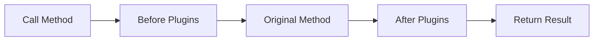
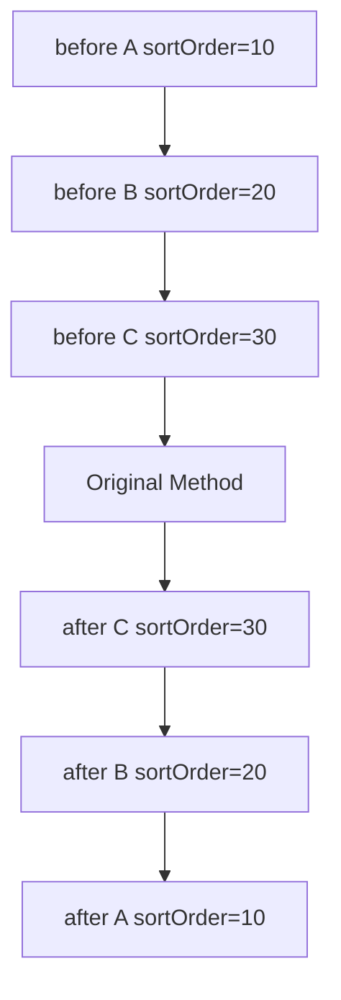

# 🔌 الـ Plugins (Interceptors)

> الدليل الشامل للـ Plugins في Magento 2

---

## 📑 الفهرس

1. [مقدمة](#1-مقدمة)
2. [أنواع الـ Plugins](#2-أنواع-الـ-plugins)
3. [تسجيل Plugin](#3-تسجيل-plugin)
4. [Before Plugin](#4-before-plugin)
5. [After Plugin](#5-after-plugin)
6. [Around Plugin](#6-around-plugin)
7. [Plugin Sorting](#7-plugin-sorting)
8. [Limitations](#8-limitations)
9. [Plugin vs Preference](#9-plugin-vs-preference)
10. [Best Practices](#10-best-practices)
11. [مستوى متقدم](#11-مستوى-متقدم)

---

## 1. مقدمة

### ما هو Plugin؟

Plugin (أو Interceptor) يسمح لك بـ:
- **تعديل arguments** قبل تنفيذ method
- **تعديل return value** بعد تنفيذ method
- **التحكم الكامل** قبل وبعد التنفيذ



---

## 2. أنواع الـ Plugins

| النوع | الوظيفة | متى تستخدمه |
|-------|---------|-------------|
| **Before** | تعديل arguments | تغيير input |
| **After** | تعديل return | تغيير output |
| **Around** | تحكم كامل | عندما تحتاج الاثنين |

---

## 3. تسجيل Plugin

### di.xml

```xml
<?xml version="1.0"?>
<config xmlns:xsi="http://www.w3.org/2001/XMLSchema-instance"
        xsi:noNamespaceSchemaLocation="urn:magento:framework:ObjectManager/etc/config.xsd">

    <type name="Magento\Catalog\Model\Product">
        <plugin name="vendor_module_product_plugin"
                type="Vendor\Module\Plugin\ProductPlugin"
                sortOrder="10"
                disabled="false"/>
    </type>
</config>
```

### Attributes

| Attribute | الوظيفة | Default |
|-----------|---------|---------|
| `name` | معرف فريد | (required) |
| `type` | الـ Plugin class | (required) |
| `sortOrder` | الترتيب | 0 |
| `disabled` | تعطيل | false |

---

## 4. Before Plugin

### الغرض

تعديل **arguments** قبل تنفيذ الـ method الأصلي.

### التسمية

```php
public function before{MethodName}($subject, ...originalArgs)
```

### مثال

```php
<?php
declare(strict_types=1);

namespace Vendor\Module\Plugin;

use Magento\Catalog\Model\Product;

class ProductPlugin
{
    /**
     * Before getName - modify nothing, just observe
     *
     * @param Product $subject
     * @return null
     */
    public function beforeGetName(Product $subject)
    {
        // لا نعيد شيء = لا نغير arguments
        return null;
    }

    /**
     * Before setName - modify the name argument
     *
     * @param Product $subject
     * @param string $name
     * @return array - modified arguments
     */
    public function beforeSetName(Product $subject, string $name): array
    {
        // تعديل الـ argument
        $modifiedName = trim($name);

        // Return array of modified arguments
        return [$modifiedName];
    }

    /**
     * Before method with multiple arguments
     */
    public function beforeSetData(Product $subject, $key, $value = null): array
    {
        if ($key === 'name') {
            $value = strtoupper($value);
        }

        return [$key, $value];
    }
}
```

### Return Value

| Return | النتيجة |
|--------|---------|
| `null` | لا تغيير |
| `[]` (empty array) | لا تغيير |
| `[arg1, arg2, ...]` | arguments معدلة |

---

## 5. After Plugin

### الغرض

تعديل **return value** بعد تنفيذ الـ method الأصلي.

### التسمية

```php
public function after{MethodName}($subject, $result, ...originalArgs)
```

### مثال

```php
<?php
declare(strict_types=1);

namespace Vendor\Module\Plugin;

use Magento\Catalog\Model\Product;

class ProductPlugin
{
    /**
     * After getName - modify the result
     *
     * @param Product $subject
     * @param string $result - original return value
     * @return string - modified return value
     */
    public function afterGetName(Product $subject, string $result): string
    {
        // Add prefix
        return '[SALE] ' . $result;
    }

    /**
     * After getPrice - apply custom discount
     *
     * @param Product $subject
     * @param float $result
     * @return float
     */
    public function afterGetPrice(Product $subject, float $result): float
    {
        // Apply 10% discount
        return $result * 0.9;
    }

    /**
     * After with access to original arguments
     *
     * @param Product $subject
     * @param mixed $result
     * @param string $key - original argument
     * @return mixed
     */
    public function afterGetData(Product $subject, $result, $key = null)
    {
        if ($key === 'price' && $result !== null) {
            return $result * 0.9;
        }

        return $result;
    }
}
```

### Parameters

| Parameter | الوصف |
|-----------|-------|
| `$subject` | الـ object الأصلي |
| `$result` | القيمة المُرجعة من الـ method الأصلي |
| `...args` | الـ arguments الأصلية (اختياري) |

---

## 6. Around Plugin

### الغرض

**التحكم الكامل** - قبل وبعد وأثناء التنفيذ.

### التسمية

```php
public function around{MethodName}($subject, callable $proceed, ...originalArgs)
```

### مثال

```php
<?php
declare(strict_types=1);

namespace Vendor\Module\Plugin;

use Magento\Catalog\Model\Product;
use Psr\Log\LoggerInterface;

class ProductPlugin
{
    public function __construct(
        private LoggerInterface $logger
    ) {}

    /**
     * Around save - add logging
     *
     * @param Product $subject
     * @param callable $proceed
     * @return Product
     */
    public function aroundSave(Product $subject, callable $proceed): Product
    {
        // === BEFORE ===
        $this->logger->info('Product save started', ['sku' => $subject->getSku()]);
        $startTime = microtime(true);

        try {
            // === CALL ORIGINAL METHOD ===
            $result = $proceed();

            // === AFTER (success) ===
            $duration = microtime(true) - $startTime;
            $this->logger->info('Product save completed', [
                'sku' => $subject->getSku(),
                'id' => $result->getId(),
                'duration' => $duration
            ]);

            return $result;

        } catch (\Exception $e) {
            // === AFTER (error) ===
            $this->logger->error('Product save failed', [
                'sku' => $subject->getSku(),
                'error' => $e->getMessage()
            ]);
            throw $e;
        }
    }

    /**
     * Around with modified arguments
     */
    public function aroundSetName(
        Product $subject,
        callable $proceed,
        string $name
    ): Product {
        // Modify argument before calling
        $modifiedName = trim($name);

        // Call with modified argument
        $result = $proceed($modifiedName);

        // Modify result before returning
        return $result;
    }

    /**
     * Around with conditional execution
     */
    public function aroundCanDelete(Product $subject, callable $proceed): bool
    {
        // Check custom condition
        if ($subject->getData('is_protected')) {
            return false; // Don't call original method
        }

        // Call original method
        return $proceed();
    }
}
```

### $proceed Parameter

```php
// استدعاء الـ method الأصلي
$result = $proceed();

// استدعاء مع arguments معدلة
$result = $proceed($modifiedArg1, $modifiedArg2);

// عدم الاستدعاء = تجاوز الـ method!
if ($condition) {
    return $customResult; // Original method not called!
}
```

> ⚠️ **تحذير:** يجب دائماً استدعاء `$proceed()` إلا إذا كنت متعمداً تجاوز الـ method.

---

## 7. Plugin Sorting

### Sort Order

```xml
<type name="Magento\Catalog\Model\Product">
    <plugin name="plugin_a" type="A\Plugin" sortOrder="10"/>
    <plugin name="plugin_b" type="B\Plugin" sortOrder="20"/>
    <plugin name="plugin_c" type="C\Plugin" sortOrder="30"/>
</type>
```

### ترتيب التنفيذ

```
Before Plugins: A → B → C (ascending)
Original Method
After Plugins: C → B → A (descending)
```



### Around Plugins

```
Around plugins form a chain:
A.around {
    B.around {
        C.around {
            Original Method
        }
    }
}
```

---

## 8. Limitations

### ❌ لا يمكن عمل Plugin على:

| النوع | السبب |
|-------|-------|
| **Final methods** | PHP لا يسمح |
| **Final classes** | PHP لا يسمح |
| **Static methods** | لا يمكن اعتراضها |
| **Private methods** | غير مرئية |
| **__construct** | يُستدعى قبل DI |
| **Virtual types** | لا توجد PHP class |
| **Objects not from ObjectManager** | لا interceptor |

### مثال على Limitations

```php
// ❌ هذه لا يمكن عمل plugin عليها
final class FinalClass {}

class SomeClass
{
    final public function finalMethod() {}
    private function privateMethod() {}
    public static function staticMethod() {}
    public function __construct() {}
}
```

---

## 9. Plugin vs Preference

### متى تستخدم Plugin

| Plugin ✅ | Preference ❌ |
|----------|--------------|
| تعديل method واحد | استبدال class كامل |
| الحفاظ على التوافق | قد يكسر updates |
| Multi-vendor friendly | تعارض المودولات |

### مثال

```xml
<!-- ✅ Plugin - أفضل -->
<type name="Magento\Catalog\Model\Product">
    <plugin name="my_plugin" type="My\Plugin"/>
</type>

<!-- ❌ Preference - تجنبه -->
<preference for="Magento\Catalog\Model\Product"
            type="My\Model\Product"/>
```

---

## 10. Best Practices

### ✅ 1. استخدم After بدلاً من Around

```php
// ✅ أفضل - أبسط وأوضح
public function afterGetPrice(Product $subject, float $result): float
{
    return $result * 0.9;
}

// ❌ معقد بلا داعٍ
public function aroundGetPrice(Product $subject, callable $proceed): float
{
    $result = $proceed();
    return $result * 0.9;
}
```

### ✅ 2. Plugin Name فريد

```xml
<!-- ✅ صحيح -->
<plugin name="vendor_module_feature_plugin" .../>

<!-- ❌ قد يتعارض -->
<plugin name="product_plugin" .../>
```

### ✅ 3. استخدم Proxy للـ Heavy Dependencies

```php
public function __construct(
    private Session\Proxy $session // Lazy loading
) {}
```

### ✅ 4. تجنب Multiple Around Plugins

Around plugins تُضيف overhead. استخدم Before + After حيث أمكن.

---

## 11. مستوى متقدم

### Multiple Methods في Plugin واحد

```php
class ProductPlugin
{
    public function beforeGetName(Product $subject) { }
    public function afterGetName(Product $subject, $result) { }
    public function beforeGetPrice(Product $subject) { }
    public function afterGetPrice(Product $subject, $result) { }
}
```

### Plugin على Interface

```xml
<!-- Plugin على كل implementations للـ Interface -->
<type name="Magento\Catalog\Api\ProductRepositoryInterface">
    <plugin name="my_plugin" type="My\Plugin"/>
</type>
```

### Disable Plugin

```xml
<!-- تعطيل plugin من مودول آخر -->
<type name="Magento\Catalog\Model\Product">
    <plugin name="other_vendor_plugin" disabled="true"/>
</type>
```

### Debug Plugins

```bash
# عرض الـ plugins المُسجلة
bin/magento dev:di:info "Magento\Catalog\Model\Product"
```

---

## 📌 ملخص

| النوع | Signature | Return |
|-------|-----------|--------|
| Before | `before{Method}($subject, ...args)` | `null` or `[args]` |
| After | `after{Method}($subject, $result, ...args)` | Modified result |
| Around | `around{Method}($subject, $proceed, ...args)` | Result |

---

## ⬅️ [السابق](./09_OBSERVERS.md) | [🏠 الرئيسية](../MODULE_STRUCTURE.md) | [التالي ➡️](./11_API.md)
