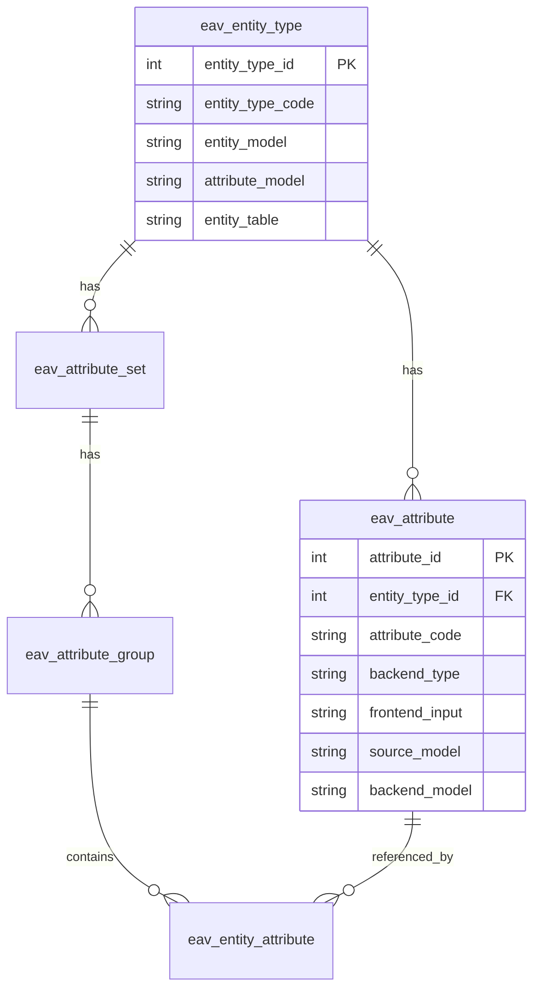

# 🗃️ EAV (Entity-Attribute-Value) System

> الدليل المتقدم لنظام EAV في Magento 2

---

## 📑 الفهرس

1. [مقدمة](#1-مقدمة)
2. [بنية EAV](#2-بنية-eav)
3. [Entity Types](#3-entity-types)
4. [Attributes](#4-attributes)
5. [إنشاء Custom EAV Entity](#5-إنشاء-custom-eav-entity)
6. [Product Attributes](#6-product-attributes)
7. [Customer Attributes](#7-customer-attributes)
8. [Category Attributes](#8-category-attributes)
9. [Attribute Sets & Groups](#9-attribute-sets--groups)
10. [Source Models](#10-source-models)
11. [Backend & Frontend Models](#11-backend--frontend-models)
12. [Best Practices](#12-best-practices)

---

## 1. مقدمة

### ما هو EAV؟

**Entity-Attribute-Value** هو نمط تصميم قاعدة بيانات يسمح بـ:
- إضافة attributes بدون تغيير هيكل الجدول
- دعم Multi-store values
- المرونة العالية

### Flat Table vs EAV

```
┌─────────────────────────────────────────────────────────────┐
│                      Flat Table                              │
│  ┌──────┬───────────┬─────────┬────────┬─────────┬───────┐ │
│  │ id   │ name      │ sku     │ price  │ weight  │ color │ │
│  ├──────┼───────────┼─────────┼────────┼─────────┼───────┤ │
│  │ 1    │ Shirt     │ SH001   │ 29.99  │ 0.5     │ Red   │ │
│  └──────┴───────────┴─────────┴────────┴─────────┴───────┘ │
│                                                              │
│  ❌ إضافة attribute جديد = تعديل الجدول                      │
│  ❌ Multi-store values = جداول إضافية معقدة                  │
└─────────────────────────────────────────────────────────────┘

┌─────────────────────────────────────────────────────────────┐
│                      EAV System                              │
│                                                              │
│  Entity Table          Attribute Table                       │
│  ┌────┬──────────┐    ┌────────┬────────────┬──────────┐   │
│  │ id │ sku      │    │ att_id │ code       │ type     │   │
│  │ 1  │ SH001    │    │ 71     │ name       │ varchar  │   │
│  └────┴──────────┘    │ 72     │ price      │ decimal  │   │
│                        │ 73     │ color      │ int      │   │
│                        └────────┴────────────┴──────────┘   │
│                                                              │
│  Value Tables (per type)                                     │
│  ┌──────────┬────────┬──────────┬─────────────────────┐    │
│  │entity_id │ att_id │ store_id │ value               │    │
│  │ 1        │ 71     │ 0        │ Shirt               │    │
│  │ 1        │ 71     │ 1        │ قميص                │    │
│  │ 1        │ 72     │ 0        │ 29.99               │    │
│  └──────────┴────────┴──────────┴─────────────────────┘    │
│                                                              │
│  ✅ إضافة attribute = صف في eav_attribute فقط              │
│  ✅ Multi-store = store_id في جدول القيم                   │
└─────────────────────────────────────────────────────────────┘
```

---

## 2. بنية EAV

### الجداول الأساسية



### جداول القيم (Value Tables)

لكل `backend_type` جدول منفصل:

| Backend Type | جدول Products | جدول Customers |
|--------------|---------------|----------------|
| `varchar` | `catalog_product_entity_varchar` | `customer_entity_varchar` |
| `int` | `catalog_product_entity_int` | `customer_entity_int` |
| `decimal` | `catalog_product_entity_decimal` | `customer_entity_decimal` |
| `text` | `catalog_product_entity_text` | `customer_entity_text` |
| `datetime` | `catalog_product_entity_datetime` | `customer_entity_datetime` |
| `static` | في `catalog_product_entity` مباشرة | في `customer_entity` |

---

## 3. Entity Types

### Entity Types الموجودة

```sql
SELECT * FROM eav_entity_type;
```

| entity_type_id | entity_type_code | entity_model |
|----------------|------------------|--------------|
| 1 | customer | `Magento\Customer\Model\Customer` |
| 2 | customer_address | `Magento\Customer\Model\Address` |
| 3 | catalog_category | `Magento\Catalog\Model\Category` |
| 4 | catalog_product | `Magento\Catalog\Model\Product` |
| 5 | order | `Magento\Sales\Model\Order` |
| 6 | invoice | `Magento\Sales\Model\Invoice` |
| 7 | creditmemo | `Magento\Sales\Model\Creditmemo` |
| 8 | shipment | `Magento\Sales\Model\Shipment` |

### الحصول على Entity Type برمجياً

```php
use Magento\Eav\Model\Config;

class MyClass
{
    public function __construct(
        private Config $eavConfig
    ) {}

    public function getProductEntityType()
    {
        return $this->eavConfig->getEntityType('catalog_product');
    }
}
```

---

## 4. Attributes

### Attribute Properties

| Property | الوظيفة | مثال |
|----------|---------|------|
| `attribute_code` | المعرف الفريد | `color`, `size` |
| `backend_type` | نوع التخزين | `varchar`, `int`, `decimal` |
| `frontend_input` | نوع الـ input | `text`, `select`, `multiselect` |
| `source_model` | مصدر الخيارات | للـ dropdowns |
| `backend_model` | معالجة القيم | للتحويلات |
| `frontend_model` | العرض | للتنسيق |

### Backend Types

| Type | الجدول | الاستخدام |
|------|--------|-----------|
| `static` | Entity table | SKU, created_at |
| `varchar` | `_varchar` | اسم، عنوان قصير |
| `text` | `_text` | وصف طويل |
| `int` | `_int` | Status, Category IDs |
| `decimal` | `_decimal` | Price, Weight |
| `datetime` | `_datetime` | تواريخ |

### Frontend Inputs

| Input | العرض | Backend Type المناسب |
|-------|-------|---------------------|
| `text` | Text field | `varchar` |
| `textarea` | Text area | `text` |
| `select` | Dropdown | `int` |
| `multiselect` | Multiple select | `varchar` |
| `boolean` | Yes/No | `int` |
| `date` | Date picker | `datetime` |
| `price` | Price field | `decimal` |
| `weight` | Weight field | `decimal` |
| `media_image` | Image uploader | `varchar` |
| `gallery` | Image gallery | special |

---

## 5. إنشاء Custom EAV Entity

### هيكل الملفات

```
app/code/Vendor/Module/
├── etc/
│   └── db_schema.xml
├── Model/
│   ├── CustomEntity.php
│   ├── ResourceModel/
│   │   ├── CustomEntity.php
│   │   └── CustomEntity/
│   │       └── Collection.php
│   └── Attribute/
│       └── Backend/
│           └── CustomBackend.php
├── Setup/
│   └── Patch/
│       └── Data/
│           └── InstallEntityType.php
└── Api/
    └── Data/
        └── CustomEntityInterface.php
```

### db_schema.xml

```xml
<?xml version="1.0"?>
<schema xmlns:xsi="http://www.w3.org/2001/XMLSchema-instance"
        xsi:noNamespaceSchemaLocation="urn:magento:framework:Setup/Declaration/Schema/etc/schema.xsd">

    <!-- Main Entity Table -->
    <table name="vendor_custom_entity" resource="default" engine="innodb">
        <column xsi:type="int" name="entity_id" unsigned="true" nullable="false" identity="true"/>
        <column xsi:type="varchar" name="identifier" nullable="false" length="255"/>
        <column xsi:type="timestamp" name="created_at" nullable="false" default="CURRENT_TIMESTAMP"/>
        <column xsi:type="timestamp" name="updated_at" nullable="false" default="CURRENT_TIMESTAMP" on_update="true"/>
        <constraint xsi:type="primary" referenceId="PRIMARY">
            <column name="entity_id"/>
        </constraint>
    </table>

    <!-- VARCHAR Value Table -->
    <table name="vendor_custom_entity_varchar" resource="default" engine="innodb">
        <column xsi:type="int" name="value_id" unsigned="true" nullable="false" identity="true"/>
        <column xsi:type="smallint" name="attribute_id" unsigned="true" nullable="false"/>
        <column xsi:type="smallint" name="store_id" unsigned="true" nullable="false" default="0"/>
        <column xsi:type="int" name="entity_id" unsigned="true" nullable="false"/>
        <column xsi:type="varchar" name="value" nullable="true" length="255"/>
        <constraint xsi:type="primary" referenceId="PRIMARY">
            <column name="value_id"/>
        </constraint>
        <constraint xsi:type="foreign" referenceId="FK_CUSTOM_ENTITY_VARCHAR_ENTITY"
                    table="vendor_custom_entity_varchar" column="entity_id"
                    referenceTable="vendor_custom_entity" referenceColumn="entity_id" onDelete="CASCADE"/>
        <constraint xsi:type="unique" referenceId="VENDOR_CUSTOM_ENTITY_VARCHAR_ENTITY_ATTRIBUTE_STORE">
            <column name="entity_id"/>
            <column name="attribute_id"/>
            <column name="store_id"/>
        </constraint>
    </table>

    <!-- INT Value Table -->
    <table name="vendor_custom_entity_int" resource="default" engine="innodb">
        <column xsi:type="int" name="value_id" unsigned="true" nullable="false" identity="true"/>
        <column xsi:type="smallint" name="attribute_id" unsigned="true" nullable="false"/>
        <column xsi:type="smallint" name="store_id" unsigned="true" nullable="false" default="0"/>
        <column xsi:type="int" name="entity_id" unsigned="true" nullable="false"/>
        <column xsi:type="int" name="value" nullable="true"/>
        <constraint xsi:type="primary" referenceId="PRIMARY">
            <column name="value_id"/>
        </constraint>
    </table>

    <!-- DECIMAL Value Table -->
    <table name="vendor_custom_entity_decimal" resource="default" engine="innodb">
        <column xsi:type="int" name="value_id" unsigned="true" nullable="false" identity="true"/>
        <column xsi:type="smallint" name="attribute_id" unsigned="true" nullable="false"/>
        <column xsi:type="smallint" name="store_id" unsigned="true" nullable="false" default="0"/>
        <column xsi:type="int" name="entity_id" unsigned="true" nullable="false"/>
        <column xsi:type="decimal" name="value" precision="12" scale="4" nullable="true"/>
        <constraint xsi:type="primary" referenceId="PRIMARY">
            <column name="value_id"/>
        </constraint>
    </table>

    <!-- TEXT Value Table -->
    <table name="vendor_custom_entity_text" resource="default" engine="innodb">
        <column xsi:type="int" name="value_id" unsigned="true" nullable="false" identity="true"/>
        <column xsi:type="smallint" name="attribute_id" unsigned="true" nullable="false"/>
        <column xsi:type="smallint" name="store_id" unsigned="true" nullable="false" default="0"/>
        <column xsi:type="int" name="entity_id" unsigned="true" nullable="false"/>
        <column xsi:type="text" name="value" nullable="true"/>
        <constraint xsi:type="primary" referenceId="PRIMARY">
            <column name="value_id"/>
        </constraint>
    </table>

    <!-- DATETIME Value Table -->
    <table name="vendor_custom_entity_datetime" resource="default" engine="innodb">
        <column xsi:type="int" name="value_id" unsigned="true" nullable="false" identity="true"/>
        <column xsi:type="smallint" name="attribute_id" unsigned="true" nullable="false"/>
        <column xsi:type="smallint" name="store_id" unsigned="true" nullable="false" default="0"/>
        <column xsi:type="int" name="entity_id" unsigned="true" nullable="false"/>
        <column xsi:type="datetime" name="value" nullable="true"/>
        <constraint xsi:type="primary" referenceId="PRIMARY">
            <column name="value_id"/>
        </constraint>
    </table>
</schema>
```

---

## 6. Product Attributes

### إنشاء Product Attribute

```php
<?php
namespace Vendor\Module\Setup\Patch\Data;

use Magento\Eav\Setup\EavSetupFactory;
use Magento\Framework\Setup\Patch\DataPatchInterface;
use Magento\Framework\Setup\ModuleDataSetupInterface;
use Magento\Catalog\Model\Product;
use Magento\Eav\Model\Entity\Attribute\ScopedAttributeInterface;

class AddColorAttribute implements DataPatchInterface
{
    public function __construct(
        private ModuleDataSetupInterface $moduleDataSetup,
        private EavSetupFactory $eavSetupFactory
    ) {}

    public function apply()
    {
        $eavSetup = $this->eavSetupFactory->create(['setup' => $this->moduleDataSetup]);

        $eavSetup->addAttribute(
            Product::ENTITY,
            'custom_color',
            [
                // Backend Properties
                'type' => 'int',                              // backend_type
                'backend' => '',                              // backend_model
                'frontend' => '',                             // frontend_model
                'source' => \Vendor\Module\Model\Attribute\Source\Color::class,

                // Frontend Properties
                'label' => 'Custom Color',
                'input' => 'select',                          // frontend_input
                'class' => '',
                'global' => ScopedAttributeInterface::SCOPE_STORE,

                // Catalog Properties
                'visible' => true,
                'required' => false,
                'user_defined' => true,
                'default' => '',
                'searchable' => true,
                'filterable' => true,
                'comparable' => true,
                'visible_on_front' => true,
                'used_in_product_listing' => true,
                'unique' => false,
                'apply_to' => 'simple,configurable',
                'group' => 'General',
                'sort_order' => 100,
            ]
        );
    }

    public static function getDependencies(): array
    {
        return [];
    }

    public function getAliases(): array
    {
        return [];
    }
}
```

### Attribute Scopes

| Scope | Constant | الوصف |
|-------|----------|-------|
| Global | `SCOPE_GLOBAL` | نفس القيمة لكل الـ Store Views |
| Website | `SCOPE_WEBSITE` | قيمة مختلفة لكل Website |
| Store View | `SCOPE_STORE` | قيمة مختلفة لكل Store View |

---

## 7. Customer Attributes

```php
<?php
namespace Vendor\Module\Setup\Patch\Data;

use Magento\Customer\Setup\CustomerSetupFactory;
use Magento\Customer\Model\Customer;
use Magento\Framework\Setup\Patch\DataPatchInterface;

class AddCustomerAttribute implements DataPatchInterface
{
    public function __construct(
        private ModuleDataSetupInterface $moduleDataSetup,
        private CustomerSetupFactory $customerSetupFactory
    ) {}

    public function apply()
    {
        $customerSetup = $this->customerSetupFactory->create(['setup' => $this->moduleDataSetup]);

        $customerSetup->addAttribute(
            Customer::ENTITY,
            'loyalty_points',
            [
                'type' => 'int',
                'label' => 'Loyalty Points',
                'input' => 'text',
                'required' => false,
                'visible' => true,
                'user_defined' => true,
                'position' => 999,
                'system' => false,
            ]
        );

        // Add to forms
        $attribute = $customerSetup->getEavConfig()->getAttribute(Customer::ENTITY, 'loyalty_points');
        $attribute->setData('used_in_forms', [
            'adminhtml_customer',
            // 'customer_account_create',
            // 'customer_account_edit',
        ]);
        $attribute->save();
    }

    public static function getDependencies(): array
    {
        return [];
    }

    public function getAliases(): array
    {
        return [];
    }
}
```

---

## 8. Category Attributes

```php
$eavSetup->addAttribute(
    \Magento\Catalog\Model\Category::ENTITY,
    'custom_category_attribute',
    [
        'type' => 'varchar',
        'label' => 'Custom Category Attribute',
        'input' => 'text',
        'required' => false,
        'sort_order' => 100,
        'global' => ScopedAttributeInterface::SCOPE_STORE,
        'group' => 'General Information',
    ]
);
```

---

## 9. Attribute Sets & Groups

### Attribute Set

مجموعة من الـ Attributes المُنظمة في Groups.

```php
// إنشاء Attribute Set جديد
$eavSetup->addAttributeSet(
    Product::ENTITY,
    'Custom Product Set',
    $eavSetup->getDefaultAttributeSetId(Product::ENTITY)
);

// إضافة Attribute لـ Set
$eavSetup->addAttributeToSet(
    Product::ENTITY,
    'Custom Product Set',
    'General',  // Group name
    'custom_attribute'
);
```

### Attribute Group

تنظيم الـ Attributes داخل الـ Set.

```php
// إنشاء Group جديد
$eavSetup->addAttributeGroup(
    Product::ENTITY,
    'Default',
    'Custom Group',
    100  // sort order
);
```

---

## 10. Source Models

### Source Model لـ Dropdown

```php
<?php
namespace Vendor\Module\Model\Attribute\Source;

use Magento\Eav\Model\Entity\Attribute\Source\AbstractSource;

class Color extends AbstractSource
{
    public function getAllOptions(): array
    {
        if ($this->_options === null) {
            $this->_options = [
                ['value' => '', 'label' => __('-- Please Select --')],
                ['value' => 1, 'label' => __('Red')],
                ['value' => 2, 'label' => __('Green')],
                ['value' => 3, 'label' => __('Blue')],
                ['value' => 4, 'label' => __('Yellow')],
            ];
        }
        return $this->_options;
    }
}
```

### Source Model ديناميكي

```php
<?php
namespace Vendor\Module\Model\Attribute\Source;

use Magento\Eav\Model\Entity\Attribute\Source\AbstractSource;

class DynamicSource extends AbstractSource
{
    public function __construct(
        private CollectionFactory $collectionFactory
    ) {}

    public function getAllOptions(): array
    {
        if ($this->_options === null) {
            $this->_options = [['value' => '', 'label' => __('-- Select --')]];

            $collection = $this->collectionFactory->create();
            foreach ($collection as $item) {
                $this->_options[] = [
                    'value' => $item->getId(),
                    'label' => $item->getName()
                ];
            }
        }
        return $this->_options;
    }
}
```

---

## 11. Backend & Frontend Models

### Backend Model

يُستخدم لمعالجة القيم قبل الحفظ وبعد التحميل.

```php
<?php
namespace Vendor\Module\Model\Attribute\Backend;

use Magento\Eav\Model\Entity\Attribute\Backend\AbstractBackend;
use Magento\Framework\DataObject;

class CustomBackend extends AbstractBackend
{
    public function beforeSave($object)
    {
        $attrCode = $this->getAttribute()->getAttributeCode();
        $value = $object->getData($attrCode);

        // معالجة قبل الحفظ
        $processedValue = strtoupper($value);
        $object->setData($attrCode, $processedValue);

        return parent::beforeSave($object);
    }

    public function afterLoad($object)
    {
        // معالجة بعد التحميل
        return parent::afterLoad($object);
    }

    public function validate($object)
    {
        $attrCode = $this->getAttribute()->getAttributeCode();
        $value = $object->getData($attrCode);

        if (!$this->isValidValue($value)) {
            throw new \Magento\Framework\Exception\LocalizedException(
                __('Invalid value for %1', $attrCode)
            );
        }

        return true;
    }
}
```

### Frontend Model

يُستخدم لتنسيق العرض.

```php
<?php
namespace Vendor\Module\Model\Attribute\Frontend;

use Magento\Eav\Model\Entity\Attribute\Frontend\AbstractFrontend;
use Magento\Framework\DataObject;

class CustomFrontend extends AbstractFrontend
{
    public function getValue(DataObject $object)
    {
        $value = parent::getValue($object);

        // تنسيق العرض
        return '<strong>' . $value . '</strong>';
    }
}
```

---

## 12. Best Practices

### ✅ اختر Backend Type المناسب

```php
// ✅ للنصوص القصيرة
'type' => 'varchar'

// ✅ للنصوص الطويلة
'type' => 'text'

// ✅ للـ dropdowns
'type' => 'int'

// ✅ للأسعار والأوزان
'type' => 'decimal'
```

### ✅ استخدم Static للبيانات الثابتة

```php
// ✅ SKU لا يتغير بين Store Views
'type' => 'static'
```

### ✅ استخدم Source Models للـ Options

```php
'source' => \Vendor\Module\Model\Attribute\Source\Options::class
```

### ✅ Indexing

للـ Attributes المستخدمة في الـ Search أو Filters:

```php
'searchable' => true,
'filterable' => true,
'used_in_product_listing' => true,
```

---

## 📌 ملخص

| المكون | الوظيفة |
|--------|---------|
| **Entity Type** | نوع الـ Entity (product, customer, etc.) |
| **Attribute** | الخاصية المُضافة |
| **Attribute Set** | مجموعة Attributes |
| **Attribute Group** | تنظيم داخل الـ Set |
| **Value Table** | جدول تخزين القيم |
| **Source Model** | خيارات الـ Dropdown |
| **Backend Model** | معالجة قبل/بعد الحفظ |
| **Frontend Model** | تنسيق العرض |

---

## ⬅️ [السابق](./05_MODELS.md) | [🏠 الرئيسية](../MODULE_STRUCTURE.md) | [التالي ➡️](./16_XML_CONFIGURATION.md)
