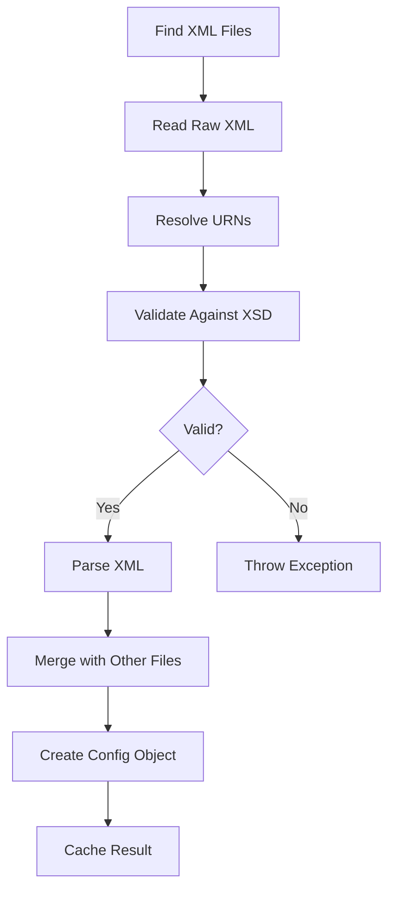
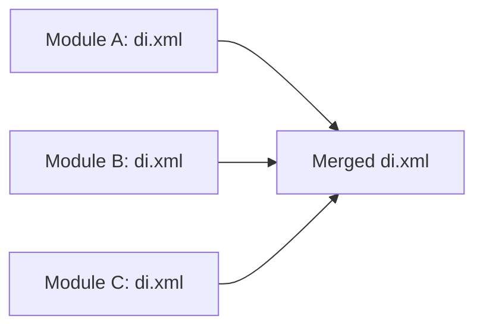

# 📄 XML Configuration System

> الدليل المتقدم لنظام XML في Magento 2

---

## 📑 الفهرس

1. [مقدمة](#1-مقدمة)
2. [XML Processing](#2-xml-processing)
3. [XSD Schemas](#3-xsd-schemas)
4. [URN Resolution](#4-urn-resolution)
5. [XML Merging](#5-xml-merging)
6. [Configuration Types](#6-configuration-types)
7. [كل ملفات XML](#7-كل-ملفات-xml)
8. [تنسيق Custom XML](#8-تنسيق-custom-xml)
9. [Best Practices](#9-best-practices)
10. [Debugging](#10-debugging)

---

## 1. مقدمة

### كيف يستخدم Magento الـ XML؟

Magento يستخدم XML للـ:
- **Configuration** (di.xml, events.xml, routes.xml)
- **Layout** (layout XML files)
- **UI Components** (ui_component XML)
- **Schema Definition** (db_schema.xml)

### مميزات XML في Magento

| الميزة | الوصف |
|--------|-------|
| **Declarative** | بدون كود PHP |
| **Mergeable** | دمج من موديولات متعددة |
| **Validatable** | تحقق عبر XSD |
| **Area-specific** | ملفات مختلفة لكل Area |

---

## 2. XML Processing

### كيف يقرأ Magento ملفات XML



### Classes المسؤولة

```php
// XML Reading
Magento\Framework\Config\Reader\Filesystem

// XML Validation
Magento\Framework\Config\Dom

// URN Resolution
Magento\Framework\Config\Dom\UrnResolver

// Caching
Magento\Framework\App\Config\ConfigCache
```

---

## 3. XSD Schemas

### ما هو XSD؟

**XML Schema Definition** - ملف يُعرّف هيكل الـ XML الصحيح.

### أمثلة على XSD

```xml
<!-- module.xml يستخدم هذا الـ XSD -->
xsi:noNamespaceSchemaLocation="urn:magento:framework:Module/etc/module.xsd"

<!-- di.xml يستخدم هذا الـ XSD -->
xsi:noNamespaceSchemaLocation="urn:magento:framework:ObjectManager/etc/config.xsd"

<!-- routes.xml يستخدم هذا الـ XSD -->
xsi:noNamespaceSchemaLocation="urn:magento:framework:App/etc/routes.xsd"
```

### هيكل XSD

```xml
<?xml version="1.0" encoding="UTF-8"?>
<xs:schema xmlns:xs="http://www.w3.org/2001/XMLSchema">

    <!-- تعريف Root Element -->
    <xs:element name="config">
        <xs:complexType>
            <xs:sequence>
                <xs:element name="module" type="moduleDeclaration" maxOccurs="unbounded"/>
            </xs:sequence>
        </xs:complexType>
    </xs:element>

    <!-- تعريف Type -->
    <xs:complexType name="moduleDeclaration">
        <xs:sequence>
            <xs:element name="sequence" type="sequenceType" minOccurs="0"/>
        </xs:sequence>
        <xs:attribute name="name" type="moduleName" use="required"/>
        <xs:attribute name="setup_version" type="xs:string"/>
    </xs:complexType>

    <!-- تعريف Pattern للاسم -->
    <xs:simpleType name="moduleName">
        <xs:restriction base="xs:string">
            <xs:pattern value="[A-Z][a-zA-Z0-9]*_[A-Z][a-zA-Z0-9]*"/>
        </xs:restriction>
    </xs:simpleType>

</xs:schema>
```

### مواقع XSD Files

```
vendor/magento/framework/
├── Module/etc/module.xsd
├── ObjectManager/etc/config.xsd
├── App/etc/routes.xsd
├── Event/etc/events.xsd
├── View/Layout/etc/page_configuration.xsd
└── Setup/Declaration/Schema/etc/schema.xsd

vendor/magento/module-webapi/etc/webapi.xsd
vendor/magento/module-cron/etc/crontab.xsd
```

---

## 4. URN Resolution

### ما هو URN؟

**Uniform Resource Name** - معرف فريد للـ Schema.

### تحويل URN لمسار

```
URN: urn:magento:framework:Module/etc/module.xsd
              ↓ يتحول إلى ↓
Path: vendor/magento/framework/Module/etc/module.xsd

URN: urn:magento:module:Magento_Catalog:etc/catalog_attributes.xsd
              ↓ يتحول إلى ↓
Path: vendor/magento/module-catalog/etc/catalog_attributes.xsd
```

### URN Patterns

| Pattern | المسار |
|---------|--------|
| `urn:magento:framework:{path}` | `vendor/magento/framework/{path}` |
| `urn:magento:module:{Module}:{path}` | `vendor/magento/module-{module}/{path}` |

### IDE Integration

لجعل PhpStorm يفهم الـ URNs:

```bash
bin/magento dev:urn-catalog:generate .idea/misc.xml
```

---

## 5. XML Merging

### كيف يتم الدمج؟



### قواعد الدمج

| العنصر | السلوك |
|--------|--------|
| **نفس الـ name/id** | الأخير يكسب |
| **عناصر مختلفة** | تُدمج معاً |
| **Child elements** | تُدمج recursively |

### مثال الدمج

```xml
<!-- Module A: di.xml -->
<config>
    <type name="Magento\Catalog\Model\Product">
        <plugin name="plugin_a" type="A\Plugin"/>
    </type>
</config>

<!-- Module B: di.xml -->
<config>
    <type name="Magento\Catalog\Model\Product">
        <plugin name="plugin_b" type="B\Plugin"/>
    </type>
</config>

<!-- النتيجة المدمجة -->
<config>
    <type name="Magento\Catalog\Model\Product">
        <plugin name="plugin_a" type="A\Plugin"/>
        <plugin name="plugin_b" type="B\Plugin"/>
    </type>
</config>
```

### التحكم في الترتيب

في `module.xml`:
```xml
<module name="Vendor_Module">
    <sequence>
        <module name="Magento_Catalog"/>
    </sequence>
</module>
```

---

## 6. Configuration Types

### Global vs Area-specific

```
etc/
├── config.xml           # Global
├── di.xml              # Global
├── events.xml          # Global
│
├── frontend/
│   ├── di.xml          # Frontend only
│   ├── events.xml      # Frontend only
│   └── routes.xml      # Frontend routes
│
├── adminhtml/
│   ├── di.xml          # Admin only
│   ├── events.xml      # Admin only
│   └── routes.xml      # Admin routes
│
├── webapi_rest/
│   └── di.xml          # REST API only
│
├── webapi_soap/
│   └── di.xml          # SOAP API only
│
└── graphql/
    └── di.xml          # GraphQL only
```

### Areas المتاحة

| Area | المسار | الاستخدام |
|------|--------|-----------|
| `global` | `etc/` | الكل |
| `frontend` | `etc/frontend/` | Frontend |
| `adminhtml` | `etc/adminhtml/` | Admin Panel |
| `webapi_rest` | `etc/webapi_rest/` | REST API |
| `webapi_soap` | `etc/webapi_soap/` | SOAP API |
| `graphql` | `etc/graphql/` | GraphQL |
| `crontab` | `etc/crontab/` | Cron Jobs |

---

## 7. كل ملفات XML

### ملفات etc/

| الملف | الوظيفة | XSD |
|-------|---------|-----|
| `module.xml` | تعريف الموديول | `module.xsd` |
| `di.xml` | Dependency Injection | `config.xsd` |
| `events.xml` | Event Observers | `events.xsd` |
| `routes.xml` | URL Routing | `routes.xsd` |
| `acl.xml` | Access Control | `acl.xsd` |
| `config.xml` | Default Values | `config.xsd` |
| `system.xml` | Admin Settings | `system.xsd` |
| `menu.xml` | Admin Menu | `menu.xsd` |
| `crontab.xml` | Cron Jobs | `crontab.xsd` |
| `webapi.xml` | REST/SOAP API | `webapi.xsd` |
| `db_schema.xml` | Database Tables | `schema.xsd` |
| `indexer.xml` | Indexers | `indexer.xsd` |
| `mview.xml` | Materialized Views | `mview.xsd` |
| `email_templates.xml` | Email Templates | `email_templates.xsd` |
| `widget.xml` | Widgets | `widget.xsd` |
| `product_types.xml` | Product Types | `product_types.xsd` |
| `product_options.xml` | Product Options | `product_options.xsd` |

### ملفات view/

| الملف | الوظيفة |
|-------|---------|
| `layout/*.xml` | Page Layout |
| `templates/*.phtml` | PHP Templates |
| `ui_component/*.xml` | UI Components |
| `web/` | Static files |

---

## 8. تنسيق Custom XML

### إنشاء XML Configuration جديد

#### 1. إنشاء XSD Schema

```xml
<!-- etc/custom_config.xsd -->
<?xml version="1.0" encoding="UTF-8"?>
<xs:schema xmlns:xs="http://www.w3.org/2001/XMLSchema">
    <xs:element name="config">
        <xs:complexType>
            <xs:sequence>
                <xs:element name="item" maxOccurs="unbounded">
                    <xs:complexType>
                        <xs:attribute name="id" type="xs:string" use="required"/>
                        <xs:attribute name="class" type="xs:string" use="required"/>
                        <xs:attribute name="disabled" type="xs:boolean" default="false"/>
                    </xs:complexType>
                </xs:element>
            </xs:sequence>
        </xs:complexType>
    </xs:element>
</xs:schema>
```

#### 2. إنشاء Reader

```php
<?php
namespace Vendor\Module\Model\Config;

use Magento\Framework\Config\SchemaLocatorInterface;
use Magento\Framework\Config\Reader\Filesystem;

class Reader extends Filesystem
{
    protected $_idAttributes = [
        '/config/item' => 'id',
    ];

    public function __construct(
        \Magento\Framework\Config\FileResolverInterface $fileResolver,
        \Magento\Framework\Config\ConverterInterface $converter,
        SchemaLocatorInterface $schemaLocator,
        \Magento\Framework\Config\ValidationStateInterface $validationState,
        $fileName = 'custom_config.xml',
        $idAttributes = [],
        $domDocumentClass = \Magento\Framework\Config\Dom::class,
        $defaultScope = 'global'
    ) {
        parent::__construct(
            $fileResolver,
            $converter,
            $schemaLocator,
            $validationState,
            $fileName,
            $idAttributes,
            $domDocumentClass,
            $defaultScope
        );
    }
}
```

#### 3. إنشاء Converter

```php
<?php
namespace Vendor\Module\Model\Config;

use Magento\Framework\Config\ConverterInterface;

class Converter implements ConverterInterface
{
    public function convert($source): array
    {
        $result = [];

        foreach ($source->getElementsByTagName('item') as $item) {
            $id = $item->getAttribute('id');
            $result[$id] = [
                'id' => $id,
                'class' => $item->getAttribute('class'),
                'disabled' => $item->getAttribute('disabled') === 'true',
            ];
        }

        return $result;
    }
}
```

---

## 9. Best Practices

### ✅ دائماً استخدم XSD

```xml
<!-- ✅ صحيح -->
<config xmlns:xsi="http://www.w3.org/2001/XMLSchema-instance"
        xsi:noNamespaceSchemaLocation="urn:magento:framework:...">

<!-- ❌ بدون validation -->
<config>
```

### ✅ استخدم Area-specific files

```
etc/frontend/di.xml  ← للـ Frontend فقط
etc/adminhtml/di.xml ← للـ Admin فقط
```

### ✅ Unique identifiers

```xml
<!-- ✅ فريد -->
<plugin name="vendor_module_product_plugin"/>

<!-- ❌ قد يتعارض -->
<plugin name="product_plugin"/>
```

### ✅ Proper indentation

```xml
<!-- ✅ منسق -->
<type name="ClassName">
    <arguments>
        <argument name="arg" xsi:type="string">value</argument>
    </arguments>
</type>
```

---

## 10. Debugging

### عرض Configuration المدمجة

```bash
# عرض di.xml بعد الدمج
bin/magento dev:di:info "Magento\Catalog\Model\Product"
```

### التحقق من الـ XML

```bash
# Validate XML syntax
xmllint --noout file.xml

# Validate against XSD
xmllint --schema schema.xsd file.xml
```

### Cache

```bash
# مسح config cache
bin/magento cache:clean config

# Flush all
bin/magento cache:flush
```

### Debug في الكود

```php
// عرض merged config
$configData = $this->configReader->read();
var_dump($configData);
```

---

## 📌 ملخص

| العنصر | الوظيفة |
|--------|---------|
| **XSD** | تعريف هيكل XML |
| **URN** | معرف للـ Schema |
| **Merging** | دمج من موديولات متعددة |
| **Areas** | ملفات مختلفة لكل منطقة |
| **Reader** | قراءة ومعالجة XML |
| **Converter** | تحويل XML لـ Array |

---

## ⬅️ [السابق](./15_EAV.md) | [🏠 الرئيسية](../MODULE_STRUCTURE.md)
