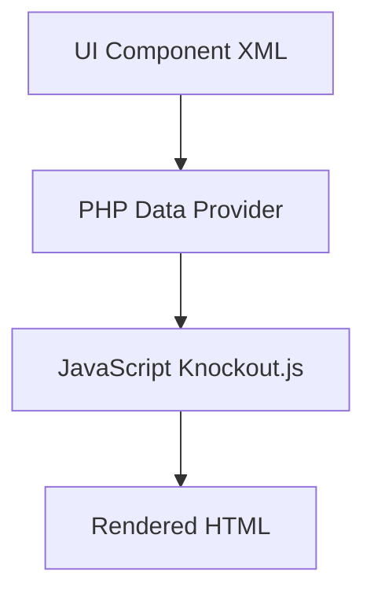

# 🖥️ UI Components

> الدليل الشامل لـ UI Components في Magento 2

---

## 📑 الفهرس

1. [مقدمة](#1-مقدمة)
2. [Listing Component](#2-listing-component)
3. [Form Component](#3-form-component)
4. [Columns](#4-columns)
5. [Actions](#5-actions)
6. [Filters](#6-filters)
7. [Data Providers](#7-data-providers)
8. [Mass Actions](#8-mass-actions)
9. [Best Practices](#9-best-practices)

---

## 1. مقدمة

### ما هي UI Components؟

UI Components هي نظام لبناء واجهات Admin في Magento 2 باستخدام XML و JavaScript.



### أنواع UI Components

| النوع | الاستخدام |
|-------|-----------|
| **Listing** | عرض Grid/جداول |
| **Form** | نماذج الإدخال |
| **Columns** | أعمدة الجدول |
| **Filters** | فلترة البيانات |
| **Actions** | أزرار التحكم |

---

## 2. Listing Component

### الهيكل الأساسي

```
view/adminhtml/ui_component/vendor_module_listing.xml
```

```xml
<?xml version="1.0" encoding="UTF-8"?>
<listing xmlns:xsi="http://www.w3.org/2001/XMLSchema-instance"
         xsi:noNamespaceSchemaLocation="urn:magento:module:Magento_Ui:etc/ui_configuration.xsd">

    <argument name="data" xsi:type="array">
        <item name="js_config" xsi:type="array">
            <item name="provider" xsi:type="string">
                vendor_module_listing.vendor_module_listing_data_source
            </item>
        </item>
    </argument>

    <settings>
        <buttons>
            <button name="add">
                <url path="*/*/new"/>
                <class>primary</class>
                <label translate="true">Add New</label>
            </button>
        </buttons>
        <spinner>vendor_module_columns</spinner>
        <deps>
            <dep>vendor_module_listing.vendor_module_listing_data_source</dep>
        </deps>
    </settings>

    <dataSource name="vendor_module_listing_data_source" component="Magento_Ui/js/grid/provider">
        <settings>
            <storageConfig>
                <param name="indexField" xsi:type="string">entity_id</param>
            </storageConfig>
            <updateUrl path="mui/index/render"/>
        </settings>
        <aclResource>Vendor_Module::entity</aclResource>
        <dataProvider class="Magento\Framework\View\Element\UiComponent\DataProvider\DataProvider"
                      name="vendor_module_listing_data_source">
            <settings>
                <requestFieldName>id</requestFieldName>
                <primaryFieldName>entity_id</primaryFieldName>
            </settings>
        </dataProvider>
    </dataSource>

    <listingToolbar name="listing_top">
        <settings>
            <sticky>true</sticky>
        </settings>
        <bookmark name="bookmarks"/>
        <columnsControls name="columns_controls"/>
        <filterSearch name="fulltext"/>
        <filters name="listing_filters">
            <settings>
                <templates>
                    <filters>
                        <select>
                            <param name="template" xsi:type="string">ui/grid/filters/elements/ui-select</param>
                            <param name="component" xsi:type="string">Magento_Ui/js/form/element/ui-select</param>
                        </select>
                    </filters>
                </templates>
            </settings>
        </filters>
        <massaction name="listing_massaction">
            <action name="delete">
                <settings>
                    <confirm>
                        <message translate="true">Are you sure?</message>
                        <title translate="true">Delete</title>
                    </confirm>
                    <url path="vendor_module/entity/massDelete"/>
                    <type>delete</type>
                    <label translate="true">Delete</label>
                </settings>
            </action>
        </massaction>
        <paging name="listing_paging"/>
    </listingToolbar>

    <columns name="vendor_module_columns">
        <selectionsColumn name="ids">
            <settings>
                <indexField>entity_id</indexField>
            </settings>
        </selectionsColumn>

        <column name="entity_id">
            <settings>
                <filter>textRange</filter>
                <label translate="true">ID</label>
                <sorting>asc</sorting>
            </settings>
        </column>

        <column name="name">
            <settings>
                <filter>text</filter>
                <label translate="true">Name</label>
                <editor>
                    <validation>
                        <rule name="required-entry" xsi:type="boolean">true</rule>
                    </validation>
                    <editorType>text</editorType>
                </editor>
            </settings>
        </column>

        <column name="status" component="Magento_Ui/js/grid/columns/select">
            <settings>
                <filter>select</filter>
                <options class="Vendor\Module\Model\Source\Status"/>
                <dataType>select</dataType>
                <label translate="true">Status</label>
            </settings>
        </column>

        <column name="created_at" class="Magento\Ui\Component\Listing\Columns\Date"
                component="Magento_Ui/js/grid/columns/date">
            <settings>
                <filter>dateRange</filter>
                <label translate="true">Created</label>
            </settings>
        </column>

        <actionsColumn name="actions" class="Vendor\Module\Ui\Component\Listing\Column\Actions">
            <settings>
                <indexField>entity_id</indexField>
            </settings>
        </actionsColumn>
    </columns>
</listing>
```

---

## 3. Form Component

```xml
<?xml version="1.0" encoding="UTF-8"?>
<form xmlns:xsi="http://www.w3.org/2001/XMLSchema-instance"
      xsi:noNamespaceSchemaLocation="urn:magento:module:Magento_Ui:etc/ui_configuration.xsd">

    <argument name="data" xsi:type="array">
        <item name="js_config" xsi:type="array">
            <item name="provider" xsi:type="string">
                vendor_module_form.vendor_module_form_data_source
            </item>
        </item>
        <item name="label" xsi:type="string" translate="true">Entity Information</item>
        <item name="template" xsi:type="string">templates/form/collapsible</item>
    </argument>

    <settings>
        <buttons>
            <button name="save" class="Vendor\Module\Block\Adminhtml\Entity\Edit\SaveButton"/>
            <button name="delete" class="Vendor\Module\Block\Adminhtml\Entity\Edit\DeleteButton"/>
            <button name="back" class="Vendor\Module\Block\Adminhtml\Entity\Edit\BackButton"/>
        </buttons>
        <namespace>vendor_module_form</namespace>
        <dataScope>data</dataScope>
        <deps>
            <dep>vendor_module_form.vendor_module_form_data_source</dep>
        </deps>
    </settings>

    <dataSource name="vendor_module_form_data_source">
        <argument name="data" xsi:type="array">
            <item name="js_config" xsi:type="array">
                <item name="component" xsi:type="string">Magento_Ui/js/form/provider</item>
            </item>
        </argument>
        <settings>
            <submitUrl path="vendor_module/entity/save"/>
        </settings>
        <dataProvider class="Vendor\Module\Model\Entity\DataProvider"
                      name="vendor_module_form_data_source">
            <settings>
                <requestFieldName>id</requestFieldName>
                <primaryFieldName>entity_id</primaryFieldName>
            </settings>
        </dataProvider>
    </dataSource>

    <fieldset name="general">
        <settings>
            <label translate="true">General</label>
        </settings>

        <field name="entity_id" formElement="input">
            <settings>
                <dataType>text</dataType>
                <visible>false</visible>
            </settings>
        </field>

        <field name="name" sortOrder="10" formElement="input">
            <settings>
                <dataType>text</dataType>
                <label translate="true">Name</label>
                <validation>
                    <rule name="required-entry" xsi:type="boolean">true</rule>
                </validation>
            </settings>
        </field>

        <field name="status" sortOrder="20" formElement="select">
            <settings>
                <dataType>int</dataType>
                <label translate="true">Status</label>
            </settings>
            <formElements>
                <select>
                    <settings>
                        <options class="Vendor\Module\Model\Source\Status"/>
                    </settings>
                </select>
            </formElements>
        </field>

        <field name="description" sortOrder="30" formElement="textarea">
            <settings>
                <dataType>text</dataType>
                <label translate="true">Description</label>
                <rows>5</rows>
            </settings>
        </field>

        <field name="image" sortOrder="40" formElement="imageUploader">
            <settings>
                <label translate="true">Image</label>
                <componentType>imageUploader</componentType>
            </settings>
            <formElements>
                <imageUploader>
                    <settings>
                        <uploaderConfig>
                            <param xsi:type="url" name="url" path="vendor_module/entity/upload"/>
                        </uploaderConfig>
                        <previewTmpl>Magento_Catalog/image-preview</previewTmpl>
                    </settings>
                </imageUploader>
            </formElements>
        </field>
    </fieldset>
</form>
```

---

## 4. Columns

### أنواع الأعمدة

| Column Type | الاستخدام |
|-------------|-----------|
| `text` | نص عادي |
| `select` | Dropdown |
| `date` | تاريخ |
| `actions` | أزرار تحكم |
| `thumbnail` | صورة مصغرة |

### Custom Column

```php
<?php
namespace Vendor\Module\Ui\Component\Listing\Column;

use Magento\Ui\Component\Listing\Columns\Column;

class CustomColumn extends Column
{
    public function prepareDataSource(array $dataSource)
    {
        if (isset($dataSource['data']['items'])) {
            foreach ($dataSource['data']['items'] as &$item) {
                $item[$this->getData('name')] = $this->formatValue($item);
            }
        }
        return $dataSource;
    }

    private function formatValue(array $item): string
    {
        return '<span class="custom">' . $item['field_name'] . '</span>';
    }
}
```

---

## 5. Actions

### Actions Column

```php
<?php
namespace Vendor\Module\Ui\Component\Listing\Column;

use Magento\Framework\UrlInterface;
use Magento\Framework\View\Element\UiComponent\ContextInterface;
use Magento\Framework\View\Element\UiComponentFactory;
use Magento\Ui\Component\Listing\Columns\Column;

class Actions extends Column
{
    private const URL_PATH_EDIT = 'vendor_module/entity/edit';
    private const URL_PATH_DELETE = 'vendor_module/entity/delete';

    public function __construct(
        ContextInterface $context,
        UiComponentFactory $uiComponentFactory,
        private UrlInterface $urlBuilder,
        array $components = [],
        array $data = []
    ) {
        parent::__construct($context, $uiComponentFactory, $components, $data);
    }

    public function prepareDataSource(array $dataSource)
    {
        if (isset($dataSource['data']['items'])) {
            foreach ($dataSource['data']['items'] as &$item) {
                if (isset($item['entity_id'])) {
                    $item[$this->getData('name')] = [
                        'edit' => [
                            'href' => $this->urlBuilder->getUrl(
                                self::URL_PATH_EDIT,
                                ['id' => $item['entity_id']]
                            ),
                            'label' => __('Edit')
                        ],
                        'delete' => [
                            'href' => $this->urlBuilder->getUrl(
                                self::URL_PATH_DELETE,
                                ['id' => $item['entity_id']]
                            ),
                            'label' => __('Delete'),
                            'confirm' => [
                                'title' => __('Delete'),
                                'message' => __('Are you sure?')
                            ]
                        ]
                    ];
                }
            }
        }
        return $dataSource;
    }
}
```

---

## 6. Filters

```xml
<filters name="listing_filters">
    <filterSelect name="status" provider="${ $.parentName }">
        <settings>
            <options class="Vendor\Module\Model\Source\Status"/>
            <caption translate="true">Select...</caption>
            <label translate="true">Status</label>
            <dataScope>status</dataScope>
        </settings>
    </filterSelect>
</filters>
```

---

## 7. Data Providers

### Listing Data Provider

```php
<?php
namespace Vendor\Module\Ui\Component\DataProvider;

use Magento\Framework\Api\FilterBuilder;
use Magento\Framework\Api\Search\ReportingInterface;
use Magento\Framework\Api\Search\SearchCriteriaBuilder;
use Magento\Framework\App\RequestInterface;
use Magento\Framework\View\Element\UiComponent\DataProvider\DataProvider;

class ListingDataProvider extends DataProvider
{
    public function getData()
    {
        $data = parent::getData();

        // Custom data manipulation
        foreach ($data['items'] as &$item) {
            $item['custom_field'] = $this->processItem($item);
        }

        return $data;
    }
}
```

### Form Data Provider

```php
<?php
namespace Vendor\Module\Model\Entity;

use Magento\Ui\DataProvider\AbstractDataProvider;
use Vendor\Module\Model\ResourceModel\Entity\CollectionFactory;

class DataProvider extends AbstractDataProvider
{
    private array $loadedData = [];

    public function __construct(
        $name,
        $primaryFieldName,
        $requestFieldName,
        CollectionFactory $collectionFactory,
        array $meta = [],
        array $data = []
    ) {
        parent::__construct($name, $primaryFieldName, $requestFieldName, $meta, $data);
        $this->collection = $collectionFactory->create();
    }

    public function getData(): array
    {
        if (!empty($this->loadedData)) {
            return $this->loadedData;
        }

        $items = $this->collection->getItems();
        foreach ($items as $entity) {
            $this->loadedData[$entity->getId()] = $entity->getData();
        }

        return $this->loadedData;
    }
}
```

---

## 8. Mass Actions

```xml
<massaction name="listing_massaction">
    <action name="delete">
        <settings>
            <confirm>
                <message translate="true">Delete selected items?</message>
                <title translate="true">Delete</title>
            </confirm>
            <url path="vendor_module/entity/massDelete"/>
            <type>delete</type>
            <label translate="true">Delete</label>
        </settings>
    </action>

    <action name="status">
        <settings>
            <type>status</type>
            <label translate="true">Change Status</label>
            <actions>
                <action name="enable">
                    <type>enable</type>
                    <label translate="true">Enable</label>
                    <url path="vendor_module/entity/massStatus">
                        <param name="status">1</param>
                    </url>
                </action>
                <action name="disable">
                    <type>disable</type>
                    <label translate="true">Disable</label>
                    <url path="vendor_module/entity/massStatus">
                        <param name="status">0</param>
                    </url>
                </action>
            </actions>
        </settings>
    </action>
</massaction>
```

---

## 9. Best Practices

### ✅ Use di.xml for Data Source Registration

```xml
<!-- etc/di.xml -->
<type name="Magento\Framework\View\Element\UiComponent\DataProvider\CollectionFactory">
    <arguments>
        <argument name="collections" xsi:type="array">
            <item name="vendor_module_listing_data_source" xsi:type="string">
                Vendor\Module\Model\ResourceModel\Entity\Grid\Collection
            </item>
        </argument>
    </arguments>
</type>
```

### ✅ Grid Collection

```php
<?php
namespace Vendor\Module\Model\ResourceModel\Entity\Grid;

use Magento\Framework\Data\Collection\Db\FetchStrategyInterface;
use Magento\Framework\Data\Collection\EntityFactoryInterface;
use Magento\Framework\Event\ManagerInterface;
use Magento\Framework\View\Element\UiComponent\DataProvider\SearchResult;
use Psr\Log\LoggerInterface;

class Collection extends SearchResult
{
    public function __construct(
        EntityFactoryInterface $entityFactory,
        LoggerInterface $logger,
        FetchStrategyInterface $fetchStrategy,
        ManagerInterface $eventManager,
        $mainTable = 'vendor_module_entity',
        $resourceModel = \Vendor\Module\Model\ResourceModel\Entity::class
    ) {
        parent::__construct(
            $entityFactory,
            $logger,
            $fetchStrategy,
            $eventManager,
            $mainTable,
            $resourceModel
        );
    }
}
```

---

## 📌 ملخص

| المكون | الوظيفة |
|--------|---------|
| **Listing** | عرض Grid |
| **Form** | نماذج Edit/New |
| **DataProvider** | توفير البيانات |
| **Columns** | تعريف الأعمدة |
| **Actions** | أزرار التحكم |
| **MassActions** | عمليات جماعية |

---

## ⬅️ [السابق](./16_XML_CONFIGURATION.md) | [🏠 الرئيسية](../MODULE_STRUCTURE.md) | [التالي ➡️](./18_INDEXERS.md)
