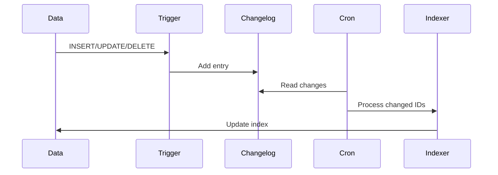

# 📊 Indexers

> الدليل الشامل لـ Indexers في Magento 2

---

## 📑 الفهرس

1. [مقدمة](#1-مقدمة)
2. [Indexers الموجودة](#2-indexers-الموجودة)
3. [أوضاع التشغيل](#3-أوضاع-التشغيل)
4. [إنشاء Custom Indexer](#4-إنشاء-custom-indexer)
5. [MView](#5-mview)
6. [CLI Commands](#6-cli-commands)
7. [Best Practices](#7-best-practices)

---

## 1. مقدمة

### ما هو الـ Indexer؟

الـ Indexer يقوم بتحويل البيانات من الشكل المُعقد (EAV) إلى شكل مُسطح (Flat) للأداء الأفضل.


### لماذا نحتاج Indexers؟

| بدون Indexing | مع Indexing |
|---------------|-------------|
| Queries معقدة | Queries بسيطة |
| بطيء جداً | سريع جداً |
| JOINs كثيرة | جدول واحد |

---

## 2. Indexers الموجودة

### Core Indexers

| Indexer | الوظيفة | الجدول |
|---------|---------|--------|
| `catalog_product_flat` | Flat products | `catalog_product_flat_*` |
| `catalog_category_flat` | Flat categories | `catalog_category_flat_store_*` |
| `catalog_product_price` | Product prices | `catalog_product_index_price` |
| `cataloginventory_stock` | Stock data | `cataloginventory_stock_status` |
| `catalogsearch_fulltext` | Search index | `catalogsearch_fulltext_scope*` |
| `catalog_category_product` | Category-Product | `catalog_category_product_index` |
| `catalog_product_attribute` | Layered navigation | `catalog_product_index_eav` |
| `catalogrule_rule` | Catalog rules | `catalogrule_product` |
| `catalogrule_product` | Rule products | `catalogrule_product_price` |

### عرض حالة الـ Indexers

```bash
bin/magento indexer:status
```

---

## 3. أوضاع التشغيل

### Update on Save

يتم الـ Reindex مباشرة بعد حفظ البيانات.

```bash
bin/magento indexer:set-mode realtime catalog_product_price
```

### Update by Schedule

يتم الـ Reindex عبر Cron Job دورياً.

```bash
bin/magento indexer:set-mode schedule catalog_product_price
```

### Changelog (MView)



---

## 4. إنشاء Custom Indexer

### هيكل الملفات

```
app/code/Vendor/Module/
├── etc/
│   ├── indexer.xml
│   └── mview.xml
├── Model/
│   └── Indexer/
│       └── CustomIndexer.php
└── Setup/
    └── Patch/
        └── Schema/
            └── CreateIndexTable.php
```

### indexer.xml

```xml
<?xml version="1.0"?>
<config xmlns:xsi="http://www.w3.org/2001/XMLSchema-instance"
        xsi:noNamespaceSchemaLocation="urn:magento:framework:Indexer/etc/indexer.xsd">

    <indexer id="vendor_module_custom"
             view_id="vendor_module_custom"
             class="Vendor\Module\Model\Indexer\CustomIndexer">
        <title translate="true">Custom Indexer</title>
        <description translate="true">Indexes custom entity data</description>
    </indexer>
</config>
```

### mview.xml

```xml
<?xml version="1.0"?>
<config xmlns:xsi="http://www.w3.org/2001/XMLSchema-instance"
        xsi:noNamespaceSchemaLocation="urn:magento:framework:Mview/etc/mview.xsd">

    <view id="vendor_module_custom"
          class="Vendor\Module\Model\Indexer\CustomIndexer"
          group="indexer">
        <subscriptions>
            <table name="vendor_module_entity" entity_column="entity_id"/>
        </subscriptions>
    </view>
</config>
```

### Indexer Class

```php
<?php
declare(strict_types=1);

namespace Vendor\Module\Model\Indexer;

use Magento\Framework\Indexer\ActionInterface as IndexerActionInterface;
use Magento\Framework\Mview\ActionInterface as MviewActionInterface;
use Psr\Log\LoggerInterface;

class CustomIndexer implements IndexerActionInterface, MviewActionInterface
{
    public function __construct(
        private LoggerInterface $logger,
        private IndexBuilder $indexBuilder
    ) {}

    /**
     * Execute full reindex
     */
    public function executeFull(): void
    {
        $this->logger->info('Starting full reindex');
        $this->indexBuilder->reindexAll();
        $this->logger->info('Full reindex completed');
    }

    /**
     * Execute partial reindex by ID list
     */
    public function executeList(array $ids): void
    {
        $this->logger->info('Reindexing IDs: ' . implode(',', $ids));
        $this->indexBuilder->reindexByIds($ids);
    }

    /**
     * Execute partial reindex by ID
     */
    public function executeRow($id): void
    {
        $this->executeList([$id]);
    }

    /**
     * Execute materialized view update
     */
    public function execute($ids): void
    {
        $this->executeList($ids);
    }
}
```

### Index Builder

```php
<?php
namespace Vendor\Module\Model\Indexer;

use Magento\Framework\App\ResourceConnection;
use Vendor\Module\Model\ResourceModel\Entity\CollectionFactory;

class IndexBuilder
{
    public function __construct(
        private ResourceConnection $resourceConnection,
        private CollectionFactory $collectionFactory
    ) {}

    public function reindexAll(): void
    {
        $connection = $this->resourceConnection->getConnection();
        $indexTable = $this->resourceConnection->getTableName('vendor_module_entity_index');

        // Clear index
        $connection->truncateTable($indexTable);

        // Rebuild
        $collection = $this->collectionFactory->create();
        foreach ($collection as $entity) {
            $this->insertIndexData($entity);
        }
    }

    public function reindexByIds(array $ids): void
    {
        $connection = $this->resourceConnection->getConnection();
        $indexTable = $this->resourceConnection->getTableName('vendor_module_entity_index');

        // Delete old entries
        $connection->delete($indexTable, ['entity_id IN (?)' => $ids]);

        // Rebuild for specific IDs
        $collection = $this->collectionFactory->create();
        $collection->addFieldToFilter('entity_id', ['in' => $ids]);

        foreach ($collection as $entity) {
            $this->insertIndexData($entity);
        }
    }

    private function insertIndexData($entity): void
    {
        $connection = $this->resourceConnection->getConnection();
        $indexTable = $this->resourceConnection->getTableName('vendor_module_entity_index');

        $connection->insert($indexTable, [
            'entity_id' => $entity->getId(),
            'name' => $entity->getName(),
            'status' => $entity->getStatus(),
            'indexed_at' => date('Y-m-d H:i:s')
        ]);
    }
}
```

---

## 5. MView

### ما هو MView؟

**Materialized View** - نظام يتتبع التغييرات عبر Triggers ويحفظها في Changelog.

### Changelog Table

```sql
-- يتم إنشاؤها تلقائياً
SELECT * FROM vendor_module_custom_cl;
-- version_id | entity_id
-- 1          | 5
-- 2          | 12
```

### Subscriptions

```xml
<subscriptions>
    <!-- Main table -->
    <table name="vendor_module_entity" entity_column="entity_id"/>

    <!-- Related tables -->
    <table name="vendor_module_entity_varchar" entity_column="entity_id"/>
    <table name="vendor_module_entity_int" entity_column="entity_id"/>
</subscriptions>
```

---

## 6. CLI Commands

### عرض الحالة

```bash
# عرض حالة جميع الـ Indexers
bin/magento indexer:status

# عرض حالة indexer معين
bin/magento indexer:status vendor_module_custom
```

### Reindex

```bash
# Reindex الكل
bin/magento indexer:reindex

# Reindex واحد
bin/magento indexer:reindex vendor_module_custom

# Reindex متعددة
bin/magento indexer:reindex catalog_product_price cataloginventory_stock
```

### تغيير الوضع

```bash
# عرض الوضع الحالي
bin/magento indexer:show-mode

# تغيير للـ Schedule
bin/magento indexer:set-mode schedule

# تغيير للـ Realtime
bin/magento indexer:set-mode realtime catalog_product_price
```

### Reset

```bash
# إعادة تعيين indexer (يحتاج reindex)
bin/magento indexer:reset vendor_module_custom
```

---

## 7. Best Practices

### ✅ استخدم Schedule في Production

```bash
bin/magento indexer:set-mode schedule
```

### ✅ Batch Processing

```php
public function reindexAll(): void
{
    $batchSize = 1000;
    $lastId = 0;

    while (true) {
        $collection = $this->collectionFactory->create();
        $collection->addFieldToFilter('entity_id', ['gt' => $lastId]);
        $collection->setPageSize($batchSize);

        if ($collection->count() === 0) {
            break;
        }

        foreach ($collection as $entity) {
            $this->insertIndexData($entity);
            $lastId = $entity->getId();
        }
    }
}
```

### ✅ Invalidation

```php
use Magento\Framework\Indexer\IndexerRegistry;

class MyClass
{
    public function __construct(
        private IndexerRegistry $indexerRegistry
    ) {}

    public function invalidateIndex(): void
    {
        $indexer = $this->indexerRegistry->get('vendor_module_custom');
        $indexer->invalidate();
    }
}
```

---

## 📌 ملخص

| المكون | الوظيفة |
|--------|---------|
| **indexer.xml** | تعريف الـ Indexer |
| **mview.xml** | تعريف الـ Subscriptions |
| **Indexer Class** | منطق الـ Indexing |
| **Changelog** | تتبع التغييرات |
| **Schedule** | وضع الـ Cron |
| **Realtime** | وضع الفوري |

---

## ⬅️ [السابق](./17_UI_COMPONENTS.md) | [🏠 الرئيسية](../MODULE_STRUCTURE.md) | [التالي ➡️](./19_CACHING.md)
