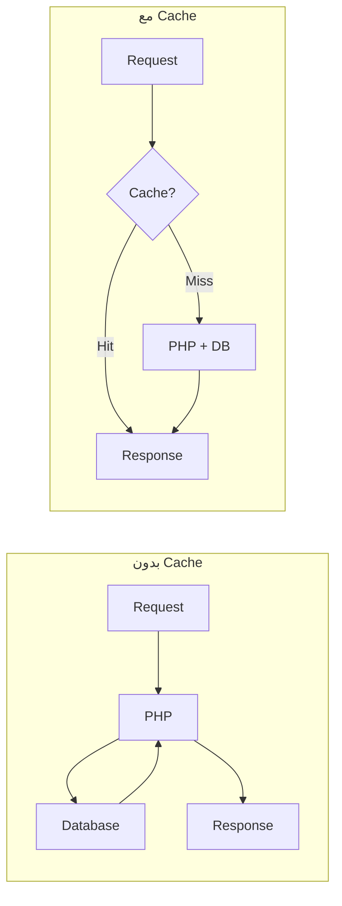

# 🗄️ Caching

> الدليل الشامل لنظام الـ Cache في Magento 2

---

## 📑 الفهرس

1. [مقدمة](#1-مقدمة)
2. [Cache Types](#2-cache-types)
3. [Cache Backends](#3-cache-backends)
4. [Full Page Cache](#4-full-page-cache)
5. [Cache في الكود](#5-cache-في-الكود)
6. [Cache Tags](#6-cache-tags)
7. [Varnish](#7-varnish)
8. [CLI Commands](#8-cli-commands)
9. [Best Practices](#9-best-practices)

---

## 1. مقدمة

### لماذا الـ Caching؟



---

## 2. Cache Types

### أنواع الـ Cache

| Type | الوصف | يُستخدم لـ |
|------|-------|-----------|
| `config` | Configuration | di.xml, events.xml |
| `layout` | Layout files | XML layouts |
| `block_html` | Block output | Rendered blocks |
| `collections` | Collections data | DB collections |
| `db_ddl` | Database schema | Table metadata |
| `eav` | EAV attributes | Attribute metadata |
| `full_page` | Full Page Cache | Complete pages |
| `reflection` | Reflection | Class reflection |
| `translate` | Translations | i18n |
| `config_integration` | Integration config | API integrations |
| `config_integration_api` | API config | WebAPI config |
| `config_webservice` | Web services | SOAP/REST |

### عرض حالة الـ Cache

```bash
bin/magento cache:status
```

---

## 3. Cache Backends

### File (Default)

```php
// env.php
'cache' => [
    'frontend' => [
        'default' => [
            'backend' => 'Magento\Framework\Cache\Backend\File',
            'backend_options' => [
                'cache_dir' => 'cache'
            ]
        ]
    ]
]
```

### Redis

```php
'cache' => [
    'frontend' => [
        'default' => [
            'backend' => 'Magento\Framework\Cache\Backend\Redis',
            'backend_options' => [
                'server' => '127.0.0.1',
                'port' => '6379',
                'database' => '0',
                'password' => '',
                'compress_data' => '1'
            ]
        ],
        'page_cache' => [
            'backend' => 'Magento\Framework\Cache\Backend\Redis',
            'backend_options' => [
                'server' => '127.0.0.1',
                'port' => '6379',
                'database' => '1',
                'password' => '',
                'compress_data' => '1'
            ]
        ]
    ]
]
```

---

## 4. Full Page Cache

### تفعيل FPC

```bash
bin/magento cache:enable full_page
```

### Non-cacheable Blocks

```xml
<!-- layout XML -->
<block class="Vendor\Module\Block\Dynamic" name="dynamic.block" cacheable="false"/>
```

### Private Content (Customer-specific)

```javascript
// view/frontend/web/js/customer-data.js
define(['jquery', 'Magento_Customer/js/customer-data'], function ($, customerData) {
    'use strict';

    return function (config, element) {
        var sections = ['cart', 'customer'];
        customerData.reload(sections);
    };
});
```

```xml
<!-- etc/frontend/sections.xml -->
<config xmlns:xsi="http://www.w3.org/2001/XMLSchema-instance"
        xsi:noNamespaceSchemaLocation="urn:magento:module:Magento_Customer:etc/sections.xsd">
    <action name="vendor_module/cart/add">
        <section name="cart"/>
    </action>
</config>
```

---

## 5. Cache في الكود

### استخدام الـ Cache

```php
<?php
namespace Vendor\Module\Model;

use Magento\Framework\App\CacheInterface;
use Magento\Framework\Serialize\SerializerInterface;

class DataProvider
{
    private const CACHE_KEY_PREFIX = 'VENDOR_MODULE_';
    private const CACHE_LIFETIME = 3600;
    private const CACHE_TAG = 'vendor_module_data';

    public function __construct(
        private CacheInterface $cache,
        private SerializerInterface $serializer
    ) {}

    public function getData(int $id): array
    {
        $cacheKey = self::CACHE_KEY_PREFIX . $id;

        // Try to load from cache
        $cached = $this->cache->load($cacheKey);
        if ($cached) {
            return $this->serializer->unserialize($cached);
        }

        // Load from database
        $data = $this->loadFromDatabase($id);

        // Save to cache
        $this->cache->save(
            $this->serializer->serialize($data),
            $cacheKey,
            [self::CACHE_TAG],
            self::CACHE_LIFETIME
        );

        return $data;
    }

    public function invalidate(int $id): void
    {
        $cacheKey = self::CACHE_KEY_PREFIX . $id;
        $this->cache->remove($cacheKey);
    }

    public function invalidateAll(): void
    {
        $this->cache->clean([self::CACHE_TAG]);
    }
}
```

### Custom Cache Type

```php
<?php
// Model/Cache/Type/CustomCache.php
namespace Vendor\Module\Model\Cache\Type;

use Magento\Framework\App\Cache\Type\FrontendPool;
use Magento\Framework\Cache\Frontend\Decorator\TagScope;

class CustomCache extends TagScope
{
    public const TYPE_IDENTIFIER = 'vendor_module_cache';
    public const CACHE_TAG = 'VENDOR_MODULE';

    public function __construct(FrontendPool $cacheFrontendPool)
    {
        parent::__construct(
            $cacheFrontendPool->get(self::TYPE_IDENTIFIER),
            self::CACHE_TAG
        );
    }
}
```

```xml
<!-- etc/cache.xml -->
<?xml version="1.0"?>
<config xmlns:xsi="http://www.w3.org/2001/XMLSchema-instance"
        xsi:noNamespaceSchemaLocation="urn:magento:framework:Cache/etc/cache.xsd">
    <type name="vendor_module_cache"
          translate="label,description"
          instance="Vendor\Module\Model\Cache\Type\CustomCache">
        <label>Vendor Module Cache</label>
        <description>Custom cache for vendor module data</description>
    </type>
</config>
```

---

## 6. Cache Tags

### استخدام Tags للـ Invalidation

```php
// عند الحفظ
$this->cache->save(
    $data,
    'unique_key',
    ['tag_product_1', 'tag_category_5', 'vendor_module']
);

// مسح كل ما يرتبط بـ Product ID 1
$this->cache->clean(['tag_product_1']);
```

### Block Cache Tags

```php
<?php
namespace Vendor\Module\Block;

use Magento\Framework\View\Element\Template;
use Magento\Framework\DataObject\IdentityInterface;

class CustomBlock extends Template implements IdentityInterface
{
    public function getIdentities(): array
    {
        return ['vendor_module_entity_' . $this->getEntityId()];
    }

    protected function getCacheLifetime(): int
    {
        return 3600;
    }

    protected function getCacheKey(): string
    {
        return 'vendor_module_block_' . $this->getEntityId();
    }

    protected function getCacheTags(): array
    {
        return ['vendor_module_entity'];
    }
}
```

---

## 7. Varnish

### تفعيل Varnish

```bash
bin/magento config:set system/full_page_cache/caching_application 2
```

### VCL Configuration

```vcl
# varnish.vcl (generated by Magento)
vcl 4.0;

backend default {
    .host = "127.0.0.1";
    .port = "8080";
}

sub vcl_recv {
    if (req.method != "GET" && req.method != "HEAD") {
        return (pass);
    }

    # Skip cache for admin
    if (req.url ~ "^/admin") {
        return (pass);
    }
}

sub vcl_backend_response {
    # Cache HTML for 1 hour
    if (beresp.http.content-type ~ "text/html") {
        set beresp.ttl = 1h;
    }
}
```

### Purge Cache

```php
use Magento\CacheInvalidate\Model\PurgeCache;

class MyClass
{
    public function __construct(
        private PurgeCache $purgeCache
    ) {}

    public function purge(array $tags): void
    {
        $this->purgeCache->sendPurgeRequest($tags);
    }
}
```

---

## 8. CLI Commands

### إدارة الـ Cache

```bash
# عرض الحالة
bin/magento cache:status

# تفعيل
bin/magento cache:enable config layout block_html

# تعطيل
bin/magento cache:disable full_page

# مسح
bin/magento cache:clean

# Flush (مسح كامل)
bin/magento cache:flush

# مسح نوع معين
bin/magento cache:clean config
```

---

## 9. Best Practices

### ✅ استخدم Redis في Production

```php
'cache' => [
    'frontend' => [
        'default' => [
            'backend' => 'Magento\Framework\Cache\Backend\Redis'
        ]
    ]
]
```

### ✅ استخدم Cache Tags

```php
$this->cache->save($data, $key, ['specific_tags']);
```

### ✅ تحديد Cache Lifetime

```php
protected function getCacheLifetime(): int
{
    return 3600; // 1 hour
}
```

### ✅ Implement IdentityInterface

```php
class MyBlock extends Template implements IdentityInterface
{
    public function getIdentities(): array
    {
        return ['my_entity_' . $this->getId()];
    }
}
```

---

## 📌 ملخص

| المكون | الوظيفة |
|--------|---------|
| **Cache Types** | أنواع البيانات المُخزنة |
| **Backend** | File/Redis/Varnish |
| **FPC** | Cache للصفحات الكاملة |
| **Tags** | للـ Invalidation |
| **IdentityInterface** | للـ Block caching |

---

## ⬅️ [السابق](./18_INDEXERS.md) | [🏠 الرئيسية](../MODULE_STRUCTURE.md) | [التالي ➡️](./20_ACL_SECURITY.md)
