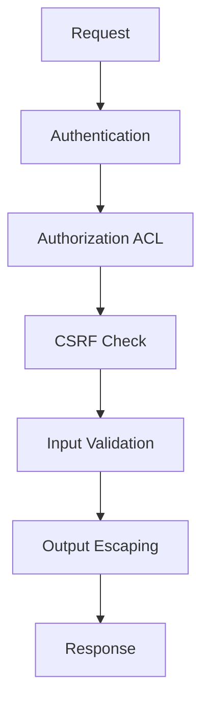

# 🔐 ACL و Security

> الدليل الشامل للأمان والصلاحيات في Magento 2

---

## 📑 الفهرس

1. [مقدمة](#1-مقدمة)
2. [ACL Resources](#2-acl-resources)
3. [Admin Controllers](#3-admin-controllers)
4. [API Security](#4-api-security)
5. [CSRF Protection](#5-csrf-protection)
6. [XSS Prevention](#6-xss-prevention)
7. [SQL Injection](#7-sql-injection)
8. [Secure Coding](#8-secure-coding)
9. [Best Practices](#9-best-practices)

---

## 1. مقدمة

### طبقات الأمان في Magento



---

## 2. ACL Resources

### تعريف الصلاحيات

```xml
<!-- etc/acl.xml -->
<?xml version="1.0"?>
<config xmlns:xsi="http://www.w3.org/2001/XMLSchema-instance"
        xsi:noNamespaceSchemaLocation="urn:magento:framework:Acl/etc/acl.xsd">
    <acl>
        <resources>
            <resource id="Magento_Backend::admin">
                <resource id="Vendor_Module::main" title="Vendor Module" sortOrder="100">
                    <resource id="Vendor_Module::entity" title="Manage Entities" sortOrder="10">
                        <resource id="Vendor_Module::entity_view" title="View" sortOrder="10"/>
                        <resource id="Vendor_Module::entity_save" title="Save" sortOrder="20"/>
                        <resource id="Vendor_Module::entity_delete" title="Delete" sortOrder="30"/>
                    </resource>
                    <resource id="Vendor_Module::config" title="Configuration" sortOrder="20"/>
                </resource>
            </resource>
        </resources>
    </acl>
</config>
```

### التحقق من الصلاحيات

```php
use Magento\Framework\AuthorizationInterface;

class MyClass
{
    public function __construct(
        private AuthorizationInterface $authorization
    ) {}

    public function canView(): bool
    {
        return $this->authorization->isAllowed('Vendor_Module::entity_view');
    }

    public function canSave(): bool
    {
        return $this->authorization->isAllowed('Vendor_Module::entity_save');
    }
}
```

---

## 3. Admin Controllers

### Controller مع ACL

```php
<?php
declare(strict_types=1);

namespace Vendor\Module\Controller\Adminhtml\Entity;

use Magento\Backend\App\Action;
use Magento\Backend\App\Action\Context;
use Magento\Framework\View\Result\PageFactory;

class Index extends Action
{
    /**
     * ACL Resource
     */
    public const ADMIN_RESOURCE = 'Vendor_Module::entity_view';

    public function __construct(
        Context $context,
        private PageFactory $pageFactory
    ) {
        parent::__construct($context);
    }

    public function execute()
    {
        $resultPage = $this->pageFactory->create();
        $resultPage->setActiveMenu('Vendor_Module::entity');
        $resultPage->getConfig()->getTitle()->prepend(__('Entities'));
        return $resultPage;
    }
}
```

### Save Controller

```php
<?php
namespace Vendor\Module\Controller\Adminhtml\Entity;

use Magento\Backend\App\Action;
use Magento\Framework\App\Action\HttpPostActionInterface;

class Save extends Action implements HttpPostActionInterface
{
    public const ADMIN_RESOURCE = 'Vendor_Module::entity_save';

    public function execute()
    {
        $data = $this->getRequest()->getPostValue();

        if (!$this->_formKeyValidator->validate($this->getRequest())) {
            $this->messageManager->addErrorMessage(__('Invalid form key'));
            return $this->resultRedirectFactory->create()->setPath('*/*/');
        }

        try {
            // Save logic
            $this->messageManager->addSuccessMessage(__('Saved successfully'));
        } catch (\Exception $e) {
            $this->messageManager->addErrorMessage($e->getMessage());
        }

        return $this->resultRedirectFactory->create()->setPath('*/*/');
    }
}
```

---

## 4. API Security

### webapi.xml مع ACL

```xml
<?xml version="1.0"?>
<routes xmlns:xsi="http://www.w3.org/2001/XMLSchema-instance"
        xsi:noNamespaceSchemaLocation="urn:magento:module:Magento_Webapi:etc/webapi.xsd">

    <!-- Admin access required -->
    <route url="/V1/vendor-module/entities" method="GET">
        <service class="Vendor\Module\Api\EntityRepositoryInterface" method="getList"/>
        <resources>
            <resource ref="Vendor_Module::entity_view"/>
        </resources>
    </route>

    <!-- Customer self-service -->
    <route url="/V1/vendor-module/my-entities" method="GET">
        <service class="Vendor\Module\Api\CustomerEntityInterface" method="getMyEntities"/>
        <resources>
            <resource ref="self"/>
        </resources>
    </route>

    <!-- Anonymous access -->
    <route url="/V1/vendor-module/public" method="GET">
        <service class="Vendor\Module\Api\PublicInterface" method="getData"/>
        <resources>
            <resource ref="anonymous"/>
        </resources>
    </route>
</routes>
```

### Authentication Types

| Type | Usage | Token Source |
|------|-------|--------------|
| `Admin Token` | Admin API | `/V1/integration/admin/token` |
| `Customer Token` | Customer API | `/V1/integration/customer/token` |
| `Integration Token` | Integrations | Admin > System > Integrations |
| `OAuth` | Third-party | OAuth 1.0a |

---

## 5. CSRF Protection

### Form Key Validation

```php
// In Controller
if (!$this->_formKeyValidator->validate($this->getRequest())) {
    throw new \Magento\Framework\Exception\LocalizedException(
        __('Invalid form key. Please refresh the page.')
    );
}
```

### في الـ Template

```php
<!-- Template -->
<form action="<?= $block->getUrl('*/*/save') ?>" method="post">
    <?= $block->getBlockHtml('formkey') ?>
    <!-- form fields -->
</form>
```

### JavaScript AJAX

```javascript
require(['jquery', 'mage/cookies'], function ($) {
    $.ajax({
        url: '/vendor_module/entity/save',
        type: 'POST',
        data: {
            form_key: $.mage.cookies.get('form_key'),
            name: 'value'
        }
    });
});
```

---

## 6. XSS Prevention

### Escaping Methods

```php
// في الـ Template
<?= $block->escapeHtml($value) ?>                    // HTML content
<?= $block->escapeHtmlAttr($value) ?>               // HTML attributes
<?= $block->escapeUrl($url) ?>                       // URLs
<?= $block->escapeJs($value) ?>                      // JavaScript
<?= $block->escapeCss($value) ?>                     // CSS values
<?= /* @noEscape */ $block->getChildHtml() ?>        // Safe HTML
```

### Examples

```php
<!-- ✅ صحيح -->
<div class="<?= $block->escapeHtmlAttr($className) ?>">
    <?= $block->escapeHtml($content) ?>
</div>
<a href="<?= $block->escapeUrl($url) ?>">Link</a>

<!-- ❌ خطر - XSS -->
<div class="<?= $className ?>">
    <?= $content ?>
</div>
```

### When NOT to Escape

```php
<!-- HTML المُولّد من Magento آمن -->
<?= /* @noEscape */ $block->getChildHtml('child.block') ?>
<?= /* @noEscape */ $block->getLayout()->renderElement('element') ?>
```

---

## 7. SQL Injection

### ✅ الطريقة الآمنة

```php
// Using Bindings
$connection->select()
    ->from('table')
    ->where('id = ?', $id)
    ->where('status IN (?)', $statuses);

// Using Collections
$collection->addFieldToFilter('id', $id);
$collection->addFieldToFilter('status', ['in' => $statuses]);

// Using Repository
$searchCriteria = $this->searchCriteriaBuilder
    ->addFilter('id', $id)
    ->create();
```

### ❌ الطريقة الخطرة

```php
// NEVER DO THIS
$connection->query("SELECT * FROM table WHERE id = $id");
$collection->getSelect()->where("id = $id");
```

---

## 8. Secure Coding

### Input Validation

```php
use Magento\Framework\Validator\ValidatorChain;

class DataValidator
{
    public function validate(array $data): array
    {
        $errors = [];

        if (empty($data['name'])) {
            $errors[] = __('Name is required');
        }

        if (!filter_var($data['email'], FILTER_VALIDATE_EMAIL)) {
            $errors[] = __('Invalid email format');
        }

        if (!is_numeric($data['quantity']) || $data['quantity'] < 0) {
            $errors[] = __('Quantity must be a positive number');
        }

        return $errors;
    }
}
```

### Secure File Upload

```php
use Magento\Framework\File\UploaderFactory;

class FileUploader
{
    public function upload(array $fileInput): string
    {
        $uploader = $this->uploaderFactory->create(['fileId' => $fileInput]);

        // Allowed extensions
        $uploader->setAllowedExtensions(['jpg', 'jpeg', 'png', 'gif']);

        // Rename if exists
        $uploader->setAllowRenameFiles(true);

        // Disable PHP execution
        $uploader->setFilesDispersion(true);

        // Validate MIME type
        $uploader->addValidateCallback('validate_image', $this, 'validateImage');

        $result = $uploader->save($this->getMediaPath());
        return $result['file'];
    }
}
```

---

## 9. Best Practices

### ✅ Always Define ACL

```xml
<resource id="Vendor_Module::entity_view" title="View Entities"/>
```

### ✅ Use ADMIN_RESOURCE

```php
public const ADMIN_RESOURCE = 'Vendor_Module::entity_view';
```

### ✅ Validate Form Key

```php
if (!$this->_formKeyValidator->validate($this->getRequest())) {
    // Handle invalid request
}
```

### ✅ Escape All Output

```php
<?= $block->escapeHtml($data) ?>
```

### ✅ Use Bindings for SQL

```php
$connection->select()->where('id = ?', $id);
```

### ✅ Validate Input

```php
if (!is_numeric($id) || $id <= 0) {
    throw new InputException(__('Invalid ID'));
}
```

---

## 📌 ملخص

| المكون | الوظيفة |
|--------|---------|
| **ACL** | تعريف الصلاحيات |
| **ADMIN_RESOURCE** | ربط Controller بـ ACL |
| **Form Key** | حماية CSRF |
| **Escaping** | منع XSS |
| **Bindings** | منع SQL Injection |
| **Validation** | التحقق من المدخلات |

---

## ⬅️ [السابق](./19_CACHING.md) | [🏠 الرئيسية](../MODULE_STRUCTURE.md) | [التالي ➡️](./21_TESTING.md)
