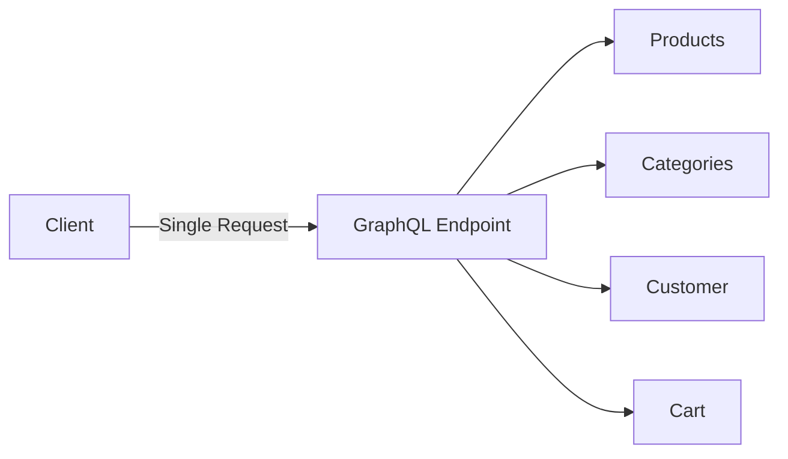

# 🔷 GraphQL

> الدليل الشامل لـ GraphQL في Magento 2

---

## 📑 الفهرس

1. [مقدمة](#1-مقدمة)
2. [GraphQL vs REST](#2-graphql-vs-rest)
3. [Schema Definition](#3-schema-definition)
4. [Queries](#4-queries)
5. [Mutations](#5-mutations)
6. [Resolvers](#6-resolvers)
7. [Types و Interfaces](#7-types-و-interfaces)
8. [Authentication](#8-authentication)
9. [Best Practices](#9-best-practices)

---

## 1. مقدمة

### ما هو GraphQL؟

GraphQL هو لغة استعلام للـ APIs تسمح للعميل بطلب البيانات التي يحتاجها فقط.



### مميزات GraphQL

| الميزة | الوصف |
|--------|-------|
| **Single Endpoint** | `/graphql` فقط |
| **No Over-fetching** | تحصل على ما تطلبه فقط |
| **Typed Schema** | Schema واضح ومُوثق |
| **Introspection** | استكشاف الـ API تلقائياً |

---

## 2. GraphQL vs REST

| الميزة | REST | GraphQL |
|--------|------|---------|
| **Endpoints** | متعددة | واحد `/graphql` |
| **Data Fetching** | Fixed response | Flexible |
| **Versioning** | v1, v2, v3 | لا حاجة |
| **Documentation** | Manual | Auto-generated |

```bash
# REST - Multiple requests
GET /products/1
GET /products/1/reviews
GET /products/1/related

# GraphQL - Single request
POST /graphql
{
  product(id: 1) {
    name
    reviews { text }
    related { name }
  }
}
```

---

## 3. Schema Definition

### هيكل الملفات

```
app/code/Vendor/Module/
├── etc/
│   └── schema.graphqls
└── Model/
    └── Resolver/
        ├── EntityResolver.php
        └── EntitiesResolver.php
```

### schema.graphqls

```graphql
# etc/schema.graphqls

# Extend Query type
type Query {
    vendorModuleEntity(
        id: Int! @doc(description: "Entity ID")
    ): VendorModuleEntity @resolver(class: "Vendor\\Module\\Model\\Resolver\\Entity") @doc(description: "Get entity by ID")

    vendorModuleEntities(
        filter: VendorModuleEntityFilterInput @doc(description: "Filter")
        pageSize: Int = 20 @doc(description: "Page size")
        currentPage: Int = 1 @doc(description: "Current page")
        sort: VendorModuleEntitySortInput @doc(description: "Sort")
    ): VendorModuleEntities @resolver(class: "Vendor\\Module\\Model\\Resolver\\Entities") @doc(description: "Get entities list")
}

# Extend Mutation type
type Mutation {
    createVendorModuleEntity(
        input: VendorModuleEntityInput!
    ): VendorModuleEntity @resolver(class: "Vendor\\Module\\Model\\Resolver\\CreateEntity") @doc(description: "Create entity")

    updateVendorModuleEntity(
        id: Int!
        input: VendorModuleEntityInput!
    ): VendorModuleEntity @resolver(class: "Vendor\\Module\\Model\\Resolver\\UpdateEntity") @doc(description: "Update entity")

    deleteVendorModuleEntity(
        id: Int!
    ): Boolean @resolver(class: "Vendor\\Module\\Model\\Resolver\\DeleteEntity") @doc(description: "Delete entity")
}

# Custom Types
type VendorModuleEntity @doc(description: "Entity Type") {
    entity_id: Int @doc(description: "Entity ID")
    name: String @doc(description: "Name")
    description: String @doc(description: "Description")
    status: Int @doc(description: "Status")
    created_at: String @doc(description: "Created Date")
    updated_at: String @doc(description: "Updated Date")
}

type VendorModuleEntities @doc(description: "Entities Result") {
    items: [VendorModuleEntity] @doc(description: "List of entities")
    total_count: Int @doc(description: "Total count")
    page_info: SearchResultPageInfo @doc(description: "Page info")
}

# Input Types
input VendorModuleEntityInput @doc(description: "Entity Input") {
    name: String! @doc(description: "Name")
    description: String @doc(description: "Description")
    status: Int @doc(description: "Status (0 or 1)")
}

input VendorModuleEntityFilterInput @doc(description: "Filter Input") {
    entity_id: FilterEqualTypeInput @doc(description: "Filter by ID")
    name: FilterMatchTypeInput @doc(description: "Filter by name")
    status: FilterEqualTypeInput @doc(description: "Filter by status")
}

input VendorModuleEntitySortInput @doc(description: "Sort Input") {
    entity_id: SortEnum @doc(description: "Sort by ID")
    name: SortEnum @doc(description: "Sort by name")
    created_at: SortEnum @doc(description: "Sort by date")
}
```

---

## 4. Queries

### Query الأساسي

```graphql
# Get single entity
query {
    vendorModuleEntity(id: 1) {
        entity_id
        name
        description
        status
    }
}

# Get list with filter
query {
    vendorModuleEntities(
        filter: { status: { eq: "1" } }
        pageSize: 10
        currentPage: 1
        sort: { created_at: DESC }
    ) {
        items {
            entity_id
            name
            status
        }
        total_count
        page_info {
            current_page
            page_size
            total_pages
        }
    }
}
```

### Query مع Variables

```graphql
query GetEntity($id: Int!) {
    vendorModuleEntity(id: $id) {
        entity_id
        name
    }
}

# Variables
{
    "id": 1
}
```

---

## 5. Mutations

### Create Mutation

```graphql
mutation {
    createVendorModuleEntity(
        input: {
            name: "New Entity"
            description: "Description here"
            status: 1
        }
    ) {
        entity_id
        name
    }
}
```

### Update Mutation

```graphql
mutation UpdateEntity($id: Int!, $input: VendorModuleEntityInput!) {
    updateVendorModuleEntity(id: $id, input: $input) {
        entity_id
        name
        status
    }
}

# Variables
{
    "id": 1,
    "input": {
        "name": "Updated Name",
        "status": 0
    }
}
```

### Delete Mutation

```graphql
mutation {
    deleteVendorModuleEntity(id: 1)
}
```

---

## 6. Resolvers

### Query Resolver

```php
<?php
declare(strict_types=1);

namespace Vendor\Module\Model\Resolver;

use Magento\Framework\GraphQl\Config\Element\Field;
use Magento\Framework\GraphQl\Query\ResolverInterface;
use Magento\Framework\GraphQl\Schema\Type\ResolveInfo;
use Magento\Framework\GraphQl\Exception\GraphQlInputException;
use Magento\Framework\GraphQl\Exception\GraphQlNoSuchEntityException;
use Vendor\Module\Api\EntityRepositoryInterface;

class Entity implements ResolverInterface
{
    public function __construct(
        private EntityRepositoryInterface $entityRepository
    ) {}

    public function resolve(
        Field $field,
        $context,
        ResolveInfo $info,
        array $value = null,
        array $args = null
    ): array {
        if (!isset($args['id'])) {
            throw new GraphQlInputException(__('Entity ID is required'));
        }

        try {
            $entity = $this->entityRepository->getById((int)$args['id']);
        } catch (\Exception $e) {
            throw new GraphQlNoSuchEntityException(
                __('Entity with ID %1 not found', $args['id'])
            );
        }

        return [
            'entity_id' => $entity->getId(),
            'name' => $entity->getName(),
            'description' => $entity->getDescription(),
            'status' => $entity->getStatus(),
            'created_at' => $entity->getCreatedAt(),
            'updated_at' => $entity->getUpdatedAt()
        ];
    }
}
```

### List Resolver

```php
<?php
namespace Vendor\Module\Model\Resolver;

use Magento\Framework\GraphQl\Query\ResolverInterface;
use Magento\Framework\Api\SearchCriteriaBuilder;

class Entities implements ResolverInterface
{
    public function __construct(
        private EntityRepositoryInterface $entityRepository,
        private SearchCriteriaBuilder $searchCriteriaBuilder
    ) {}

    public function resolve(
        Field $field,
        $context,
        ResolveInfo $info,
        array $value = null,
        array $args = null
    ): array {
        $pageSize = $args['pageSize'] ?? 20;
        $currentPage = $args['currentPage'] ?? 1;

        $this->searchCriteriaBuilder->setPageSize($pageSize);
        $this->searchCriteriaBuilder->setCurrentPage($currentPage);

        // Apply filters
        if (isset($args['filter'])) {
            $this->applyFilters($args['filter']);
        }

        $searchCriteria = $this->searchCriteriaBuilder->create();
        $result = $this->entityRepository->getList($searchCriteria);

        $items = [];
        foreach ($result->getItems() as $entity) {
            $items[] = [
                'entity_id' => $entity->getId(),
                'name' => $entity->getName(),
                'status' => $entity->getStatus()
            ];
        }

        return [
            'items' => $items,
            'total_count' => $result->getTotalCount(),
            'page_info' => [
                'current_page' => $currentPage,
                'page_size' => $pageSize,
                'total_pages' => ceil($result->getTotalCount() / $pageSize)
            ]
        ];
    }
}
```

### Mutation Resolver

```php
<?php
namespace Vendor\Module\Model\Resolver;

use Magento\Framework\GraphQl\Query\ResolverInterface;

class CreateEntity implements ResolverInterface
{
    public function __construct(
        private EntityRepositoryInterface $entityRepository,
        private EntityInterfaceFactory $entityFactory
    ) {}

    public function resolve(
        Field $field,
        $context,
        ResolveInfo $info,
        array $value = null,
        array $args = null
    ): array {
        $input = $args['input'];

        $entity = $this->entityFactory->create();
        $entity->setName($input['name']);
        $entity->setDescription($input['description'] ?? '');
        $entity->setStatus($input['status'] ?? 1);

        $savedEntity = $this->entityRepository->save($entity);

        return [
            'entity_id' => $savedEntity->getId(),
            'name' => $savedEntity->getName(),
            'status' => $savedEntity->getStatus()
        ];
    }
}
```

---

## 7. Types و Interfaces

### Custom Scalar Types

```graphql
# Magento Built-in Scalars
scalar Int
scalar String
scalar Boolean
scalar Float
scalar ID
```

### Interfaces

```graphql
interface VendorModuleEntityInterface @typeResolver(class: "Vendor\\Module\\Model\\Resolver\\EntityTypeResolver") {
    entity_id: Int
    name: String
    status: Int
}

type VendorModulePost implements VendorModuleEntityInterface {
    entity_id: Int
    name: String
    status: Int
    content: String
    author: String
}
```

### Enums

```graphql
enum VendorModuleEntityStatus {
    ENABLED @doc(description: "Enabled")
    DISABLED @doc(description: "Disabled")
}
```

---

## 8. Authentication

### Customer Token

```graphql
mutation {
    generateCustomerToken(
        email: "customer@example.com"
        password: "password123"
    ) {
        token
    }
}
```

### استخدام الـ Token

```bash
# Request with Authorization header
curl -X POST https://magento.local/graphql \
  -H "Authorization: Bearer customer_token_here" \
  -H "Content-Type: application/json" \
  -d '{"query": "{ customer { email firstname } }"}'
```

### Context للتحقق

```php
public function resolve($field, $context, $info, $value = null, $args = null)
{
    // Check if customer is logged in
    if ($context->getExtensionAttributes()->getIsCustomer() === false) {
        throw new GraphQlAuthorizationException(__('Customer is not logged in'));
    }

    $customerId = $context->getUserId();
    // ...
}
```

---

## 9. Best Practices

### ✅ Cache GraphQL Responses

```graphql
type Query {
    cachedQuery: CachedType @resolver(class: "..") @cache(cacheIdentity: "Vendor\\Module\\Model\\Resolver\\Identity")
}
```

```php
<?php
namespace Vendor\Module\Model\Resolver;

use Magento\Framework\GraphQl\Query\Resolver\IdentityInterface;

class Identity implements IdentityInterface
{
    public function getIdentities(array $resolvedData): array
    {
        return ['vendor_module_entity_' . $resolvedData['entity_id']];
    }
}
```

### ✅ Batching Queries

```graphql
# Multiple queries in one request
query {
    entity1: vendorModuleEntity(id: 1) { name }
    entity2: vendorModuleEntity(id: 2) { name }
    entity3: vendorModuleEntity(id: 3) { name }
}
```

### ✅ Error Handling

```php
use Magento\Framework\GraphQl\Exception\GraphQlInputException;
use Magento\Framework\GraphQl\Exception\GraphQlNoSuchEntityException;
use Magento\Framework\GraphQl\Exception\GraphQlAuthorizationException;

// Input error
throw new GraphQlInputException(__('Invalid input'));

// Not found
throw new GraphQlNoSuchEntityException(__('Entity not found'));

// Auth error
throw new GraphQlAuthorizationException(__('Not authorized'));
```

---

## 📌 ملخص

| المكون | الوظيفة |
|--------|---------|
| **schema.graphqls** | تعريف الـ Types و Queries |
| **Query** | جلب البيانات |
| **Mutation** | تعديل البيانات |
| **Resolver** | تنفيذ المنطق |
| **Types** | تعريف البيانات |
| **Input** | بيانات الإدخال |

---

## ⬅️ [السابق](./21_TESTING.md) | [🏠 الرئيسية](../MODULE_STRUCTURE.md) | [التالي ➡️](./23_MESSAGE_QUEUES.md)
