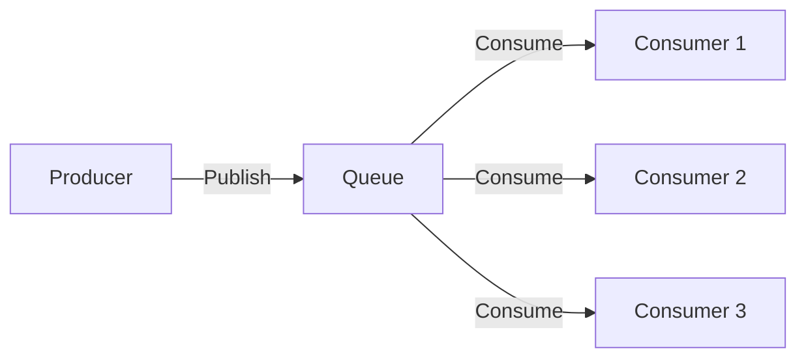
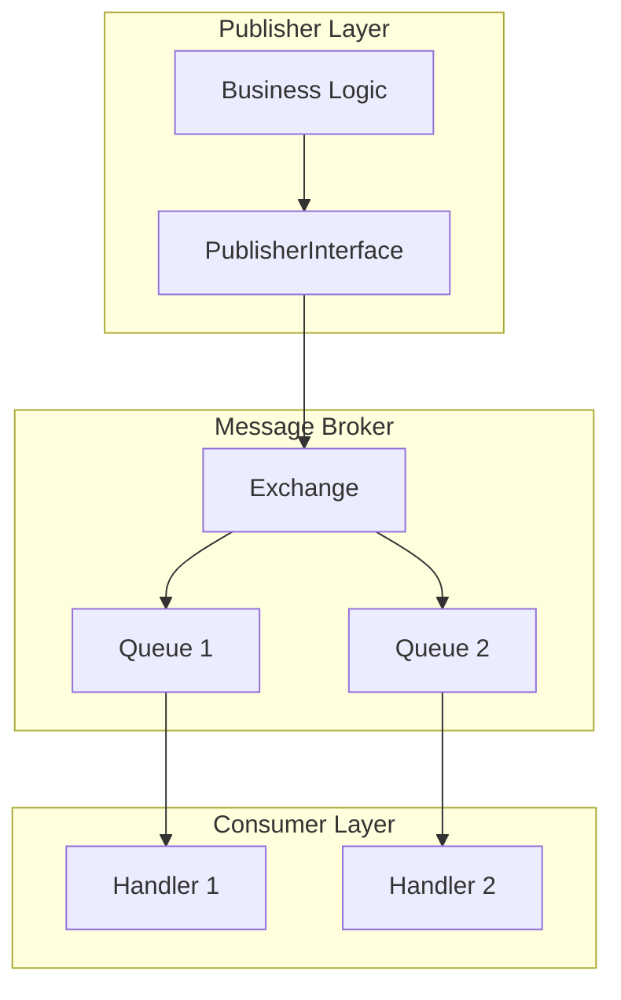

# 📨 Message Queues & RabbitMQ

> الدليل الشامل لـ Message Queues في Magento 2

---

## 📑 الفهرس

1. [مقدمة](#1-مقدمة)
2. [Queue Architecture](#2-queue-architecture)
3. [Configuration Files](#3-configuration-files)
4. [Publisher](#4-publisher)
5. [Consumer](#5-consumer)
6. [RabbitMQ Setup](#6-rabbitmq-setup)
7. [Async Operations](#7-async-operations)
8. [CLI Commands](#8-cli-commands)
9. [Best Practices](#9-best-practices)

---

## 1. مقدمة

### ما هي Message Queues؟

نظام يسمح بمعالجة المهام بشكل غير متزامن (Asynchronous).



### متى نستخدمها؟

| الحالة | المثال |
|--------|--------|
| **Long Operations** | إرسال آلاف الإيميلات |
| **Background Tasks** | تحديث الأسعار |
| **Async Processing** | معالجة الصور |
| **Decoupling** | تكامل مع أنظمة خارجية |

---

## 2. Queue Architecture

### المكونات



### Queue Types

| Type | الوصف | Backend |
|------|-------|---------|
| **DB** | قاعدة البيانات | MySQL |
| **AMQP** | Advanced MQ | RabbitMQ |

---

## 3. Configuration Files

### هيكل الملفات

```
app/code/Vendor/Module/
├── etc/
│   ├── communication.xml
│   ├── queue_consumer.xml
│   ├── queue_publisher.xml
│   └── queue_topology.xml
└── Model/
    └── Queue/
        ├── Handler.php
        └── Publisher.php
```

### communication.xml

```xml
<?xml version="1.0"?>
<config xmlns:xsi="http://www.w3.org/2001/XMLSchema-instance"
        xsi:noNamespaceSchemaLocation="urn:magento:framework:Communication/etc/communication.xsd">

    <!-- Define Topic -->
    <topic name="vendor.module.entity.process"
           request="Vendor\Module\Api\Data\EntityInterface">
        <handler name="entityHandler"
                 type="Vendor\Module\Model\Queue\Handler"
                 method="process"/>
    </topic>

    <!-- Topic with response -->
    <topic name="vendor.module.entity.sync"
           request="Vendor\Module\Api\Data\SyncRequestInterface"
           response="Vendor\Module\Api\Data\SyncResponseInterface">
        <handler name="syncHandler"
                 type="Vendor\Module\Model\Queue\SyncHandler"
                 method="processSync"/>
    </topic>
</config>
```

### queue_topology.xml

```xml
<?xml version="1.0"?>
<config xmlns:xsi="http://www.w3.org/2001/XMLSchema-instance"
        xsi:noNamespaceSchemaLocation="urn:magento:framework-message-queue:etc/topology.xsd">

    <!-- Define Exchange -->
    <exchange name="vendor.module.exchange"
              type="topic"
              connection="amqp">
        <binding id="vendorModuleEntityBinding"
                 topic="vendor.module.entity.process"
                 destination="vendor.module.entity.queue"
                 destinationType="queue"/>

        <binding id="vendorModuleSyncBinding"
                 topic="vendor.module.entity.sync"
                 destination="vendor.module.sync.queue"
                 destinationType="queue"/>
    </exchange>
</config>
```

### queue_publisher.xml

```xml
<?xml version="1.0"?>
<config xmlns:xsi="http://www.w3.org/2001/XMLSchema-instance"
        xsi:noNamespaceSchemaLocation="urn:magento:framework-message-queue:etc/publisher.xsd">

    <publisher topic="vendor.module.entity.process">
        <connection name="amqp" exchange="vendor.module.exchange"/>
    </publisher>

    <publisher topic="vendor.module.entity.sync">
        <connection name="amqp" exchange="vendor.module.exchange"/>
    </publisher>
</config>
```

### queue_consumer.xml

```xml
<?xml version="1.0"?>
<config xmlns:xsi="http://www.w3.org/2001/XMLSchema-instance"
        xsi:noNamespaceSchemaLocation="urn:magento:framework-message-queue:etc/consumer.xsd">

    <consumer name="vendor.module.entity.consumer"
              queue="vendor.module.entity.queue"
              handler="Vendor\Module\Model\Queue\Handler::process"
              consumerInstance="Magento\Framework\MessageQueue\Consumer"
              connection="amqp"
              maxMessages="100"/>

    <consumer name="vendor.module.sync.consumer"
              queue="vendor.module.sync.queue"
              handler="Vendor\Module\Model\Queue\SyncHandler::processSync"
              consumerInstance="Magento\Framework\MessageQueue\Consumer"
              connection="amqp"/>
</config>
```

---

## 4. Publisher

### Publisher Class

```php
<?php
declare(strict_types=1);

namespace Vendor\Module\Model\Queue;

use Magento\Framework\MessageQueue\PublisherInterface;
use Vendor\Module\Api\Data\EntityInterface;

class Publisher
{
    private const TOPIC_NAME = 'vendor.module.entity.process';

    public function __construct(
        private PublisherInterface $publisher
    ) {}

    public function publish(EntityInterface $entity): void
    {
        $this->publisher->publish(self::TOPIC_NAME, $entity);
    }

    public function publishBatch(array $entities): void
    {
        foreach ($entities as $entity) {
            $this->publisher->publish(self::TOPIC_NAME, $entity);
        }
    }
}
```

### استخدام الـ Publisher

```php
<?php
namespace Vendor\Module\Model;

class EntityService
{
    public function __construct(
        private Publisher $publisher,
        private EntityRepositoryInterface $repository
    ) {}

    public function processAsync(int $entityId): void
    {
        $entity = $this->repository->getById($entityId);
        $this->publisher->publish($entity);
    }
}
```

---

## 5. Consumer

### Handler Class

```php
<?php
declare(strict_types=1);

namespace Vendor\Module\Model\Queue;

use Vendor\Module\Api\Data\EntityInterface;
use Psr\Log\LoggerInterface;

class Handler
{
    public function __construct(
        private LoggerInterface $logger,
        private EntityProcessor $processor
    ) {}

    public function process(EntityInterface $entity): void
    {
        try {
            $this->logger->info('Processing entity', ['id' => $entity->getId()]);

            // Process the entity
            $this->processor->process($entity);

            $this->logger->info('Entity processed successfully', ['id' => $entity->getId()]);
        } catch (\Exception $e) {
            $this->logger->error('Failed to process entity', [
                'id' => $entity->getId(),
                'error' => $e->getMessage()
            ]);
            throw $e; // Re-throw to retry
        }
    }
}
```

### Sync Handler (with Response)

```php
<?php
namespace Vendor\Module\Model\Queue;

use Vendor\Module\Api\Data\SyncRequestInterface;
use Vendor\Module\Api\Data\SyncResponseInterface;
use Vendor\Module\Api\Data\SyncResponseInterfaceFactory;

class SyncHandler
{
    public function __construct(
        private SyncResponseInterfaceFactory $responseFactory
    ) {}

    public function processSync(SyncRequestInterface $request): SyncResponseInterface
    {
        $response = $this->responseFactory->create();

        try {
            // Process sync
            $response->setSuccess(true);
            $response->setMessage('Sync completed');
        } catch (\Exception $e) {
            $response->setSuccess(false);
            $response->setMessage($e->getMessage());
        }

        return $response;
    }
}
```

---

## 6. RabbitMQ Setup

### env.php Configuration

```php
'queue' => [
    'amqp' => [
        'host' => 'localhost',
        'port' => '5672',
        'user' => 'guest',
        'password' => 'guest',
        'virtualhost' => '/',
        'ssl' => false
    ]
]
```

### Docker Compose

```yaml
# docker-compose.yml
services:
  rabbitmq:
    image: rabbitmq:3-management
    ports:
      - "5672:5672"
      - "15672:15672"
    environment:
      RABBITMQ_DEFAULT_USER: guest
      RABBITMQ_DEFAULT_PASS: guest
```

### Verify Connection

```bash
# Check RabbitMQ status
rabbitmqctl status

# List queues
rabbitmqctl list_queues

# Access Management UI
# http://localhost:15672
# User: guest / Pass: guest
```

---

## 7. Async Operations

### Bulk API

```php
<?php
namespace Vendor\Module\Model;

use Magento\Framework\Bulk\BulkManagementInterface;
use Magento\Framework\Bulk\OperationInterface;
use Magento\Framework\DataObject\IdentityGeneratorInterface;
use Magento\Framework\Serialize\SerializerInterface;
use Magento\AsyncBulkOperations\Api\Data\OperationInterfaceFactory;

class BulkPublisher
{
    public function __construct(
        private BulkManagementInterface $bulkManagement,
        private OperationInterfaceFactory $operationFactory,
        private IdentityGeneratorInterface $identityGenerator,
        private SerializerInterface $serializer
    ) {}

    public function publishBulk(array $entityIds): string
    {
        $bulkUuid = $this->identityGenerator->generateId();
        $operations = [];

        foreach ($entityIds as $entityId) {
            $operation = $this->operationFactory->create();
            $operation->setBulkUuid($bulkUuid);
            $operation->setTopicName('vendor.module.entity.process');
            $operation->setSerializedData($this->serializer->serialize(['entity_id' => $entityId]));
            $operation->setStatus(OperationInterface::STATUS_TYPE_OPEN);
            $operations[] = $operation;
        }

        $this->bulkManagement->scheduleBulk($bulkUuid, $operations, 'Process Entities');

        return $bulkUuid;
    }
}
```

---

## 8. CLI Commands

### تشغيل الـ Consumers

```bash
# تشغيل consumer واحد
bin/magento queue:consumers:start vendor.module.entity.consumer

# مع حد أقصى للرسائل
bin/magento queue:consumers:start vendor.module.entity.consumer --max-messages=100

# تشغيل في الخلفية
bin/magento queue:consumers:start vendor.module.entity.consumer &

# عرض قائمة الـ Consumers
bin/magento queue:consumers:list
```

### إعداد Cron للـ Consumers

```xml
<!-- etc/crontab.xml -->
<config>
    <group id="consumers">
        <job name="vendor_module_consumer" instance="Magento\MessageQueue\Model\Cron\ConsumersRunner" method="run">
            <schedule>* * * * *</schedule>
        </job>
    </group>
</config>
```

```php
// env.php
'cron_consumers_runner' => [
    'cron_run' => true,
    'max_messages' => 1000,
    'consumers' => [
        'vendor.module.entity.consumer'
    ]
]
```

---

## 9. Best Practices

### ✅ Idempotent Handlers

```php
public function process(EntityInterface $entity): void
{
    // Check if already processed
    if ($this->isAlreadyProcessed($entity->getId())) {
        return;
    }

    // Process
    $this->doProcess($entity);

    // Mark as processed
    $this->markAsProcessed($entity->getId());
}
```

### ✅ Error Handling & Retry

```php
public function process(EntityInterface $entity): void
{
    $maxRetries = 3;
    $attempt = 0;

    while ($attempt < $maxRetries) {
        try {
            $this->doProcess($entity);
            return;
        } catch (\Exception $e) {
            $attempt++;
            if ($attempt >= $maxRetries) {
                $this->moveToDeadLetterQueue($entity, $e);
                throw $e;
            }
            sleep(pow(2, $attempt)); // Exponential backoff
        }
    }
}
```

### ✅ Logging

```php
$this->logger->info('Message received', ['entity_id' => $entity->getId()]);
$this->logger->info('Message processed', ['duration' => $duration]);
$this->logger->error('Processing failed', ['error' => $e->getMessage()]);
```

---

## 📌 ملخص

| المكون | الملف | الوظيفة |
|--------|-------|---------|
| **communication.xml** | Topic & Handler | تعريف الرسائل |
| **queue_topology.xml** | Exchange & Binding | ربط الـ Topics بالـ Queues |
| **queue_publisher.xml** | Publisher config | إعداد الـ Publisher |
| **queue_consumer.xml** | Consumer config | إعداد الـ Consumer |
| **Publisher** | PHP Class | إرسال الرسائل |
| **Handler** | PHP Class | معالجة الرسائل |

---

## ⬅️ [السابق](./22_GRAPHQL.md) | [🏠 الرئيسية](../MODULE_STRUCTURE.md) | [التالي ➡️](./24_PAYMENT.md)
