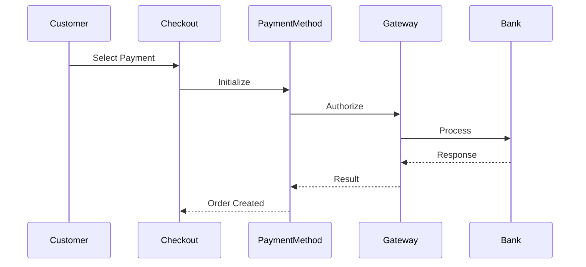

# 💳 Payment Methods

> الدليل الشامل لإنشاء Payment Methods في Magento 2

---

## 📑 الفهرس

1. [مقدمة](#1-مقدمة)
2. [Payment Architecture](#2-payment-architecture)
3. [Custom Payment Method](#3-custom-payment-method)
4. [Gateway Commands](#4-gateway-commands)
5. [Frontend Integration](#5-frontend-integration)
6. [Refund & Void](#6-refund--void)
7. [Best Practices](#7-best-practices)

---

## 1. مقدمة

### Payment Flow



### Payment Actions

| Action | الوظيفة |
|--------|---------|
| **Authorize** | حجز المبلغ |
| **Capture** | سحب المبلغ |
| **Authorize & Capture** | الاثنين معاً |
| **Refund** | استرجاع |
| **Void** | إلغاء الحجز |

---

## 2. Payment Architecture

### هيكل الملفات

```
app/code/Vendor/Payment/
├── etc/
│   ├── module.xml
│   ├── di.xml
│   ├── config.xml
│   └── adminhtml/
│       └── system.xml
├── Gateway/
│   ├── Config/
│   │   └── Config.php
│   ├── Command/
│   │   ├── AuthorizeCommand.php
│   │   ├── CaptureCommand.php
│   │   └── RefundCommand.php
│   ├── Request/
│   │   ├── AuthorizeRequest.php
│   │   └── CaptureRequest.php
│   ├── Response/
│   │   └── ResponseHandler.php
│   ├── Validator/
│   │   └── ResponseValidator.php
│   └── Http/
│       └── Client.php
├── Model/
│   └── Ui/
│       └── ConfigProvider.php
└── view/
    └── frontend/
        ├── layout/
        │   └── checkout_index_index.xml
        └── web/
            └── js/
                └── view/
                    └── payment/
                        └── method-renderer.js
```

---

## 3. Custom Payment Method

### config.xml

```xml
<?xml version="1.0"?>
<config xmlns:xsi="http://www.w3.org/2001/XMLSchema-instance"
        xsi:noNamespaceSchemaLocation="urn:magento:module:Magento_Store:etc/config.xsd">
    <default>
        <payment>
            <vendor_payment>
                <active>1</active>
                <title>Custom Payment</title>
                <model>VendorPaymentFacade</model>
                <order_status>pending</order_status>
                <payment_action>authorize_capture</payment_action>
                <is_gateway>1</is_gateway>
                <can_use_checkout>1</can_use_checkout>
                <can_authorize>1</can_authorize>
                <can_capture>1</can_capture>
                <can_refund>1</can_refund>
                <can_void>1</can_void>
                <can_cancel>1</can_cancel>
                <can_use_internal>1</can_use_internal>
                <min_order_total>1</min_order_total>
                <max_order_total>10000</max_order_total>
            </vendor_payment>
        </payment>
    </default>
</config>
```

### di.xml - Virtual Type Configuration

```xml
<?xml version="1.0"?>
<config xmlns:xsi="http://www.w3.org/2001/XMLSchema-instance"
        xsi:noNamespaceSchemaLocation="urn:magento:framework:ObjectManager/etc/config.xsd">

    <!-- Payment Facade -->
    <virtualType name="VendorPaymentFacade" type="Magento\Payment\Model\Method\Adapter">
        <arguments>
            <argument name="code" xsi:type="const">Vendor\Payment\Model\Ui\ConfigProvider::CODE</argument>
            <argument name="formBlockType" xsi:type="string">Magento\Payment\Block\Form</argument>
            <argument name="infoBlockType" xsi:type="string">Magento\Payment\Block\Info</argument>
            <argument name="valueHandlerPool" xsi:type="object">VendorPaymentValueHandlerPool</argument>
            <argument name="commandPool" xsi:type="object">VendorPaymentCommandPool</argument>
        </arguments>
    </virtualType>

    <!-- Value Handler Pool -->
    <virtualType name="VendorPaymentValueHandlerPool" type="Magento\Payment\Gateway\Config\ValueHandlerPool">
        <arguments>
            <argument name="handlers" xsi:type="array">
                <item name="default" xsi:type="string">VendorPaymentConfigValueHandler</item>
            </argument>
        </arguments>
    </virtualType>

    <virtualType name="VendorPaymentConfigValueHandler" type="Magento\Payment\Gateway\Config\ConfigValueHandler">
        <arguments>
            <argument name="configInterface" xsi:type="object">VendorPaymentConfig</argument>
        </arguments>
    </virtualType>

    <virtualType name="VendorPaymentConfig" type="Magento\Payment\Gateway\Config\Config">
        <arguments>
            <argument name="methodCode" xsi:type="const">Vendor\Payment\Model\Ui\ConfigProvider::CODE</argument>
        </arguments>
    </virtualType>

    <!-- Command Pool -->
    <virtualType name="VendorPaymentCommandPool" type="Magento\Payment\Gateway\Command\CommandPool">
        <arguments>
            <argument name="commands" xsi:type="array">
                <item name="authorize" xsi:type="string">VendorPaymentAuthorizeCommand</item>
                <item name="capture" xsi:type="string">VendorPaymentCaptureCommand</item>
                <item name="refund" xsi:type="string">VendorPaymentRefundCommand</item>
                <item name="void" xsi:type="string">VendorPaymentVoidCommand</item>
            </argument>
        </arguments>
    </virtualType>
</config>
```

---

## 4. Gateway Commands

### Authorize Command

```xml
<!-- di.xml -->
<virtualType name="VendorPaymentAuthorizeCommand" type="Magento\Payment\Gateway\Command\GatewayCommand">
    <arguments>
        <argument name="requestBuilder" xsi:type="object">VendorPaymentAuthorizeRequest</argument>
        <argument name="transferFactory" xsi:type="object">Vendor\Payment\Gateway\Http\TransferFactory</argument>
        <argument name="client" xsi:type="object">Vendor\Payment\Gateway\Http\Client</argument>
        <argument name="handler" xsi:type="object">VendorPaymentResponseHandler</argument>
        <argument name="validator" xsi:type="object">Vendor\Payment\Gateway\Validator\ResponseValidator</argument>
    </arguments>
</virtualType>
```

### Request Builder

```php
<?php
declare(strict_types=1);

namespace Vendor\Payment\Gateway\Request;

use Magento\Payment\Gateway\Request\BuilderInterface;
use Magento\Payment\Gateway\Helper\SubjectReader;

class AuthorizeRequest implements BuilderInterface
{
    public function build(array $buildSubject): array
    {
        $payment = SubjectReader::readPayment($buildSubject);
        $order = $payment->getOrder();
        $amount = SubjectReader::readAmount($buildSubject);

        return [
            'merchant_id' => $this->config->getMerchantId(),
            'transaction_type' => 'authorize',
            'amount' => $amount * 100, // Convert to cents
            'currency' => $order->getCurrencyCode(),
            'order_id' => $order->getOrderIncrementId(),
            'customer_email' => $order->getBillingAddress()->getEmail(),
            'customer_name' => $order->getBillingAddress()->getFirstname(),
            'card_number' => $payment->getPayment()->getCcNumber(),
            'card_exp_month' => $payment->getPayment()->getCcExpMonth(),
            'card_exp_year' => $payment->getPayment()->getCcExpYear(),
            'card_cvv' => $payment->getPayment()->getCcCid()
        ];
    }
}
```

### HTTP Client

```php
<?php
namespace Vendor\Payment\Gateway\Http;

use Magento\Payment\Gateway\Http\ClientInterface;
use Magento\Payment\Gateway\Http\TransferInterface;
use Magento\Framework\HTTP\Client\Curl;

class Client implements ClientInterface
{
    public function __construct(
        private Curl $curl,
        private Config $config
    ) {}

    public function placeRequest(TransferInterface $transferObject): array
    {
        $request = $transferObject->getBody();
        $url = $this->config->getGatewayUrl();

        $this->curl->setHeaders([
            'Content-Type' => 'application/json',
            'Authorization' => 'Bearer ' . $this->config->getApiKey()
        ]);

        $this->curl->post($url, json_encode($request));

        $response = json_decode($this->curl->getBody(), true);

        return $response ?? [];
    }
}
```

### Response Handler

```php
<?php
namespace Vendor\Payment\Gateway\Response;

use Magento\Payment\Gateway\Response\HandlerInterface;
use Magento\Payment\Gateway\Helper\SubjectReader;

class ResponseHandler implements HandlerInterface
{
    public function handle(array $handlingSubject, array $response): void
    {
        $payment = SubjectReader::readPayment($handlingSubject);
        $paymentInfo = $payment->getPayment();

        // Save transaction info
        $paymentInfo->setTransactionId($response['transaction_id']);
        $paymentInfo->setIsTransactionClosed(false);

        // Additional info
        $paymentInfo->setAdditionalInformation('gateway_response', $response);
    }
}
```

### Response Validator

```php
<?php
namespace Vendor\Payment\Gateway\Validator;

use Magento\Payment\Gateway\Validator\AbstractValidator;
use Magento\Payment\Gateway\Validator\ResultInterface;
use Magento\Payment\Gateway\Validator\ResultInterfaceFactory;

class ResponseValidator extends AbstractValidator
{
    public function validate(array $validationSubject): ResultInterface
    {
        $response = $validationSubject['response'];

        if ($response['status'] === 'success') {
            return $this->createResult(true);
        }

        return $this->createResult(
            false,
            [__('Transaction failed: %1', $response['message'])]
        );
    }
}
```

---

## 5. Frontend Integration

### ConfigProvider

```php
<?php
namespace Vendor\Payment\Model\Ui;

use Magento\Checkout\Model\ConfigProviderInterface;

class ConfigProvider implements ConfigProviderInterface
{
    public const CODE = 'vendor_payment';

    public function getConfig(): array
    {
        return [
            'payment' => [
                self::CODE => [
                    'isActive' => true,
                    'title' => 'Custom Payment',
                    'redirectUrl' => '',
                    'logoUrl' => $this->getLogoUrl()
                ]
            ]
        ];
    }
}
```

### JavaScript Renderer

```javascript
// view/frontend/web/js/view/payment/method-renderer.js
define([
    'uiComponent',
    'Magento_Checkout/js/model/payment/renderer-list'
], function (Component, rendererList) {
    'use strict';

    rendererList.push({
        type: 'vendor_payment',
        component: 'Vendor_Payment/js/view/payment/method-renderer/vendor-payment'
    });

    return Component.extend({});
});
```

```javascript
// view/frontend/web/js/view/payment/method-renderer/vendor-payment.js
define([
    'Magento_Checkout/js/view/payment/default'
], function (Component) {
    'use strict';

    return Component.extend({
        defaults: {
            template: 'Vendor_Payment/payment/vendor-payment'
        },

        getMailingAddress: function () {
            return window.checkoutConfig.payment.vendor_payment.mailingAddress;
        },

        getInstructions: function () {
            return window.checkoutConfig.payment.vendor_payment.instructions;
        }
    });
});
```

### Layout XML

```xml
<!-- view/frontend/layout/checkout_index_index.xml -->
<page xmlns:xsi="http://www.w3.org/2001/XMLSchema-instance"
      xsi:noNamespaceSchemaLocation="urn:magento:framework:View/Layout/etc/page_configuration.xsd">
    <body>
        <referenceBlock name="checkout.root">
            <arguments>
                <argument name="jsLayout" xsi:type="array">
                    <item name="components" xsi:type="array">
                        <item name="checkout" xsi:type="array">
                            <item name="children" xsi:type="array">
                                <item name="steps" xsi:type="array">
                                    <item name="children" xsi:type="array">
                                        <item name="billing-step" xsi:type="array">
                                            <item name="children" xsi:type="array">
                                                <item name="payment" xsi:type="array">
                                                    <item name="children" xsi:type="array">
                                                        <item name="renders" xsi:type="array">
                                                            <item name="children" xsi:type="array">
                                                                <item name="vendor-payment" xsi:type="array">
                                                                    <item name="component" xsi:type="string">Vendor_Payment/js/view/payment/method-renderer</item>
                                                                    <item name="methods" xsi:type="array">
                                                                        <item name="vendor_payment" xsi:type="array">
                                                                            <item name="isBillingAddressRequired" xsi:type="boolean">true</item>
                                                                        </item>
                                                                    </item>
                                                                </item>
                                                            </item>
                                                        </item>
                                                    </item>
                                                </item>
                                            </item>
                                        </item>
                                    </item>
                                </item>
                            </item>
                        </item>
                    </item>
                </argument>
            </arguments>
        </referenceBlock>
    </body>
</page>
```

---

## 6. Refund & Void

### Refund Command

```php
<?php
namespace Vendor\Payment\Gateway\Request;

use Magento\Payment\Gateway\Request\BuilderInterface;

class RefundRequest implements BuilderInterface
{
    public function build(array $buildSubject): array
    {
        $payment = SubjectReader::readPayment($buildSubject);
        $amount = SubjectReader::readAmount($buildSubject);

        return [
            'transaction_id' => $payment->getPayment()->getLastTransId(),
            'amount' => $amount * 100,
            'transaction_type' => 'refund'
        ];
    }
}
```

---

## 7. Best Practices

### ✅ Use Virtual Types

```xml
<virtualType name="VendorPaymentFacade" type="Magento\Payment\Model\Method\Adapter">
```

### ✅ Secure Credentials

```php
// Use encrypted config
$this->encryptor->decrypt($this->config->getApiKey());
```

### ✅ Error Handling

```php
try {
    $response = $this->client->placeRequest($transfer);
} catch (\Exception $e) {
    throw new PaymentException(__('Payment failed: %1', $e->getMessage()));
}
```

---

## 📌 ملخص

| المكون | الوظيفة |
|--------|---------|
| **Facade** | واجهة الـ Payment |
| **Command Pool** | مجموعة الأوامر |
| **Request Builder** | بناء الطلب |
| **HTTP Client** | الاتصال بالـ Gateway |
| **Response Handler** | معالجة الرد |
| **Validator** | التحقق من الرد |

---

## ⬅️ [السابق](./23_MESSAGE_QUEUES.md) | [🏠 الرئيسية](../MODULE_STRUCTURE.md) | [التالي ➡️](./25_CHECKOUT.md)
