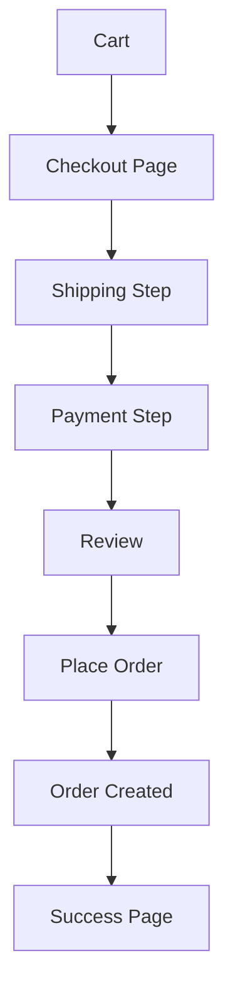

# 🛒 Checkout Customization

> الدليل الشامل لتخصيص Checkout في Magento 2

---

## 📑 الفهرس

1. [Checkout Architecture](#1-checkout-architecture)
2. [Quote to Order](#2-quote-to-order)
3. [Checkout Steps](#3-checkout-steps)
4. [Custom Checkout Fields](#4-custom-checkout-fields)
5. [Shipping Methods](#5-shipping-methods)
6. [Order Processing](#6-order-processing)
7. [Best Practices](#7-best-practices)

---

## 1. Checkout Architecture

### Checkout Flow



### Main Components

| Component | الوظيفة |
|-----------|---------|
| **Quote** | السلة والبيانات المؤقتة |
| **Checkout Layout** | ترتيب الخطوات |
| **Shipping** | طرق الشحن |
| **Payment** | طرق الدفع |
| **Order** | الطلب النهائي |

---

## 2. Quote to Order

### Quote Model

```php
<?php
use Magento\Quote\Api\CartRepositoryInterface;
use Magento\Quote\Model\QuoteFactory;

class CartService
{
    public function __construct(
        private CartRepositoryInterface $cartRepository,
        private QuoteFactory $quoteFactory
    ) {}

    public function createCart(int $customerId): int
    {
        $quote = $this->quoteFactory->create();
        $quote->setCustomerId($customerId);
        $quote->setStoreId(1);
        $this->cartRepository->save($quote);

        return (int)$quote->getId();
    }

    public function addItem(int $quoteId, int $productId, int $qty): void
    {
        $quote = $this->cartRepository->get($quoteId);
        $quote->addProduct($product, $qty);
        $this->cartRepository->save($quote);
    }
}
```

### Order Placement

```php
<?php
use Magento\Quote\Api\CartManagementInterface;

class OrderService
{
    public function __construct(
        private CartManagementInterface $cartManagement
    ) {}

    public function placeOrder(int $cartId): int
    {
        return $this->cartManagement->placeOrder($cartId);
    }
}
```

---

## 3. Checkout Steps

### Checkout Layout

```xml
<!-- view/frontend/layout/checkout_index_index.xml -->
<page xmlns:xsi="http://www.w3.org/2001/XMLSchema-instance"
      xsi:noNamespaceSchemaLocation="urn:magento:framework:View/Layout/etc/page_configuration.xsd">
    <body>
        <referenceBlock name="checkout.root">
            <arguments>
                <argument name="jsLayout" xsi:type="array">
                    <item name="components" xsi:type="array">
                        <item name="checkout" xsi:type="array">
                            <item name="children" xsi:type="array">
                                <item name="steps" xsi:type="array">
                                    <item name="children" xsi:type="array">

                                        <!-- Custom Step -->
                                        <item name="custom-step" xsi:type="array">
                                            <item name="component" xsi:type="string">Vendor_Module/js/view/custom-step</item>
                                            <item name="sortOrder" xsi:type="string">1</item>
                                            <item name="children" xsi:type="array">
                                                <!-- Step children -->
                                            </item>
                                        </item>

                                    </item>
                                </item>
                            </item>
                        </item>
                    </item>
                </argument>
            </arguments>
        </referenceBlock>
    </body>
</page>
```

### Custom Step Component

```javascript
// view/frontend/web/js/view/custom-step.js
define([
    'ko',
    'uiComponent',
    'underscore',
    'Magento_Checkout/js/model/step-navigator'
], function (ko, Component, _, stepNavigator) {
    'use strict';

    return Component.extend({
        defaults: {
            template: 'Vendor_Module/custom-step'
        },

        isVisible: ko.observable(true),

        initialize: function () {
            this._super();

            stepNavigator.registerStep(
                'custom-step',
                null,
                'Custom Step Title',
                this.isVisible,
                _.bind(this.navigate, this),
                15 // Sort order
            );

            return this;
        },

        navigate: function () {
            this.isVisible(true);
        },

        navigateToNextStep: function () {
            stepNavigator.next();
        }
    });
});
```

---

## 4. Custom Checkout Fields

### Adding Field to Shipping

```xml
<!-- checkout_index_index.xml -->
<item name="shipping-step" xsi:type="array">
    <item name="children" xsi:type="array">
        <item name="shippingAddress" xsi:type="array">
            <item name="children" xsi:type="array">
                <item name="shipping-address-fieldset" xsi:type="array">
                    <item name="children" xsi:type="array">

                        <!-- Custom Field -->
                        <item name="delivery_instructions" xsi:type="array">
                            <item name="component" xsi:type="string">Magento_Ui/js/form/element/textarea</item>
                            <item name="config" xsi:type="array">
                                <item name="customScope" xsi:type="string">shippingAddress.custom_attributes</item>
                                <item name="template" xsi:type="string">ui/form/field</item>
                                <item name="elementTmpl" xsi:type="string">ui/form/element/textarea</item>
                            </item>
                            <item name="dataScope" xsi:type="string">shippingAddress.custom_attributes.delivery_instructions</item>
                            <item name="label" xsi:type="string">Delivery Instructions</item>
                            <item name="provider" xsi:type="string">checkoutProvider</item>
                            <item name="visible" xsi:type="boolean">true</item>
                            <item name="validation" xsi:type="array">
                                <item name="max_text_length" xsi:type="number">255</item>
                            </item>
                            <item name="sortOrder" xsi:type="number">200</item>
                        </item>

                    </item>
                </item>
            </item>
        </item>
    </item>
</item>
```

### Save Custom Attribute

```php
<?php
namespace Vendor\Module\Plugin;

use Magento\Checkout\Api\Data\ShippingInformationInterface;
use Magento\Checkout\Api\ShippingInformationManagementInterface;
use Magento\Quote\Api\CartRepositoryInterface;

class ShippingInformationPlugin
{
    public function __construct(
        private CartRepositoryInterface $cartRepository
    ) {}

    public function beforeSaveAddressInformation(
        ShippingInformationManagementInterface $subject,
        int $cartId,
        ShippingInformationInterface $addressInformation
    ): array {
        $shippingAddress = $addressInformation->getShippingAddress();
        $extensionAttributes = $shippingAddress->getExtensionAttributes();

        if ($extensionAttributes) {
            $customAttribute = $extensionAttributes->getDeliveryInstructions();
            $shippingAddress->setDeliveryInstructions($customAttribute);
        }

        return [$cartId, $addressInformation];
    }
}
```

---

## 5. Shipping Methods

### Custom Shipping Method

```php
<?php
declare(strict_types=1);

namespace Vendor\Module\Model\Carrier;

use Magento\Shipping\Model\Carrier\AbstractCarrier;
use Magento\Shipping\Model\Carrier\CarrierInterface;
use Magento\Quote\Model\Quote\Address\RateRequest;
use Magento\Shipping\Model\Rate\Result;

class CustomShipping extends AbstractCarrier implements CarrierInterface
{
    protected $_code = 'customshipping';
    protected $_isFixed = true;

    public function __construct(
        \Magento\Framework\App\Config\ScopeConfigInterface $scopeConfig,
        \Magento\Quote\Model\Quote\Address\RateResult\ErrorFactory $rateErrorFactory,
        \Psr\Log\LoggerInterface $logger,
        private \Magento\Shipping\Model\Rate\ResultFactory $rateResultFactory,
        private \Magento\Quote\Model\Quote\Address\RateResult\MethodFactory $rateMethodFactory,
        array $data = []
    ) {
        parent::__construct($scopeConfig, $rateErrorFactory, $logger, $data);
    }

    public function collectRates(RateRequest $request): Result|bool
    {
        if (!$this->getConfigFlag('active')) {
            return false;
        }

        $result = $this->rateResultFactory->create();

        // Standard Rate
        $method = $this->rateMethodFactory->create();
        $method->setCarrier($this->_code);
        $method->setCarrierTitle($this->getConfigData('title'));
        $method->setMethod('standard');
        $method->setMethodTitle('Standard Delivery');
        $method->setPrice($this->calculatePrice($request));
        $method->setCost($this->calculatePrice($request));
        $result->append($method);

        // Express Rate
        $expressMethod = $this->rateMethodFactory->create();
        $expressMethod->setCarrier($this->_code);
        $expressMethod->setCarrierTitle($this->getConfigData('title'));
        $expressMethod->setMethod('express');
        $expressMethod->setMethodTitle('Express Delivery');
        $expressMethod->setPrice($this->calculatePrice($request) * 2);
        $expressMethod->setCost($this->calculatePrice($request) * 2);
        $result->append($expressMethod);

        return $result;
    }

    public function getAllowedMethods(): array
    {
        return [
            'standard' => 'Standard Delivery',
            'express' => 'Express Delivery'
        ];
    }

    private function calculatePrice(RateRequest $request): float
    {
        $basePrice = (float)$this->getConfigData('price');
        $weight = $request->getPackageWeight();

        // Price per kg
        return $basePrice + ($weight * 0.5);
    }
}
```

### config.xml

```xml
<config>
    <default>
        <carriers>
            <customshipping>
                <active>1</active>
                <model>Vendor\Module\Model\Carrier\CustomShipping</model>
                <name>Custom Shipping</name>
                <title>Custom Carrier</title>
                <price>5.00</price>
                <sallowspecific>0</sallowspecific>
                <handling_type>F</handling_type>
            </customshipping>
        </carriers>
    </default>
</config>
```

---

## 6. Order Processing

### Order States & Statuses

| State | Status | الوظيفة |
|-------|--------|---------|
| `new` | `pending` | طلب جديد |
| `pending_payment` | `pending_payment` | في انتظار الدفع |
| `processing` | `processing` | قيد المعالجة |
| `complete` | `complete` | مكتمل |
| `closed` | `closed` | مغلق |
| `canceled` | `canceled` | ملغي |
| `holded` | `holded` | معلق |

### Order Observer

```php
<?php
namespace Vendor\Module\Observer;

use Magento\Framework\Event\ObserverInterface;
use Magento\Framework\Event\Observer;

class OrderPlaceAfter implements ObserverInterface
{
    public function execute(Observer $observer): void
    {
        $order = $observer->getEvent()->getOrder();

        // Process order
        $this->processOrder($order);

        // Send notification
        $this->sendNotification($order);
    }

    private function processOrder($order): void
    {
        // Custom logic
    }
}
```

```xml
<!-- events.xml -->
<event name="sales_order_place_after">
    <observer name="vendor_module_order_place" instance="Vendor\Module\Observer\OrderPlaceAfter"/>
</event>
```

---

## 7. Best Practices

### ✅ Use Service Contracts

```php
use Magento\Sales\Api\OrderRepositoryInterface;
use Magento\Quote\Api\CartRepositoryInterface;
```

### ✅ Validate Before Order

```php
public function beforePlaceOrder($cartId): void
{
    $quote = $this->cartRepository->get($cartId);

    if (!$quote->getItemsCount()) {
        throw new LocalizedException(__('Cart is empty'));
    }
}
```

### ✅ Use Extension Attributes

```xml
<!-- extension_attributes.xml -->
<extension_attributes for="Magento\Sales\Api\Data\OrderInterface">
    <attribute code="custom_field" type="string"/>
</extension_attributes>
```

---

## 📌 ملخص

| المكون | الوظيفة |
|--------|---------|
| **Quote** | السلة المؤقتة |
| **Shipping** | طرق التوصيل |
| **Payment** | طرق الدفع |
| **Order** | الطلب النهائي |
| **Steps** | خطوات الـ Checkout |

---

## ⬅️ [السابق](./24_PAYMENT.md) | [🏠 الرئيسية](../MODULE_STRUCTURE.md) | [التالي ➡️](./26_THEMES.md)
