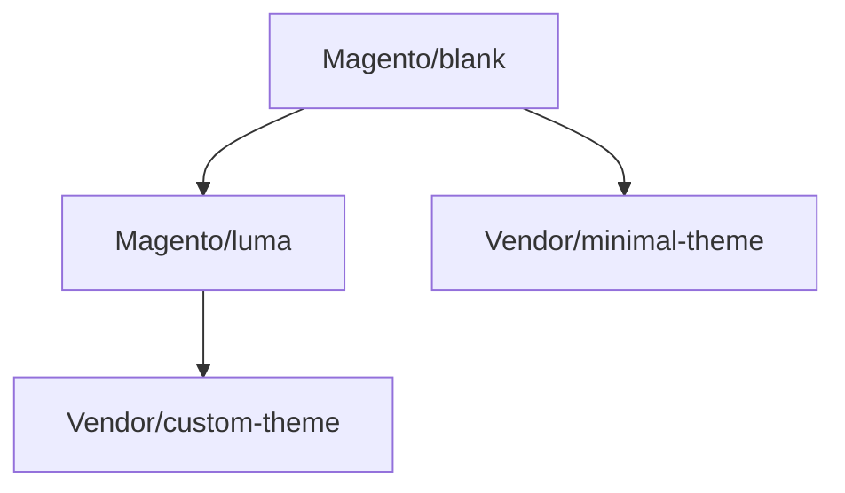

# 🎨 Theme Development

> الدليل الشامل لتطوير Themes في Magento 2

---

## 📑 الفهرس

1. [مقدمة](#1-مقدمة)
2. [Theme Structure](#2-theme-structure)
3. [Theme Configuration](#3-theme-configuration)
4. [Static Files](#4-static-files)
5. [LESS & CSS](#5-less--css)
6. [Template Overrides](#6-template-overrides)
7. [Layout Overrides](#7-layout-overrides)
8. [JavaScript](#8-javascript)
9. [Deployment](#9-deployment)
10. [Best Practices](#10-best-practices)

---

## 1. مقدمة

### Theme Inheritance



### Theme Types

| Type | Based On | Usage |
|------|----------|-------|
| **Blank** | - | قاعدة فارغة |
| **Luma** | Blank | مع styles |
| **Custom** | Luma/Blank | مخصص |

---

## 2. Theme Structure

```
app/design/frontend/Vendor/theme-name/
├── registration.php
├── theme.xml
├── composer.json
├── etc/
│   └── view.xml
├── media/
│   └── preview.jpg
├── web/
│   ├── css/
│   │   └── source/
│   │       ├── _theme.less
│   │       └── _variables.less
│   ├── images/
│   │   └── logo.svg
│   ├── js/
│   │   └── custom.js
│   └── fonts/
├── Magento_Theme/
│   ├── layout/
│   │   └── default.xml
│   └── templates/
│       └── html/
│           └── header.phtml
├── Magento_Catalog/
│   ├── layout/
│   │   └── catalog_product_view.xml
│   └── templates/
│       └── product/
│           └── view.phtml
└── Magento_Checkout/
    └── layout/
        └── checkout_index_index.xml
```

---

## 3. Theme Configuration

### registration.php

```php
<?php
use Magento\Framework\Component\ComponentRegistrar;

ComponentRegistrar::register(
    ComponentRegistrar::THEME,
    'frontend/Vendor/theme-name',
    __DIR__
);
```

### theme.xml

```xml
<?xml version="1.0"?>
<theme xmlns:xsi="http://www.w3.org/2001/XMLSchema-instance"
       xsi:noNamespaceSchemaLocation="urn:magento:framework:Config/etc/theme.xsd">
    <title>Vendor Custom Theme</title>
    <parent>Magento/luma</parent>
    <media>
        <preview_image>media/preview.jpg</preview_image>
    </media>
</theme>
```

### etc/view.xml

```xml
<?xml version="1.0"?>
<view xmlns:xsi="http://www.w3.org/2001/XMLSchema-instance"
      xsi:noNamespaceSchemaLocation="urn:magento:framework:Config/etc/view.xsd">
    <media>
        <images module="Magento_Catalog">
            <image id="category_page_grid" type="small_image">
                <width>240</width>
                <height>300</height>
            </image>
            <image id="category_page_list" type="small_image">
                <width>240</width>
                <height>300</height>
            </image>
            <image id="product_page_image_medium" type="image">
                <width>700</width>
                <height>700</height>
            </image>
        </images>
    </media>
    <vars module="Magento_Catalog">
        <var name="gallery">
            <var name="fullscreen">true</var>
            <var name="loop">true</var>
            <var name="nav">thumbs</var>
        </var>
    </vars>
</view>
```

---

## 4. Static Files

### Logo & Favicon

```xml
<!-- Magento_Theme/layout/default.xml -->
<page xmlns:xsi="http://www.w3.org/2001/XMLSchema-instance"
      xsi:noNamespaceSchemaLocation="urn:magento:framework:View/Layout/etc/page_configuration.xsd">
    <body>
        <referenceBlock name="logo">
            <arguments>
                <argument name="logo_file" xsi:type="string">images/logo.svg</argument>
                <argument name="logo_img_width" xsi:type="number">200</argument>
                <argument name="logo_img_height" xsi:type="number">50</argument>
            </arguments>
        </referenceBlock>
    </body>
</page>
```

### Add CSS/JS

```xml
<page>
    <head>
        <css src="css/custom-styles.css"/>
        <script src="js/custom-script.js"/>
        <link src="https://fonts.googleapis.com/css?family=Open+Sans" src_type="url"/>
    </head>
</page>
```

---

## 5. LESS & CSS

### _theme.less

```less
// web/css/source/_theme.less

// Import variables
@import '_variables.less';

// Typography
body {
    font-family: @font-family__base;
    font-size: @font-size__base;
    color: @text__color;
}

// Header
.page-header {
    background-color: @header__background-color;
    padding: 20px 0;

    .logo {
        max-width: @logo__width;
    }
}

// Navigation
.navigation {
    background-color: @navigation__background;

    .level0 > .level-top {
        color: @navigation__link-color;
        font-weight: 600;

        &:hover {
            color: @navigation__link-color-hover;
        }
    }
}

// Buttons
.action.primary {
    background-color: @button-primary__background;
    border-color: @button-primary__border;
    color: @button-primary__color;

    &:hover {
        background-color: @button-primary__hover__background;
    }
}

// Footer
.page-footer {
    background-color: @footer__background-color;
    color: @footer__text-color;
}
```

### _variables.less

```less
// web/css/source/_variables.less

// Colors
@brand__primary: #ff6b35;
@brand__secondary: #2c3e50;
@brand__accent: #e74c3c;

// Text
@text__color: #333333;
@text__color__light: #666666;

// Typography
@font-family__base: 'Open Sans', sans-serif;
@font-size__base: 14px;

// Header
@header__background-color: @brand__secondary;
@logo__width: 200px;

// Navigation
@navigation__background: @brand__primary;
@navigation__link-color: #ffffff;
@navigation__link-color-hover: darken(@navigation__link-color, 10%);

// Buttons
@button-primary__background: @brand__primary;
@button-primary__border: @brand__primary;
@button-primary__color: #ffffff;
@button-primary__hover__background: darken(@brand__primary, 10%);

// Footer
@footer__background-color: @brand__secondary;
@footer__text-color: #ffffff;
```

### Extend Existing Styles

```less
// Extend Luma styles
& when (@media-common = true) {
    .product-item-info {
        border: 1px solid #eee;
        padding: 15px;
        border-radius: 4px;
        transition: box-shadow 0.3s ease;

        &:hover {
            box-shadow: 0 4px 15px rgba(0,0,0,0.1);
        }
    }
}
```

---

## 6. Template Overrides

### Override Template

```
Original: vendor/magento/module-catalog/view/frontend/templates/product/view.phtml
Override: app/design/frontend/Vendor/theme-name/Magento_Catalog/templates/product/view.phtml
```

### Example Template

```php
<!-- Magento_Catalog/templates/product/list.phtml -->
<?php
/** @var \Magento\Catalog\Block\Product\ListProduct $block */
$_productCollection = $block->getLoadedProductCollection();
?>

<div class="products-grid">
    <?php foreach ($_productCollection as $_product): ?>
        <div class="product-item">
            <a href="<?= $block->escapeUrl($_product->getProductUrl()) ?>">
                <?= $block->getImage($_product, 'category_page_grid')->toHtml() ?>
                <h3><?= $block->escapeHtml($_product->getName()) ?></h3>
                <span class="price"><?= $block->getProductPrice($_product) ?></span>
            </a>
            <?= $block->getProductDetailsHtml($_product) ?>
        </div>
    <?php endforeach; ?>
</div>
```

---

## 7. Layout Overrides

### Remove Block

```xml
<page>
    <body>
        <referenceBlock name="catalog.compare.sidebar" remove="true"/>
        <referenceBlock name="wishlist_sidebar" remove="true"/>
    </body>
</page>
```

### Move Block

```xml
<page>
    <body>
        <move element="product.info.stock.sku" destination="product.info.main" before="product.info.price"/>
    </body>
</page>
```

### Add Container

```xml
<page>
    <body>
        <referenceContainer name="content">
            <container name="custom.container" htmlTag="div" htmlClass="custom-section">
                <block class="Magento\Framework\View\Element\Template"
                       name="custom.block"
                       template="Vendor_Theme::custom.phtml"/>
            </container>
        </referenceContainer>
    </body>
</page>
```

---

## 8. JavaScript

### requirejs-config.js

```javascript
// web/requirejs-config.js
var config = {
    paths: {
        'customModule': 'js/custom-module',
        'slickSlider': 'js/lib/slick.min'
    },
    shim: {
        'slickSlider': {
            deps: ['jquery']
        }
    },
    map: {
        '*': {
            'customWidget': 'js/custom-widget'
        }
    },
    config: {
        mixins: {
            'Magento_Catalog/js/catalog-add-to-cart': {
                'js/mixins/catalog-add-to-cart-mixin': true
            }
        }
    }
};
```

### Custom Widget

```javascript
// web/js/custom-widget.js
define([
    'jquery',
    'jquery-ui-modules/widget'
], function ($) {
    'use strict';

    $.widget('vendor.customWidget', {
        options: {
            message: 'Hello'
        },

        _create: function () {
            this._bind();
        },

        _bind: function () {
            this.element.on('click', this._onClick.bind(this));
        },

        _onClick: function (e) {
            alert(this.options.message);
        }
    });

    return $.vendor.customWidget;
});
```

---

## 9. Deployment

### Development Mode

```bash
# Deploy static content
bin/magento setup:static-content:deploy -f

# Clean cache
bin/magento cache:clean
bin/magento cache:flush
```

### Production Mode

```bash
# Compile
bin/magento setup:di:compile

# Deploy all locales
bin/magento setup:static-content:deploy en_US ar_SA -f

# Enable production mode
bin/magento deploy:mode:set production
```

### Clear Generated

```bash
rm -rf var/view_preprocessed/*
rm -rf pub/static/frontend/*
rm -rf generated/*
```

---

## 10. Best Practices

### ✅ Use Theme Inheritance

```xml
<parent>Magento/luma</parent>
```

### ✅ Use Variables

```less
@brand__primary: #ff6b35;
// Use throughout
background: @brand__primary;
```

### ✅ Mobile First

```less
// Base mobile styles
.element {
    width: 100%;
}

// Desktop
@media (min-width: 768px) {
    .element {
        width: 50%;
    }
}
```

### ✅ Override, Don't Copy

فقط override الملفات التي تحتاج تعديل.

### ✅ Use View.xml for Images

```xml
<image id="category_page_grid" type="small_image">
    <width>240</width>
    <height>300</height>
</image>
```

---

## 📌 ملخص

| المكون | الوظيفة |
|--------|---------|
| **theme.xml** | إعدادات الـ Theme |
| **registration.php** | تسجيل الـ Theme |
| **view.xml** | إعدادات الصور |
| **_theme.less** | Styles رئيسية |
| **_variables.less** | المتغيرات |
| **Layout XML** | هيكل الصفحات |
| **Templates** | ملفات PHTML |

---

## ⬅️ [السابق](./25_CHECKOUT.md) | [🏠 الرئيسية](../MODULE_STRUCTURE.md)
