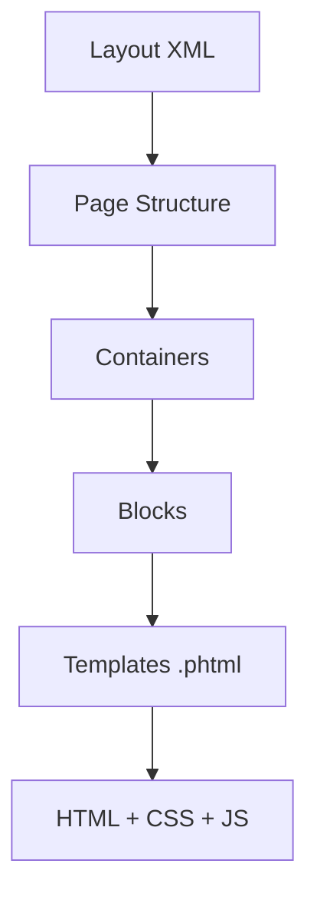

# 🎨 Views and Layouts

> Complete Guide to the Presentation Layer in Magento 2

---

## 📑 Table of Contents

1. [Introduction](#1-introduction)
2. [File Structure](#2-file-structure)
3. [Layout XML](#3-layout-xml)
4. [Page Layouts](#4-page-layouts)
5. [Containers](#5-containers)
6. [Blocks in Layout](#6-blocks-in-layout)
7. [Templates PHTML](#7-templates-phtml)
8. [Assets CSS/JS](#8-assets-cssjs)
9. [RequireJS](#9-requirejs)
10. [Best Practices](#10-best-practices)

---

## 1. Introduction

### Presentation Layer



---

## 2. File Structure

```
app/code/Vendor/Module/view/
├── frontend/
│   ├── layout/
│   │   ├── default.xml
│   │   └── module_controller_action.xml
│   ├── templates/
│   │   └── my_template.phtml
│   ├── web/
│   │   ├── css/
│   │   └── js/
│   └── requirejs-config.js
└── adminhtml/
    ├── layout/
    ├── templates/
    └── ui_component/
```

---

## 3. Layout XML

### File Naming

```
{route_id}_{controller}_{action}.xml

Examples:
catalog_product_view.xml   → /catalog/product/view
customer_account_login.xml → /customer/account/login
helloworld_index_index.xml → /helloworld/index/index
```

### Complete Example

```xml
<?xml version="1.0"?>
<page xmlns:xsi="http://www.w3.org/2001/XMLSchema-instance"
      layout="2columns-left"
      xsi:noNamespaceSchemaLocation="urn:magento:framework:View/Layout/etc/page_configuration.xsd">

    <head>
        <title>Page Title</title>
        <css src="Vendor_Module::css/styles.css"/>
        <script src="Vendor_Module::js/script.js"/>
    </head>

    <body>
        <referenceContainer name="content">
            <block class="Vendor\Module\Block\MyBlock"
                   name="my.block"
                   template="Vendor_Module::my_template.phtml"/>
        </referenceContainer>

        <referenceBlock name="product.info.main" remove="true"/>

        <move element="block.name" destination="new.container" before="-"/>
    </body>
</page>
```

---

## 4. Page Layouts

| Layout | Description |
|--------|-------------|
| `empty` | Empty page |
| `1column` | Single column |
| `2columns-left` | Two columns (sidebar left) |
| `2columns-right` | Two columns (sidebar right) |
| `3columns` | Three columns |

```xml
<page layout="2columns-left">
```

---

## 5. Containers

### Main Containers

| Container | Location |
|-----------|----------|
| `head.additional` | Inside `<head>` |
| `header.container` | Header |
| `content` | Main content |
| `sidebar.main` | Left sidebar |
| `footer-container` | Footer |

### Create Container

```xml
<container name="my.container"
           htmlTag="div"
           htmlClass="my-container-class"/>
```

---

## 6. Blocks in Layout

### Add Block

```xml
<block class="Vendor\Module\Block\MyBlock"
       name="unique.name"
       template="Vendor_Module::template.phtml">
    <arguments>
        <argument name="title" xsi:type="string">My Title</argument>
        <argument name="view_model" xsi:type="object">Vendor\Module\ViewModel\MyViewModel</argument>
    </arguments>
</block>
```

### Modify Existing Block

```xml
<referenceBlock name="block.name">
    <action method="setTemplate">
        <argument name="template" xsi:type="string">Vendor_Module::new.phtml</argument>
    </action>
</referenceBlock>

<!-- Remove block -->
<referenceBlock name="block.name" remove="true"/>
```

---

## 7. Templates PHTML

```php
<?php
/** @var \Vendor\Module\Block\MyBlock $block */
?>
<div class="my-component">
    <h2><?= $block->escapeHtml($block->getTitle()) ?></h2>

    <?php if ($block->hasItems()): ?>
        <ul>
            <?php foreach ($block->getItems() as $item): ?>
                <li><?= $block->escapeHtml($item->getName()) ?></li>
            <?php endforeach; ?>
        </ul>
    <?php endif; ?>

    <?= $block->getChildHtml('child.block.name') ?>
</div>
```

---

## 8. Assets CSS/JS

### Add CSS

```xml
<head>
    <css src="Vendor_Module::css/styles.css"/>
    <remove src="Magento_Theme::css/old.css"/>
</head>
```

### Add JavaScript

```xml
<head>
    <script src="Vendor_Module::js/script.js"/>
</head>
```

---

## 9. RequireJS

### requirejs-config.js

```javascript
var config = {
    paths: {
        'myModule': 'Vendor_Module/js/my-module'
    },
    config: {
        mixins: {
            'Magento_Catalog/js/catalog-add-to-cart': {
                'Vendor_Module/js/mixin': true
            }
        }
    }
};
```

### JavaScript Module

```javascript
define(['jquery'], function ($) {
    'use strict';

    return function (config, element) {
        $(element).on('click', function () {
            console.log('Clicked!');
        });
    };
});
```

### Using in Template

```html
<div data-mage-init='{"Vendor_Module/js/my-module": {"option": "value"}}'>
    Content
</div>
```

---

## 10. Best Practices

### ✅ Always Escape Output

```php
<?= $block->escapeHtml($data) ?>
```

### ✅ Use ViewModels

```xml
<argument name="view_model" xsi:type="object">Vendor\Module\ViewModel\MyViewModel</argument>
```

### ✅ Use data-mage-init

```html
<div data-mage-init='{"module": {"config": "value"}}'>
```

---

## 📌 Summary

| Component | Path | Extension |
|-----------|------|-----------|
| Layout | `view/frontend/layout/` | `.xml` |
| Template | `view/frontend/templates/` | `.phtml` |
| CSS | `view/frontend/web/css/` | `.less` / `.css` |
| JS | `view/frontend/web/js/` | `.js` |
| RequireJS | `view/frontend/` | `requirejs-config.js` |

---

## ⬅️ [Previous](./06_BLOCKS.md) | [🏠 Home](../MODULE_STRUCTURE_EN.md) | [Next ➡️](./08_DI.md)
