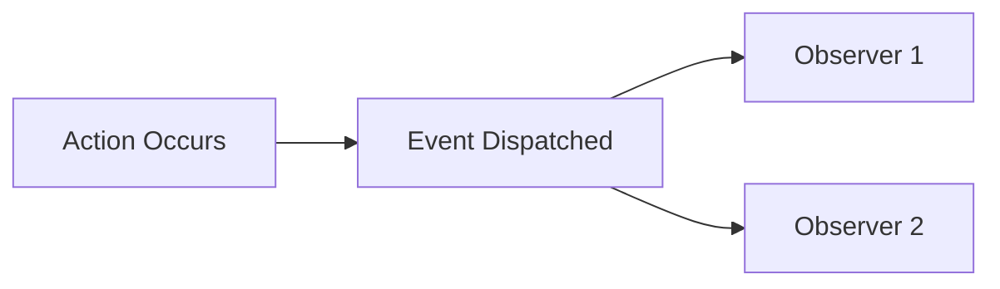

# 👁️ Observers

> Complete Guide to Event Observers in Magento 2

---

## 📑 Table of Contents

1. [Introduction](#1-introduction)
2. [File Location](#2-file-location)
3. [events.xml](#3-eventsxml)
4. [Observer Class](#4-observer-class)
5. [Common Events](#5-common-events)
6. [Custom Events](#6-custom-events)
7. [Observer vs Plugin](#7-observer-vs-plugin)
8. [Best Practices](#8-best-practices)

---

## 1. Introduction

### What is an Observer?

An Observer is a class that listens for an **Event** and executes code when it occurs.



---

## 2. File Location

```
app/code/Vendor/Module/
├── etc/
│   ├── events.xml              # Global events
│   ├── frontend/
│   │   └── events.xml          # Frontend events only
│   └── adminhtml/
│       └── events.xml          # Admin events only
└── Observer/
    └── MyObserver.php
```

---

## 3. events.xml

```xml
<?xml version="1.0"?>
<config xmlns:xsi="http://www.w3.org/2001/XMLSchema-instance"
        xsi:noNamespaceSchemaLocation="urn:magento:framework:Event/etc/events.xsd">

    <event name="catalog_product_save_after">
        <observer name="vendor_module_product_observer"
                  instance="Vendor\Module\Observer\ProductSaveObserver"/>
    </event>
</config>
```

---

## 4. Observer Class

```php
<?php
declare(strict_types=1);

namespace Vendor\Module\Observer;

use Magento\Framework\Event\Observer;
use Magento\Framework\Event\ObserverInterface;
use Psr\Log\LoggerInterface;

class ProductSaveObserver implements ObserverInterface
{
    public function __construct(
        private LoggerInterface $logger
    ) {}

    public function execute(Observer $observer): void
    {
        $product = $observer->getEvent()->getData('product');

        if ($product) {
            $this->logger->info('Product saved', [
                'id' => $product->getId(),
                'sku' => $product->getSku()
            ]);
        }
    }
}
```

---

## 5. Common Events

### Catalog Events

| Event | When Fired | Data |
|-------|------------|------|
| `catalog_product_save_after` | After product save | `product` |
| `catalog_product_delete_after` | After product delete | `product` |
| `catalog_category_save_after` | After category save | `category` |

### Sales Events

| Event | When Fired | Data |
|-------|------------|------|
| `sales_order_place_after` | After order placed | `order` |
| `sales_order_save_after` | After order save | `order` |

### Customer Events

| Event | When Fired | Data |
|-------|------------|------|
| `customer_register_success` | After registration | `customer` |
| `customer_login` | After login | `customer` |

---

## 6. Custom Events

### Dispatch Event

```php
use Magento\Framework\Event\ManagerInterface;

class MyService
{
    public function __construct(
        private ManagerInterface $eventManager
    ) {}

    public function process(): void
    {
        $this->eventManager->dispatch(
            'vendor_module_entity_process_after',
            ['entity' => $entity, 'result' => $result]
        );
    }
}
```

---

## 7. Observer vs Plugin

| Scenario | Observer | Plugin |
|----------|----------|--------|
| React to event | ✅ | ❌ |
| Modify arguments | ❌ | ✅ (before) |
| Modify return value | ❌ | ✅ (after) |
| Cancel execution | ❌ | ✅ (around) |

---

## 8. Best Practices

### ✅ Use Area-specific events.xml

### ✅ Observers Should Be Fast

### ✅ Use Unique Observer Names

```xml
<observer name="vendor_module_product_logger" .../>
```

---

## 📌 Summary

| Component | Path |
|-----------|------|
| **events.xml** | `etc/events.xml` or `etc/{area}/events.xml` |
| **Observer** | `Observer/MyObserver.php` |
| **Interface** | `ObserverInterface` |
| **Method** | `execute(Observer $observer)` |

---

## ⬅️ [Previous](./08_DI.md) | [🏠 Home](../MODULE_STRUCTURE_EN.md) | [Next ➡️](./10_PLUGINS.md)
