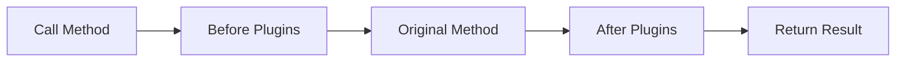

# 🔌 Plugins (Interceptors)

> Complete Guide to Plugins in Magento 2

---

## 📑 Table of Contents

1. [Introduction](#1-introduction)
2. [Plugin Types](#2-plugin-types)
3. [Registering Plugins](#3-registering-plugins)
4. [Before Plugin](#4-before-plugin)
5. [After Plugin](#5-after-plugin)
6. [Around Plugin](#6-around-plugin)
7. [Plugin Sorting](#7-plugin-sorting)
8. [Limitations](#8-limitations)
9. [Best Practices](#9-best-practices)

---

## 1. Introduction

### What is a Plugin?

A Plugin (or Interceptor) allows you to:
- **Modify arguments** before method execution
- **Modify return value** after method execution
- **Full control** before and after execution



---

## 2. Plugin Types

| Type | Purpose | When to Use |
|------|---------|-------------|
| **Before** | Modify arguments | Change input |
| **After** | Modify return value | Change output |
| **Around** | Full control | When you need both |

---

## 3. Registering Plugins

```xml
<type name="Magento\Catalog\Model\Product">
    <plugin name="vendor_module_product_plugin"
            type="Vendor\Module\Plugin\ProductPlugin"
            sortOrder="10"
            disabled="false"/>
</type>
```

---

## 4. Before Plugin

```php
public function beforeSetName(Product $subject, string $name): array
{
    $modifiedName = trim($name);
    return [$modifiedName];  // Return array of arguments
}
```

### Return Value

| Return | Result |
|--------|--------|
| `null` | No change |
| `[arg1, ...]` | Modified arguments |

---

## 5. After Plugin

```php
public function afterGetName(Product $subject, string $result): string
{
    return $result . ' - Modified';
}
```

---

## 6. Around Plugin

```php
public function aroundSave(Product $subject, callable $proceed): Product
{
    // Before
    $this->logger->info('Save started');

    $result = $proceed();  // Call original method

    // After
    $this->logger->info('Save completed');

    return $result;
}
```

> ⚠️ **Warning:** Always call `$proceed()` unless intentionally bypassing the method.

---

## 7. Plugin Sorting

```xml
<plugin name="plugin_a" ... sortOrder="10"/>
<plugin name="plugin_b" ... sortOrder="20"/>
```

**Execution Order:**
- Before: A → B (ascending)
- After: B → A (descending)

---

## 8. Limitations

### Cannot Plugin:

| Type | Reason |
|------|--------|
| **Final methods** | PHP restriction |
| **Final classes** | PHP restriction |
| **Static methods** | Cannot intercept |
| **Private methods** | Not visible |
| **`__construct`** | Called before DI |

---

## 9. Best Practices

### ✅ Use After Instead of Around

```php
// ✅ Better - simpler
public function afterGetPrice(Product $subject, float $result): float
{
    return $result * 0.9;
}
```

### ✅ Unique Plugin Names

```xml
<plugin name="vendor_module_feature_plugin" .../>
```

### ✅ Use Proxy for Heavy Dependencies

```php
public function __construct(
    private Session\Proxy $session
) {}
```

---

## 📌 Summary

| Type | Signature | Return |
|------|-----------|--------|
| Before | `before{Method}($subject, ...args)` | `null` or `[args]` |
| After | `after{Method}($subject, $result, ...args)` | Modified result |
| Around | `around{Method}($subject, $proceed, ...args)` | Result |

---

## ⬅️ [Previous](./09_OBSERVERS.md) | [🏠 Home](../MODULE_STRUCTURE_EN.md) | [Next ➡️](./11_API.md)
