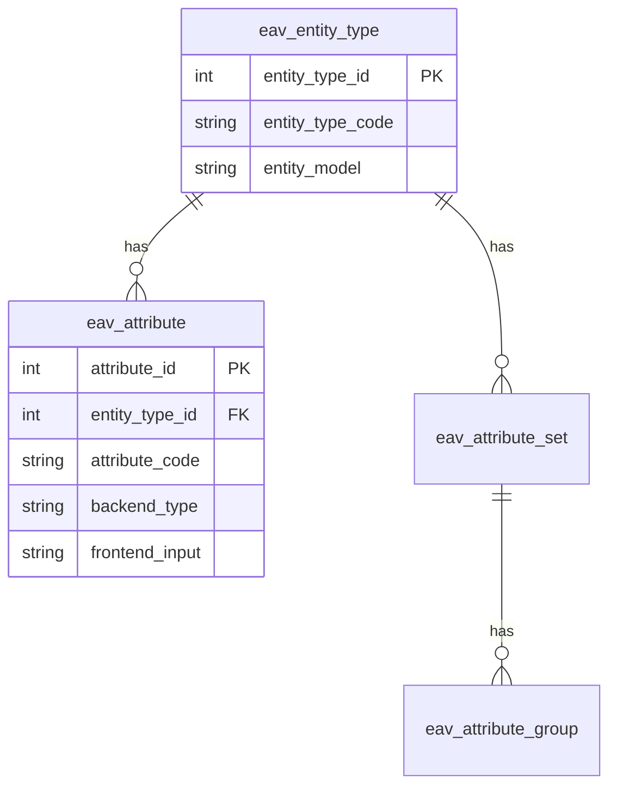

# 🗃️ EAV (Entity-Attribute-Value) System

> Advanced Guide to EAV System in Magento 2

---

## 📑 Table of Contents

1. [Introduction](#1-introduction)
2. [EAV Structure](#2-eav-structure)
3. [Entity Types](#3-entity-types)
4. [Attributes](#4-attributes)
5. [Product Attributes](#5-product-attributes)
6. [Customer Attributes](#6-customer-attributes)
7. [Source Models](#7-source-models)
8. [Backend & Frontend Models](#8-backend--frontend-models)
9. [Best Practices](#9-best-practices)

---

## 1. Introduction

### What is EAV?

**Entity-Attribute-Value** is a database design pattern that allows:
- Adding attributes without changing table structure
- Multi-store value support
- High flexibility

### Flat Table vs EAV

| Feature | Flat Table | EAV |
|---------|-----------|-----|
| **Speed** | ✅ Faster | ❌ Slower |
| **Flexibility** | ❌ Fixed | ✅ Very flexible |
| **Multi-store** | ❌ Hard | ✅ Easy |
| **Complexity** | ✅ Simple | ❌ Complex |

---

## 2. EAV Structure

### Core Tables



### Value Tables

For each `backend_type`, there's a separate table:

| Backend Type | Product Table |
|--------------|---------------|
| `varchar` | `catalog_product_entity_varchar` |
| `int` | `catalog_product_entity_int` |
| `decimal` | `catalog_product_entity_decimal` |
| `text` | `catalog_product_entity_text` |
| `datetime` | `catalog_product_entity_datetime` |
| `static` | In main entity table |

---

## 3. Entity Types

| entity_type_id | entity_type_code | entity_model |
|----------------|------------------|--------------|
| 1 | customer | `Magento\Customer\Model\Customer` |
| 2 | customer_address | `Magento\Customer\Model\Address` |
| 3 | catalog_category | `Magento\Catalog\Model\Category` |
| 4 | catalog_product | `Magento\Catalog\Model\Product` |

---

## 4. Attributes

### Attribute Properties

| Property | Purpose | Example |
|----------|---------|---------|
| `attribute_code` | Unique identifier | `color`, `size` |
| `backend_type` | Storage type | `varchar`, `int` |
| `frontend_input` | Input type | `text`, `select` |
| `source_model` | Options source | For dropdowns |
| `backend_model` | Value processing | For transformations |

### Backend Types

| Type | Table | Usage |
|------|-------|-------|
| `static` | Entity table | SKU, created_at |
| `varchar` | `_varchar` | Short text |
| `text` | `_text` | Long text |
| `int` | `_int` | Status, IDs |
| `decimal` | `_decimal` | Price, Weight |
| `datetime` | `_datetime` | Dates |

---

## 5. Product Attributes

### Create Product Attribute

```php
<?php
namespace Vendor\Module\Setup\Patch\Data;

use Magento\Eav\Setup\EavSetupFactory;
use Magento\Framework\Setup\Patch\DataPatchInterface;
use Magento\Catalog\Model\Product;
use Magento\Eav\Model\Entity\Attribute\ScopedAttributeInterface;

class AddProductAttribute implements DataPatchInterface
{
    public function __construct(
        private ModuleDataSetupInterface $moduleDataSetup,
        private EavSetupFactory $eavSetupFactory
    ) {}

    public function apply()
    {
        $eavSetup = $this->eavSetupFactory->create(['setup' => $this->moduleDataSetup]);

        $eavSetup->addAttribute(
            Product::ENTITY,
            'custom_attribute',
            [
                'type' => 'varchar',
                'label' => 'Custom Attribute',
                'input' => 'text',
                'required' => false,
                'visible' => true,
                'user_defined' => true,
                'searchable' => true,
                'filterable' => true,
                'global' => ScopedAttributeInterface::SCOPE_STORE,
                'group' => 'General',
            ]
        );
    }

    public static function getDependencies(): array
    {
        return [];
    }

    public function getAliases(): array
    {
        return [];
    }
}
```

### Attribute Scopes

| Scope | Constant | Description |
|-------|----------|-------------|
| Global | `SCOPE_GLOBAL` | Same value for all Store Views |
| Website | `SCOPE_WEBSITE` | Different per Website |
| Store View | `SCOPE_STORE` | Different per Store View |

---

## 6. Customer Attributes

```php
use Magento\Customer\Setup\CustomerSetupFactory;
use Magento\Customer\Model\Customer;

$customerSetup->addAttribute(
    Customer::ENTITY,
    'loyalty_points',
    [
        'type' => 'int',
        'label' => 'Loyalty Points',
        'input' => 'text',
        'required' => false,
        'visible' => true,
        'system' => false,
    ]
);

// Add to forms
$attribute = $customerSetup->getEavConfig()->getAttribute(Customer::ENTITY, 'loyalty_points');
$attribute->setData('used_in_forms', ['adminhtml_customer']);
$attribute->save();
```

---

## 7. Source Models

### Dropdown Source Model

```php
<?php
namespace Vendor\Module\Model\Attribute\Source;

use Magento\Eav\Model\Entity\Attribute\Source\AbstractSource;

class Options extends AbstractSource
{
    public function getAllOptions(): array
    {
        return [
            ['value' => '', 'label' => __('-- Select --')],
            ['value' => 1, 'label' => __('Option 1')],
            ['value' => 2, 'label' => __('Option 2')],
        ];
    }
}
```

---

## 8. Backend & Frontend Models

### Backend Model

Process values before save and after load:

```php
<?php
namespace Vendor\Module\Model\Attribute\Backend;

use Magento\Eav\Model\Entity\Attribute\Backend\AbstractBackend;

class CustomBackend extends AbstractBackend
{
    public function beforeSave($object)
    {
        $value = $object->getData($this->getAttribute()->getAttributeCode());
        $object->setData($this->getAttribute()->getAttributeCode(), strtoupper($value));
        return parent::beforeSave($object);
    }
}
```

---

## 9. Best Practices

### ✅ Choose Appropriate Backend Type

```php
// Short text
'type' => 'varchar'

// Long text
'type' => 'text'

// Dropdowns
'type' => 'int'

// Prices
'type' => 'decimal'
```

### ✅ Use Source Models for Options

```php
'source' => \Vendor\Module\Model\Attribute\Source\Options::class
```

---

## 📌 Summary

| Component | Purpose |
|-----------|---------|
| **Entity Type** | Entity type (product, customer) |
| **Attribute** | Property added to entity |
| **Attribute Set** | Group of attributes |
| **Value Table** | Stores attribute values |
| **Source Model** | Dropdown options |
| **Backend Model** | Value processing |

---

## ⬅️ [Previous](./05_MODELS.md) | [🏠 Home](../MODULE_STRUCTURE_EN.md) | [Next ➡️](./16_XML_CONFIGURATION.md)
