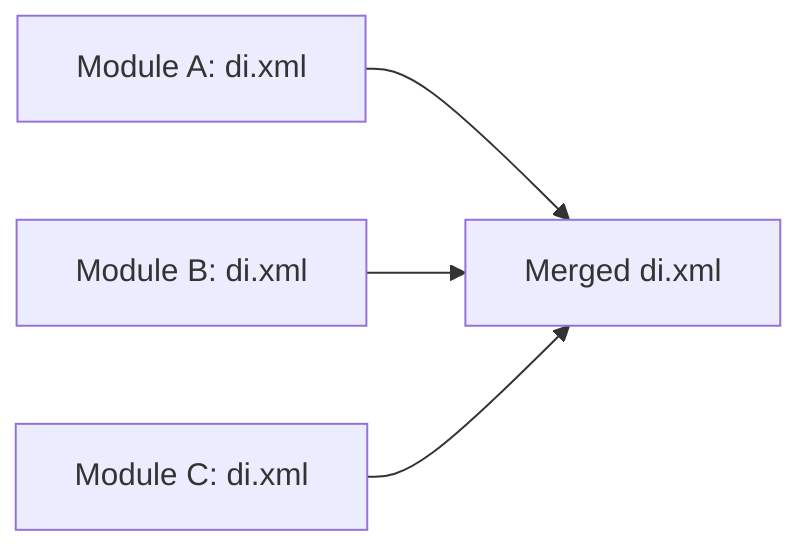

# 📄 XML Configuration System

> Advanced Guide to XML System in Magento 2

---

## 📑 Table of Contents

1. [Introduction](#1-introduction)
2. [XSD Schemas](#2-xsd-schemas)
3. [URN Resolution](#3-urn-resolution)
4. [XML Merging](#4-xml-merging)
5. [Configuration Areas](#5-configuration-areas)
6. [All XML Files](#6-all-xml-files)
7. [Best Practices](#7-best-practices)

---

## 1. Introduction

### How Magento Uses XML

Magento uses XML for:
- **Configuration** (di.xml, events.xml, routes.xml)
- **Layout** (layout XML files)
- **UI Components** (ui_component XML)
- **Schema Definition** (db_schema.xml)

---

## 2. XSD Schemas

### What is XSD?

**XML Schema Definition** - defines valid XML structure.

### Common XSD References

```xml
<!-- module.xml -->
xsi:noNamespaceSchemaLocation="urn:magento:framework:Module/etc/module.xsd"

<!-- di.xml -->
xsi:noNamespaceSchemaLocation="urn:magento:framework:ObjectManager/etc/config.xsd"

<!-- routes.xml -->
xsi:noNamespaceSchemaLocation="urn:magento:framework:App/etc/routes.xsd"

<!-- events.xml -->
xsi:noNamespaceSchemaLocation="urn:magento:framework:Event/etc/events.xsd"
```

---

## 3. URN Resolution

### URN to Path

```
URN: urn:magento:framework:Module/etc/module.xsd
              ↓ resolves to ↓
Path: vendor/magento/framework/Module/etc/module.xsd

URN: urn:magento:module:Magento_Catalog:etc/catalog_attributes.xsd
              ↓ resolves to ↓
Path: vendor/magento/module-catalog/etc/catalog_attributes.xsd
```

### IDE Integration

```bash
bin/magento dev:urn-catalog:generate .idea/misc.xml
```

---

## 4. XML Merging

### How Merging Works



### Merging Rules

| Element | Behavior |
|---------|----------|
| **Same name/id** | Last one wins |
| **Different elements** | Merged together |
| **Child elements** | Merged recursively |

---

## 5. Configuration Areas

### Global vs Area-specific

```
etc/
├── di.xml              # Global
├── events.xml          # Global
│
├── frontend/
│   ├── di.xml          # Frontend only
│   └── routes.xml
│
├── adminhtml/
│   ├── di.xml          # Admin only
│   └── routes.xml
│
└── webapi_rest/
    └── di.xml          # REST API only
```

### Available Areas

| Area | Path | Usage |
|------|------|-------|
| `global` | `etc/` | All areas |
| `frontend` | `etc/frontend/` | Frontend |
| `adminhtml` | `etc/adminhtml/` | Admin Panel |
| `webapi_rest` | `etc/webapi_rest/` | REST API |
| `graphql` | `etc/graphql/` | GraphQL |

---

## 6. All XML Files

### etc/ Files

| File | Purpose |
|------|---------|
| `module.xml` | Module declaration |
| `di.xml` | Dependency Injection |
| `events.xml` | Event Observers |
| `routes.xml` | URL Routing |
| `acl.xml` | Access Control |
| `config.xml` | Default Values |
| `system.xml` | Admin Settings |
| `menu.xml` | Admin Menu |
| `crontab.xml` | Cron Jobs |
| `webapi.xml` | REST/SOAP API |
| `db_schema.xml` | Database Tables |

---

## 7. Best Practices

### ✅ Always Use XSD

```xml
<!-- ✅ Correct -->
<config xmlns:xsi="http://www.w3.org/2001/XMLSchema-instance"
        xsi:noNamespaceSchemaLocation="urn:magento:framework:...">
```

### ✅ Use Area-specific Files

```
etc/frontend/di.xml  ← Frontend only
etc/adminhtml/di.xml ← Admin only
```

### ✅ Unique Identifiers

```xml
<!-- ✅ Unique -->
<plugin name="vendor_module_product_plugin"/>

<!-- ❌ May conflict -->
<plugin name="product_plugin"/>
```

---

## 📌 Summary

| Element | Purpose |
|---------|---------|
| **XSD** | Defines XML structure |
| **URN** | Schema identifier |
| **Merging** | Combine from multiple modules |
| **Areas** | Different files per area |

---

## ⬅️ [Previous](./15_EAV.md) | [🏠 Home](../MODULE_STRUCTURE_EN.md)
