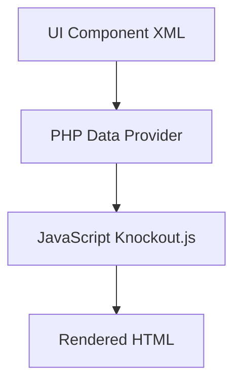

# 🖥️ UI Components

> Complete Guide to UI Components in Magento 2

---

## 📑 Table of Contents

1. [Introduction](#1-introduction)
2. [Listing Component](#2-listing-component)
3. [Form Component](#3-form-component)
4. [Data Providers](#4-data-providers)
5. [Columns & Actions](#5-columns--actions)
6. [Best Practices](#6-best-practices)

---

## 1. Introduction

### What are UI Components?

UI Components are a system for building Admin interfaces using XML and JavaScript (Knockout.js).



### Types

| Type | Usage |
|------|-------|
| **Listing** | Grid/Tables |
| **Form** | Edit forms |
| **Columns** | Table columns |
| **Filters** | Data filtering |

---

## 2. Listing Component

```xml
<?xml version="1.0"?>
<listing xmlns:xsi="http://www.w3.org/2001/XMLSchema-instance"
         xsi:noNamespaceSchemaLocation="urn:magento:module:Magento_Ui:etc/ui_configuration.xsd">

    <settings>
        <buttons>
            <button name="add">
                <url path="*/*/new"/>
                <class>primary</class>
                <label translate="true">Add New</label>
            </button>
        </buttons>
        <spinner>columns</spinner>
    </settings>

    <dataSource name="data_source" component="Magento_Ui/js/grid/provider">
        <settings>
            <storageConfig>
                <param name="indexField" xsi:type="string">entity_id</param>
            </storageConfig>
            <updateUrl path="mui/index/render"/>
        </settings>
        <dataProvider class="Magento\Framework\View\Element\UiComponent\DataProvider\DataProvider"
                      name="data_source">
            <settings>
                <requestFieldName>id</requestFieldName>
                <primaryFieldName>entity_id</primaryFieldName>
            </settings>
        </dataProvider>
    </dataSource>

    <listingToolbar name="listing_top">
        <bookmark name="bookmarks"/>
        <columnsControls name="columns_controls"/>
        <filters name="listing_filters"/>
        <paging name="listing_paging"/>
    </listingToolbar>

    <columns name="columns">
        <selectionsColumn name="ids">
            <settings>
                <indexField>entity_id</indexField>
            </settings>
        </selectionsColumn>

        <column name="entity_id">
            <settings>
                <filter>textRange</filter>
                <label translate="true">ID</label>
                <sorting>asc</sorting>
            </settings>
        </column>

        <column name="name">
            <settings>
                <filter>text</filter>
                <label translate="true">Name</label>
            </settings>
        </column>

        <actionsColumn name="actions" class="Vendor\Module\Ui\Component\Listing\Column\Actions">
            <settings>
                <indexField>entity_id</indexField>
            </settings>
        </actionsColumn>
    </columns>
</listing>
```

---

## 3. Form Component

```xml
<?xml version="1.0"?>
<form xmlns:xsi="http://www.w3.org/2001/XMLSchema-instance"
      xsi:noNamespaceSchemaLocation="urn:magento:module:Magento_Ui:etc/ui_configuration.xsd">

    <settings>
        <buttons>
            <button name="save" class="Vendor\Module\Block\Adminhtml\Edit\SaveButton"/>
            <button name="back" class="Vendor\Module\Block\Adminhtml\Edit\BackButton"/>
        </buttons>
        <namespace>vendor_module_form</namespace>
        <dataScope>data</dataScope>
    </settings>

    <dataSource name="data_source">
        <settings>
            <submitUrl path="vendor_module/entity/save"/>
        </settings>
        <dataProvider class="Vendor\Module\Model\Entity\DataProvider" name="data_source">
            <settings>
                <requestFieldName>id</requestFieldName>
                <primaryFieldName>entity_id</primaryFieldName>
            </settings>
        </dataProvider>
    </dataSource>

    <fieldset name="general">
        <settings>
            <label translate="true">General</label>
        </settings>

        <field name="name" formElement="input">
            <settings>
                <dataType>text</dataType>
                <label translate="true">Name</label>
                <validation>
                    <rule name="required-entry" xsi:type="boolean">true</rule>
                </validation>
            </settings>
        </field>

        <field name="status" formElement="select">
            <settings>
                <dataType>int</dataType>
                <label translate="true">Status</label>
            </settings>
            <formElements>
                <select>
                    <settings>
                        <options class="Vendor\Module\Model\Source\Status"/>
                    </settings>
                </select>
            </formElements>
        </field>
    </fieldset>
</form>
```

---

## 4. Data Providers

### Listing Data Provider

```php
// Registered via di.xml
<type name="Magento\Framework\View\Element\UiComponent\DataProvider\CollectionFactory">
    <arguments>
        <argument name="collections" xsi:type="array">
            <item name="listing_data_source" xsi:type="string">
                Vendor\Module\Model\ResourceModel\Entity\Grid\Collection
            </item>
        </argument>
    </arguments>
</type>
```

### Form Data Provider

```php
<?php
namespace Vendor\Module\Model\Entity;

use Magento\Ui\DataProvider\AbstractDataProvider;

class DataProvider extends AbstractDataProvider
{
    public function getData(): array
    {
        $items = $this->collection->getItems();
        foreach ($items as $entity) {
            $this->loadedData[$entity->getId()] = $entity->getData();
        }
        return $this->loadedData;
    }
}
```

---

## 5. Columns & Actions

### Actions Column

```php
<?php
namespace Vendor\Module\Ui\Component\Listing\Column;

use Magento\Ui\Component\Listing\Columns\Column;

class Actions extends Column
{
    public function prepareDataSource(array $dataSource)
    {
        foreach ($dataSource['data']['items'] as &$item) {
            $item[$this->getData('name')] = [
                'edit' => [
                    'href' => $this->urlBuilder->getUrl('*/*/edit', ['id' => $item['entity_id']]),
                    'label' => __('Edit')
                ],
                'delete' => [
                    'href' => $this->urlBuilder->getUrl('*/*/delete', ['id' => $item['entity_id']]),
                    'label' => __('Delete'),
                    'confirm' => ['title' => __('Delete'), 'message' => __('Are you sure?')]
                ]
            ];
        }
        return $dataSource;
    }
}
```

---

## 6. Best Practices

### ✅ Register Data Source in di.xml

### ✅ Use Mass Actions for Bulk Operations

### ✅ Implement Proper Data Provider

---

## 📌 Summary

| Component | Purpose |
|-----------|---------|
| **Listing** | Display Grid |
| **Form** | Edit forms |
| **DataProvider** | Provide data |
| **Columns** | Define columns |
| **Actions** | Row actions |

---

## ⬅️ [Previous](./16_XML_CONFIGURATION.md) | [🏠 Home](../MODULE_STRUCTURE_EN.md) | [Next ➡️](./18_INDEXERS.md)
