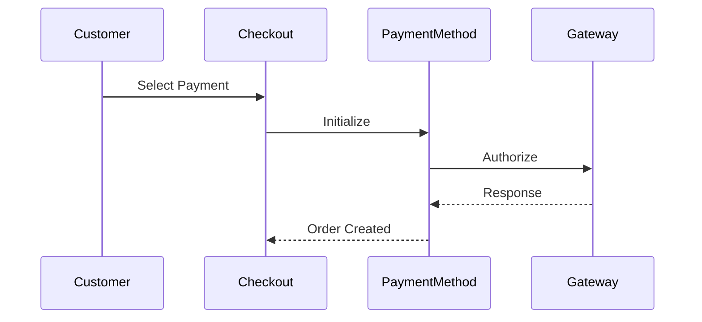

# 💳 Payment Methods

> Complete Guide to Custom Payment Methods in Magento 2

---

## 📑 Table of Contents

1. [Payment Architecture](#1-payment-architecture)
2. [Configuration](#2-configuration)
3. [Gateway Commands](#3-gateway-commands)
4. [Frontend Integration](#4-frontend-integration)

---

## 1. Payment Architecture

### Payment Flow



### Payment Actions

| Action | Purpose |
|--------|---------|
| **Authorize** | Reserve amount |
| **Capture** | Charge amount |
| **Refund** | Return money |
| **Void** | Cancel authorization |

---

## 2. Configuration

### config.xml

```xml
<config>
    <default>
        <payment>
            <vendor_payment>
                <active>1</active>
                <title>Custom Payment</title>
                <model>VendorPaymentFacade</model>
                <payment_action>authorize_capture</payment_action>
                <can_authorize>1</can_authorize>
                <can_capture>1</can_capture>
                <can_refund>1</can_refund>
            </vendor_payment>
        </payment>
    </default>
</config>
```

### di.xml - Payment Facade

```xml
<virtualType name="VendorPaymentFacade" type="Magento\Payment\Model\Method\Adapter">
    <arguments>
        <argument name="code" xsi:type="const">Vendor\Payment\Model\Ui\ConfigProvider::CODE</argument>
        <argument name="commandPool" xsi:type="object">VendorPaymentCommandPool</argument>
    </arguments>
</virtualType>

<virtualType name="VendorPaymentCommandPool" type="Magento\Payment\Gateway\Command\CommandPool">
    <arguments>
        <argument name="commands" xsi:type="array">
            <item name="authorize" xsi:type="string">VendorPaymentAuthorizeCommand</item>
            <item name="capture" xsi:type="string">VendorPaymentCaptureCommand</item>
        </argument>
    </arguments>
</virtualType>
```

---

## 3. Gateway Commands

### Request Builder

```php
<?php
namespace Vendor\Payment\Gateway\Request;

use Magento\Payment\Gateway\Request\BuilderInterface;

class AuthorizeRequest implements BuilderInterface
{
    public function build(array $buildSubject): array
    {
        $payment = SubjectReader::readPayment($buildSubject);
        $amount = SubjectReader::readAmount($buildSubject);

        return [
            'amount' => $amount * 100,
            'order_id' => $payment->getOrder()->getOrderIncrementId(),
            'currency' => $payment->getOrder()->getCurrencyCode()
        ];
    }
}
```

### Response Handler

```php
<?php
namespace Vendor\Payment\Gateway\Response;

use Magento\Payment\Gateway\Response\HandlerInterface;

class ResponseHandler implements HandlerInterface
{
    public function handle(array $handlingSubject, array $response): void
    {
        $payment = SubjectReader::readPayment($handlingSubject);
        $payment->getPayment()->setTransactionId($response['transaction_id']);
    }
}
```

---

## 4. Frontend Integration

### ConfigProvider

```php
<?php
namespace Vendor\Payment\Model\Ui;

use Magento\Checkout\Model\ConfigProviderInterface;

class ConfigProvider implements ConfigProviderInterface
{
    public const CODE = 'vendor_payment';

    public function getConfig(): array
    {
        return [
            'payment' => [
                self::CODE => [
                    'isActive' => true,
                    'title' => 'Custom Payment'
                ]
            ]
        ];
    }
}
```

---

## 📌 Summary

| Component | Purpose |
|-----------|---------|
| **Facade** | Payment interface |
| **Command Pool** | Commands collection |
| **Request Builder** | Build request |
| **Response Handler** | Handle response |

---

## ⬅️ [Previous](./23_MESSAGE_QUEUES.md) | [🏠 Home](../MODULE_STRUCTURE_EN.md) | [Next ➡️](./25_CHECKOUT.md)
