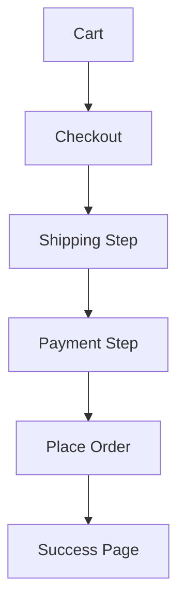

# 🛒 Checkout Customization

> Complete Guide to Checkout Customization in Magento 2

---

## 📑 Table of Contents

1. [Checkout Flow](#1-checkout-flow)
2. [Quote to Order](#2-quote-to-order)
3. [Custom Shipping Methods](#3-custom-shipping-methods)
4. [Custom Checkout Fields](#4-custom-checkout-fields)
5. [Order Processing](#5-order-processing)

---

## 1. Checkout Flow



---

## 2. Quote to Order

```php
<?php
use Magento\Quote\Api\CartManagementInterface;

class OrderService
{
    public function __construct(
        private CartManagementInterface $cartManagement
    ) {}

    public function placeOrder(int $cartId): int
    {
        return $this->cartManagement->placeOrder($cartId);
    }
}
```

---

## 3. Custom Shipping Methods

```php
<?php
namespace Vendor\Module\Model\Carrier;

use Magento\Shipping\Model\Carrier\AbstractCarrier;
use Magento\Shipping\Model\Carrier\CarrierInterface;

class CustomShipping extends AbstractCarrier implements CarrierInterface
{
    protected $_code = 'customshipping';

    public function collectRates(RateRequest $request)
    {
        $result = $this->rateResultFactory->create();

        $method = $this->rateMethodFactory->create();
        $method->setCarrier($this->_code);
        $method->setCarrierTitle('Custom Carrier');
        $method->setMethod('standard');
        $method->setMethodTitle('Standard Delivery');
        $method->setPrice(5.00);
        $method->setCost(5.00);

        $result->append($method);
        return $result;
    }

    public function getAllowedMethods(): array
    {
        return ['standard' => 'Standard Delivery'];
    }
}
```

### config.xml

```xml
<config>
    <default>
        <carriers>
            <customshipping>
                <active>1</active>
                <model>Vendor\Module\Model\Carrier\CustomShipping</model>
                <title>Custom Carrier</title>
                <price>5.00</price>
            </customshipping>
        </carriers>
    </default>
</config>
```

---

## 4. Custom Checkout Fields

### Add Field in Layout

```xml
<item name="delivery_instructions" xsi:type="array">
    <item name="component" xsi:type="string">Magento_Ui/js/form/element/textarea</item>
    <item name="dataScope" xsi:type="string">shippingAddress.custom_attributes.delivery_instructions</item>
    <item name="label" xsi:type="string">Delivery Instructions</item>
    <item name="visible" xsi:type="boolean">true</item>
</item>
```

---

## 5. Order Processing

### Order Observer

```php
<?php
namespace Vendor\Module\Observer;

use Magento\Framework\Event\ObserverInterface;

class OrderPlaceAfter implements ObserverInterface
{
    public function execute(Observer $observer): void
    {
        $order = $observer->getEvent()->getOrder();
        // Process order
    }
}
```

```xml
<event name="sales_order_place_after">
    <observer name="vendor_order_place" instance="Vendor\Module\Observer\OrderPlaceAfter"/>
</event>
```

---

## 📌 Summary

| Component | Purpose |
|-----------|---------|
| **Quote** | Temporary cart |
| **Shipping** | Delivery methods |
| **Payment** | Payment methods |
| **Order** | Final order |

---

## ⬅️ [Previous](./24_PAYMENT.md) | [🏠 Home](../MODULE_STRUCTURE_EN.md) | [Next ➡️](./26_THEMES.md)
